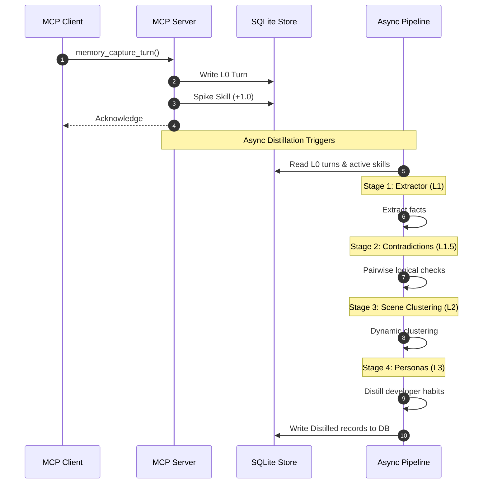
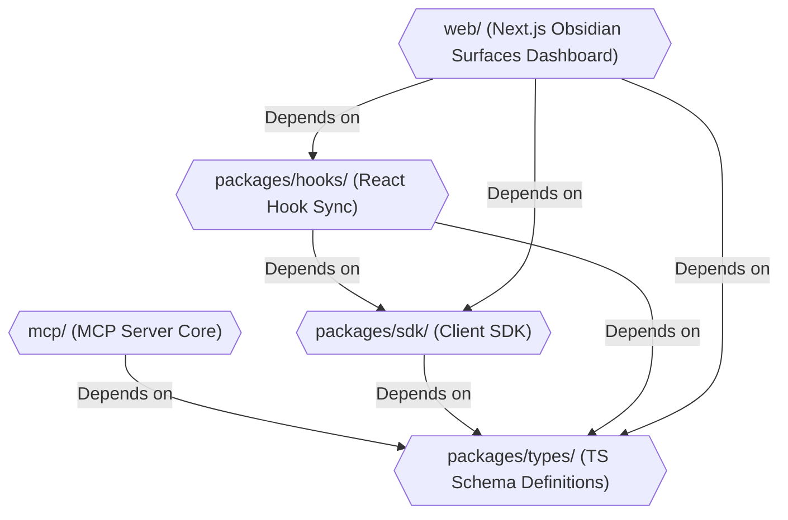
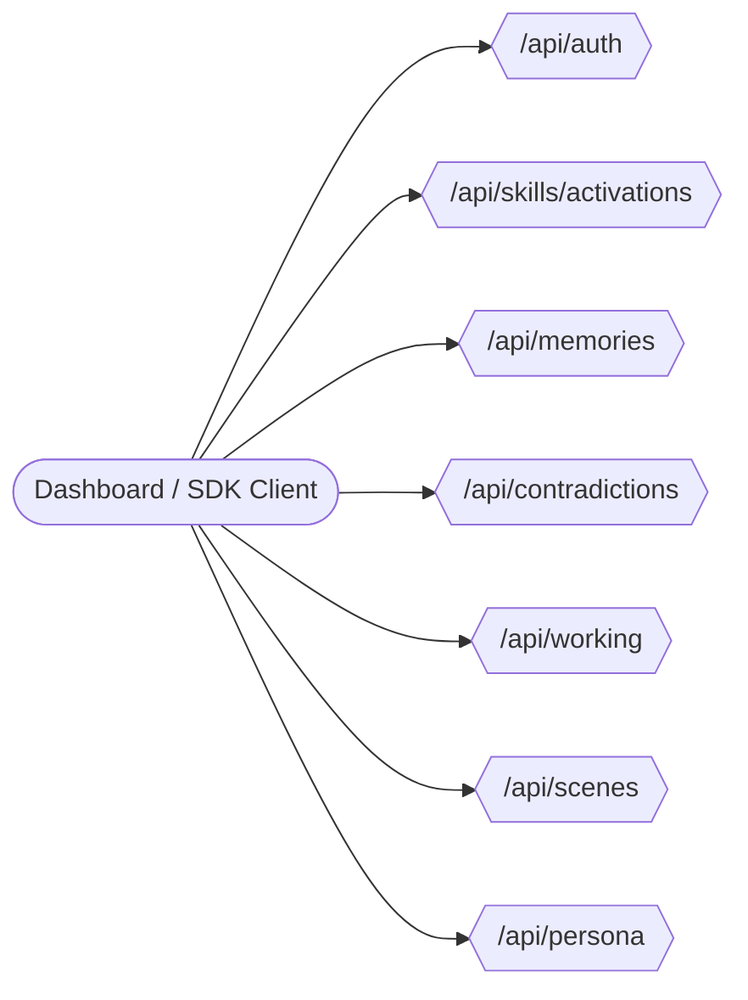

# 🧠 BrainRouter: Technical Architecture Reference

This document is the engineering deep-dive for BrainRouter. It covers the SNN-inspired activation mathematics, the full asynchronous distillation pipeline, the working memory compaction tiers, the monorepo package breakdown, and the REST API surface. For a human-readable overview, see [README.md](./README.md).

---

## 🏗️ Landscape Comparison

| Feature | agentmemory | TencentDB-Agent-Memory | BrainRouter |
| :--- | :--- | :--- | :--- |
| **Primary Focus** | Collaborative agent mesh & administrative database control | Enterprise cloud-native scaling & markdown-based debugging | **Local-first developer workflow & active context pre-warming** |
| **Backend Store** | ChromaDB + Postgres/SQLite | Tencent Cloud VectorDB + SQLite | **SQLite (`sqlite-vec` + FTS5) — fully local** |
| **Tool Namespace** | Massive (51 administrative tools) | Small (~10 controller tools) | **Moderate (~40 developer-centric tools)** |
| **Active Pruning** | Manual/standard prompt truncation | Short-term tool summaries | **SNN-inspired decay and pre-warming thresholds** |
| **Context Offload** | None | Mermaid execution flowchart | **4-tier working memory offload (W0–W3)** |
| **Memory Layers** | Flat episodic log | Flat episodic log | **Hierarchical: L0 → L1 → L1.5 → L2 → L3** |

---

## ⚡ SNN Prototype Inspirations

BrainRouter adapts biological modeling patterns from the **ei8/prototypes** repository:

### `HelloWorm` — Spiking Potential & Leakage
Models C. elegans movement where sensory inputs trigger spiking nodes that accumulate potential, which then decay (leak) back to zero over time. BrainRouter maps developer skills (e.g., `spec-driven-development`, `testing-skill`) to these nodes. Tool calls spike activation. Inactivity causes exponential decay.

### `HeartRate` — Sensor-Analyzer-Reactor Loop
A closed control loop that senses spikes, analyzes thresholds, and triggers state adjustments:
- **Sensor:** Tracks active tool invocations and user queries
- **Analyzer:** Performs in-memory decay and checks which skill scores exceed the pre-warming threshold
- **Reactor:** Dynamically injects instructions and memory hints for threshold-crossing skills into the active context window

---

## 📐 Mathematical Formulation of Skill Decay

Activation potential $P$ is capped within $[0, P_{max}]$ and updated on each tool execution and prompt assembly.

### Spike Step
When a skill is triggered:
$$P_{new} = \min(P_{max}, P_{old} + \Delta P_{spike})$$
*(default $\Delta P_{spike} = 1.0$, $P_{max} = 4.0$)*

### Hybrid Decay (Lazy On-Read)
To avoid constant DB writes, decay is calculated in-memory at read time. Given half-life $T_{1/2}$ in minutes:
$$\lambda = \frac{\ln(2)}{T_{1/2}}$$

**Temporal decay** (for elapsed time $\Delta t$):
$$P_{time} = P_{old} \times e^{-\lambda \Delta t}$$

**Per-turn minimum decay** (guards against rapid turns with $\Delta t \approx 0$):
$$P_{turn} = P_{old} \times (1 - D_{turn})$$

**Final decayed value:**
$$P_{decayed} = \max(0, \min(P_{time}, P_{turn}))$$

Skills with $P_{decayed} \ge \text{Threshold}$ (default `1.5`) have their documentation and memory registers loaded into the active prompt.

---

## 🔄 The Routing Execution Loop

Every agent turn follows this structured cycle:

```
[Agent Tool Invocation]
         │
         ▼
 1. Resolve Session ──► Establish tenant-isolated session uuid
         │
         ▼
 2. Recall Context  ──► Decay potentials, select pre-warmed skills, fetch L1 memories
         │
         ▼
 3. Select Skill    ──► Load the active skill template (e.g. spec-driven-development)
         │
         ▼
 4. Execute Task    ──► Run commands/edits & spike active skill potential (+1.0)
         │
         ▼
 5. Signal Citation ──► Log cited memories to power the ACE feedback loop
         │
         ▼
 6. Capture Turn    ──► Write raw L0 log and trigger async L1 memory distillation
```

---

## 🔄 The Memory & Cognitive Pipeline

When turns are captured, they pass through asynchronous processing stages inside `mcp/src/memory/pipeline/`:



### Core Pipeline Stages

1. **L1 Extraction (`l1-extractor.ts`):** Distills conversation logs into structured episodic facts and general rules.
2. **L1 Dedup (`l1-dedup.ts`):** Merges overlapping memories using vector similarity comparison.
3. **Contradictions (`l1-contradiction.ts`):** Identifies conflicting rules or instructions. Flagged for human review on the dashboard.
4. **Scene Clustering (`l2-scene.ts`):** Groups episodic memories by situational affinity scores (scene heat).
5. **Persona Compilation (`l3-distiller.ts`):** Aggregates technical preferences to compile the user profile.

---

## 📥 Short-Term Working Memory Offloading

To handle large terminal payloads, BrainRouter uses a 4-tier compaction pipeline (`offload.ts`):


- **W0 (Raw Refs):** Saves full payloads to `.brainrouter/work/<session>/refs/*.md` and returns a reference ID.
- **W1 (Step Logs):** A JSONL log of sequential execution steps.
- **W2 (Mermaid Canvas):** A structured task diagram rendered via `canvas.ts`.
- **W3 (Injected State):** A compact summary string containing active goals and visual diagrams, injected into the active prompt.

---

## 🗺️ Monorepo Package Breakdown



### `packages/types/`
Defines shared schemas and interfaces across frontend, SDK, and server:
- `api.ts` — REST request/response interfaces (e.g., `/api/skills/activations` payloads)
- `memory.ts` — Interfaces for L0 raw messages, L1 records, L2 scenes, and L3 persona states
- `store.ts` — Database interface contracts for storage methods and state variables

### `packages/sdk/`
- `client.ts` — `BrainRouterClient` class with promise-based wrappers for all REST APIs, auth, memory, and skill activations

### `packages/hooks/`
React Hooks that fetch and cache state from the REST API:
- `useSkillActivations.ts` — Real-time skill potential curves and manual spike actions
- `useMemories.ts` — Fetches, searches, and paginates L1 episodic/semantic memories
- `useContradictions.ts` — Manages active semantic contradictions between L1 instructions
- `useWorkingMemory.ts` — Exposes short-term working context files and Mermaid canvas states
- `useScenes.ts` / `usePersona.ts` — Syncs scene nodes and L3 persona profiles
- `useHookStatus.ts` / `useOperations.ts` / `useStats.ts` / `useDiagnostics.ts` — System diagnostics hooks

---

## 🔌 REST API Reference (`mcp/src/api/routes/`)



- **`auth.ts`** — Authenticates users and registers API keys
- **`skills.ts`** — `GET /api/skills/activations` returns SNN values; `POST /api/skills/spike` manually increments
- **`memories.ts`** — CRUD, vector search, and ACE citation counts for L1 records
- **`contradictions.ts`** — Surfaces contradictions flagged during distillation
- **`working.ts`** — Exposes the Mermaid canvas and compression methods
- **`scenes.ts`** / **`persona.ts`** — Configures L2 situation boundaries and L3 profiles
- **`hooks.ts`** — Registers passive lifecycle events
