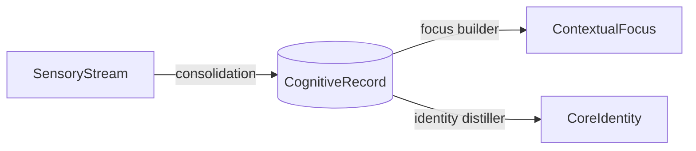
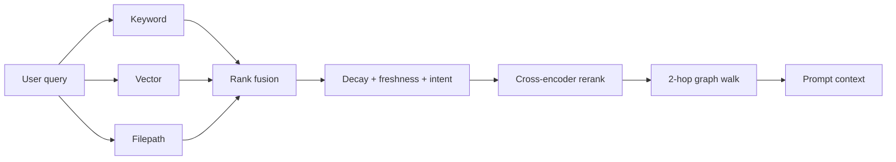

# BrainRouter — Memory for Agents

Most agent "memory" is a flat vector DB: dump everything in, hope cosine
similarity surfaces the right thing next time. BrainRouter takes a different
shape — it emulates how human memory actually works: a short-term buffer
feeds a long-term store, unused facts decay, used ones get reinforced.

The goal: when your agent reads its prompt, it sees what's relevant and
recent, not a wall of stale chunks.

## The four layers

| Layer | What it stores | Lifetime |
| --- | --- | --- |
| **SensoryStream** | Raw user + assistant messages | Transient — pruned after extraction |
| **CognitiveRecord** | Classified facts (decisions, preferences, code facts) | Long-term, with decay |
| **ContextualFocus** | Active "scenes" — clusters of records around a task | Medium — heat-based eviction |
| **CoreIdentity** | User profile + non-negotiable instructions | Permanent — prepended to system prompts |

## How recall works

Three retrievers run in parallel and get fused. The fused list is then
rescored against each record's decayed priority and recent citation count,
optionally reranked by a cross-encoder, and expanded via the knowledge
graph to pull in related facts.

## What makes it different

- **It forgets.** Memories decay on a type-specific half-life. Instructions
  never decay; codebase facts decay over 60 days; task state over 14.
- **It reinforces.** When the agent actually cites a memory, that memory
  gets a boost. When it ignores one repeatedly, the memory archives itself.
- **It connects.** A 2-hop graph walk pulls in related facts the keyword /
  vector search wouldn't have surfaced on their own.

## Beyond memory

The repo also ships [`brainrouter-cli/`](brainrouter-cli/) — a terminal
agent built on top of the memory stack. Slash commands, hookify rules,
multi-agent orchestration, durable workflow artifacts.

See **[brainrouter-docs/cli.md](brainrouter-docs/cli.md)** for the CLI
deep dive.

## Going deeper

- **[brainrouter-docs/memory-engine.md](brainrouter-docs/memory-engine.md)** — formulas, decay constants, ranking blend.
- **[brainrouter-docs/cli.md](brainrouter-docs/cli.md)** — terminal CLI internals.
- **[brainrouter-docs/configuration.md](brainrouter-docs/configuration.md)** — env vars, storage layout, transports, backpressure.
