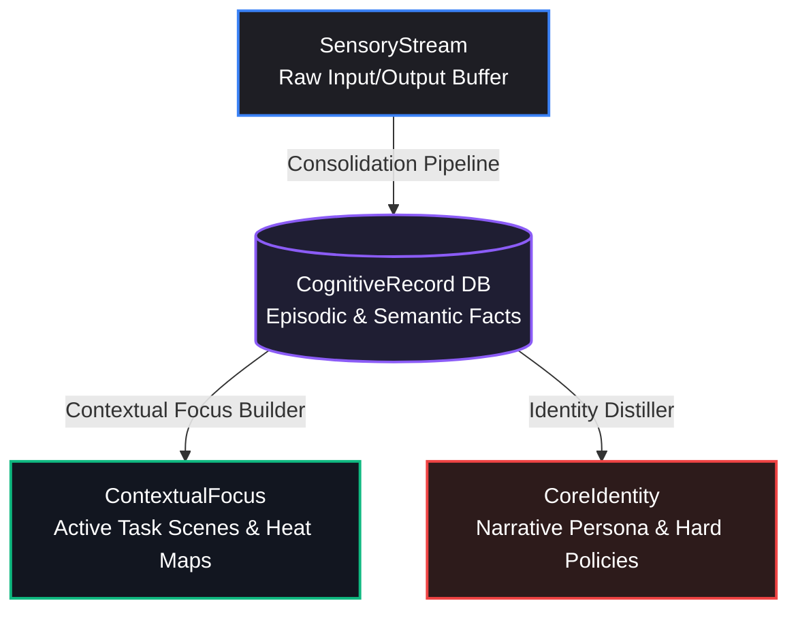
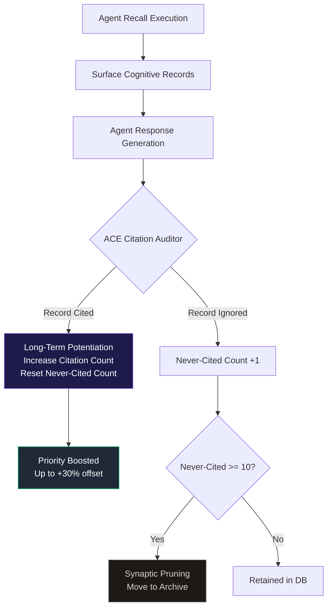

# 🧠 BrainRouter: Dual-Process Metacognitive Memory Network

BrainRouter is a biologically-inspired, multi-layered cognitive memory architecture designed for LLM agents. Rather than treating memory as a flat vector database of arbitrary chunks, BrainRouter emulates the human brain's hierarchical retention, time-decay, reinforcement, and spreading activation mechanics. 

This document details the concepts, mathematical formulations, biological mappings, and structural design of the BrainRouter memory framework, and explains how it differentiates itself from generic agent database memories (such as TencentDB-Agent-Memory).

---

## 🏛️ The Cognitive Memory Stack

Human memory is not a singular monolithic storage system. It is a highly coordinated stack of specialized systems operating at different timescales and levels of abstraction. BrainRouter implements this structure via four distinct cognitive layers:

| Layer | Biological Equivalent | System Name | Technical Description | Persistence Lifecycle |
| :--- | :--- | :--- | :--- | :--- |
| **SensoryStream** | Sensory / Echoic Memory | **Dialogue Ingestion Buffer** | Stores raw, unredacted user/assistant messages immediately. Acts as the high-throughput, temporal sensory stream. | Transitory (Pruned after extraction) |
| **CognitiveRecord** | Declarative (Episodic & Semantic) Memory | **Long-Term Memory Store** | Structured facts, preferences, and codebase decisions extracted via LLM. Supports hybrid vector + keyword indexes. | Long-Term (Subject to time-decay & citation boosts) |
| **ContextualFocus** | Working Memory / Task Focus | **Active Scene Console** | Dynamic clusters of cognitive records representing active topics/tasks (e.g., "Monorepo Setup"). | Medium-Term (Evicted/merged when heat cools down) |
| **CoreIdentity** | Core Beliefs / Identity / Long-Term Schema | **Consolidated Persona Profile** | A synthesized Markdown narrative reflecting user profiles, coding style, and absolute instructions. | Permanent (Cached & prepended to all system prompts) |

### 1. SensoryStream (Dialogue Ingestion)
The sensory memory registers environmental inputs. In BrainRouter, this is the `SensoryStream`. It is high-bandwidth, temporal, and stores raw user-agent interactions. It undergoes rapid consolidation, meaning that once memories are extracted into the `CognitiveRecord` layer, the sensory buffer is flagged as processed to prevent redundant prompt pollution.

### 2. CognitiveRecord (Semantic & Episodic Store)
Once the consolidation pipeline parses the raw stream, it stores declarative memories in the `CognitiveRecord` layer. Each record is classified by type (e.g. `architecture_decision`, `tool_preference`, `instruction`, `codebase_fact`) and has metadata including:
- **Priority**: A numeric importance weight (0 to 100).
- **Temporal context**: Timestamps denoting when it was created and last retrieved.
- **Entity relations**: Keys linking it to nodes in the Knowledge Graph.

### 3. ContextualFocus (Working Focus Scenes)
Working memory holds task-relevant details active. In BrainRouter, this is the `ContextualFocus` layer. It groups related `CognitiveRecords` into dynamic **Scenes**. 
* **Heat Score**: Scenes gain heat when accessed and decay when inactive.
* **Focus Drift**: A specialized detector evaluates incoming cognitive records. If a sudden change in task direction is detected, it triggers a focus shift, cooling down the previous scene and pre-warming a new one.

### 4. CoreIdentity (Consolidated Persona)
CoreIdentity is the agent's representation of the user's stable characteristics, non-negotiable coding guidelines, and long-term workspace instructions. The `CoreIdentity` distiller periodically scans the entire memory stack, synthesizing a unified Markdown profile. Because it represents structural beliefs, it is pre-loaded at startup and directly prepended to system prompts, bypassing vector search entirely to prevent identity fragmentation.

---

## 🧬 Biological Mechanics & Mathematical Formulations

BrainRouter goes beyond standard database lookup by expressing biological cognitive processes in mathematical models:

### 1. Ebbinghaus Forgetting Curve (Memory Decay)
Human brains forget memories exponentially over time. BrainRouter applies this decay to the priority of `CognitiveRecord` memories using a half-life model:

$$P_{\text{decayed}}(t) = P_{\text{original}} \times 2^{-\frac{t}{\tau}}$$

Where:
* $P_{\text{original}}$ is the base priority assigned at extraction (0–100).
* $t$ is the elapsed time since the memory's creation (in days).
* $\tau$ is the half-life parameter (in days) configured for the memory's specific type:
  - `instruction`: $\infty$ (Never decays; absolute rules remain permanent).
  - `architecture_decision` / `security_policy`: $180$ days.
  - `codebase_fact`: $60$ days.
  - `task_state`: $14$ days.
  - `skill_context`: $7$ days.

---

### 2. Synaptic Plasticity & LTP (ACE Feedback Loop)
Long-Term Potentiation (LTP) states that synapses are strengthened when they are repeatedly active. BrainRouter emulates this with the **ACE (Agent Citation & Evaluation) Loop**:

#### The Citation Boost Formula
When the agent cites a memory in its output, the memory's effective priority is boosted, offsetting its time-decay:

$$P_{\text{effective}} = P_{\text{decayed}} \times (1 + \text{Boost}_{\text{citation}})$$

$$\text{Boost}_{\text{citation}} = \min(N_{\text{citations}} \times 0.05, 0.30)$$

Where $N_{\text{citations}}$ is the number of times the record has been cited. This ensures active codebase constraints and instructions remain dominant in recall.

#### Synaptic Pruning (Auto-Archiving)
To prevent noise accumulation, if a cognitive record is surfaced in recall but the agent chooses *not* to cite it, its `neverCitedCount` increases. Once:

$$N_{\text{never\_cited}} \geq 10$$

The record is **pruned** (moved to the archive tables), keeping the search index high-fidelity.

---

### 3. Neural Spreading Activation
Retrieving a memory naturally activates associated memories. BrainRouter models this via two pathways:

#### A. 2-Hop Knowledge Graph BFS
BrainRouter maintains a Knowledge Graph of entities and relationships parsed from cognitive records. During retrieval:
1. Key entities are extracted from the user query.
2. A 2-Hop Breadth-First Search (BFS) is executed starting from these query nodes.
3. Adjacent facts and relations are pulled in:

$$\text{GraphContext} = \bigcup_{e \in \text{QueryEntities}} \text{BFS}_2(e)$$

This allows the agent to recall related context that may not share direct keywords or high vector similarity with the original query.

#### B. Skill Pre-warming (Memetic Potentials)
Skills (e.g. `chrome-extensions`, `monorepo-migration`) have specific keyword triggers. When user input fires a trigger, the skill's memetic potential spikes:

$$H_{\text{new}} = \min(H_{\text{max}}, H_{\text{decayed}} + \Delta_{\text{spike}})$$

Where $H_{\text{max}} = 4.0$ and $\Delta_{\text{spike}} = 1.0$. The decay of skill potential over time (in minutes) follows a 10-minute half-life:

$$H_{\text{decayed}} = H_{\text{old}} \times e^{-\lambda t}, \quad \lambda = \frac{\ln(2)}{10}$$

If $H_{\text{new}} \geq 0.3$, the system pre-warms the skill context and injects its workspace directives directly into the prompt.

---

## 🔍 The Dual-Process Retrieval Pipeline

Human cognition uses two systems: **System 1** (fast, intuitive, heuristic) and **System 2** (slow, deliberate, analytical). BrainRouter implements this dual-process theory in its recall pipeline:

### System 1: Heuristic Candidates
System 1 runs concurrently, querying three indexes:
1. **FTS5 BM25**: Captures exact keywords, function names, and paths.
2. **Vector Similarity**: Captures semantic concepts.
3. **Filepath Heuristics**: Matches files currently open or active in the editor.

These search results are merged using **Reciprocal Rank Fusion (RRF)**:

$$\text{Score}_{\text{RRF}}(m) = \sum_{s \in S} \frac{1}{60 + \text{Rank}_s(m)}$$

### System 2: Metacognitive Blending & Reranking
System 2 analyzes and filters the System 1 candidates:
1. **Priority Blending**: Integrates the memory's decaying priority (30% weight) with the RRF score (70% weight).
2. **Intent Affinity**: Adjusts scores based on query intent (e.g. a query containing "fix compile error" boosts `bug_finding` and `instruction` records by `1.3x`).
3. **Reranking**: A Cross-Encoder reranker service (e.g., Cohere or local vLLM `/v1/rerank`) evaluates the top 20 candidates to select the top $N$ memories.
4. **Graph Expansion**: Conducts a 2-hop BFS on the selected memories' entities to append relevant context.

---

## 🆚 Comparison with TencentDB-Agent-Memory

To understand BrainRouter's positioning, it is useful to contrast it with TencentDB-Agent-Memory and other traditional agent storage systems:

| Architectural Feature | TencentDB-Agent-Memory | BrainRouter (Metacognitive Network) |
| :--- | :--- | :--- |
| **Retrieval Strategy** | Basic Vector / Semantic Search. | **Dual-Process (System 1 + System 2)**: FTS5 + Vector + Filepath RRF, reranked and boosted by query intent. |
| **Forgetting & Decay** | Typically static storage or simple LRU/time-based eviction. | **Exponential Decay**: Modeled on the Ebbinghaus forgetting curve with decay rates tailored to memory type. |
| **Synaptic Plasticity** | None. Facts remain in the database regardless of utility. | **ACE Loop**: Reinforces cited memories (LTP) and prunes neglected records (Synaptic Pruning) automatically. |
| **Associative Recall** | Restricted to vector distance. | **Spreading Activation**: 2-Hop BFS Knowledge Graph expansion and keyword-based Skill pre-warming. |
| **Self-Healing** | Overwrites or creates duplicate entries. | **Contradiction Resolution**: Evaluates updates to either supersede outdated facts or log conflicts for manual review. |
| **Layered Structure** | Flat key-value or document collections. | **Multi-tier Stack**: Hierarchical flow from `SensoryStream` → `CognitiveRecord` → `ContextualFocus` → `CoreIdentity`. |
