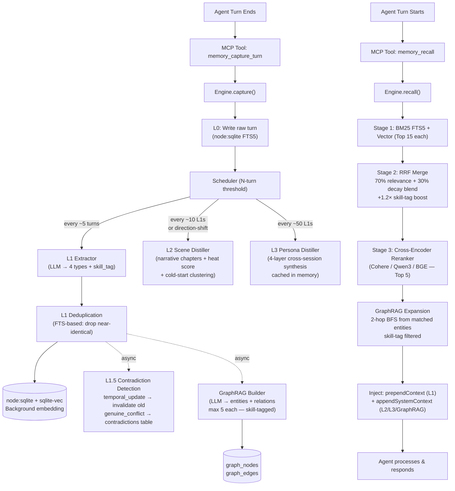
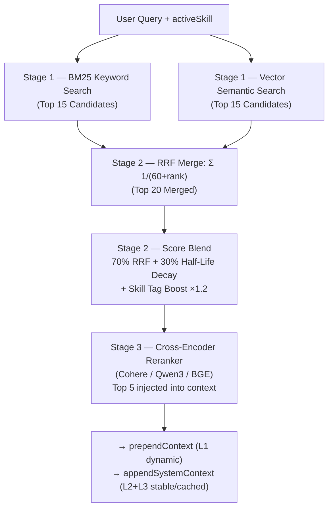

# BrainRouter Memory Engine — Architecture & Implementation

> The definitive technical reference for BrainRouter's memory system.
> Adapted from TencentDB Agent Memory research, extended far beyond it.
>
> **Last updated:** May 2026

---

## What BrainRouter Is (and Isn't)

| Dimension | BrainRouter | TencentDB Agent Memory | agentmemory |
|---|---|---|---|
| **Scope** | Agentic OS: Skills + Routing + Memory | Memory engine (OpenClaw plugin) | Memory daemon only |
| **Memory types** | 4 (persona, episodic, instruction, **skill_context**) | 3 (persona, episodic, instruction) | 4-tier (Working/Episodic/Semantic/Procedural) |
| **Contradiction handling** | **First-class L1.5 — temporal supersession + agent-visible conflicts** | Silently dedup (store/update/merge/skip) | Auto-evict based on decay score |
| **Capture mechanism** | MCP tool-driven (agent calls after each turn) | Hook-driven (agent_end event) | 12 auto-hooks (zero agent effort) |
| **Skill awareness** | ✅ Full — extraction hints per skill, skill_tag on every memory | ❌ None | ❌ None |
| **Knowledge graph** | ✅ **Shipped Phase 2** — Skill-conditioned entities/relations, 2-hop BFS, `memory_graph_query` tool | ❌ None | ✅ Entity extraction + BFS traversal |
| **Retrieval** | BM25 + Vector + RRF + Cross-Encoder Reranker + **GraphRAG context expansion** | BM25 + Vector + RRF | BM25 + Vector + Graph traversal + RRF |
| **Temporal validity** | ✅ **Shipped Phase 3** — `invalid_at` + `superseded_by`; self-healing L1.5 | ❌ Not modeled | ❌ Not modeled |
| **ACE feedback loop** | ✅ **Shipped Phase 3** | ❌ None | ❌ None |
| **Multi-tenant** | ✅ user_id on all tables, enforced in every query | Partial (sessionKey scoped) | ❌ Single-process |
| **Runtime** | stdio / HTTP — no daemon required | File-based SQLite, OpenClaw-only | iii-engine daemon (WebSocket + REST) |
| **Auto skill generation** | ⏳ Phase 4 — from skill_context patterns | ❌ None | ❌ None (4 manually authored skills) |

---

## The Big Picture: Orthogonal Systems with MCP Tools

The engine is built inside `mcp/src/memory/` and exposed to the agent via MCP tools.



---

## Shipped: The Full Memory Stack

### Layer 0 — Raw Conversation Storage

**File:** `mcp/src/memory/capture.ts`  
**Tool:** `memory_capture_turn`

- Every message written to `l0_conversations` with `user_id` isolation
- FTS5 indexed immediately; vector embedding queued as background task
- `activeSkill` tag attached — every turn knows which BrainRouter skill was running
- Cursor-based capture: each message carries a monotonic `timestamp`; duplicate detection via unique `(userId, sessionKey, timestamp, role)` composite
- Never blocks the agent — embedding is always fire-and-forget

### Layer 1 — Extracted Structured Memories

**File:** `mcp/src/memory/pipeline/l1-extractor.ts`  
**Prompt:** `mcp/src/memory/prompts/l1-extraction.ts`

The LLM acts as a **Skill-Aware Memory Extraction Expert**. It processes the last 10 new messages (with 5 older messages as read-only context) and produces:

| Memory Type | What it captures | Half-life |
|---|---|---|
| `persona` | Stable user traits, preferences, identity | 180 days |
| `episodic` | Objective events with timestamps and outcomes | 30 days |
| `instruction` | Long-term rules the user gave the AI | **Never decays** |
| `skill_context` *(BrainRouter-original)* | How *this user* runs *this skill* specifically | 7 days |

**Skill Hints:** The active skill's `memory_hints` (from `SKILL.md` frontmatter) are injected into the extraction prompt, guiding what to look for in that domain.

**Quality gates before calling the LLM:**
- Filters messages shorter than a threshold (noise)
- Filters symbol-only or injection-attempt messages
- Prefers zero memories over bad memories ("Nothingness > Bad memory")

### Layer 1.5 — Contradiction Detection & Temporal Validity

**File:** `mcp/src/memory/pipeline/l1-contradiction.ts`

This is BrainRouter's most significant advance over TencentDB's dedup model:

| Approach | TencentDB | agentmemory | BrainRouter |
|---|---|---|---|
| When conflict detected | Silent LLM judgment: store/update/merge/skip | Auto-evict lower-priority | Classify as temporal update or genuine conflict |
| Agent visibility | Never sees it | Never sees it | **Surfaced during next recall** |
| User agency | None | None | **Explicit ⚠️ warning, user resolves genuine conflicts** |
| Temporal updates | No concept | No concept | **Auto-self-heal: old record invalidated, audit trail kept** |

**How it works (two-pass evaluation):**
1. New memory → FTS keyword search for top-5 similar existing memories
2. LLM batch judgment for each candidate: `{ isContradiction, kind: "temporal_update" | "genuine_conflict", confidence, reason }`
3. **If ANY candidate is a `temporal_update`**: treat the entire batch as a temporal transition — all conflicting old records are invalidated (`invalid_at = NOW()`, `superseded_by = new_record_id`). No conflict entry is written.
4. **Only genuine conflicts** (no temporal signal in any candidate) are stored in `contradictions` table and surfaced as `⚠️` warnings during recall.

**Temporal validity columns on `l1_records`:**
```sql
invalid_at   TEXT  -- set when a newer memory supersedes this one
superseded_by TEXT -- record_id of the new memory that replaced this
```
All active recall queries filter `WHERE invalid_at IS NULL`. Invalidated records are preserved for audit but excluded from active memory.

### Layer 2 — Scene Narratives

**File:** `mcp/src/memory/pipeline/l2-scene.ts`

- Triggers every `BRAINROUTER_L2_TRIGGER_N` L1 extractions (default: 10)
- LLM reads new L1 batch → decides: update existing scene / create new scene
- Scenes stored with **heat score** (+30 on each distillation, decays each cycle)
- Scene summaries injected as stable `<scene-navigation>` block in `appendSystemContext`
- **Scene cold-start consolidation:** On first run, existing scene names are passed to the L1 extractor so new extractions snap to existing names rather than coining near-duplicates
- **Scene clustering:** At the start of each `distillScenes()` run, fragmenting scene names are clustered via LLM and remapped to a single canonical name (`pipeline/l2-scene.ts` `canonicalizeSceneNames()`)
- **Auto-merge** when scene count exceeds threshold (`BRAINROUTER_L2_MAX_SCENES`, default 20)
- **Direction-shift early trigger:** if new L1s signal a major topic shift (≥0.75 LLM confidence), L2 fires immediately before count threshold
- Stored as rows in `l2_scenes` SQLite table (not files — no filesystem coupling)

### Layer 2.5 — Skill-Conditioned Knowledge Graph (GraphRAG)

**Files:** `mcp/src/memory/pipeline/graph-builder.ts`, `graph-recall.ts`  
**Prompt:** `mcp/src/memory/prompts/graph-extraction.ts`

> Extends agentmemory's entity BFS — every graph edge carries a `skill_tag` so queries can be conditioned on the active skill.

**Construction (non-blocking, post-L1-capture):**
1. LLM reads each new L1 record → extracts up to 5 entities and 5 relations (JSON)
2. Entities upserted into `graph_nodes`; relations into `graph_edges` with `skill_tag` + `confidence`
3. Stable entity IDs prevent duplicate nodes across sessions (case-insensitive lookup)
4. Controlled by `BRAINROUTER_GRAPH_ENABLED` (opt-out) and `BRAINROUTER_GRAPH_TIMEOUT_MS` (default 120s for local LLMs)

**Recall expansion (hybrid BFS):**
1. Entity names mentioned in the query or top L1 results → matched against `graph_nodes`
2. 2-hop BFS traversal from each matching node via `getGraphNeighbors()`
3. Optional skill-tag filter on edges: only traverses relationships established during the active skill
4. Results injected as `<graph-context>` block in `appendSystemContext`

**Direct query tool:** `memory_graph_query` — programmatic entity + hop traversal with optional skill filter.

### Layer 3 — Persona Synthesis

**File:** `mcp/src/memory/pipeline/l3-distiller.ts`

- Triggers every `BRAINROUTER_L3_TRIGGER_N` L1 extractions (default: 50)
- Reads **all** `persona` + `instruction` L1 memories cross-session for this user
- Synthesizes via LLM with 90s timeout → 4-layer profile:

| Layer | What it synthesizes |
|---|---|
| Base Anchors | Role, tech stack, current projects |
| Interest Graph | Actively worked on vs. passively followed |
| Interaction Protocol | Communication style, preferred response format |
| Cognitive Core | Decision logic, risk tolerance, what drives you |

- Persona injected as stable `<user-persona>` block in `appendSystemContext`
- Auto-trigger from L2: if scene extractor detects major direction shift → L3 runs immediately

---

## The Retrieval Pipeline (3-Stage)



**Why each stage matters:**
- **Keyword** — catches exact terms ("pnpm", "auth service") via FTS5
- **Vector** — catches *meaning* ("package manager" → surfaces pnpm memories)
- **RRF** — high in both = almost certainly relevant
- **Reranker** — reads query AND candidate together; highest precision, runs only on top 20

**Decay scoring formula:**
```typescript
function effectivePriority(memory: L1Record): number {
    if (memory.type === 'instruction' || !memory.halfLifeDays) {
        return memory.priority; // instructions never decay
    }
    const ageDays = (Date.now() - new Date(memory.createdTime).getTime()) / 86_400_000;
    const decayFactor = Math.pow(0.5, ageDays / memory.halfLifeDays);
    return memory.priority * decayFactor;
}

// Blend: 70% RRF relevance + 30% decay-weighted priority
const blendedScore = (rrfScore * 0.7) + (effectivePriority(m) / 100 * 0.3);
```

---

## Context Injection Format

### `prependContext` — User message prefix (dynamic, per-turn)
```xml
<relevant-memories>
  The following memories are relevant to this query. Reference only if helpful:

  - [persona] User always uses pnpm, never npm or yarn. (skill: conventions-skill)
  - [episodic|debugging] User fixed a Next.js hydration bug on 2026-05-10 by disabling SSR for auth.
  - [instruction] User requires all responses to use TypeScript, never plain JavaScript.
  ⚠️ Contradiction: "User prefers REST" conflicts with "User now using gRPC for internal services" — unresolved.
</relevant-memories>
```

### `appendSystemContext` — System prompt suffix (stable, cacheable)
```xml
<user-persona>
  # User Narrative Profile
  > Archetype: A pragmatic full-stack engineer who optimizes for shipping speed over architectural purity.
  ...
</user-persona>

<scene-navigation>
  Skills recently active: debugging-and-error-recovery (3 sessions), spec-driven-development (1 session)
  Scenes: backend-architecture, auth-debugging, devops-pipeline
</scene-navigation>

<memory-tools-guide>
  Use memory_search to retrieve more specific memories.
  Use memory_contradictions to review unresolved conflicts.
  Max 3 memory tool calls per turn.
</memory-tools-guide>
```

---

## Shipped: Phase 2 Intelligence Upgrades

### What Outperforms agentmemory & TencentDB

| Feature | Status | What it does |
|---|---|---|
| **Temporal Validity Windows** | ✅ Shipped | Self-healing L1.5 — preferences auto-supersede; `invalid_at` column; audit trail preserved |
| **Skill-Conditioned GraphRAG** | ✅ Shipped | Entity/relation graph with `skill_tag` on every edge; 2-hop BFS hybrid recall expansion |
| **Scene Cold-Start Consolidation** | ✅ Shipped | L1 extractor snaps to existing scene names; clustering pass prevents fragmentation |
| **Scene Direction-Shift Trigger** | ✅ Shipped | LLM judge fires L2 early on major topic transitions (≥0.75 confidence) |
| **L2 Scene Auto-Merge** | ✅ Shipped | Cold scenes merged when count exceeds `BRAINROUTER_L2_MAX_SCENES` |
| **4-Layer Persona Profile** | ✅ Shipped | Base Anchors → Interest Graph → Skill Map → Behavioural Patterns + Hard Rules |
| **Persona Prompt-Level Cache** | ✅ Shipped | TTL-cached in-memory persona, invalidated on L3 distillation |

---

## Still Planned: Next Intelligence Upgrades

### Shipped: ACE Feedback Loop (Citation Tracking)

> The mechanism neither TencentDB nor agentmemory has at all.

Track which recalled memories were actually cited in agent responses. Use this signal to:

1. **Up-rank useful memories** — frequently cited → higher effective priority in decay scoring
2. **Auto-archive noise** — never cited after N recalls → archive flag set, excluded from active pool
3. **Feed skill detection** — if `skill_context` memories for a pattern are consistently cited → proposal threshold drops

```typescript
// New tool: memory_mark_cited
// Called by agent when it uses a specific recalled memory in its response
server.tool("memory_mark_cited", {
    inputSchema: z.object({
        userId: z.string(),
        recordIds: z.array(z.string()), // IDs from the last memory_recall result
    })
});
```

```sql
ALTER TABLE l1_records ADD COLUMN citation_count INTEGER DEFAULT 0;
ALTER TABLE l1_records ADD COLUMN last_cited_at TEXT;
ALTER TABLE l1_records ADD COLUMN never_cited_count INTEGER DEFAULT 0; -- increments on each recall where NOT cited
```

### Next: Autonomous Skill Detection

> `create_skill` and `update_skill` are already shipped. This is the detection layer.

Background scheduler scans `skill_context` memories:

```
Pattern detected across 4 sessions (from skill_context memories):
  You've solved React hydration bugs with a consistent 4-step process.
  Step 1: Disable SSR for the component temporarily
  Step 2: Check browser console for hydration mismatch errors
  Step 3: Trace to server/client rendering boundary
  Step 4: Fix the boundary mismatch

  → Proposed skill: "react-hydration-debugging"
  → Call create_skill to save, or dismiss for 30 days.
```

The detection pipeline:
1. Query `skill_context` memories: group by `sceneName` + semantic clustering
2. Same N-step structure seen 3+ times → candidate pattern
3. Surface proposal via new `memory_skill_proposals` tool
4. On approval: call `create_skill` automatically with the detected workflow
5. On dismiss: suppress same proposal for configurable cooldown

### Shipped: Model Routing (Cost Optimisation)

> 60–80% reduction in LLM API cost for memory operations.

Different extraction tasks need different model quality:

| Task | Model tier | Rationale |
|---|---|---|
| L1 extraction | Fast/cheap (Haiku, GPT-4o-mini, DeepSeek-V3) | Structured JSON → smaller model sufficient |
| L1.5 contradiction judgment | Fast/cheap | Yes/No classification task |
| L2 scene distillation | Medium (Sonnet, GPT-4o) | Narrative quality matters |
| L3 persona synthesis | Smarter (Sonnet, GPT-4o) | Deep reasoning over long context |

```typescript
// .env configuration
BRAINROUTER_EXTRACTION_MODEL=gpt-4o-mini    // L1, L1.5
BRAINROUTER_SYNTHESIS_MODEL=gpt-4o          // L2, L3
BRAINROUTER_LLM_ENDPOINT=https://api.openai.com/v1/chat/completions
```

### Shipped: Skill Pre-warming

> Proactive context injection before the agent asks.

Analyse `skill_context` memories for temporal patterns:
- User always opens `spec-driven-development` at the start of new features
- User runs `debugging-and-error-recovery` in the first session of each week

When pattern confidence exceeds threshold → inject that skill's extraction hints + workflow summary into `appendSystemContext` proactively. Zero latency, zero agent effort.

---

## The Storage Layer

**Files:** `mcp/src/memory/store/sqlite.ts` & `embedding.ts`

Uses **`node:sqlite`** (built into Node 22+) + **`sqlite-vec`**. No external database dependencies.

### Key Tables (Shipped)

| Table | Purpose |
|-------|---------|
| `l0_conversations` | Raw messages, FTS5 indexed, `user_id` scoped |
| `l1_records` | Extracted memories (4 types). Half-life, priority, `skill_tag`, `invalid_at`, `superseded_by` |
| `l2_scenes` | Scene narratives with heat scores |
| `l3_persona` | Latest persona profile per user |
| `contradictions` | Conflicting L1 pairs (genuine conflicts only), resolved/unresolved status |
| `skill_extraction_hints` | Cached hints from SKILL.md files |
| `vec_l1` | sqlite-vec virtual table for L1 vector embeddings |
| `graph_nodes` | Knowledge graph entities — `user_id`, `entity`, `entity_type`, `skill_tag`, `confidence` |
| `graph_edges` | Knowledge graph relations — `from_node_id`, `to_node_id`, `relation`, `skill_tag`, `confidence` |

### Planned Additions

| `graph_nodes` | Entities: User, Technology, Decision, Project, Bug |
| `graph_edges` | Relations with `skill_tag` and `confidence` |
| `l1_records.valid_from / valid_to / invalid_at` | Temporal supersession |
| `l1_records.citation_count / never_cited_count` | ACE feedback signal |

### Planned Additions

| Table | Purpose | Phase |
|-------|---------|-------|
| `skill_proposals` | Auto-detected skill candidates awaiting approval | 4 |

### Multi-Tenant Isolation

Every table has a `user_id` column. Every SQL query strictly filters by `WHERE user_id = ?`. The `userId` is passed as a required parameter in every MCP tool call — never inferred or trusted from session state.

---

## The MCP Tools Interface

### Current (Shipped)

| Tool | When called | What it does |
|---|---|---|
| `memory_capture_turn` | After every agent response | Records L0 turn, schedules L1 pipeline |
| `memory_recall` | Before generating a response | 3-stage retrieval + GraphRAG + L2/L3 injection |
| `memory_search` | When injected context is insufficient | Explicit semantic search |
| `memory_contradictions` | Proactive check / contradiction warning | Lists or resolves genuine conflicts |
| `memory_register_skill_hints` | When loading a skill | Teaches engine what to extract |
| `memory_resolve_session` | Session start | Resolves stable sessionKey UUID |
| `memory_graph_query` | On-demand graph traversal | Query knowledge graph by entity name, hop depth, skill filter |
| `memory_mark_cited` | After agent response | Signal that specific recalled memories were used |

### Planned

| Tool | Phase | Purpose |
|---|---|---|
| `memory_skill_proposals` | Phase 4 | List/approve/dismiss auto-detected skill patterns |
| `memory_export` | Phase 4 | Export full memory snapshot (L1 + L2 + L3) |
| `memory_import` | Phase 4 | Import snapshot on new machine / team member |
| `memory_prune` | Nice-to-have | Manually archive low-relevance memories |
| `memory_stats` | Nice-to-have | Counts, sizes, oldest memory, embedding coverage |

---

## Competitive Advantage Summary

| Capability | TencentDB | agentmemory | **BrainRouter** |
|---|---|---|---|
| Memory types | 3 | 4-tier | 4 + skill_context |
| Contradiction model | Silent dedup | Silent eviction | **Temporal supersession + explicit L1.5 conflicts** |
| Skill awareness | ❌ | ❌ | **Full — per-skill hints + skill_tag** |
| Knowledge graph | ❌ | Entity BFS | **✅ Skill-conditioned graph — shipped** |
| Temporal validity | ❌ | ❌ | **✅ invalid_at + superseded_by — shipped** |
| ACE feedback loop | ❌ | ❌ | **✅ Citation tracking → auto-archive — shipped** |
| Auto skill generation | ❌ | ❌ | **From skill_context patterns** *(planned)* |
| Retrieval | BM25 + Vec + RRF | BM25 + Vec + Graph | **BM25 + Vec + RRF + Cross-Encoder Reranker + GraphRAG** |
| Multi-tenant | Partial | ❌ | **user_id enforced on every query** |
| Runtime dependency | OpenClaw plugin | iii-engine daemon | **None — stdio, zero infrastructure** |
| Extraction language | Chinese (hardcoded) | Configurable | **English, configurable endpoint** |
| Local LLM support | ❌ | Partial | **✅ Fully configurable timeouts + GRAPH_ENABLED opt-out** |
| Benchmarks | PersonaMem 76% | LongMemEval ~68% | *to be measured — targets: beat both* |
