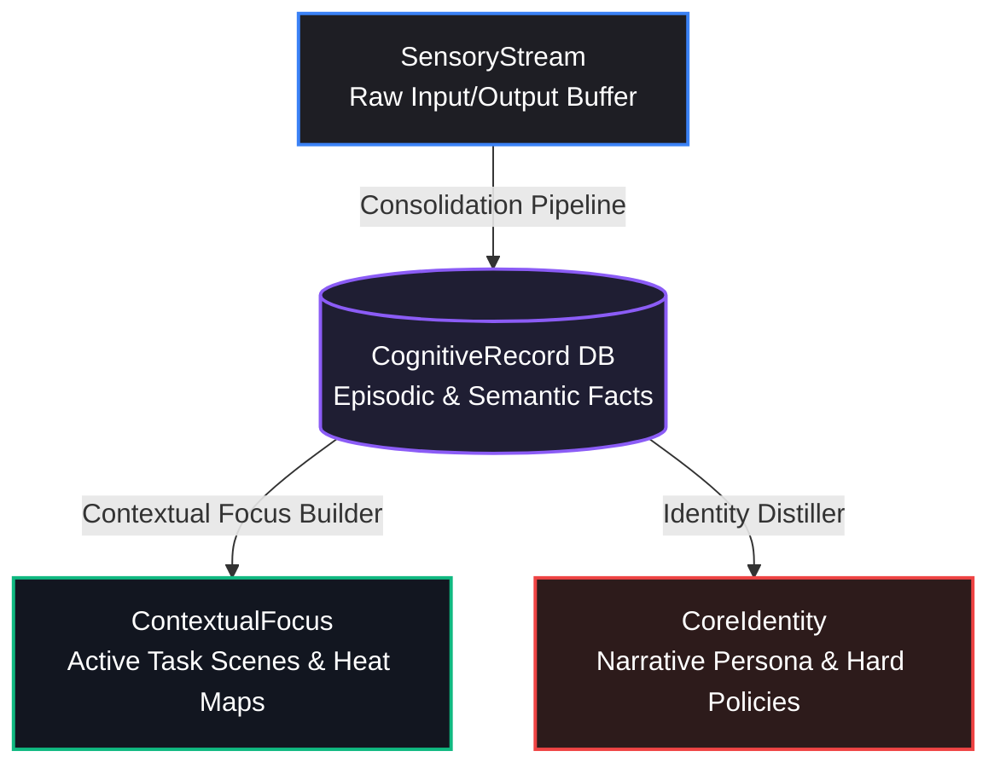
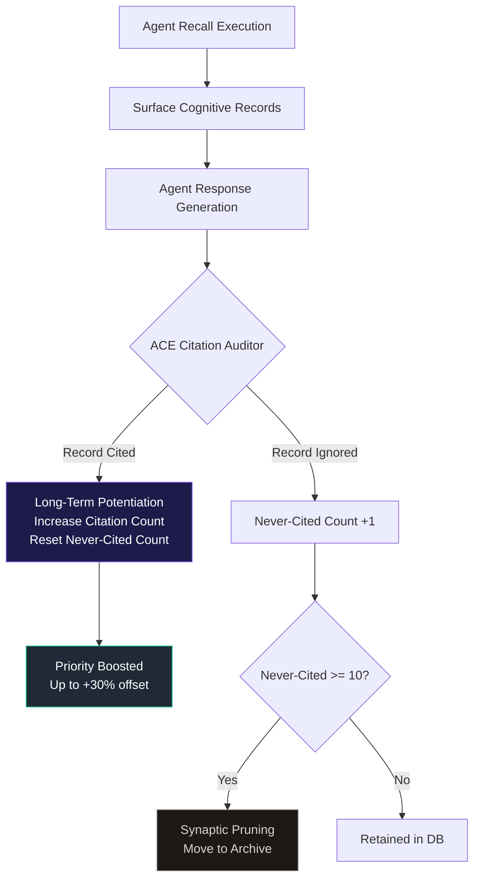
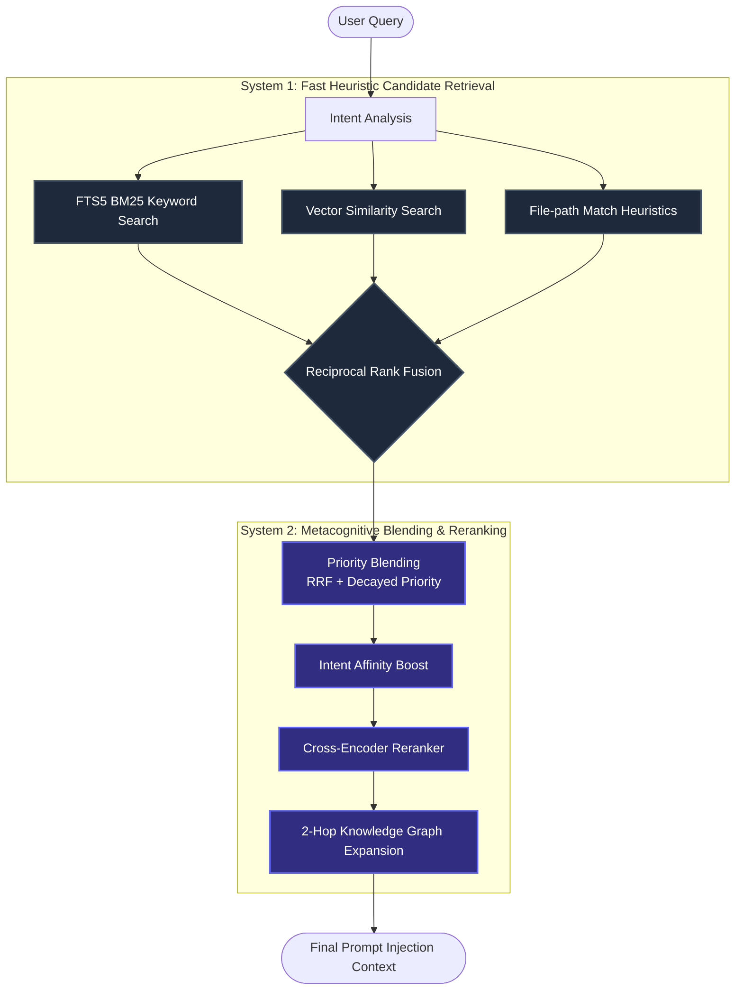
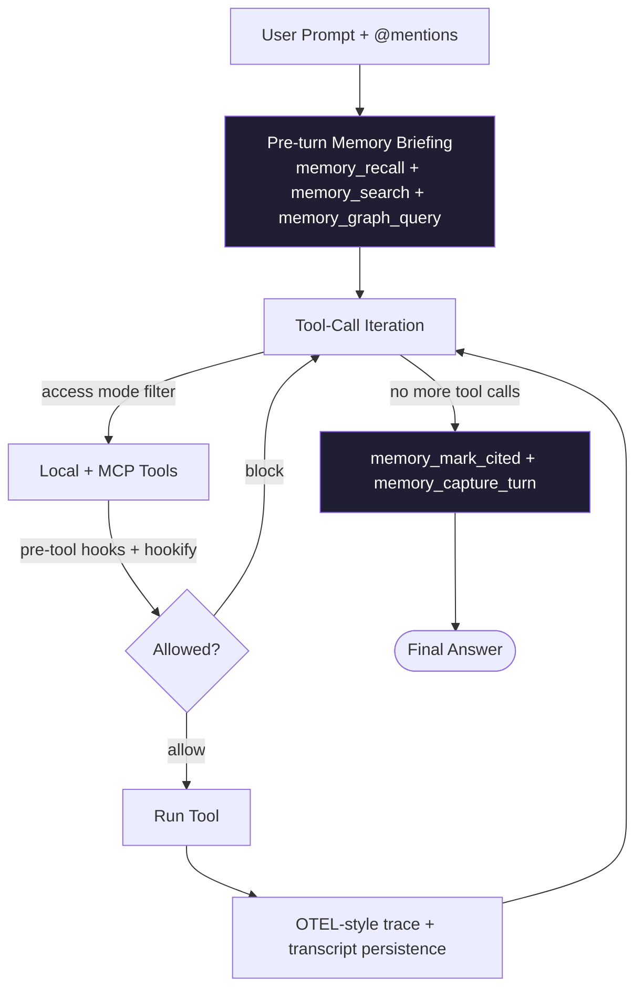

# 🧠 BrainRouter: Dual-Process Metacognitive Memory Network

BrainRouter is a biologically-inspired, multi-layered cognitive memory architecture designed for LLM agents. Rather than treating memory as a flat vector database of arbitrary chunks, BrainRouter emulates the human brain's hierarchical retention, time-decay, reinforcement, and spreading activation mechanics. 

This document details the concepts, mathematical formulations, biological mappings, and structural design of the BrainRouter memory framework, and explains how it differentiates itself from generic agent database memories (such as TencentDB-Agent-Memory).

---

## 🏛️ The Cognitive Memory Stack

Human memory is not a singular monolithic storage system. It is a highly coordinated stack of specialized systems operating at different timescales and levels of abstraction. BrainRouter implements this structure via four distinct cognitive layers:

| Layer | Biological Equivalent | System Name | Technical Description | Persistence Lifecycle |
| :--- | :--- | :--- | :--- | :--- |
| **SensoryStream** | Sensory / Echoic Memory | **Dialogue Ingestion Buffer** | Stores raw, unredacted user/assistant messages immediately. Acts as the high-throughput, temporal sensory stream. | Transitory (Pruned after extraction) |
| **CognitiveRecord** | Declarative (Episodic & Semantic) Memory | **Long-Term Memory Store** | Structured facts, preferences, and codebase decisions extracted via LLM. Supports hybrid vector + keyword indexes. | Long-Term (Subject to time-decay & citation boosts) |
| **ContextualFocus** | Working Memory / Task Focus | **Active Scene Console** | Dynamic clusters of cognitive records representing active topics/tasks (e.g., "Monorepo Setup"). | Medium-Term (Evicted/merged when heat cools down) |
| **CoreIdentity** | Core Beliefs / Identity / Long-Term Schema | **Consolidated Persona Profile** | A synthesized Markdown narrative reflecting user profiles, coding style, and absolute instructions. | Permanent (Cached & prepended to all system prompts) |



### 1. SensoryStream (Dialogue Ingestion)
The sensory memory registers environmental inputs. In BrainRouter, this is the `SensoryStream`. It is high-bandwidth, temporal, and stores raw user-agent interactions. It undergoes rapid consolidation, meaning that once memories are extracted into the `CognitiveRecord` layer, the sensory buffer is flagged as processed to prevent redundant prompt pollution.

### 2. CognitiveRecord (Semantic & Episodic Store)
Once the consolidation pipeline parses the raw stream, it stores declarative memories in the `CognitiveRecord` layer. Each record is classified by type (e.g. `architecture_decision`, `tool_preference`, `instruction`, `codebase_fact`) and has metadata including:
- **Priority**: A numeric importance weight (0 to 100).
- **Temporal context**: Timestamps denoting when it was created and last retrieved.
- **Entity relations**: Keys linking it to nodes in the Knowledge Graph.

### 3. ContextualFocus (Working Focus Scenes)
Working memory holds task-relevant details active. In BrainRouter, this is the `ContextualFocus` layer. It groups related `CognitiveRecords` into dynamic **Scenes**. 
* **Heat Score**: Scenes gain heat when accessed and decay when inactive.
* **Focus Drift**: A specialized detector evaluates incoming cognitive records. If a sudden change in task direction is detected, it triggers a focus shift, cooling down the previous scene and pre-warming a new one.

### 4. CoreIdentity (Consolidated Persona)
CoreIdentity is the agent's representation of the user's stable characteristics, non-negotiable coding guidelines, and long-term workspace instructions. The `CoreIdentity` distiller periodically scans the entire memory stack, synthesizing a unified Markdown profile. Because it represents structural beliefs, it is pre-loaded at startup and directly prepended to system prompts, bypassing vector search entirely to prevent identity fragmentation.

---

## 🧬 Biological Mechanics & Mathematical Formulations

BrainRouter goes beyond standard database lookup by expressing biological cognitive processes in mathematical models:

### 1. Ebbinghaus Forgetting Curve (Memory Decay)
Human brains forget memories exponentially over time. BrainRouter applies this decay to the priority of `CognitiveRecord` memories using a half-life model:

$$P_{\text{decayed}}(t) = P_{\text{original}} \times 2^{-\frac{t}{\tau}}$$

Where:
* $P_{\text{original}}$ is the base priority assigned at extraction (0–100).
* $t$ is the elapsed time since the memory's creation (in days).
* $\tau$ is the half-life parameter (in days) configured for the memory's specific type:
  - `instruction`: $\infty$ (Never decays; absolute rules remain permanent).
  - `architecture_decision` / `security_policy`: $180$ days.
  - `codebase_fact`: $60$ days.
  - `task_state`: $14$ days.
  - `skill_context`: $7$ days.

---

### 2. Synaptic Plasticity & LTP (ACE Feedback Loop)
Long-Term Potentiation (LTP) states that synapses are strengthened when they are repeatedly active. BrainRouter emulates this with the **ACE (Agent Citation & Evaluation) Loop**:



#### The Citation Boost Formula
When the agent cites a memory in its output, the memory's effective priority is boosted, offsetting its time-decay:

$$P_{\text{effective}} = P_{\text{decayed}} \times (1 + \text{Boost}_{\text{citation}})$$

$$\text{Boost}_{\text{citation}} = \min(N_{\text{citations}} \times 0.05, 0.30)$$

Where $N_{\text{citations}}$ is the number of times the record has been cited. This ensures active codebase constraints and instructions remain dominant in recall.

#### Synaptic Pruning (Auto-Archiving)
To prevent noise accumulation, if a cognitive record is surfaced in recall but the agent chooses *not* to cite it, its `neverCitedCount` increases. Once:

$$N_{\text{never-cited}} \geq 10$$

The record is **pruned** (moved to the archive tables), keeping the search index high-fidelity.

---

### 3. Neural Spreading Activation
Retrieving a memory naturally activates associated memories. BrainRouter models this via two pathways:

#### A. 2-Hop Knowledge Graph BFS
BrainRouter maintains a Knowledge Graph of entities and relationships parsed from cognitive records. During retrieval:
1. Key entities are extracted from the user query.
2. A 2-Hop Breadth-First Search (BFS) is executed starting from these query nodes.
3. Adjacent facts and relations are pulled in:

$$\text{GraphContext} = \bigcup_{e \in \text{QueryEntities}} \text{BFS}_2(e)$$

This allows the agent to recall related context that may not share direct keywords or high vector similarity with the original query.

#### B. Skill Pre-warming (Memetic Potentials)
Skills (e.g. `chrome-extensions`, `monorepo-migration`) have specific keyword triggers. When user input fires a trigger, the skill's memetic potential spikes:

$$H_{\text{new}} = \min(H_{\text{max}}, H_{\text{decayed}} + \Delta_{\text{spike}})$$

Where $H_{\text{max}} = 4.0$ and $\Delta_{\text{spike}} = 1.0$. The decay of skill potential over time (in minutes) follows a 10-minute half-life:

$$H_{\text{decayed}} = H_{\text{old}} \times e^{-\lambda t}, \quad \lambda = \frac{\ln(2)}{10}$$

If $H_{\text{new}} \geq 0.3$, the system pre-warms the skill context and injects its workspace directives directly into the prompt.

---

## 🔍 The Dual-Process Retrieval Pipeline

Human cognition uses two systems: **System 1** (fast, intuitive, heuristic) and **System 2** (slow, deliberate, analytical). BrainRouter implements this dual-process theory in its recall pipeline:



### System 1: Heuristic Candidates
System 1 runs concurrently, querying three indexes:
1. **FTS5 BM25**: Captures exact keywords, function names, and paths.
2. **Vector Similarity**: Captures semantic concepts.
3. **Filepath Heuristics**: Matches files currently open or active in the editor.

These search results are merged using **Reciprocal Rank Fusion (RRF)**:

$$\text{Score}_{\text{RRF}}(m) = \sum_{s \in S} \frac{1}{60 + \text{Rank}_s(m)}$$

### System 2: Metacognitive Blending & Reranking
System 2 analyzes and filters the System 1 candidates:
1. **Priority Blending**: Integrates the memory's decaying priority (30% weight) with the RRF score (70% weight).
2. **Intent Affinity**: Adjusts scores based on query intent (e.g. a query containing "fix compile error" boosts `bug_finding` and `instruction` records by `1.3x`).
3. **Reranking**: A Cross-Encoder reranker service (e.g., Cohere or local vLLM `/v1/rerank`) evaluates the top 20 candidates to select the top $N$ memories.
4. **Graph Expansion**: Conducts a 2-hop BFS on the selected memories' entities to append relevant context.

---

## 🖥️ The Brainrouter Terminal CLI

While BrainRouter began as a pure MCP server, the repo now ships a first-party terminal agent at [`brainrouter/`](brainrouter/). The CLI treats the BrainRouter MCP as a **primary tool**, not an afterthought, so cognitive memory shapes every turn instead of being a sidecar.

### 1. Agent Loop & Access Modes

The agent loop is a bounded tool-calling fixed-point:



* **Access modes**: `read` (no writes / no shell), `write` (file edits permitted), `shell` (run_command permitted). Shift+Tab cycles them; `/permissions` sets explicitly.
* **Tool surface**: local tools (`read_file`, `write_file`, `edit_file`, `apply_patch`, `run_command`, `grep_search`, `glob_files`, `fetch_url`, `web_search`, `update_plan`, orchestration tools) plus every MCP tool exposed by BrainRouter.
* **Trace**: each turn opens an OTEL-style span; tool calls become child events. Set `BRAINROUTER_TRACE_LOG=<path>` to emit JSONL.

---

### 2. `/compact` — LLM-driven Context Summarization

When a session's chat history grows past the model's effective context window, naive history-clearing loses every decision the agent made. The CLI's `/compact` instead asks the model for a structured summary:

```
# Goals
- ...
# Decisions made
- ...
# Files touched
- ...
# Open work
- ...
# Last user request
- (verbatim)
```

The verbose history is then replaced with `[system, compactedSummary, lastUserMessage]`, tagged so the next turn knows to treat the summary as authoritative state. The implementation in [`brainrouter/src/prompt/compactor.ts`](brainrouter/src/prompt/compactor.ts) is provider-agnostic and works against any OpenAI-compatible endpoint.

---

### 3. Hookify — Markdown-Rule Behavior Guards

BrainRouter CLI ships a markdown-rule guardrail system at [`brainrouter/src/state/hookifyStore.ts`](brainrouter/src/state/hookifyStore.ts). Users drop a file into `~/.brainrouter/workspaces/<encoded>/hooks/` with YAML frontmatter and a markdown body:

```markdown
---
name: warn-debug-code
enabled: true
event: file
pattern: console\.log\(|debugger;
action: warn
---

🐛 Debug code detected — remember to remove before committing.
```

Rules are evaluated against the canonical hookify event taxonomy:

| Brainrouter tool | Hookify event | Fields exposed |
| :--- | :--- | :--- |
| `run_command` | `bash` | `command` |
| `write_file` | `file` | `file_path`, `content`, `new_text` |
| `edit_file` | `file` | `file_path`, `old_text`, `new_text` |
| `apply_patch` | `file` | `new_text` |
| user prompt submit | `prompt` | `user_prompt` |
| agent stop | `stop` | `transcript` |

Each rule can use a single `pattern:` regex shortcut or a list of `conditions:` (all-must-match). The `action` field decides the outcome: `warn` surfaces a message in the tool summary; `block` denies the call entirely and feeds the explanation back to the model so it self-corrects.

---

### 4. Phase-2 Filesystem Memory Consolidation

The MCP cognitive store is the source of truth, but users want a **human-readable** view of what the agent has learned across sessions. The CLI writes per-type markdown artifacts via [`brainrouter/src/memory/consolidation.ts`](brainrouter/src/memory/consolidation.ts) and the MCP tool [`mcp/src/tools/memory_consolidate.ts`](mcp/src/tools/memory_consolidate.ts):

```
<workspace>/.brainrouter/memories/
├── MEMORY.md              # one-line index of all consolidated entries
├── user.md                # role, expertise, goals
├── feedback.md            # do/avoid guidance the user validated
├── project.md             # in-flight deadlines, stakeholders, motivation
├── reference.md           # pointers to Linear / Grafana / GitHub
├── raw_memories.md        # unclassified records
└── rollout_summaries/     # one .md per session summary
```

The classification taxonomy follows the auto-memory schema (user / feedback / project / reference). Records that don't classify land in `raw_memories.md` so nothing is lost. Trigger consolidation manually with `/memories consolidate`, or via the MCP tool from any MCP-speaking client.

---

### 5. Personality Overlay

`/personality <style>` injects a communication-style block into the system prompt. Implemented in [`brainrouter/src/systemPrompt.ts`](brainrouter/src/systemPrompt.ts), the overlay is preference-driven (persists across restarts) and picked up by `refreshSystemPrompt()` on the next turn without re-bootstrapping the session.

| Style | Behavior |
| :--- | :--- |
| `concise` | ≤ 2-sentence answers, skip closing summaries when tool output is self-explanatory. |
| `standard` | Default — no extra overlay. |
| `detailed` | Walk through reasoning + post-task summary with file/line citations. |
| `pair-programmer` | Narrate decisions, surface tradeoffs, invite redirection at forks. |

---

### 6. Storage Layout — User-Global Home + Workspace Workflows

Personal CLI state lives in the user-global home (`~/.brainrouter/`), not inside the project tree. Only workflow artifacts that are *meant* to be committed live in the workspace.

```
~/.brainrouter/                            ← user-global (override with BRAINROUTER_HOME)
├── memory.db                              # MCP cognitive memory engine
└── workspaces/
    └── <basename>-<sha8>/                 # one bucket per workspace, encoded path
        ├── cli/
        │   ├── preferences.json           # theme, statusline, vim mode, personality
        │   ├── hooks.json                 # shell lifecycle hooks
        │   ├── sessions.json              # child-agent orchestration index
        │   ├── feedback.jsonl
        │   ├── current-workflow.json
        │   └── sessions/                  # ─── ONE FOLDER PER CHAT SESSION ───
        │       ├── <encodedKey-A>/
        │       │   ├── transcript.jsonl   # JSONL message log (secret-redacted)
        │       │   ├── goal.json          # /goal text (sticky directive)
        │       │   └── tasks.json         # /plan items, status, explanation
        │       └── <encodedKey-B>/
        │           └── transcript.jsonl
        ├── hooks/                         # Hookify markdown rules (*.md)
        └── memories/                      # Phase 2 filesystem consolidation

<workspace>/.brainrouter/                  ← workspace-local (committable)
└── workflows/
    └── <slug>/
        ├── spec.md                        # what + why + boundaries
        ├── tasks.md                       # ordered breakdown
        ├── walkthrough.md                 # post-implementation summary
        └── meta.json
```

* **Encoding** — workspace path → `<basename>-<sha1[0:8]>`. Two workspaces with the same basename (e.g. multiple `frontend` checkouts) get distinct buckets via the hash. Session keys are base64url-encoded so any string is safe as a directory name.
* **Isolation** — `/fork`, `/new`, `/side`, `/btw` each produce a fresh session key and therefore a fresh bucket. Goals and plans do not leak across forks.
* **Auto-migration** — workspaces upgraded from a pre-2026-05-21 build keep their old `<workspace>/.brainrouter/` files. On first run the CLI copies them into the new home bucket and drops a `.migrated-from-workspace` marker so it never copies twice. The legacy files are left in place so a roll-back is still possible.
* **Why workflows stay in the workspace** — `spec.md`, `tasks.md`, and `walkthrough.md` are team documentation. They are the *output* of the workflow, meant to be reviewed and committed alongside the code. The agent's `write_file` tool only accepts workspace-relative paths, so workflows in `~/.brainrouter/` would also break the write path.
* **`/rollout`** prints the bucket directory and lists `transcript.jsonl`, `goal.json`, `tasks.json` with sizes + mtimes — a quick "where does this session live on disk?" view.
* **`BRAINROUTER_HOME`** — point this env var at a custom directory to relocate everything (tests use it to isolate state; users can use it for multi-profile setups).

---

### 7. Multi-Agent Orchestration

Beyond the single-agent loop, the CLI exposes a first-class multi-agent surface:

* **Roles**: `explorer` (read-only investigation), `architect` (design alternatives), `reviewer` (code review), `worker` (write access for implementation), `verifier` (shell access for tests/typechecks).
* **Tools**: `spawn_agent`, `wait_agent`, `list_agents`, `read_agent_transcript`, `close_agent`.
* **Durable workflows**: every multi-step workflow lands as files under `.brainrouter/cli/workflows/<slug>/` — `spec.md` (what + why), `tasks.md` (ordered breakdown), `walkthrough.md` (post-implementation summary). Slash commands `/spec`, `/feature-dev`, `/review`, `/implement-plan`, `/approve` scaffold these automatically.

---

## 🔎 Memory Filters & Ranking Knobs

`memory_recall` and `memory_search` accept an optional `filters` object that narrows the candidate pool before RRF/spark/rerank runs. Filters never *add* records — they only constrain the search universe, so the ranking stays meaningful within the filtered scope.

```ts
filters: {
  types?: string[];           // ['instruction', 'feedback']
  scenes?: string[];          // ['Mobile App Build']
  capturedAfter?: string;     // ISO 8601 lower bound
  capturedBefore?: string;    // ISO 8601 upper bound
  minPriority?: number;       // drop records below this stored priority (0-100)
  skillTag?: string;          // restrict to a specific skill
}
```

Filters apply to all three candidate streams (FTS, vector, file-path) so RRF computes ranks over the actually-relevant pool rather than skewing toward records that just happen to be globally top-15.

### Ranking blend

```
effectivePriority(r) = decayedPriority(r) * (1 + citationBoost) * freshnessBoost
finalScore(r)        = rrfScore(r) * 30 * 0.7
                     + (effectivePriority(r) / 100) * 0.3
                     * intentAffinity[type][intent]
                     * (1.2 if r.skill_tag matches activeSkill)
```

| Knob | Behavior |
| :--- | :--- |
| **Time decay** | Type-specific half-life (instructions ∞, architecture 180d, codebase 60d, task 14d, skill 7d). |
| **Citation boost** | Up to +30% based on how often the record has been cited. |
| **Freshness boost** | Linear ramp from `1.15×` at age 0 → `1.0×` at age 1 day. Brand-new captures surface even before citations accumulate. |
| **Intent affinity** | `detectTaskIntent(query)` maps verbs ("debug", "fix", "design") to per-type multipliers. |
| **Skill boost** | When `activeSkill` matches `record.skill_tag`, score × 1.2. |
| **Neural sparks** | 2-hop spreading activation. Records that fire above threshold join the candidate pool. |
| **Reranker** | Cross-encoder reranker (when configured) replaces the top-K ranking with model-judged relevance. |

---

## 🛰️ Multi-Agent: Batch Spawn + Auto-Router

`spawn_agent` is one child at a time. For fan-out workflows (3 explorers covering different parts of a codebase, two reviewers focusing on different concerns), use the new batch tools.

```ts
// Spawn three explorers in one tool call (auto-routed when role is omitted)
spawn_agents({
  agents: [
    { prompt: 'Investigate the auth middleware and recent commits.', label: 'auth-explorer' },
    { prompt: 'Map the packages/types public surface.',              label: 'types-explorer' },
    { prompt: 'Design two alternatives for the new search filter.',  role: 'architect' },
  ]
})
// → { spawned: 3, agents: [{ id, role, access, status }, …] }

// Drain the whole batch
wait_agents({ ids: ['agent-...', 'agent-...', 'agent-...'], timeoutMs: 240000 })
```

### Auto-router heuristic

When `role` is omitted from a `spawn_agents` entry, `inferRoleFromTask` picks a role from the leading verb / intent of the prompt:

| Verb / intent | Role |
| :--- | :--- |
| investigate / explore / map / find / locate / inspect / audit / scan / "where is" / "how does" | `explorer` |
| design / propose / architect / plan / outline / sketch / "tradeoff" / "spec" | `architect` |
| review / critique / evaluate / assess / "code review" / "smell" | `reviewer` |
| test / verify / typecheck / "build passes" / "tests pass" | `verifier` |
| (default — implementation) | `worker` |

`route_agent({ task: '...' })` returns the inferred role + rationale without spawning, useful for sanity-checking before a costly fan-out.

---

## ⚙️ Operations: Transports, Env Knobs, Backpressure

### Stdio vs HTTP MCP transport

The CLI can talk to the MCP server two ways. Same protocol, same tools, same memory store — only the transport differs.

| Transport | When to use | Where MCP logs go | Setup |
| :--- | :--- | :--- | :--- |
| **stdio** (default) | Single-machine dev. CLI spawns MCP as a subprocess. | Forwarded to the CLI's terminal (stderr passthrough). | `~/.config/brainrouter/config.json` → `"activeServer": "default"`. The CLI auto-spawns `node mcp/dist/index.js`. |
| **HTTP (Streamable)** | Multi-process / cloud / clean CLI window. MCP is its own long-lived process. | Wherever you launched the server. | Start: `cd mcp && npm run start:http` (port 3747). Then in `~/.config/brainrouter/config.json` add a profile `{ "type": "http", "url": "http://localhost:3747/mcp", "apiKey": "br_..." }` and set it active. |

The same `BRAINROUTER_API_KEY` (from `users.api_key` in `memory.db`) authenticates both — for HTTP, send it as `Authorization: Bearer <key>`.

### Configuration env vars (full reference)

The MCP server loads `mcp/.env` via `dotenv/config` at startup. The CLI also auto-loads `mcp/.env` at boot so the env reaches both processes consistently. Anything in your shell's exported env beats the `.env` file.

| Var | Default | Purpose |
| :--- | :--- | :--- |
| `BRAINROUTER_LLM_API_KEY` | _(required)_ | The cognitive extractor + chat LLM credential. Falls back to `OPENAI_API_KEY` if unset. |
| `BRAINROUTER_LLM_ENDPOINT` | `https://api.openai.com/v1/chat/completions` | OpenAI-compatible chat endpoint. Common choices: LM Studio (`http://localhost:1234/v1/chat/completions`), OpenRouter, Ollama, vLLM. |
| `BRAINROUTER_LLM_MODEL` | `gpt-4o-mini` | Chat model. For local: `google/gemma-2-9b-it`, `qwen2:7b`, etc. |
| `BRAINROUTER_EXTRACTION_MODEL` | inherits from `BRAINROUTER_LLM_MODEL` | Cheaper/faster model for cognitive extraction tasks. |
| `BRAINROUTER_SYNTHESIS_MODEL` | inherits | Smarter model for scene/identity distillation. |
| `BRAINROUTER_LLM_MAX_CONCURRENT` | `2` (MCP) / `4` (CLI) | Cap on simultaneous LLM calls per process. Set to `1` for consumer hardware running LM Studio with a single small model; crank to `16+` for cloud APIs. |
| `BRAINROUTER_MCP_TIMEOUT_MS` | `60000` | Per-tool timeout from CLI to MCP. |
| `BRAINROUTER_LLM_TIMEOUT_MS` | `120000` | Per-call timeout from CLI to chat LLM. |
| `BRAINROUTER_MAX_TOOL_RESULT_CHARS` | `8000` | LLM-visible clamp on tool result bodies; full text still recorded in transcript. |
| `BRAINROUTER_AUTO_COMPACT_TOKENS` | `80000` | Estimated history-size trigger for auto-compaction (`/compact`). |
| `BRAINROUTER_MAX_TOOL_LOOPS` | `60` | Hard ceiling on tool-call iterations per turn. |
| `BRAINROUTER_EXTRACTION_SWEEP_INTERVAL_MS` | `300000` (5 min) | How often the background extractor revisits unextracted sensory rows. **Floored at 30s** — values below clamp with a warning. |
| `BRAINROUTER_EXTRACTION_SWEEP_MIN_AGE_MS` | `120000` (2 min) | Minimum age before the sweeper picks up a sensory row. |
| `BRAINROUTER_EXTRACTION_MAX_FAILURES` | `5` | Per-user extraction-failure budget before the engine pauses background work. |
| `BRAINROUTER_DISABLE_EXTRACTION_SWEEPER` | `false` | Hard-disable the periodic backlog sweeper. |
| `BRAINROUTER_GRAPH_ENABLED` | `true` | Toggle 2-hop graph extraction + BFS expansion. |
| `BRAINROUTER_GRAPH_TIMEOUT_MS` | `120000` | Graph-extraction LLM timeout. |
| `BRAINROUTER_PERSONA_CACHE_TTL_MS` | `3600000` (1 h) | Cache lifetime for L3 persona output. |
| `BRAINROUTER_L2_TRIGGER_N` | `10` | New cognitive records before L2 scene distillation fires. |
| `BRAINROUTER_L3_TRIGGER_N` | `50` | New cognitive records before L3 identity distillation fires. |
| `BRAINROUTER_SANDBOX` | unset | Wrap `run_command` in `sandbox-exec` (mac) / `bwrap` / `firejail` (Linux). |
| `BRAINROUTER_WORKSPACE` | _(auto-detected)_ | Override workspace root the CLI uses for file tools + session key. |
| `BRAINROUTER_HOME` | `~/.brainrouter` | Override the per-user state root. |

### Backpressure model

When you run BrainRouter against a single local LLM (LM Studio, Ollama, vLLM with one replica), a single user turn can fire many concurrent LLM calls in seconds: the chat reply, the extractor, contradiction checks (one per neighbor up to 5), graph extraction (one per record), focus-shift detection, and any spawned children — plus the periodic sweeper. Consumer hardware running an 8GB model handles maybe 2–3 concurrent generations before the runtime starts OOMing or auto-unloading.

BrainRouter's mitigations, in order:

1. **Concurrency semaphore** (`BRAINROUTER_LLM_MAX_CONCURRENT`) — caps in-flight LLM calls per process. Excess calls queue, FIFO.
2. **Sequential per-record fan-out** — contradiction checks within one record run sequentially via `for...of`; only the per-record top-level promises (contradiction, graph) are parallel.
3. **LM Studio retry-on-unload** — when LM Studio returns `400 {"error":"Model is unloaded."}` the extractor retries once after 1.5 s. LM Studio's JIT loading usually has the model ready by then.
4. **Sweeper reentrancy guard** — `setInterval` can stack overlapping callbacks if a sweep takes longer than the interval. The guard ensures at most one sweep is in flight; later ticks no-op until the previous one finishes.
5. **Sweeper interval floor** — values below 30 s clamp with a warning to stderr (the units are milliseconds; a `100` typo would otherwise fire 10 ticks/sec).

### Diagnostics

`/doctor` prints a live health snapshot including:
- MCP connection latency
- Memory extraction status: `healthy | backlog | DEGRADED`
- Last extractor error message (if any), with a hint when no LLM key reached the child
- Number of child sessions, plan items, hookify rules

`memory_diagnostics` (MCP tool) returns the same data over RPC, including `scheduler_state.extraction_errors` and `last_error_message`.
