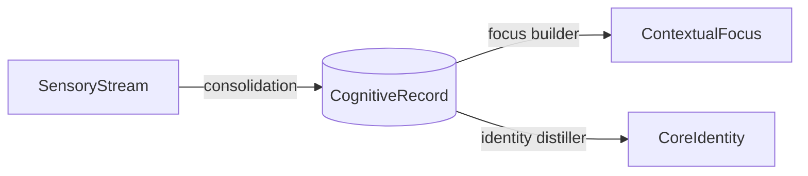
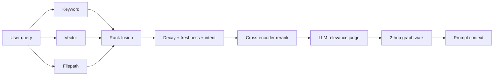

# BrainRouter — Memory for Agents

Most agent "memory" is a flat vector DB: dump everything in, hope cosine
similarity surfaces the right thing next time. BrainRouter takes a different
shape — it emulates how human memory actually works: a short-term buffer
feeds a long-term store, unused facts decay, used ones get reinforced.

The goal: when your agent reads its prompt, it sees what's relevant and
recent, not a wall of stale chunks.

> **Version 0.4.2.** Memory engine + MCP server + a memory-native terminal
> CLI + a Next.js dashboard. This doc covers the engine and the MCP API; the
> CLI deep dive is [brainrouter-docs/cli.md](brainrouter-docs/cli.md).

## The four layers

| Layer | What it stores | Lifetime |
| --- | --- | --- |
| **SensoryStream** | Raw user + assistant messages | Transient — pruned after extraction |
| **CognitiveRecord** | Classified facts (decisions, preferences, code facts) | Long-term, with decay |
| **ContextualFocus** | Active "scenes" — clusters of records around a task | Medium — heat-based eviction |
| **CoreIdentity** | User profile + non-negotiable instructions | Permanent — prepended to system prompts |



## How recall works



Three retrievers run in parallel and get fused. The fused list is rescored
against each record's decayed priority and citation count, optionally
reranked by a cross-encoder, then optionally gated by an LLM relevance
judge that drops candidates the reranker ranked highly but which aren't
actually about the query. The survivors get expanded via the knowledge
graph to pull in related facts.

## What makes it different

- **It forgets.** Memories decay on a type-specific half-life. Instructions
  never decay; codebase facts decay over 60 days; task state over 14.
- **It reinforces.** When the agent actually cites a memory, that memory
  gets a boost. When it ignores one repeatedly, the memory archives itself.
- **It judges.** An optional LLM judge filters the final list for actual
  semantic relevance — the reranker only reorders, it never filters, so
  keyword-matched but off-topic memories used to slip through. Now they
  don't.
- **It connects.** A 2-hop graph walk pulls in related facts the keyword /
  vector search wouldn't have surfaced on their own.

## MCP API reference

The server speaks the [Model Context Protocol](https://modelcontextprotocol.io/):
any MCP-aware client (the BrainRouter CLI, Claude Desktop, Cursor, your own
agent) lists these tools and calls them over stdio or Streamable HTTP. Tools
surface to clients as `mcp__brainrouter__<tool>`. Inputs below show the
load-bearing fields — every tool tolerates extra context fields.

> Two tools (`create_skill`, `update_skill`) require an admin connection;
> the rest are open. A handful (`memory_capture_turn`, `memory_mark_cited`,
> `memory_resolve_session`, `memory_register_skill_hints`) are typically
> driven by the client's auto-pipeline rather than the model directly.

### Memory — capture & recall

| Tool | Purpose | Key inputs |
| --- | --- | --- |
| `memory_recall` | Full recall pipeline (keyword + vector + filepath → rerank → judge → graph). The pre-turn briefing's engine. | `query`, `limit?`, `scope?` (`workspace`/`project`/`global`), `workspaceTag?`, `projectTag?` |
| `memory_search` | Lighter keyword/vector search without the judge/graph stages. | `query`, `limit?`, `type?` |
| `memory_capture_turn` | Ingest a user+assistant turn into the SensoryStream for later extraction. | `userMessage`, `assistantMessage`, `sessionKey?` |
| `memory_mark_cited` | Reinforce the records the agent actually used (boosts priority). | `recordIds[]` |
| `memory_graph_query` | Walk the knowledge graph from a seed record (N-hop related facts). | `recordId`, `hops?` |
| `memory_contradictions` | Surface records that conflict with each other. | `recordId?` |
| `memory_consolidate` | Force a SensoryStream → CognitiveRecord extraction pass. | `userId?` |
| `memory_resolve_session` | Map a client sessionKey to the canonical user/session. | `sessionKey` |

### Memory — provenance, persona & governance

| Tool | Purpose | Key inputs |
| --- | --- | --- |
| `memory_persona` | Fetch the distilled CoreIdentity (pinned into the prompt prefix). | — |
| `memory_persona_refresh` | Re-distill CoreIdentity from recent records. | — |
| `memory_provenance` | "Why is this memory here?" — origin turn, citations, reinforcement history (powers `/brain why`). | `recordId` |
| `memory_explain_recall` | Why a given record ranked where it did for a query. | `query`, `recordId` |
| `memory_register_skill_hints` | Register keyword triggers that bias recall toward a skill. | `skill`, `hints[]` |
| `memory_governance_*` | Audit log, verify/re-verify a record, archive. | varies |
| `memory_engineering_*` | Low-level record CRUD + maintenance for tooling. | varies |
| `memory_working_*` | Working-memory canvas: `context` (read), `offload` (write), `reset`. | `content?` |
| `memory_hook_*` | Register/inspect server-side memory hooks. | varies |

### Brain agents (async maintenance)

The brain runs background "agents" (consolidation, persona distillation,
contradiction sweeps) off a durable job queue.

| Tool | Purpose | Key inputs |
| --- | --- | --- |
| `memory_agent_status` | Per-agent health: last run, 24h success rate, pending jobs. | `agentId?` |
| `memory_agent_run` | Manually enqueue a brain-agent run. | `agentId` |
| `memory_job_retry` | Re-arm a failed/cancelled brain job. | `jobId` |

### Federation (cross-CLI / cross-vendor)

Multiple CLIs sharing one brain can see each other and pass work across the
boundary. See [brainrouter-docs/federation.md](brainrouter-docs/federation.md).

| Tool | Purpose | Key inputs |
| --- | --- | --- |
| `session_register` / `session_heartbeat` / `session_unregister` | Presence in the active-session registry. | `sessionKey`, `clientKind?` |
| `session_list` | List live peer sessions (who else is on this brain). | `scope?` |
| `session_send` / `session_inbox_read` / `session_inbox_ack` | Direct messages + broadcasts between sessions. | `to`, `kind`, `payload` |
| `session_delegate_task` | Hand a task to another vendor/CLI (`<clientKind>:next-idle` resolution); queues to `pending_delegations` if no peer is live. | `task`, `target?` |
| `session_delegations` | Read delegated tasks addressed to this session. | — |

### Skills, personas & docs

| Tool | Purpose | Key inputs |
| --- | --- | --- |
| `list_skills` / `search_skills` / `get_skill` | Browse + load the skills library (workflow playbooks). | `scope?`, `query`, `name` + `section?` |
| `get_persona` / `get_reference` | Fetch a named persona or reference doc. | `name` |
| `list_template_docs` / `get_template_doc` | Project-specific template docs (api/design/schema/…). | `category?`, `name` + `section?` |
| `create_skill` / `update_skill` | Author/edit skills (**admin only**). | `name`, `category`, `section`, `content` |

### Transports & auth

```bash
# stdio — the client spawns the server as a child (no port)
brainrouter-mcp                      # after: npm i -g @kinqs/brainrouter-mcp-server

# Streamable HTTP — long-running shared brain on :3747
cd brainrouter && npm run start:http  # POST /mcp
```

HTTP mode also exposes a REST surface under `/api/*` (users, memories,
scenes, persona, sessions, graph, stats, governance) used by the dashboard,
plus an OpenAI-compatible `/v1/chat/completions` proxy. Admin routes are
gated by `BRAINROUTER_ADMIN_PASSWORD` + `BRAINROUTER_JWT_SECRET`. Full
server env reference: [brainrouter-docs/configuration.md](brainrouter-docs/configuration.md).

## Beyond memory — the CLI

The repo ships [`brainrouter-cli/`](brainrouter-cli/) — a terminal agent
built on the memory stack, with the brain as a first-class tool. Highlights
as of 0.4.2:

- **Memory-native turns** — every turn opens with a recall briefing + pinned
  persona; cited records are reinforced automatically.
- **Multi-agent orchestration** — `task_agent` / `delegate_agent` /
  `spawn_agents` fan out bounded child roles (explorer, architect, reviewer,
  worker, verifier) with ownership globs, per-agent budgets, and auto-chain
  review/verify. **Agent packs** (`/pack`) bundle reusable role definitions;
  **worker threads** (`/workers`) run detached, file-backed background agents.
- **Durable workflows** — `/spec`, `/feature-dev`, `/review` (`--fix` applies
  fixes), `/simplify`, `/implement-plan` write artifacts under
  `.brainrouter/workflows/<slug>/`. A persisted **run ledger** tracks each
  step; `/workflows [slug]` shows live progress; idle background completions
  notify above the prompt.
- **Federation** — `/dm`, `/broadcast`, `/inbox`, `/handoff` and cross-vendor
  `session_delegate_task` let CLIs on the same brain collaborate.
- **Controls** — `/effort low|medium|high|xhigh` (alias `max`), `/model`
  (with `--session`), `cli.fallbackModel`, `! <shell>` escape, sandboxing,
  hookify guardrails, and a `/goal` autonomy loop.

See **[brainrouter-docs/cli.md](brainrouter-docs/cli.md)** for the full CLI
reference.

## Going deeper

- **[brainrouter-docs/memory-engine.md](brainrouter-docs/memory-engine.md)** — formulas, decay constants, ranking blend.
- **[brainrouter-docs/cli.md](brainrouter-docs/cli.md)** — terminal CLI internals + every slash command.
- **[brainrouter-docs/configuration.md](brainrouter-docs/configuration.md)** — server env vars, CLI `config.json` knobs, storage layout, transports.
- **[brainrouter-docs/federation.md](brainrouter-docs/federation.md)** — multi-CLI presence, messaging, and cross-vendor delegation.
- **[brainrouter-docs/brain-agents.md](brainrouter-docs/brain-agents.md)** — the async maintenance agents + job queue.
