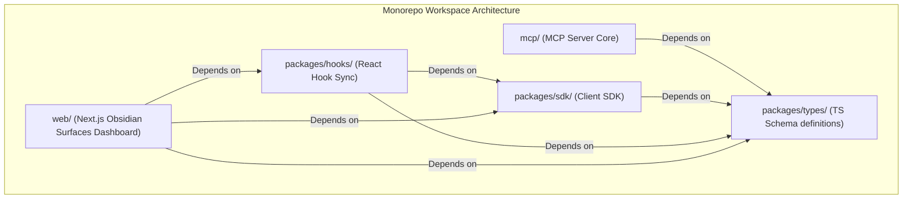
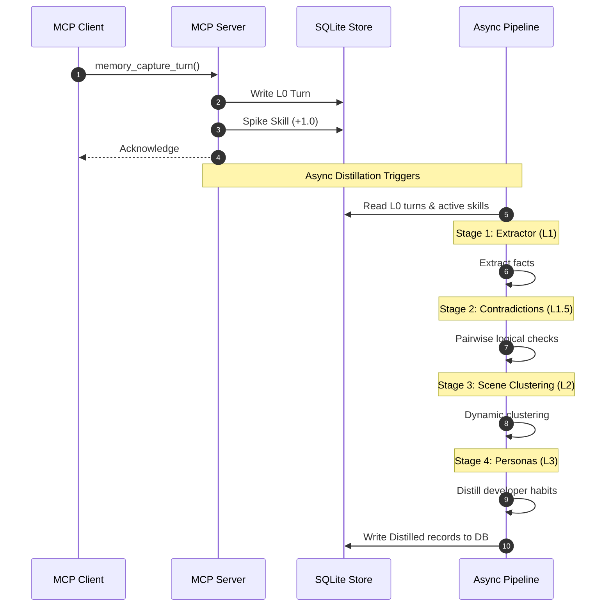
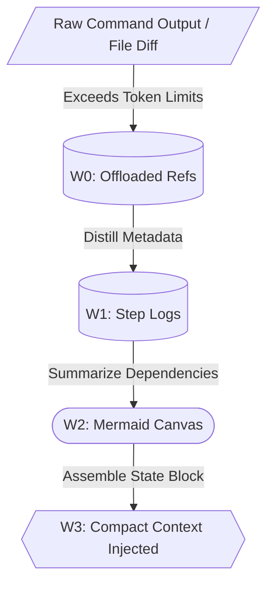

# 🧠 BrainRouter: Conceptual Architecture & Landscape Position

This document defines the core engineering architecture of BrainRouter, detailing its conceptual roots, SNN-inspired activation algorithms, and competitive positioning within the agent memory landscape.

---

## 🏗️ Landscape Comparison: BrainRouter vs. Competitors

To understand BrainRouter's design choices, we position it relative to two major alternative agent-memory implementations: **agentmemory** and **TencentDB-Agent-Memory**.

| Feature | agentmemory | TencentDB-Agent-Memory | BrainRouter |
| :--- | :--- | :--- | :--- |
| **Primary Focus** | Collaborative agent mesh & administrative database control. | Enterprise cloud-native scaling & markdown-based debugging. | **Local-first developer workflow & active context pre-warming.** |
| **Backend Store** | ChromaDB + Postgres/SQLite. | Tencent Cloud VectorDB + SQLite. | **SQLite (`sqlite-vec` + FTS5) local database.** |
| **Tool Namespace** | Massive (51 administrative tools). | Small (~10 controller tools). | **Moderate (~40 developer-centric tools).** |
| **Active Pruning** | Manual/Standard prompt truncation. | Short-term tool summaries. | **SNN-inspired decay and pre-warming thresholds.** |
| **Context Offload** | None. | Mermaid execution flowchart. | **4-tier working memory offload (W0-W3 layers).** |

### How BrainRouter Differs:
1. **Local-First Simplicity:** Like TencentDB, we leverage local SQLite storage to keep deployments lightweight and fast, but we use native `sqlite-vec` for local vector operations instead of requiring remote cloud vector database connections.
2. **Context Efficiency:** Unlike `agentmemory`, which relies on the LLM or standard truncation to handle huge prompts, BrainRouter actively manages the agent's active prompt. It dynamically scales up or down instructions and memories based on active tasks.
3. **Software Engineering Taxonomy:** Rather than storing generic unstructured episodic logs, BrainRouter categorizes memories (e.g. codebase facts, architecture decisions, failed attempts, and verification results) to apply specialized query and decay weights.

---

## ⚡ Prototype Inspirations (From `ei8/prototypes`)

BrainRouter adapts biological modeling design patterns from the **ei8/prototypes** repository to build a robust, reactive agent context router:

### 1. `HelloWorm` (Spiking Potential & Leakage)
*   **The Prototype Concept:** Models C. elegans movement where sensory inputs trigger spiking nodes that accumulate potential, which then decay (leak) back to zero over time.
*   **The BrainRouter Adaptation:** We map developer "skills" (such as `spec-driven-development` or `testing-skill`) to active nodes. When an agent calls a tool or works in a specific folder, it triggers an event that **spikes** the skill's activation score. If a skill goes unused, its score undergoes **exponential decay (leakage)**.

### 2. `HeartRate` (Sensor-Analyzer-Reactor Loop)
*   **The Prototype Concept:** A structured actor/control loop that senses heart rate spikes, analyzes threshold metrics, and triggers appropriate reactor state adjustments.
*   **The BrainRouter Adaptation:** We structure prompt assembly using this closed loop:
    *   **Sensor:** Tracks active tool invocations and user queries.
    *   **Analyzer:** Performs in-memory decay and checks which skill scores cross the pre-warming threshold.
    *   **Reactor:** Dynamically injects instructions and memory hints for threshold-exceeding skills into the agent's context window.

---

## 📐 Mathematical Formulation of Score Decay

The activation potential $P$ of any skill is capped within the range $[0, P_{max}]$ and is updated during tool execution and prompt assembly.

### 1. The Spike Step
When a skill is triggered or used:
$$P_{new} = \min(P_{max}, P_{old} + \Delta P_{spike})$$
*(where default $\Delta P_{spike} = 1.0$ and $P_{max} = 4.0$)*

### 2. The Hybrid Decay Step
To prevent write bottlenecks, decay is calculated lazily in-memory on read. Given a half-life $T_{1/2}$ (in minutes), the decay constant $\lambda$ is:
$$\lambda = \frac{\ln(2)}{T_{1/2}}$$

For an elapsed time $\Delta t$ in minutes, the decay due to clock time is:
$$P_{time} = P_{old} \times e^{-\lambda \Delta t}$$

To handle rapid agent turns where clock time elapsed is near zero ($\Delta t \approx 0$), we also enforce a minimum per-turn decay factor $D_{turn}$ (e.g., $5\%$):
$$P_{turn} = P_{old} \times (1 - D_{turn})$$

The final decayed potential returned to the routing pipeline is the minimum of these two decay models:
$$P_{decayed} = \max(0, \min(P_{time}, P_{turn}))$$

Skills with a decayed potential exceeding the **Pre-Warming Threshold** (e.g. $1.5$) have their documentation and memory registers loaded into the active prompt.

---

## 🔄 The Routing Execution Loop

Every agent interaction turn follows a structured cycle:

```
[Agent Tool Invocation]
         │
         ▼
 1. Resolve Session ──► Establish tenant-isolated session uuid
         │
         ▼
 2. Recall Context  ──► Decay potentials, select pre-warmed skills, fetch L1 memories
         │
         ▼
 3. Select Skill    ──► Load the active skill template (e.g. spec-driven-development)
         │
         ▼
 4. Execute Task    ──► Run commands/edits & spike active skill potential (+1.0)
         │
         ▼
 5. Signal Citation ──► Log cited memories to power the ACE feedback loop
         │
         ▼
 6. Capture Turn    ──► Write raw L0 log and trigger async L1 memory distillation
```
This loop ensures prompt sizes scale dynamically with active developer focus, keeping LLM attention sharp and context footprints low.

---

## 🗺️ Monorepo Package Breakdown

BrainRouter is organized as a TypeScript monorepo using npm workspaces. Here is the detailed breakdown of the workspaces and their files:



### 1. `packages/types/`
Defines the standard schemas and interfaces used across the frontend, SDK, and server layers:
*   [api.ts](./packages/types/src/api.ts): REST request and response interfaces (e.g. `/api/skills/activations` payloads).
*   [memory.ts](./packages/types/src/memory.ts): Interfaces for episodic memory hierarchies (L0 raw messages, L1 records, L2 scenes, and L3 persona states).
*   [store.ts](./packages/types/src/store.ts): Database interface contracts defining storage methods for L0/L1 memories, SQLite operations, and state variables.

### 2. `packages/sdk/`
*   [client.ts](./packages/sdk/src/client.ts): Outlines the `BrainRouterClient` class, exposing promise-based wrapper methods for all REST APIs, authentication endpoints, memory management, and skill activations.

### 3. `packages/hooks/`
Provides React Hooks that fetch and cache state from the REST API:
*   `useSkillActivations.ts`: Syncs real-time skill potential curves and manual spike actions.
*   `useMemories.ts`: Fetches, searches, and paginates L1 episodic/semantic memories.
*   `useContradictions.ts`: Manages active semantic contradictions between L1 instructions.
*   `useWorkingMemory.ts`: Exposes short-term working context files and Mermaid canvas states.
*   `useScenes.ts` / `usePersona.ts`: Syncs scene nodes and L3 persona profiles.
*   `useHookStatus.ts` / `useOperations.ts` / `useStats.ts` / `useDiagnostics.ts`: System diagnostics hooks.

---

## 🔄 The Memory & Cognitive Pipeline

When turns are captured, they pass through a series of asynchronous processing stages inside `mcp/src/memory/pipeline/`:



### Core Pipeline Stages:
1.  **L1 Extraction ([l1-extractor.ts](./mcp/src/memory/pipeline/l1-extractor.ts)):** Distills conversation logs into structured episodic facts and general rules.
2.  **L1 Dedup ([l1-dedup.ts](./mcp/src/memory/pipeline/l1-dedup.ts)):** Merges overlapping memories using vector similarity comparison.
3.  **Contradictions ([l1-contradiction.ts](./mcp/src/memory/pipeline/l1-contradiction.ts)):** Identifies conflicting rules or instructions. Conflicting nodes are flagged as active contradictions for human review on the dashboard.
4.  **Scene Clustering ([l2-scene.ts](./mcp/src/memory/pipeline/l2-scene.ts)):** Groups episodic memories by situational affinity scores (scene heat).
5.  **Persona Compilation ([l3-distiller.ts](./mcp/src/memory/pipeline/l3-distiller.ts)):** Aggregates technical preferences and preference rules to compile the user profile.

---

## ⚡ Spiking Skill Routing & Decay Mechanics

Located in [skill-prewarm.ts](./mcp/src/memory/pipeline/skill-prewarm.ts), this models active state charge and decay:

### 1. In-Memory Exponential Decay
To avoid constant DB updates, skill decay is calculated lazily on-read. When querying activations, we decay the last known potential based on clock time and a minimum per-turn rate:
*   **Temporal decay:** $P_{time} = P_{old} \times e^{-\lambda \Delta t}$
*   **Per-Turn decay:** $P_{turn} = P_{old} \times (1 - D_{turn})$
*   **Decayed value:** $P_{decayed} = \max(0, \min(P_{time}, P_{turn}))$

### 2. Pre-Warming Trigger
*   If $P_{decayed} \ge \text{Threshold}$ (default: $1.5$), the system flags the skill's associated instructions and hints for inclusion in the active context.
*   The pre-warmed context is appended to the prompt during the `memory_recall` step, making the agent instantly aware of active specifications.

---

## 📥 Short-Term Working Memory Offloading

To handle large terminal payloads, BrainRouter uses a 4-tier offloader defined in [offload.ts](./mcp/src/memory/working/offload.ts):



*   **W0 (Raw Refs):** Saves full text payloads to `.brainrouter/work/<session>/refs/*.md` and returns a placeholder.
*   **W1 (Step Logs):** Log of sequential execution steps.
*   **W2 (Mermaid Canvas):** A structured task diagram rendered inside [canvas.ts](./mcp/src/memory/working/canvas.ts).
*   **W3 (Injected State):** A compact summary string containing active goals and visual diagrams injected into the prompt.

---

## 🔌 API Routes Reference (`mcp/src/api/routes/`)

The Express server exposes the REST API layer under `/api`:


*   **[auth.ts](./mcp/src/api/routes/auth.ts):** Authenticates users and registers API keys.
*   **[skills.ts](./mcp/src/api/routes/skills.ts):** Exposes `GET /api/skills/activations` to return SNN activation values and `POST /api/skills/spike` to manually increment potentials.
*   **[memories.ts](./mcp/src/api/routes/memories.ts):** Supports CRUD operations, vector searches, and ACE citation counts for L1 records.
*   **[contradictions.ts](./mcp/src/api/routes/contradictions.ts):** Exposes contradictions flagged during distillation.
*   **[working.ts](./mcp/src/api/routes/working.ts):** Exposes the Mermaid canvas and compression methods.
*   **[scenes.ts](./mcp/src/api/routes/scenes.ts) / [persona.ts](./mcp/src/api/routes/persona.ts):** Configures L2 situation boundaries and L3 profiles.
*   **[hooks.ts](./mcp/src/api/routes/hooks.ts):** Registers passive lifecycle events.
