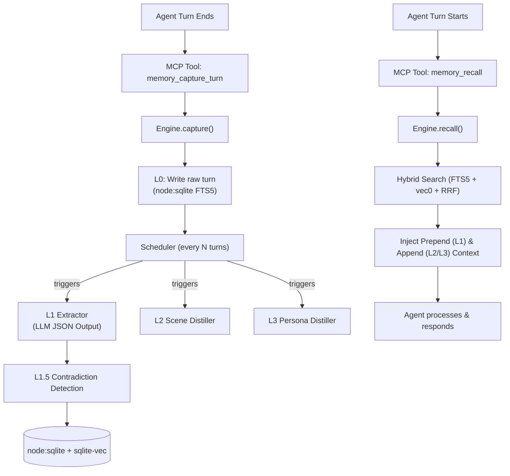

# Current BrainRouter Memory Engine — Architecture & Implementation

> How the memory engine is currently implemented in BrainRouter, adapted from the original TencentDB concept.

---

## The Big Picture: Orthogonal Systems with MCP Tools

The engine is built inside `mcp/src/memory/` and is exposed to the AI agent via MCP tools instead of internal hooks.

---

## Phase 1: Auto-Capture (Writing Memory)

**File:** `mcp/src/memory/capture.ts`
**Tool:** `memory_capture_turn`

Called actively by the agent after every response.

### Step 1 — Atomic L0 Recording
Instead of relying on a file checkpoint cursor, the MCP tool explicitly receives the `messages` array for the turn.
- The `RuntimeContext` requires `userId` and `sessionKey` to enforce strict multi-tenant isolation.
- Every message is written to `l0_conversations` in `node:sqlite`.
- Includes the `activeSkill` tag to track *which* BrainRouter skill was running.

### Step 2 — L0 Vector Indexing & Scheduler
- Background vector embedding is queued.
- `scheduler.notifyConversation()` is called to track when L1 should run.

---

## Phase 2: The L1 Extraction Pipeline

**File:** `mcp/src/memory/pipeline/l1-extractor.ts`
**Prompt:** `mcp/src/memory/prompts/l1-extraction.ts`

### The Prompt Architecture
The LLM acts as a **Skill-Aware Memory Extraction Expert**. It extracts 4 types of memories:
1. `persona` — Stable user traits.
2. `episodic` — Objective events with timestamps.
3. `instruction` — Long-term rules the user gave the AI.
4. **`skill_context`** (New) — Observations about how the user interacts with specific skills.

**Skill Hints:** The active skill's `memory_hints` (from `SKILL.md` frontmatter) are injected into the prompt to guide what to look for.

### L1.5 Contradiction Detection
**File:** `mcp/src/memory/pipeline/l1-contradiction.ts`
**Prompt:** `mcp/src/memory/prompts/l1-contradiction.ts`

Instead of just deduping, the system actively detects conflicts between a new memory and existing memories (e.g., "Always use npm" vs "Always use pnpm").
- Conflicting records are stored in the `contradictions` table.
- Unresolved conflicts are surfaced during recall to warn the agent.

---

## Phase 3: L2 Scene Distillation

**File:** `mcp/src/memory/pipeline/l2-scene.ts`
**Prompt:** `mcp/src/memory/prompts/l2-scene.ts`

Extracts narrative scenes based on clustered L1 memories. 
- Distills related memories into cohesive Markdown blocks representing different domains of the user's work or life.
- Stored directly in the database (`scene_blocks` / `l2` store) or as files, and injected into the prompt.

---

## Phase 4: L3 Persona Distillation

**File:** `mcp/src/memory/pipeline/l3-distiller.ts`
**Prompt:** `mcp/src/memory/prompts/l3-persona.ts`

Generates a deep, 4-layer psychological and technical profile of the user.
- **Layer 1:** Base Anchors (Demographics, facts).
- **Layer 2:** Interest Graph.
- **Layer 3:** Interaction Protocol (Communication style, workflows).
- **Layer 4:** Cognitive Core (Decision logic).

Produces a unified `persona.md` equivalent summary that is injected as stable context.

---

## Phase 5: Recall (Reading Memory)

**File:** `mcp/src/memory/recall.ts`
**Tool:** `memory_recall`

Called actively by the agent before generating a response to establish context.

### 1. Hybrid Search (L1)
- Uses **FTS5 BM25** (keyword) and **sqlite-vec cosine similarity** (semantic).
- Merges results using **Reciprocal Rank Fusion (RRF)**.
- **Decay Scoring:** Memories decay based on a half-life (e.g., episodic = 30 days, persona = 180 days). Instructions never decay.
- **Output:** Injected as `prependContext` (dynamic, changes every turn).

### 2. Scene & Persona Injection (L2/L3)
- The L3 Persona summary and active L2 Scene summaries are fetched.
- **Output:** Injected as `appendSystemContext` (stable, cacheable).

### 3. Contradiction Warnings
- Any unresolved L1.5 contradictions related to the user are injected, prompting the agent to ask the user for clarification.

---

## The Storage Layer

**Files:** `mcp/src/memory/store/sqlite.ts` & `embedding.ts`

Uses **`node:sqlite`** (built into Node 22+) + **`sqlite-vec`**.

### Key Tables
| Table | Purpose |
|-------|---------|
| `l0_conversations` | Raw messages, fully searchable via FTS5. |
| `l1_records` | Extracted memories (4 types). Prioritized, decayed, and tagged with `skill_tag`. |
| `contradictions` | Tracks conflicting L1 records until the user resolves them. |
| `skill_extraction_hints` | Caches hints loaded from `SKILL.md` files to guide L1 extraction. |

### Multi-Tenant Isolation
Every table has a `user_id` column. Every SQL query strictly filters by `WHERE user_id = ?`.

---

## The MCP Tools Interface

The engine is bridged to agents via these tools:

1. `memory_capture_turn` - Passive recording after a turn.
2. `memory_recall` - Proactive context loading before a turn.
3. `memory_search` - Explicit semantic search for deep diving.
4. `memory_contradictions` - Check for active conflicts.
5. `memory_register_skill_hints` - Teach the memory engine what to look for when a skill runs.
