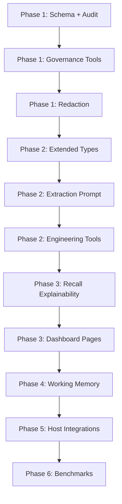

# BrainRouter: Software Engineering Memory System — Full Implementation Plan

**Date:** 2026-05-19  
**Goal:** Transform BrainRouter from a general conversation memory system into a first-class software engineering memory system, while preserving its MCP-native skill-router identity.

---

## Context & Current Baseline

BrainRouter's memory pyramid is already solid:
- **L0** → raw conversation capture (SQLite)
- **L1** → extracted memories (4 types: `persona`, `episodic`, `instruction`, `skill_context`)
- **L1.5** → contradiction detection
- **L2** → scene summaries
- **L3** → persona distillation
- Retrieval: FTS5 + sqlite-vec + RRF + decay + skill-boost + optional reranker + graph recall

**What's missing** (per `BRAINROUTER_IMRPOVEMENT.MD` and `MEMORY_SYSTEM_COMPARISON.md`):

1. Engineering-specific memory types (decisions, bugs, APIs, tasks, etc.)
2. Trust primitives: confidence, verification status, provenance, audit log, redaction
3. Recall explainability
4. Short-term working memory offload for long tasks
5. Operational tooling: export/import, governance delete, diagnostics
6. Dashboard observability: timeline, recall inspector, evidence browser
7. New MCP tools mapped to software-engineering workflows
8. Benchmark methodology and result artifacts

---

## User Review Required

> [!IMPORTANT]
> The plan is organized into 6 phases. **Phase 1 and Phase 2 are the most critical** and should be reviewed carefully before any code is written. Phases 3-6 are sequenced to depend on earlier phases — do not reorder them.

> [!WARNING]
> Phase 1 includes **SQLite schema migrations** on the `l1_records` table and new tables. These are additive (no column drops), but any live production deployment should be tested against existing data before rolling out.

> [!CAUTION]
> The expanded `MemoryType` union in `packages/types/src/memory.ts` is a **breaking change** to the shared type surface. All consumers (dashboard, SDK hooks, API routes) must be updated in the same PR as the type change. The extraction LLM prompt must also be updated simultaneously.

---

## Open Questions

> [!IMPORTANT]
> **Q1:** Should `task_state` be a separate SQLite table (`memory_task_state`) with structured columns, or a first-class L1 memory type stored in `l1_records`? Recommendation: start with L1 type for simplicity; upgrade to dedicated table in Phase 4.

> [!IMPORTANT]
> **Q2:** For the audit log (`memory_operations`), should it capture the full content of every L1 mutation, or only metadata (operation type, record_id, actor, timestamp)? Full content increases storage cost. Recommendation: metadata-only by default.

> [!NOTE]
> **Q3:** Should L2/L3 filesystem mirrors be opt-in via env var or always-on? Recommendation: always-on for local mode, opt-out via `BRAINROUTER_DISABLE_FS_MIRROR=true`.

> [!NOTE]
> **Q4:** For the privacy/redaction filter, regex pattern list (fast) or LLM-assisted (accurate)? Recommendation: regex list first, LLM-assist optional via env flag.

---

## Proposed Changes

### Phase 1 — Trust & Auditability

*Goal: Make memories trustworthy, auditable, and safely exportable before expanding the feature surface.*

---

#### [MODIFY] `packages/types/src/memory.ts`

- Extend `L1Record` with new optional provenance and governance fields:
  - `confidence: number` (default `0.65`)
  - `status: 'active' | 'superseded' | 'archived' | 'needs_verification'`
  - `sourceKind: 'user_instruction' | 'source_file' | 'command_output' | 'test_result' | 'model_inference' | 'prior_memory'`
  - `verificationStatus: '' | 'verified' | 'unverified' | 'stale'`
  - `repoPaths: string[]`
  - `filePaths: string[]`
  - `commands: string[]`
- Add new `EvidenceRef` type and `MemoryEvidence` interface
- Add `MemoryOperation` interface for audit log entries
- Add `MemoryExport` / `MemoryImport` envelope interfaces

#### [MODIFY] `packages/types/src/store.ts`

- Add `IMemoryStore` methods:
  - `insertEvidence(ev: MemoryEvidence): void`
  - `getEvidenceByRecord(userId, recordId): MemoryEvidence[]`
  - `insertOperation(op: MemoryOperation): void`
  - `getOperationLog(userId, options): MemoryOperation[]`
  - `getMemoryById(userId, recordId): L1Record | null`
  - `updateL1Confidence(userId, recordId, confidence, status): void`
  - `exportMemories(userId): MemoryExport`
  - `importMemories(userId, data): ImportResult`
  - `hardDeleteMemory(userId, recordId, reason): void`

#### [MODIFY] `mcp/src/memory/store/sqlite.ts`

- Add new tables:
  - `memory_evidence` — `(id, user_id, record_id, kind, ref, excerpt, observed_at, metadata_json)`
  - `memory_operations` — `(id, user_id, record_id, operation, actor, session_key, reason, created_at, metadata_json)`
- Add new columns to `l1_records`:
  - `confidence REAL DEFAULT 0.65`
  - `status TEXT DEFAULT 'active'`
  - `source_kind TEXT DEFAULT ''`
  - `verification_status TEXT DEFAULT ''`
  - `repo_paths_json TEXT DEFAULT '[]'`
  - `file_paths_json TEXT DEFAULT '[]'`
  - `commands_json TEXT DEFAULT '[]'`
- Implement all new `IMemoryStore` methods
- Add privacy/redaction filter at L0 insert point

#### [MODIFY] `mcp/src/memory/engine.ts`

- Add `getMemoryById`, `addEvidence`, `getEvidence`, `updateMemoryStatus`, `exportMemories`, `importMemories`, `governanceDelete` passthroughs
- Wire audit log writes to all significant mutations

#### [NEW] `mcp/src/tools/memory-governance.ts`

New MCP tools:
- `memory_get` — fetch a specific memory + evidence refs
- `memory_update` — correct content, change status, add note
- `memory_evidence_add` — attach evidence (file, command, URL, test, benchmark)
- `memory_evidence_get` — retrieve evidence for a memory
- `memory_export` — export all memories as JSON
- `memory_import` — import previously exported memories
- `memory_governance_delete` — hard delete with audit trail
- `memory_audit` — list audit log entries (paginated)

#### [MODIFY] `mcp/src/api/routes/`

- `GET /api/memories/:recordId`
- `PATCH /api/memories/:recordId`
- `POST /api/memories/:recordId/evidence`
- `GET /api/memories/:recordId/evidence`
- `GET /api/export`
- `POST /api/import`
- `DELETE /api/memories/:recordId` (with `reason` body)
- `GET /api/audit`

#### [NEW] `mcp/src/memory/redaction.ts`

- Regex-based privacy filter applied before L0 writes
- Patterns: `Bearer [token]`, `sk-[key]`, `ghp_[key]`, private key PEM blocks, `.env` format
- Replaces matched content with `[REDACTED]`

---

### Phase 2 — Engineering-Specific Memory Types

*Goal: Give the extractor the vocabulary to produce precise engineering memories.*

---

#### [MODIFY] `packages/types/src/memory.ts`

Expand `MemoryType` union:

```typescript
export type MemoryType =
  // Stable behavior (existing)
  | "persona" | "episodic" | "instruction" | "skill_context"
  // User/tool preferences
  | "tool_preference"
  // Codebase knowledge
  | "codebase_fact" | "api_contract" | "data_model"
  | "dependency_constraint" | "environment_constraint"
  // Engineering decisions
  | "architecture_decision" | "implementation_decision"
  | "design_constraint" | "security_policy" | "performance_baseline"
  // Work history & debugging
  | "bug_finding" | "debug_trace" | "fix_summary"
  | "verification_result" | "failed_attempt" | "regression_risk"
  // Planning & coordination
  | "task_state" | "handover_note" | "blocked_reason"
  | "review_comment" | "release_note"
  // Evidence & provenance
  | "source_evidence" | "artifact_reference"
  | "file_history" | "command_knowledge";
```

#### [NEW] `mcp/src/memory/memory-type-config.ts`

- Per-type decay half-life, default confidence, requires-evidence flag, recall task-intent affinity map
- Exports `TYPE_CONFIGS: Record<MemoryType, TypeConfig>`

#### [MODIFY] `mcp/src/memory/prompts/l1-extraction.ts`

- Update system prompt for all engineering types
- Gated extraction strategy:
  - Always: instructions, decisions, verified facts, task state
  - Only with evidence: API contracts, data models, performance baselines, security policies
  - Never: speculation, generic advice, duplicate file listings
- Include `confidence` scoring and `sourceKind` classification

#### [MODIFY] `mcp/src/memory/store/sqlite.ts`

- Add `memory_file_index` table: `(id, user_id, record_id, file_path, symbol, created_time)`
- Add `getMemoriesByFilePath(userId, filePath, limit)` method

#### [NEW] `mcp/src/tools/memory-engineering.ts`

New MCP tools:
- `memory_debug_trace_save` — save repro steps, suspected/confirmed cause, verification result
- `memory_debug_trace_search` — search prior failures by error, file, command, or symptom
- `memory_failed_attempts` — return approaches already tried for a problem area
- `memory_file_history` — return memories + evidence for a file path or symbol
- `memory_task_state` — read current task/handover state for a repo/session
- `memory_task_update` — write structured progress, blockers, next actions
- `memory_handover` — generate compact continuation note with evidence links
- `memory_verify` — re-check a memory, update confidence/status

#### [MODIFY] `mcp/src/memory/recall.ts`

- Add task-intent detection: `build | debug | review | test | plan | refactor | security | performance | release`
- Apply type-aware ranking policy per intent:
  - `debug` → boost `bug_finding`, `debug_trace`, `failed_attempt`, `command_knowledge`
  - `review` → boost `api_contract`, `data_model`, `security_policy`, `regression_risk`
  - `build` → boost `architecture_decision`, `implementation_decision`, `codebase_fact`
  - `security` → boost `security_policy`, `api_contract`, `data_model`
  - `performance` → boost `performance_baseline`, `verification_result`, `command_knowledge`
  - `plan` → boost `task_state`, `handover_note`, `blocked_reason`
- Add file-path based recall expansion via `memory_file_index`

---

### Phase 3 — Observability & Recall Explainability

*Goal: Make every recall and capture decision debuggable without reading raw server logs.*

---

#### [MODIFY] `mcp/src/memory/recall.ts`

- Return `recallExplanation` in `RecallResult`:
  - ftsHits, vecHits, rrfTopScore, intentDetected, typeBoosts, skillBoost, rerankerUsed, graphExpansion, citationBoosts, durationMs

#### [NEW] `mcp/src/tools/memory-explain.ts`

- `memory_explain_recall` tool — re-run a query in explain mode, return full breakdown

#### [MODIFY] `mcp/src/memory/store/sqlite.ts`

- Write `memory_operations` row for every recall query

#### Dashboard — New Pages

- **[NEW] `dashboard/app/timeline/page.tsx`**
  - Lists `memory_operations` events: capture, extraction, recall, archive, export, import, delete
  - Filterable by user, session, operation type, time range
  - Shows latency and hit counts for recall events

- **[NEW] `dashboard/app/recall-inspector/page.tsx`**
  - Input: query + userId
  - Output: ranked memories with per-memory score breakdown
  - Before/after comparison capability

- **[NEW] `dashboard/app/evidence/page.tsx`**
  - Browse all evidence attached to memories
  - Filter by kind (file, command, test, URL, benchmark)
  - Click-through from evidence to parent memory

---

### Phase 4 — Short-Term Working Memory

*Goal: Prevent long debugging sessions or large refactors from flooding the context window.*

---

#### [NEW] `mcp/src/memory/working/` directory

- `offload.ts` — detect token pressure, offload large tool results to refs
- `canvas.ts` — maintain a Mermaid task canvas for current work nodes
- `step-log.ts` — JSONL step summaries for the active session

Filesystem storage shape:
```
.brainrouter/work/<sessionKey>/
  refs/<nodeId>.md       # raw tool output refs (W0)
  steps.jsonl            # step summaries (W1)
  canvas.mmd             # Mermaid task canvas (W2)
  state.json             # current injected state block (W3)
```

#### [NEW] `mcp/src/tools/memory-working.ts`

- `memory_working_context` — return current canvas and state block; agent can request raw ref by nodeId
- `memory_working_offload` — explicitly offload a payload to a ref file, return nodeId
- `memory_working_reset` — clear working memory for a session on session end

Token-pressure triggers:
- Mild (>50% context): compress step log, keep only last 5 nodes in injected state
- Aggressive (>85% context): offload everything, inject only canvas + current node summary

---

### Phase 5 — Host Integrations

*Goal: Passive capture that does not depend entirely on the agent calling `memory_capture_turn`.*

---

#### [NEW] `mcp/src/integrations/` directory

- `claude-code.ts` — Claude Code lifecycle hooks: PreToolUse, PostToolUse, Stop, SubagentStop
- `codex.ts` — Codex lifecycle hooks for session start/end, prompt submit, compact
- `generic-mcp.ts` — Generic MCP passive capture adapter

Each adapter:
- Emits L0 capture on tool calls (with tool name + filtered args as structured metadata)
- Emits session-end signal to trigger working memory flush
- Strips secrets before capture (reuses `redaction.ts`)

#### [MODIFY] `mcp/src/tools/`

- `memory_hook_register` — agent registers a lifecycle hook source
- `memory_hook_status` — list registered hooks and their last-seen timestamp

---

### Phase 6 — Measurement & Benchmarks

*Goal: Make memory quality measurable with reproducible, published methodology.*

---

#### [NEW] `mcp/benchmark/README.md`

Documents: datasets, modes, metrics, exact commands, expected output artifacts. Tracks:
- Retrieval R@5 / R@10 / MRR
- Prompt tokens injected vs baseline (token savings %)
- Capture latency p50/p95/p99
- Recall latency p50/p95/p99
- Extraction cost (LLM tokens)
- Memory drift / contradiction rate
- Task success rate

#### [NEW] `mcp/benchmark/results/` schema

Each run writes:
- `results/<run-id>/summary.json` — aggregated metrics
- `results/<run-id>/recall-trace.jsonl` — per-query breakdown
- `results/<run-id>/extraction-trace.jsonl` — per-session L1 extraction output

#### [NEW] Dashboard `dashboard/app/benchmarks/page.tsx`

- Lists past runs with key metrics
- Token savings trend chart
- R@5 / R@10 trend chart
- Per-run drill-down with recall trace

---

## Verification Plan

### Phase 1
- `npm run build` across the full workspace — no type errors
- New SQLite tables created on engine init
- Redaction filter strips `Bearer sk-test-key` from L0 messages
- `memory_export` round-trips through `memory_import` without data loss
- `memory_governance_delete` writes to `memory_operations` log and removes L1 record

### Phase 2
- Capture a multi-turn debugging session; verify `bug_finding`, `debug_trace`, `verification_result` types appear in L1 records
- `memory_file_history` returns memories queried by file path
- `debug` intent boosts `bug_finding` above `persona` types in RRF result
- LongMemEval benchmark R@5 does not regress vs pre-Phase-2 baseline

### Phase 3
- Recall inspector returns populated `recallExplanation` fields
- Timeline page renders `memory_operations` rows with correct timestamps
- Evidence browser shows evidence attached via `memory_evidence_add`

### Phase 4
- 100-tool-call simulated session: refs files written, canvas.mmd updates
- `memory_working_context` returns canvas without raw payloads
- Aggressive offload triggers at >85% estimated context fill

### Phase 5
- Claude Code hook registered; simulated `PostToolUse` event writes filtered L0 record
- Redaction removes `sk-` prefixed keys before L0 storage

### Phase 6
- `npm run benchmark:longmemeval` writes `results/<run-id>/summary.json`
- Token savings metric populated before and after memory injection

---

## Implementation Dependency Graph


