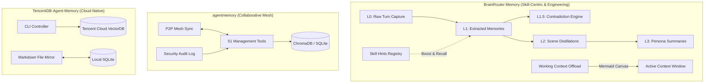

# Comparative Analysis: BrainRouter Memory vs. agentmemory vs. TencentDB-Agent-Memory

This document provides a comprehensive, side-by-side comparison of the **BrainRouter Memory System** and two major alternative agent-memory implementations: **agentmemory** and **TencentDB-Agent-Memory**. 

---

## 1. Architectural Overview & Philosophy

The three systems approach the problem of LLM/agent memory from fundamentally different angles, reflecting their design target scopes:



### BrainRouter Memory
* **Philosophy**: **Skill-routing-native and Software Engineering-oriented.** Memory is treated not just as a static text store, but as a dynamic engine to optimize tool/skill selection and preserve engineering context (architectural decisions, failed attempts, codebase facts, and debug traces) across long development tasks.
* **Storage Engine**: SQLite + `sqlite-vec` (for local vectors) + FTS5 (for full-text search).
* **Key Innovations**: Active Citation Feedback (ACE) to weight memories based on usage, strict L1.5 contradiction detection, skill-aware context prewarming, and token-pressure-triggered short-term context offloading.

### agentmemory
* **Philosophy**: **Multi-agent coordination and audit-ready governance.** Built to support massive networks of concurrent agents working collaboratively, focusing heavily on operational security, compliance, exportability, and workspace snapshotting.
* **Storage Engine**: ChromaDB (vector database) + PostgreSQL/SQLite.
* **Key Innovations**: P2P mesh synchronization, granular action queue systems (leases), and a massive management tool namespace (51 tools) covering snapshots, sentinels, and timeline replay.

### TencentDB-Agent-Memory
* **Philosophy**: **Cloud-scale enterprise performance and human-readable transparency.** Aimed at corporate environments requiring remote high-performance vector databases and transparent file-based debugging for developers.
* **Storage Engine**: Tencent Cloud VectorDB + SQLite + Local filesystem.
* **Key Innovations**: Canonical filesystem mirroring (storing L2/L3 states as Markdown files), short-term tool-output offloading, and dedicated command-line operations controllers.

---

## 2. Side-by-Side Feature Matrix

| Feature Dimension | BrainRouter Memory | agentmemory | TencentDB-Agent-Memory |
| :--- | :--- | :--- | :--- |
| **Primary Database Backend** | SQLite (`sqlite-vec` + FTS5) | ChromaDB + SQLite/Postgres | Tencent Cloud VectorDB + SQLite |
| **Vector Implementation** | Local vector extension | ChromaDB client / native embeds | Remote VectorDB client |
| **Memory Pyramid (L0-L3)** | Yes (L0 Raw, L1 Extract, L2 Scene, L3 Persona) | Partial (Unstructured/Hierarchical) | Yes (Layered JSON + Markdown) |
| **Contradiction Detection** | Yes (L1.5 explicit contradiction engine) | No (Relies on model overwrite) | No (Manual updates) |
| **Tool Namespace Size** | Moderate (~40 tools) | Large (51 tools) | Small (~10 tools) |
| **Skill-Aware Routing** | **Yes (Unique tag boost & prewarming)** | No | No |
| **Active Citation Tracking** | **Yes (ACE citation feedback loop)** | No | No |
| **Short-Term Context Offload** | Yes (W0-W3 layers, Mermaid canvas) | No | Yes (Mermaid task canvas only) |
| **Multi-Tenant Isolation** | Yes (User & Session Key scoping) | Yes (Team, Tenant, & Project scoping) | Yes (Account scoping) |
| **Lifecycle Hooks** | Passive hooks (Claude Code, Codex, Generic MCP) | Broad multi-host hook matrix | OpenClaw & Hermes adapters |
| **Replay & Observability** | Next.js Dashboard + Audit Operations | Live stream viewer (Port 3113) + Replay | Diagnostic CLI + Redacted logs |
| **Governance & Redaction** | Yes (PII/Secret redactor before L0 write) | Yes (Strict field audits + retention) | Yes (Export diagnostics) |
| **Mesh/P2P Sync** | No | Yes (Mesh Sync + Team Feeds) | No |

---

## 3. Core Architectural Deep-Dive

### A. Long-Term Memory Hierarchy & Taxonomy
* **BrainRouter**: Implements a strict **Software Engineering Memory Taxonomy**. Instead of saving everything as generic "episodic" text, memories are typed:
  * *Stable Habits*: `persona`, `instruction`, `tool_preference`
  * *Codebase Knowledge*: `codebase_fact`, `api_contract`, `data_model`, `dependency_constraint`
  * *Engineering Decisions*: `architecture_decision`, `implementation_decision`, `performance_baseline`
  * *Work History*: `bug_finding`, `debug_trace`, `fix_summary`, `verification_result`, `failed_attempt`
  This enables specialized decay rates and query-specific ranking rules.
* **agentmemory**: Relies on a simpler taxonomy (`preference`, `event`, `fact`, `lesson`). Lacks strict compiler/symbol mapping and does not distinguish between architectural constraints and temporary debugging traces.
* **TencentDB-Agent-Memory**: Divides memories into structured database objects and human-readable markdown mirrors (`scene_blocks/*.md`, `persona.md`). This facilitates git-based tracking of memory evolution.

### B. Retrieval & Ranking
* **BrainRouter**: Uses a hybrid **Reciprocal Rank Fusion (RRF)** combiner merging:
  1. Vector search similarity score.
  2. FTS5 full-text keyword match score.
  3. Half-life decay multiplier (decay varies by memory type; instructions do not decay).
  4. **Skill-tag boost** (if the current active skill matches the memory's skill tag).
  5. **Citation boost** (rewards frequently cited memories).
  6. Graph-recall expansion (follows links between nodes).
* **agentmemory**: Primarily relies on vector similarity through ChromaDB. Lacks fine-grained RRF combining or specialized decay rates based on taxonomy type.
* **TencentDB-Agent-Memory**: Combines local SQLite searches with Tencent Cloud VDB vector calls. Lacks RRF and citation feedback loops.

### C. Short-Term Working Memory Offloading
* **BrainRouter**: Solves the context-window token-pressure problem using a 4-tier system:
  * **W0 (Raw Refs)**: Large tool payloads saved to `.brainrouter/work/<session>/refs/*.md`.
  * **W1 (Step Logs)**: Structured JSONL steps.
  * **W2 (Mermaid Canvas)**: Visual depiction of task state.
  * **W3 (Injected State)**: A compact summary injected into the LLM context.
  If token limit pressure crosses a 50% threshold, it starts offloading payloads; at 85% it initiates aggressive compression.
* **agentmemory**: No active short-term offload system. Relies on the agent manually managing context or utilizing standard prompt truncation.
* **TencentDB-Agent-Memory**: Introduces a short-term offloader that parses active tool inputs/outputs, summarizes them into JSONL, and renders a Mermaid flowchart representation of the execution path.

### D. Security, Privacy & Governance
* **BrainRouter**: Integrates active **pre-write redaction** filters. Before raw conversation (L0) reaches database storage, it is scrubbed of API keys, bearer tokens, private key blocks, and `.env` style configurations. Explicit `memory_governance_delete` writes an audit trail.
* **agentmemory**: Excels in enterprise security. Features a full `memory_audit` log, data retention schedules, GDPR-compliant hard deletes, schema fingerprinting, and circuit breakers for provider failure.
* **TencentDB-Agent-Memory**: Focuses on diagnostic export safety. Compiles redacted system logs, database stats, and checkpoints into an encrypted bundle for remote support troubleshooting.

---

## 4. Pros, Cons & Limitations

### BrainRouter Memory

> [!TIP]
> Best choice for developers building AI coding agents, IDE plugins, or skill-driven routing applications where code correctness and context preservation are paramount.

* **Pros**:
  * **Software Engineering Tailored**: Excellent handling of debug traces, failed attempts, codebase facts, and test verification states.
  * **Sophisticated Search**: RRF combining vector search and FTS5 ensures relevant terms are retrieved even when vocabulary shifts.
  * **Token Efficiency**: Short-term offloading drastically reduces token consumption during massive file operations and refactoring runs.
  * **Active Loop**: ACE ensures helpful memories are prioritized while useless/noisy extractions are auto-archived.
* **Cons**:
  * **Local Scaling Constraints**: SQLite and local vector embeddings can experience latency bottlenecks as database size reaches millions of records.
  * **No Peer-to-Peer Sync**: Lacks native mesh/P2P capabilities to share learned memories natively between developer machines.
* **Limitations**:
  * Currently optimized for single-user workspaces or isolated session boundaries; lacks complex multi-agent synchronization.

---

### agentmemory

> [!IMPORTANT]
> Best choice for orchestrating multi-agent systems, collaborative swarms, or systems requiring compliance auditing and high-availability vector backends.

* **Pros**:
  * **Massive Toolset**: 51 tools provide deep administrative control (snapshots, lease locks, event watchers).
  * **Agent Collaboration**: Mesh sync and team sharing allow multiple agents to share context seamlessly.
  * **Auditing Maturity**: Unparalleled audit trail logging for security compliance.
* **Cons**:
  * **Taxonomy is Too General**: Lacks semantic knowledge of codebase syntax, file paths, API contracts, or compiler errors.
  * **High Token Footprint**: No active context window compression; vulnerable to context saturation during long tasks.
  * **Complex Configuration**: Requires deploying/managing ChromaDB or Postgres instances.
* **Limitations**:
  * Poorly suited for local, lightweight command-line interfaces due to database dependencies.

---

### TencentDB-Agent-Memory

> [!CAUTION]
> Best choice for enterprise architectures deployed on Tencent Cloud requiring massive vector scalability and visual markdown-based memory inspection.

* **Pros**:
  * **Enterprise Cloud Scalability**: Leverages Tencent Cloud VectorDB to handle tens of millions of memory vectors.
  * **Human Debuggability**: Upper layers (L2, L3) are written as Markdown files, allowing developers to inspect and edit state using git diffs.
  * **Robust CLI Tools**: Shell scripts enable rapid backend configuration, starts, stops, and migration actions.
* **Cons**:
  * **Vendor Lock-In**: Deeply coupled with Tencent Cloud VectorDB; migrating to other cloud backends requires custom client rewrites.
  * **No RRF/Decay Control**: Retrieval is basic vector similarity, leading to potential search quality degradation over long-running sessions.
  * **Thin Tool Ecosystem**: Only exports basic tools; relies on host applications to handle core reasoning.
* **Limitations**:
  * Requires active internet connection to query remote VectorDB; high vector latency for local-only agents.

---

## 5. What to Use for What?

### Scenario A: Local Coding Agent or IDE Helper (e.g., Cursor, Codex, Claude Code)
* **Recommended System**: **BrainRouter Memory**
* **Rationale**: BrainRouter's passive hooks capture CLI and editor transitions natively. Its specialized taxonomy tracks architectural decisions and failed debugging steps, preventing the agent from repeating the same file modifications or running incorrect build commands. Short-term offloading keeps prompt costs low.

### Scenario B: Multi-Agent Swarms & Collaborative Workflows
* **Recommended System**: **agentmemory**
* **Rationale**: Collaborative tasks require agent-to-agent synchronization and lock mechanisms (leases). agentmemory's peer-to-peer sync, mesh architecture, and task queues are explicitly designed to keep parallel agents from overwriting each other's execution states.

### Scenario C: Large-Scale Enterprise Cloud Deployment
* **Recommended System**: **TencentDB-Agent-Memory**
* **Rationale**: If your organization has strict compliance policies, requires cloud hosting for vector storage, and needs developers to audit agent state via raw Markdown/git changes, the TencentDB adapter is the optimal route.

---

## 6. BrainRouter Integration Roadmap

BrainRouter has already incorporated many features inspired by these alternatives into its core code. Below is a status map of what is completed, what is in progress, and what remains on the horizon:

```
[x] Phase 1: SQLite + sqlite-vec Local Database Base
[x] Phase 2: L0-L3 Memory Hierarchy & Contradiction Detection
[x] Phase 3: Active Citation Loop (ACE Citation Tracking)
[x] Phase 4: Software-Engineering Taxonomy (Decisions, Bug Findings, Repro Steps)
[x] Phase 5: Governance and Audit Operations (Export, Import, Hard Delete, Scrubbing)
[x] Phase 6: Short-Term Working Memory Offload (Mermaid Canvas, W0-W3 layers)
[x] Phase 7: Host Lifecycle Hooks (Claude Code, Codex, Generic MCP)
[ ] Phase 8: P2P Mesh Sync & Collaborative Multi-Agent Leases (Research Phase)
[ ] Phase 9: Cloud-Native Remote Backend Adaptability (pgvector / Qdrant)
```

### Outstanding Core Recommendations
1. **Optimize Vector Storage**: As the local database grows, research hybrid caching strategies where active/frequent memories remain in a fast local cache, while older elements are offloaded or lazy-loaded.
2. **Standardize Schema Fingerprinting**: Implement agentmemory-style schema validation to prevent corruption when migrating between memory engine versions.
3. **Expand Replay Capabilities**: Utilize the Next.js Dashboard to support step-by-step visual playback of memory captures and contradiction resolution events.
