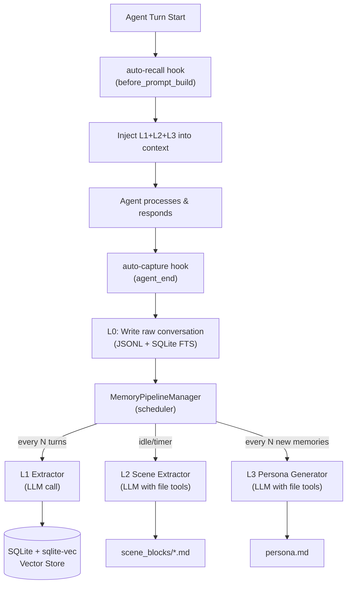

# TencentDB Agent Memory — Deep Technical Analysis & Rebuild Guide

> How it actually works under the hood, with a blueprint for rebuilding it for your MCP.

---

## The Big Picture: Two Orthogonal Systems

The project is two independent subsystems that share a storage layer:



---

## Phase 1: Auto-Capture (Writing Memory)

**File:** `src/core/hooks/auto-capture.ts` → called on every `agent_end` event.

### Step 1 — Atomic L0 Recording
```
checkpoint.captureAtomically(sessionKey, pluginStartTimestamp, async (afterTimestamp) => {
    filteredMessages = await recordConversation({ rawMessages, afterTimestamp, ... })
})
```
- Reads a **per-session cursor** (a timestamp) from a checkpoint file.
- Passes all messages **after** that cursor to `recordConversation()`.
- Uses a **file lock** to prevent two concurrent `agent_end` events from duplicating L0 records.
- Writes messages to a JSONL file: `~/.openclaw/memory-tdai/l0/<sessionKey>.jsonl`
- Returns the max timestamp of captured messages → advances the cursor.

**The key insight:** L0 captures everything verbatim, delta-style (cursor-based). No message is ever captured twice.

### Step 2 — L0 Vector Indexing (Async, Non-Blocking)
Two paths depending on the store's capability:

| Path | When | Behavior |
|------|------|----------|
| **Path A (SQLite)** | `store.supportsDeferredEmbedding === true` | Writes metadata + FTS immediately (fast, ~ms). Then fires a **background task** to batch-embed and update the vector index. Agent response is NOT blocked. |
| **Path B (VDB/remote)** | Otherwise | Embeds synchronously, then upserts with embedding in one call. |

```typescript
// Path A - non-blocking fire-and-forget
const bgPromise = (async () => {
    const embeddings = await embeddingService.embedBatch(texts);
    for (const record of records) {
        await vectorStore.updateL0Embedding(record.id, embeddings[i]);
    }
})();
bgTaskRegistry.add(bgPromise); // registered so TdaiCore.destroy() can await it
```

### Step 3 — Notify the Scheduler
```typescript
await scheduler.notifyConversation(sessionKey, []);
```
The **`MemoryPipelineManager`** tracks a counter per session. When it hits the `everyNConversations` threshold, it triggers L1 extraction.

---

## Phase 2: The L1 Extraction Pipeline (The Core "Memory Extraction")

**File:** `src/core/record/l1-extractor.ts`

This is where "extraction" actually happens. It's **a single LLM call** with a very carefully engineered prompt.

### The Prompt Architecture (L1)

**System prompt** (`src/core/prompts/l1-extraction.ts`):
The LLM is told it's a **"Scene Segmentation and Memory Extraction Expert"** with three tasks:
1. **Scene segmentation** — determine if the topic changed.
2. **Memory extraction** — extract only 3 types: `persona`, `episodic`, `instruction`.
3. **JSON output** — return a structured array of scene segments.

**The 3 memory types:**
| Type | Definition | Example |
|------|-----------|---------|
| `persona` | Stable attributes, preferences, skills | "User prefers dark mode, works as a backend engineer" |
| `episodic` | Objective events with timestamps | "User deployed their API on 2026-05-10 at 14:00" |
| `instruction` | Long-term rules user gave to the AI | "User wants responses in English, always concise" |

**The "quality gate"** before calling the LLM:
```typescript
const qualifiedMessages = messages.filter(m => shouldExtractL1(m.content));
// Filters out: too-short messages, symbol-only, prompt injection attempts
```

**Message windowing:**
```typescript
const newMessages = qualifiedMessages.slice(-maxNewMessages);    // last 10 (default)
const backgroundMessages = qualifiedMessages.slice(-15, -10);   // 5 older for context
```
Only `newMessages` are extracted from. `backgroundMessages` are read-only context.

**LLM Output Format (what the LLM must return):**
```json
[
  {
    "scene_name": "AI discussing backend development with user",
    "message_ids": ["msg_1", "msg_2"],
    "memories": [
      {
        "content": "User prefers Python for backend, starting to explore Rust",
        "type": "persona",
        "priority": 70,
        "source_message_ids": ["msg_1"],
        "metadata": {}
      }
    ]
  }
]
```

### Conflict Detection (Dedup) — the smart part

**File:** `src/core/record/l1-dedup.ts`

After extraction, before writing, a **second LLM call** checks for conflicts:

**Phase 1: Find candidates (no LLM)**
```
New memory → embed() → searchL1Vector(topK=5) → existing similar memories
```
Or falls back to FTS5 BM25 keyword search. This is fast (vector math, no LLM cost).

**Phase 2: Batch LLM judgment (one call for ALL new memories)**
```
LLM receives: new_memory + [candidates_1...5]
LLM returns: one of [store | update | merge | skip]
```
- `store` — new memory, write it.
- `update` — overwrite an existing record with merged content.
- `merge` — combine two records into one new record + delete old ones.
- `skip` — duplicate, discard.

This is what prevents you from accumulating 100 variations of "User likes Python."

---

## Phase 3: L2 Scene Extraction (Narrative Building)

**File:** `src/core/prompts/scene-extraction.ts`

This is more complex — the LLM is given **file tools** (`read`, `write`, `edit`) and acts like an **agent** itself.

**Inputs to the LLM:**
1. New L1 memories (a batch of ~20 atoms).
2. A map of existing scene files with their summaries and `heat` scores.
3. Current timestamp.

**The LLM's decision tree (enforced in the prompt):**
```
Phase 0: Count existing scenes. If ≥ maxScenes → MUST merge first.
Phase 1: Analyze what domain the memories belong to.
Phase 2: Should I UPDATE existing scene / MERGE two scenes / CREATE new scene?
  → Default is UPDATE. CREATE is a last resort.
Phase 3: Write the narrative (not a list, a story).
```

**The scene file format (Markdown with metadata):**
```markdown
-----META-START-----
created: 2026-01-01T00:00:00Z
updated: 2026-05-16T10:00:00Z
summary: User's backend development journey, Python/Rust, API work  ← indexed
heat: 7  ← how many times updated
-----META-END-----

## User Core Characteristics
User shows strong preference for Python async frameworks (FastAPI/uvicorn)...

## Core Narrative
[Trigger] Faced with a slow legacy API... [Action] Chose to rewrite in FastAPI...
[Result] Reduced latency by 40%...

## Evolution
- [2026-03-10]: Shifted from "Python-only" to "open to Rust for systems work"
```

**Deletion mechanism:** The LLM writes `[DELETED]` to soft-delete a file. The engineering layer then runs `fs.unlink()` on those files. This is because writing an empty string is rejected by the file tool's parameter validation.

---

## Phase 4: L3 Persona Generation (The Top Layer)

**File:** `src/core/prompts/persona-generation.ts`

Triggered every N new memories (default: every 50). The LLM performs a **four-layer deep scan**:

| Layer | Target | Agent Value |
|-------|--------|-------------|
| 🟢 Layer 1: Base Anchors | Demographics, facts, current state | Ice-breaker topics, context awareness |
| 🔵 Layer 2: Interest Graph | Active hobbies vs passive consumption | High-quality chit-chat, recommendations |
| 🟡 Layer 3: Interaction Protocol | Communication style, workflows, triggers | How to speak, how to deliver results |
| 🔴 Layer 4: Cognitive Core | Decision logic, contradictions, deep drives | Co-pilot for decisions |

**Output:** A `persona.md` file (max 2000 chars), human-readable, with chapters. The LLM uses `write` or `edit` file tools to update it in place.

**Trigger for persona update from L2:** If the scene extractor detects a major value shift, it outputs an out-of-band signal:
```
[PERSONA_UPDATE_REQUEST]
reason: User shifted from "work-life balance" to "startup grind mode"
[/PERSONA_UPDATE_REQUEST]
```
The engineering layer parses this signal and schedules an immediate L3 run.

---

## Phase 5: Auto-Recall (Reading Memory — Before Each Turn)

**File:** `src/core/hooks/auto-recall.ts`

On every `before_prompt_build`, three things are fetched and injected:

### 1. L1 Search (per-turn, dynamic)
Strategy is configurable: `keyword | embedding | hybrid` (default: hybrid).

**Hybrid = FTS5 BM25 + cosine vector + RRF merge:**
```typescript
// Run in parallel
const [keywordResult, embeddingResult] = await Promise.all([
    vectorStore.searchL1Fts(ftsQuery, candidateK * 3),
    embeddingService.embed(userText).then(vec => vectorStore.searchL1Vector(vec, candidateK * 3))
]);

// Merge with Reciprocal Rank Fusion (RRF)
// score = 1 / (60 + rank)  for each result list
// combined score = sum of RRF scores from both lists
const sorted = [...mergedMap.entries()].sort((a,b) => b[1].rrfScore - a[1].rrfScore);
```

This goes into **`prependContext`** (user message prefix) — not the system prompt, because it changes every turn and would bust the system prompt cache.

### 2. L2 Scene Navigation (stable)
All scene file summaries + paths are read from a scene index and formatted as:
```
<scene-navigation>
  技术研究与工程实践.md — User's backend journey, Python/Rust ...
  日常生活与健康.md — Diet, exercise, sleep habits ...
</scene-navigation>
```
This goes into **`appendSystemContext`** (system prompt end) — stable, benefits from Anthropic/OpenAI prompt caching.

### 3. L3 Persona (stable)
```
<user-persona>
  # User Narrative Profile
  > Archetype: A pragmatic idealist building a tech utopia...
  ...
</user-persona>
```
Also goes into `appendSystemContext`.

**Timeout protection:** The entire recall is wrapped in `Promise.race()` with a 5-second timeout. If recall is slow, the agent proceeds without memory injection rather than blocking the user.

---

## The Storage Layer

**Files:** `src/core/store/`

SQLite + `sqlite-vec` extension provides:

| Table | Purpose |
|-------|---------|
| `l1_memories` | Structured atom records (content, type, priority, embedding BLOB) |
| `l1_memories_fts` | FTS5 virtual table for BM25 full-text search |
| `l0_records` | Raw conversation messages for semantic recall |
| `l0_records_fts` | FTS5 for L0 conversation search |

---

## How To Rebuild This For Your Own MCP

Here's exactly what you need and the architecture decisions you'll face:

### Core Components You Need

```
my-memory-mcp/
├── src/
│   ├── core/
│   │   ├── capture.ts          # The auto-capture hook logic
│   │   ├── recall.ts           # The auto-recall hook logic
│   │   ├── l0-recorder.ts      # Conversation JSONL/DB writer
│   │   ├── l1-extractor.ts     # LLM-based memory extraction
│   │   ├── l1-dedup.ts         # Conflict detection
│   │   ├── scene-extractor.ts  # L2 scene narrative builder
│   │   ├── persona-generator.ts # L3 persona generator
│   │   └── scheduler.ts        # Pipeline trigger manager
│   ├── store/
│   │   ├── sqlite.ts           # SQLite backend (better-sqlite3)
│   │   └── embedding.ts        # Embedding service (local or API)
│   ├── prompts/
│   │   ├── l1-extraction.ts    # THE most important file — the extraction prompt
│   │   ├── l1-dedup.ts         # Conflict detection prompt
│   │   ├── scene-extraction.ts # Scene consolidation prompt
│   │   └── persona-generation.ts # Persona synthesis prompt
│   └── mcp-server.ts           # MCP tool definitions
```

### Decision 1: What LLM for Extraction?

TencentDB uses the **host agent's LLM** (OpenClaw's model) by default, or a **standalone runner** (any OpenAI-compatible API). For MCP:

```typescript
// Simple approach: use any OpenAI-compatible endpoint
const llmRunner = {
    run: async ({ prompt, systemPrompt }) => {
        const resp = await fetch("https://api.openai.com/v1/chat/completions", {
            method: "POST",
            headers: { Authorization: `Bearer ${apiKey}` },
            body: JSON.stringify({
                model: "gpt-4o-mini", // cheap, fast, sufficient for extraction
                messages: [
                    { role: "system", content: systemPrompt },
                    { role: "user", content: prompt }
                ]
            })
        });
        const data = await resp.json();
        return data.choices[0].message.content;
    }
};
```

> [!TIP]
> For L1 extraction, a cheap/fast model (GPT-4o-mini, Claude Haiku, DeepSeek-V3) works well because the output is structured JSON. For L2/L3, a smarter model (GPT-4o, Claude Sonnet) produces better narratives.

### Decision 2: Storage Backend

The easiest path: **`better-sqlite3` + `sqlite-vec`** (same as they use).

```bash
npm install better-sqlite3 sqlite-vec
```

Minimum schema:
```sql
CREATE TABLE l1_memories (
    id TEXT PRIMARY KEY,
    session_key TEXT,
    content TEXT NOT NULL,
    type TEXT CHECK(type IN ('persona','episodic','instruction')),
    priority INTEGER DEFAULT 50,
    scene_name TEXT,
    embedding BLOB,                    -- sqlite-vec float32 array
    metadata_json TEXT DEFAULT '{}',
    created_at TEXT,
    updated_at TEXT
);

CREATE VIRTUAL TABLE l1_memories_fts USING fts5(
    content, type, scene_name,
    content='l1_memories', content_rowid='rowid'
);

-- sqlite-vec vector index
CREATE VIRTUAL TABLE l1_vec USING vec0(embedding float[1536]);
```

### Decision 3: MCP Tool Definitions

For your MCP server, expose these tools:

```typescript
// Tool 1: Store a conversation turn (called by your agent after each response)
{
    name: "memory_capture_turn",
    description: "Record a completed conversation turn for memory extraction",
    inputSchema: {
        sessionKey: string,
        messages: Array<{ role, content, timestamp }>,
        userText: string
    }
}

// Tool 2: Recall relevant memories (called before generating a response)
{
    name: "memory_recall",
    description: "Retrieve relevant memories + persona before responding",
    inputSchema: {
        query: string,
        sessionKey: string
    }
}

// Tool 3: Active search (agent calls this explicitly when needed)
{
    name: "memory_search",
    description: "Search structured L1 memories",
    inputSchema: {
        query: string,
        type?: "persona" | "episodic" | "instruction",
        limit?: number
    }
}
```

### Decision 4: The Extraction Trigger

TencentDB uses `everyNConversations = 5` (every 5 turns). For MCP, you have two options:

| Strategy | Pros | Cons |
|----------|------|------|
| **N-turn counter** (their approach) | Simple, predictable cost | Extraction may happen at bad time |
| **Idle timeout** | Extracts when user pauses | Needs background timer |
| **Explicit trigger** | Full control | Agent must know to call it |

The simplest MCP approach: **trigger L1 after every `memory_capture_turn` call**, but debounce it (wait 2 seconds, cancel if another capture arrives). This way you always have fresh memories without complex scheduling.

### Decision 5: What to Simplify vs Keep

| Feature | Keep? | Why |
|---------|-------|-----|
| L0 JSONL cursor-based capture | ✅ Yes | Prevents duplicate capture — essential |
| L1 LLM extraction | ✅ Yes | Core value |
| L1 dedup conflict detection | ⚠️ Optional | Adds 1 extra LLM call. Skip for v1. |
| L2 Scene extraction | ⚠️ Optional | High value but complex. Add after L1 works. |
| L3 Persona generation | ⚠️ Optional | Very high value for personalization. |
| Hybrid RRF recall | ⚠️ Optional | Keyword-only is fine for v1. |
| Background embedding | ✅ Yes | Critical for non-blocking UX |
| Recall timeout (5s) | ✅ Yes | Essential — never block the user |

### The Minimum Viable Memory MCP

For a first working version, you only need:

1. **L0 Capture:** Write raw messages to SQLite with FTS.
2. **L1 Extract:** After N turns, call LLM with the extraction prompt, write structured memories to SQLite.
3. **Recall:** BM25 FTS search → inject top-5 memories into the agent context.
4. **No L2/L3** until the above is solid.

This is ~300 lines of code total (excluding the prompt text), yet gives you the core memory functionality.

### The L1 Extraction Prompt — The Heart of Everything

This is the most valuable piece of the whole project. The prompt (in `l1-extraction.ts`) teaches the LLM to:
1. **Segment by scene** — "did the topic change from the previous context?"
2. **Be selective** — "prefer zero memories over bad memories"
3. **Make memories self-contained** — "the memory must make sense without the conversation"
4. **Classify accurately** — exactly 3 types, with scoring rules

> [!IMPORTANT]
> You should adapt the L1 extraction prompt to your language and domain. The original is written in Chinese (`你是专业的...`). Translating and customizing the type definitions for your specific use case is the highest-leverage thing you can do.

---

## Simplified Rebuild Plan (3 Phases)

### Phase 1: Core Memory (Week 1)
- [ ] SQLite schema for L0 + L1 + FTS
- [ ] L0 cursor-based capture (JSONL or SQLite)
- [ ] L1 extraction LLM call with the prompt
- [ ] Keyword recall (BM25 FTS)
- [ ] MCP tools: `memory_capture_turn`, `memory_recall`, `memory_search`

### Phase 2: Smart Memory (Week 2)
- [ ] Embedding service integration (OpenAI or local with `@xenova/transformers`)
- [ ] Vector search (sqlite-vec)
- [ ] Hybrid RRF recall
- [ ] L1 dedup conflict detection
- [ ] Background embedding (non-blocking)

### Phase 3: Rich Memory (Week 3+)
- [ ] L2 Scene narrative files
- [ ] L3 Persona generation
- [ ] Scene navigation injection
- [ ] Recall timeout protection
- [ ] Checkpoint / session management
