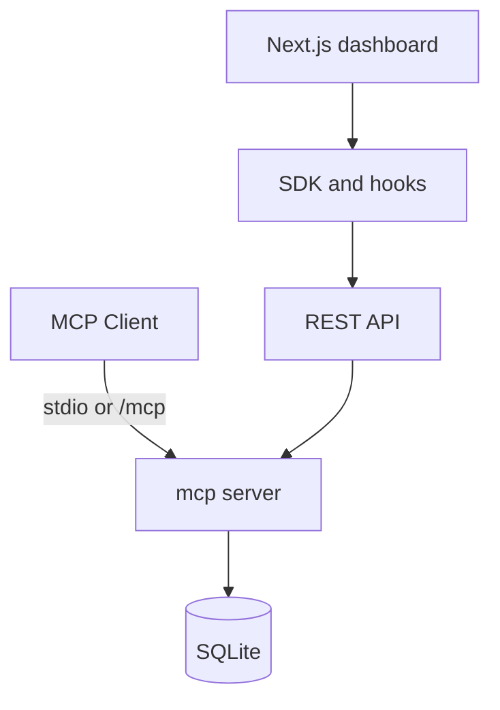
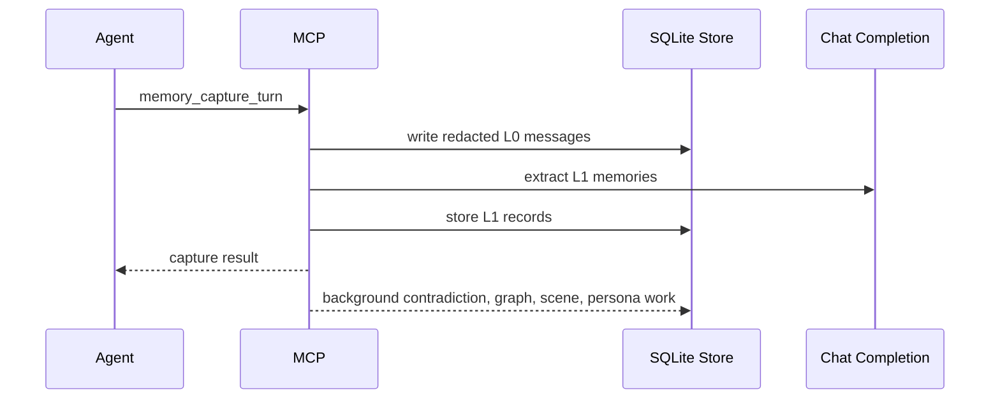

# BrainRouter Presentation

## Slide 1: What BrainRouter Is

BrainRouter is a local-first MCP memory server for AI coding agents.

It gives agents a shared memory layer across sessions and tools, backed by SQLite, exposed through MCP, REST APIs, an SDK, React hooks, and a dashboard.

Current implementation:

- MCP over stdio and Streamable HTTP.
- API-key auth for agents.
- JWT auth for the dashboard.
- Multi-user memory isolation.
- L0 capture, L1 extraction, contradiction detection, graph extraction, L2 scenes, and L3 persona synthesis.

## Slide 2: The Problem

Coding agents lose important context between sessions.

Static instruction files help, but they do not solve:

- Past decisions being forgotten.
- Repeated debugging mistakes.
- Long command output flooding context.
- Different agent hosts having separate memory.
- No inspection surface for what the agent remembered and why.

BrainRouter turns those events into queryable, governable memory.

## Slide 3: Runtime Shape



The MCP server is the core process. It owns the registry, memory engine, auth checks, REST routes, and transport sessions.

## Slide 4: Memory Pipeline



Recall combines keyword search, optional vector search, file-path matches, score fusion, priority decay, citation boosts, optional reranking, scene context, persona context, and graph expansion.

## Slide 5: Tool Surface

BrainRouter exposes tools in five groups:

- Registry: `list_skills`, `get_skill`, `search_skills`, personas, references, template docs.
- Recall/capture: `memory_resolve_session`, `memory_capture_turn`, `memory_recall`, `memory_search`, `memory_explain_recall`.
- Governance: `memory_get`, `memory_update`, evidence, export/import, audit, diagnostics, delete.
- Engineering workflow: debug traces, failed attempts, file history, task state, handover, verification.
- Host and working memory: hooks plus `.brainrouter/work/...` payload offload.

Skill writes are admin-only. Current code does not expose a `BRAINROUTER_LLM_MODE` agent/server switch.

## Slide 6: Dashboard and API

The dashboard is a Next.js app in `web/`.

It uses:

- `@brainrouter/sdk` for typed REST calls.
- `@brainrouter/hooks` for React state.
- JWT stored in session storage for dashboard auth.
- API keys for MCP client setup and integrations.

Dashboard surfaces include auth, profile/API key, users, memories, evidence, timeline, recall inspector, scenes, persona, contradictions, hooks, working memory, and diagnostics.

## Slide 7: Why It Matters

BrainRouter is not just long-term chat history.

It gives engineering agents:

- A durable memory store.
- Evidence and governance.
- Recall explanations.
- Session-scoped large-output offload.
- Cross-host ingestion hooks.
- A dashboard for inspecting and correcting memory.

The practical goal is simple: an agent should remember verified engineering context without putting every instruction, log, and historical decision into every prompt.

## Slide 8: Running It

```bash
npm install
npm run build
cd mcp
npm run setup:admin -- --reset --userId admin
npm run dev:http
```

Then:

```bash
cd web
npm run dev
```

Use the printed API key for MCP clients and the configured admin email/password for dashboard sign-in.
