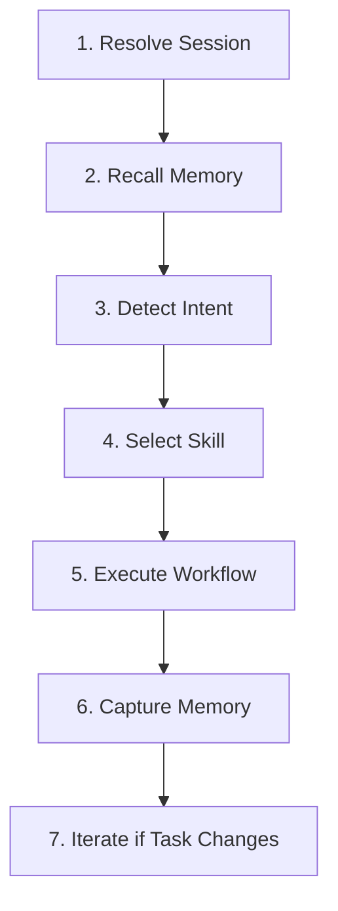
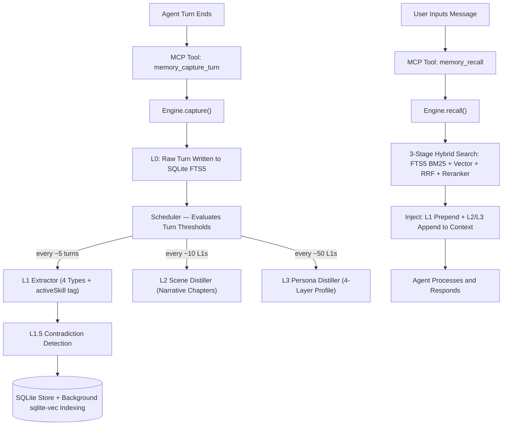

# 🧠 BrainRouter — Presentation Deck

> **Tagline:** *Give your AI coding agent a Brain, a Map, and a Memory.*

---

## Slide 1 — The Problem Every Developer Faces

### Your AI Assistant Has No Memory

Imagine hiring a brilliant contractor who forgets everything about your project every single morning. That's what using AI coding assistants is like today.

Every new conversation, the agent has **zero context**:

- You explain your tech stack — **again**
- You re-state your preferences and coding style — **again**
- You re-teach your project's conventions and rules — **again**
- It scans your entire codebase just to answer a simple question — **every time**

**This is wasteful, slow, and expensive.** Every re-explanation costs you time. Every full-repo scan costs tokens (= money). And the agent still gets it wrong because it never truly *learned* your project.

> "We constantly re-explain the same SOPs, project background, tool conventions, and output formats to the Agent. Such information should not require repetition."
> — TencentDB Agent Memory, Tencent Research

**BrainRouter solves this.**

---

## Slide 2 — The Research Behind It

### We Didn't Guess — We Built on Proven Science

BrainRouter's memory architecture is directly inspired by **[TencentDB Agent Memory](https://github.com/Tencent/TencentDB-Agent-Memory)** — a published research project by Tencent that *measured* what happens when you give AI agents structured memory.

**Their findings (measured over real, long-running coding sessions):**

| Task | Without Memory | With Memory | Improvement |
|---|---|---|---|
| Task success rate (WideSearch) | 33% | **50%** | +51.52% |
| Token usage (WideSearch) | 221M tokens | **85M tokens** | **−61% cost** |
| Coding tasks (SWE-bench) | 58.4% | **64.2%** | +9.93% |
| Remembering user preferences | 48% accuracy | **76% accuracy** | +59% |

**The bottom line:** Adding structured memory makes agents succeed at tasks 50% more often, while cutting your API bill by over 60%.

### But TencentDB Has a Limitation

Their system only works if you use *their specific* agent tools (OpenClaw and Hermes). If you use Cursor, VS Code, Claude Desktop, or Codex — you're out of luck.

**BrainRouter takes the same ideas and makes them available to every AI tool**, through the universal Model Context Protocol (MCP) standard.

---

## Slide 3 — What is BrainRouter?

### Three Systems Working Together

BrainRouter is a server that plugs into your AI tool and gives it three things it doesn't have by default:

```
┌─────────────────────────────────────────────────┐
│                  BRAINROUTER                     │
│                                                  │
│  🧠 BRAIN        📚 MAP         💾 MEMORY        │
│                                                  │
│  A library of    A navigation   A persistent     │
│  expert          system that    memory engine    │
│  playbooks       routes the     that remembers   │
│  (Skills)        agent to the   everything       │
│                  right skill    across sessions  │
│                                                  │
│         Runs as an MCP Server                    │
│    Works with any MCP-compatible AI tool         │
└─────────────────────────────────────────────────┘
```

Think of it like giving your AI assistant:
- A **training manual** (Skills) — so it knows exactly how to do complex tasks
- A **GPS** (AGENT.md router) — so it goes straight to the right page instead of searching blindly
- A **long-term memory** (Memory Engine) — so it remembers you and your project across every session

---

## Slide 4 — What is MCP? (For Non-Technical Stakeholders)

### The Universal Plug Standard for AI Tools

MCP (Model Context Protocol) is a standard created by Anthropic that lets AI tools talk to external services. Think of it like a USB standard — instead of every device needing its own special cable, everything uses USB.

BrainRouter implements MCP, which means:

- **No custom integration needed** — if your AI tool supports MCP (Cursor, VS Code, Claude, Codex all do), BrainRouter just works
- **No running servers to manage** — your AI tool automatically starts and stops BrainRouter in the background
- **No port numbers, no URLs, no network config** — it communicates directly through a secure local pipe

```
Your AI Tool ──automatically starts──▶ BrainRouter
             ◀──talks back and forth──▶ (private, local)
```

---

## Slide 5 — The Brain: Skills, Personas, and References

### 40+ Expert Playbooks, Ready to Use

A **Skill** in BrainRouter is a structured playbook for a specific task — like a Standard Operating Procedure (SOP). Instead of the agent guessing how to do a code review or debug a bug, it loads the exact workflow for that task.

**Sample skills shipped with BrainRouter:**

| Category | Skill | What it does |
|---|---|---|
| 🤖 Agent | `spec-driven-development` | Write a technical spec *before* writing any code |
| 🤖 Agent | `debugging-and-error-recovery` | Systematic: Reproduce → Localize → Fix → Guard |
| 🤖 Agent | `planning-and-task-breakdown` | Break large work into ordered, trackable tasks |
| 📦 Code | `code-review-and-quality` | Multi-axis PR review (correctness, security, performance) |
| 📦 Code | `conventions-skill` | Naming patterns, formatting, import order |
| 🎨 Design | `soft-skill` / `gpt-taste` | Premium UI design systems |
| 🎨 Design | `minimalist-ui` | Clean editorial interface design |
| 🐳 DevOps | `docker-lifecycle-engineering` | Production-grade containerization |
| 🐳 DevOps | `ci-cd-and-automation` | Automated pipeline setup |
| 💾 Memory | `agent-memory` | Teaches the agent to use memory tools correctly |

**Personas** are expert *roles* — like a Security Auditor or Staff Engineer reviewer — the agent can temporarily adopt for specialized analysis.

**References** are fact sheets the agent can pull (e.g., testing patterns, security checklists) without loading irrelevant content.

---

## Slide 6 — The Map: AGENT.md Context Router

### The Agent's Navigation System

Without BrainRouter, when you ask your AI tool to debug a bug, it might:
- Scan 200 files to "understand the project"
- Load your entire README
- Waste half its context window before writing a single line

With BrainRouter's `AGENT.md`, the agent has a routing map. It reads the user's request, matches it to a scenario, and loads **only what it needs** — like a GPS giving turn-by-turn directions instead of handing you a whole atlas.

**How the routing works — every request follows 7 steps:**



**Scenario map (from BrainRouter's own AGENT.md):**

| What you're doing | What gets loaded |
|---|---|
| Building MCP server features | `api-skill` + `conventions-skill` |
| Debugging a bug | `debugging-and-error-recovery` |
| Reviewing a pull request | `code-reviewer` persona |
| Shipping to production | `shipping-and-launch` |
| Writing a new skill | `skill-authoring` |
| Infrastructure / Docker | `docker-lifecycle-engineering` |

---

## Slide 7 — The Memory Engine: Big Picture

### How the Agent Remembers You

BrainRouter's memory engine works like a **pyramid** — raw conversations at the base, distilled wisdom at the top. Each layer builds on the one below it, compressing information into increasingly useful and compact forms.

```
┌────────────────────────────────────────────────────┐
│                 LEVEL 3 — Persona                  │
│ ← Who you are, how you think                       │
│ ← Every ~50 memories, cross-session synthesis      │
├────────────────────────────────────────────────────┤
│             LEVEL 2 — Scene Narratives             │
│ ← Chapters of your ongoing work                    │
│ ← Every ~10 L1s; heat-scored by recency            │
├────────────────────────────────────────────────────┤
│          LEVEL 1.5 — Contradiction Detection       │
│ ← BrainRouter original — flags conflicting         │
│   instructions so the agent never silently picks   │
├────────────────────────────────────────────────────┤
│             LEVEL 1 — Extracted Memories           │
│ ← persona / episodic / instruction /               │
│   skill_context (4 memory types)                   │
│ ← LLM reads recent messages every N turns          │
├────────────────────────────────────────────────────┤
│               LEVEL 0 — Raw Storage                │
│ ← Every message, verbatim, multi-tenant            │
│   FTS5 indexed + sqlite-vec for hybrid recall      │
└────────────────────────────────────────────────────┘
```

**The key principle (stolen from TencentDB's research):**
> Memory should NOT be a flat pile of notes. It must be a structured hierarchy — raw facts at the bottom, compressed wisdom at the top — so the agent can quickly get what it needs without drowning in noise.

---

## Slide 8 — Level 0: Raw Capture

### Saving Every Word

**What it does:** Every conversation turn — every message you send, every response the agent gives — is stored verbatim in a local database (SQLite, which is like a lightweight spreadsheet on your computer).

**Plain English:** It's the equivalent of recording every meeting and storing the transcripts. You don't read them all — but they're there if you need them.

**Key engineering decisions that make this work reliably:**

| Decision | What it means in plain English |
|---|---|
| **Cursor-based capture** | Like a bookmark — the system knows exactly where it left off, so no message is ever saved twice, even if two sessions run at the same time |
| **User isolation** | Every memory is tagged with *who* it belongs to. User A's memories are completely invisible to User B. It's like separate filing cabinets, not a shared pile |
| **Skill tagging** | When a memory is saved, the system also records *which task workflow was active*. This lets it later retrieve memories that are relevant to a specific type of work |
| **Background indexing** | The database is searchable (via full-text search) instantly. A slower "deep index" for semantic search runs in the background without slowing the agent down |

---

## Slide 9 — Level 1: Semantic Extraction

### Turning Conversations into Knowledge

**The problem with raw storage:** If you saved every word of every conversation, finding anything useful would be like searching through thousands of meeting recordings. You'd drown in noise.

**Level 1 solves this:** After every few conversation turns, BrainRouter calls an AI model (a cheap, fast one) with a carefully designed instruction set. The AI reads the recent conversation and extracts only the *durable, important facts* — the things worth remembering long-term.

**Think of it like a smart note-taker** who watches a meeting and afterwards writes: *"Key decisions: the team chose PostgreSQL. Preference: Sarah always wants unit tests before PRs. Rule: never deploy on Fridays."* — not a word-for-word transcript.

**The 4 types of memories BrainRouter extracts:**

| Type | What it is | Example | Plain English |
|---|---|---|---|
| `persona` | Who you are, what you prefer | "User prefers TypeScript, dislikes raw SQL" | Your personality and working style |
| `episodic` | Things that happened, with when | "User deployed auth service on May 10th" | Your project history |
| `instruction` | Rules you gave the agent | "Always use pnpm, never npm" | Your standing orders |
| `skill_context` | How *you* tend to use specific workflows | "User skips the spec phase for hotfixes" | Your personal habits around specific tasks |

> **`skill_context` is BrainRouter's original contribution** — it doesn't exist in TencentDB. Over time, the system learns *how you personally work*, not just what you've told it.

**Quality gate — the system is selective by design:**

Before extraction runs, low-value messages are filtered out: short one-liners, emoji-only messages, casual greetings, and prompt injection attempts. The guiding principle is:

> *"Empty memory is better than wrong memory. Prefer saying nothing over saying something incorrect."*

---

## Slide 10 — Level 1.5: Contradiction Detection

### Catching Conflicts Before They Cause Problems

**The problem this solves:** Imagine you told the agent in January: *"Always use npm for this project."* Then in March you said: *"We've switched to pnpm."* Without contradiction detection, both instructions sit in the database equally — and the agent might randomly follow either one, causing silent bugs.

**Level 1.5 is BrainRouter's original invention** — it doesn't exist in TencentDB or any other memory system we know of.

**How it works (plain English):**
1. A new memory is extracted from a conversation
2. The system searches existing memories for anything that *sounds like the same topic*
3. If it finds a conflict — old instruction says one thing, new one says another — it flags it
4. The conflict is stored in a dedicated "contradictions" table
5. **Next time the agent tries to do something related, it's shown the warning:**

```
⚠️ Conflict detected:
   Old rule: "Always use npm"
   New rule: "Always use pnpm"
   — These conflict. Please clarify which applies.
```

**Why this matters for stakeholders:** This is the difference between an agent that silently picks the wrong answer and one that says *"I see conflicting instructions — which should I follow?"* The second agent is dramatically more trustworthy in production.

---

## Slide 11 — Level 2: Scene Narratives

### From Facts to Chapters

**The problem:** After weeks of working on a project, you might have hundreds of extracted memories. Loading all of them into every conversation is wasteful — most won't be relevant.

**Level 2 groups related memories into "scenes"** — cohesive narrative chapters about different areas of your work. Think of it like a biography being organized into chapters: "Career at Google," "Startup Phase," "Current Project" — rather than a random pile of life events.

**Examples of scenes that might form:**
- *"Backend API Development — TypeScript, auth service, PostgreSQL"*
- *"Frontend Work — React, design system, accessibility"*
- *"DevOps & Deployment — Docker, CI/CD pipeline"*

**The system is smart about scene management:**
- It prefers **updating existing scenes** over creating new ones (to avoid explosion of chapters)
- If there are too many scenes, it **merges similar ones** automatically
- Each scene has a **heat score** — how frequently it's been updated — so the system knows which projects are currently active vs. historical

**What the agent gets:** Instead of 300 individual facts, it gets 4-5 chapter summaries it can scan instantly, and drills into a specific chapter only when needed. Much faster, much cleaner.

---

## Slide 12 — Level 3: Persona Synthesis

### The Deepest Understanding

**What it does:** Every 50 new memories or so, the system performs a deep synthesis — reading everything it knows about you across all scenes and conversations, then writing a comprehensive profile.

**Why this is valuable:** The Level 1 memories answer *"what happened?"* The persona answers *"who is this person and how do they think?"* — which lets the agent communicate, reason, and make recommendations that feel genuinely tailored.

**The 4 layers of the persona profile:**

| Layer | What it captures | How the agent uses it |
|---|---|---|
| 🟢 **Base Anchors** | Current role, tech stack, situation | Basic context — "This is a senior backend engineer on a startup" |
| 🔵 **Interest Graph** | What you actively care about vs. passively aware of | Relevant suggestions — "You'd probably like this new tool" |
| 🟡 **Interaction Protocol** | How you like to communicate, what workflows you follow | Style matching — terse vs. detailed, code-first vs. explanation-first |
| 🔴 **Cognitive Core** | How you make decisions, what drives you, what frustrates you | Deep co-pilot — "Given how you usually approach this, I'd recommend..." |

**This profile is stable** — it doesn't change turn-by-turn, so it can be efficiently cached in the AI's context window, saving cost.

**Automatic update trigger:** If the system detects a major shift in your direction — say you went from solo developer to leading a team — it automatically regenerates the persona profile to reflect the new reality.

---

## Slide 13 — Memory Half-Life: Why Memories Fade

### Not All Information Stays Relevant Forever

**What is memory half-life?** It's borrowed from physics (radioactive decay), but the concept is simple: some information becomes *less useful over time*, and BrainRouter accounts for this when deciding what to show the agent.

**An analogy:** Think about your own memory. If someone told you 3 years ago "the meeting is at 2pm tomorrow" — that's completely useless information now, even if you remember it. But if they told you "I hate meetings before 10am" — that's still very relevant today.

BrainRouter applies the same logic:

| Memory Type | Half-Life | Why |
|---|---|---|
| `instruction` | **Never fades** | Rules you set are permanent until you change them |
| `persona` | **180 days** | Your preferences change slowly but do change |
| `episodic` | **30 days** | "I deployed X last Tuesday" is mostly irrelevant after a month |
| `skill_context` | **7 days** | How you're using a workflow right now matters most for current context |

**How the math works (explained simply):**

If a memory starts at 100% relevance, after one half-life it's at 50%, after two it's at 25%, and so on. The system doesn't delete old memories — it just makes them score lower during retrieval, so newer, more relevant memories bubble to the top.

```
Instruction: "Always use pnpm"
  → Created 2 years ago → Still 100% relevant (never decays) ✅

Episodic: "Fixed a login bug on May 1st"
  → Created 30 days ago → Now at ~50% relevance
  → Created 90 days ago → Now at ~12% relevance (barely shows up)

Persona: "User prefers dark themes"
  → Created 6 months ago → Still at ~50% relevance (changes slowly)
```

**Why this matters:** Without decay, old information crowds out new information. A decision you made in 2023 shouldn't override your current preferences in 2026. Half-life scoring ensures the agent always prioritizes what's *recently relevant*.

---

## Slide 14 — Memory Recall: Finding the Right Memory

### 3-Stage Hybrid Search & Reranking

**The problem:** When the agent is about to respond to your message, it needs to find relevant memories quickly — in milliseconds, not seconds. But "relevant" is hard to define. Sometimes you want keyword matching ("find everything about pnpm"). Sometimes you want meaning matching ("find memories about package management").

**BrainRouter executes a robust 3-stage retrieval and reranking pipeline:**

**Stage 1 — Parallel Retrieval**
- **Keyword Search (BM25):** Like Ctrl+F, but smarter. Finds memories containing exact words via FTS5 (Top 15 candidates).
- **Semantic Search (Vector Similarity):** Understands meaning via mathematical embeddings stored in `sqlite-vec` (Top 15 candidates).

**Stage 2 — Reciprocal Rank Fusion (RRF) & Decay Blend**
Both searches return ranked lists. RRF merges them using a mathematical formula: *"If a memory ranks highly in both keyword AND semantic search, it's almost certainly what the user needs."* The combined RRF score is then blended with half-life freshness (70% relevance / 30% freshness) and boosted 1.2x if it matches the active skill tag.

**Stage 3 — Cross-Encoder Reranking**
Precision-sorts the top 20 candidates using cross-encoder models (Cohere, Voyage, vLLM, or BGE) to select the absolute top 5 memories for context injection.

**Timeout protection:** The entire recall runs with a 5-second maximum. If for any reason it's slow, the agent skips memory injection and responds anyway. It's never blocked.

---

## Slide 15 — The Full Data Flow

### From Conversation to Memory to Context — End to End



---

## Slide 16 — Multi-Tenant Architecture

### One Server, Many Users — Completely Isolated

**What "multi-tenant" means:** Multiple developers can share one BrainRouter server instance, and each person's memories are completely invisible to everyone else. There is no way for User A to accidentally see User B's data — not because of access controls that could have bugs, but because of fundamental database design.

**How it works:** Every single table in the database has a `user_id` column. Every single database query is written as `WHERE user_id = ?`. Architecturally, mixing data between users is impossible.

This is important for:
- **Teams** — a shared BrainRouter server for a whole engineering team
- **Products** — if you build a product on top of BrainRouter, each of your customers gets their own isolated memory space
- **Safety** — no cross-contamination of instructions, preferences, or project context

---

## Slide 17 — Where We Stand vs. TencentDB's Roadmap

### Their Research Roadmap vs. Our Shipped Features

TencentDB published a roadmap of features they're planning. Here's the honest comparison:

| TencentDB Roadmap Item | Their Status | BrainRouter Status |
|---|---|---|
| Long-term memory (L0 → L3 pipeline) | ✅ Done | ✅ Done |
| Local SQLite storage (no cloud needed) | ✅ Done | ✅ Done (Node built-in, zero extra dependencies) |
| Agent framework integration | ✅ OpenClaw + Hermes only | ✅ **Universal — any MCP tool** |
| **Portable memory (cross-agent)** | ❌ Not yet built | ✅ Multi-tenant architecture already handles this |
| **Skill authoring tools** (`create_skill`, `update_skill`) | ❌ Not yet built | ✅ **Shipped — agents scaffold & edit skills via MCP** |
| **Autonomous skill detection** (from memory patterns) | ❌ Not yet built | ⚠️ Planned (Phase 2) — `create_skill` exists, auto-detection doesn't |
| **Visual debugging dashboard** | ❌ Not yet built | ⚠️ Planned |
| Contradiction detection | ❌ Not in their design | ✅ **BrainRouter original (L1.5)** |
| Skill-aware memory | ❌ Not in their design | ✅ **BrainRouter original (skill_context type)** |
| Memory decay scoring | ❌ Static priority | ✅ **BrainRouter original (half-life model)** |
| Short-term Mermaid canvas compression | ✅ Done | ⚠️ Planned (different approach) |

**Summary:** We've matched their core memory pipeline, outpaced them on their own roadmap items (skill generation, portability), and added three features they never planned (contradiction detection, skill-aware memory, memory decay).

---

## Slide 18 — Key Differentiators

### Why BrainRouter, Not TencentDB?

**1. Works with every AI tool, not just one**
TencentDB requires you to use their specific agents. BrainRouter uses MCP — the universal standard — so it works with Cursor, Claude, Copilot, Codex, and any future MCP-compatible tool. You're not locked in.

**2. The Skills library closes the loop**
TencentDB only has memory. BrainRouter has memory *plus* a skills/personas/references library. The memory engine learns which skills you use and in what order — and pre-loads the right context. Over time, the whole system gets smarter about *how you specifically work*.

**3. Contradictions are surfaced, not buried**
In TencentDB (and most memory systems), conflicting instructions silently coexist. BrainRouter explicitly detects, stores, and surfaces them, asking you to resolve the conflict. This is essential for production reliability.

**4. Old memories don't crowd out new ones**
TencentDB uses static priority scores. BrainRouter applies half-life decay — so last week's decision about a bug doesn't crowd out today's preferences.

**5. Zero external dependencies for storage**
Uses `node:sqlite` — a database engine built directly into Node.js 22+. No extra installation, no external database, no Docker required just for memory.

**6. Global skills + local overrides**
A global library of 40+ skills comes built-in. Your project can override any of them with a project-specific version — automatically, with no configuration.

---

## Slide 19 — Setup & Integration

### Getting Started in 4 Commands

```bash
# 1. Clone and build BrainRouter
git clone https://github.com/kinqsradiollc/BrainRouter.git
cd BrainRouter/mcp
npm install && npm run build

# 2. Generate config files for your project
npm run setup:mcp -- /path/to/your/project
# Creates ready-to-paste configs in <your-project>/.brainrouter/

# 3. Paste the config into your AI tool
# (Cursor / VS Code / Claude Desktop / Codex / Antigravity)

# 4. Restart your AI tool — it auto-starts BrainRouter
```

**After setup, create an `AGENT.md` in your project:**

```markdown
# Agent Context Router
You are connected to BrainRouter. Do NOT guess — use MCP tools first.

1. Before responding: call memory_recall to load past context
2. Find the right skill: list_skills or search_skills
3. Load the skill: get_skill to follow its workflow
4. After responding: call memory_capture_turn to save this turn
```

Start your first session with: *"Read AGENT.md and let's get to work."*

**Supported tools:**

| Tool | Status |
|---|---|
| ⚡ Cursor | ✅ Supported |
| 🐙 VS Code / GitHub Copilot | ✅ Supported |
| 🟣 Claude Desktop | ✅ Supported |
| ✨ Antigravity (Google Gemini) | ✅ Supported |
| 🤖 OpenAI Codex | ✅ Supported |

---

## Slide 20 — Roadmap

### What's Coming

**Shipped Features (Phase 1 Complete):**
- L2 Scene Narratives — full generation with heat scoring
- L3 Persona Synthesis — cross-session profile generation
- Hybrid 3-Stage Recall — BM25 + Vector Similarity + Reciprocal Rank Fusion
- Cross-Encoder Reranker — precision sorting via Cohere, Voyage, vLLM, or BGE

**Short-term (in active development):**
- Memory observability dashboard — visually inspect your memory layers

**Medium-term:**
- Skill pre-warming — auto-load a skill's context when usage patterns suggest it
- Cross-session memory graph — connect related memories across different projects
- Memory export/import — move your memory to a different machine or tool

**Long-term:**
- Automatic skill generation — watch how you solve problems, generate reusable playbooks
- Team/shared memory — organizational knowledge graph across a whole engineering team
- Visual contradiction resolution UI — see and resolve conflicts in a dashboard

---

## Summary — BrainRouter in One Paragraph

BrainRouter is an **MCP server** (a universal AI tool plugin) that gives any AI coding agent three things: a **skills library** (40+ expert workflows for debugging, shipping, reviewing, designing, and more), a **context router** (so the agent loads exactly what it needs instead of scanning everything), and a **hierarchical memory engine** (a 4-layer system that remembers your preferences, project history, standing instructions, and working style across every session). The memory architecture is inspired by Tencent's research on agent memory, which proved layered memory cuts token costs by 60% and improves task success by 50%. BrainRouter takes those ideas further with three original contributions: Contradiction Detection (conflicts are surfaced, not buried), Skill-Aware Memory (the agent learns how *you* use specific workflows), and Memory Decay Scoring (newer information naturally outweighs old information). Unlike TencentDB which only works with specific agent tools, BrainRouter works with every major AI coding tool through the MCP standard.

---

*Reference: [TencentDB Agent Memory](https://github.com/Tencent/TencentDB-Agent-Memory) — Tencent Research*
*Built for High-Density Engineering.*
