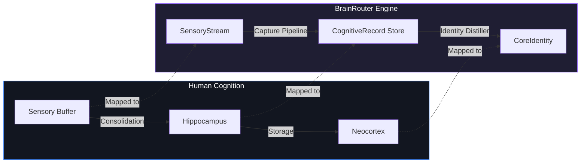
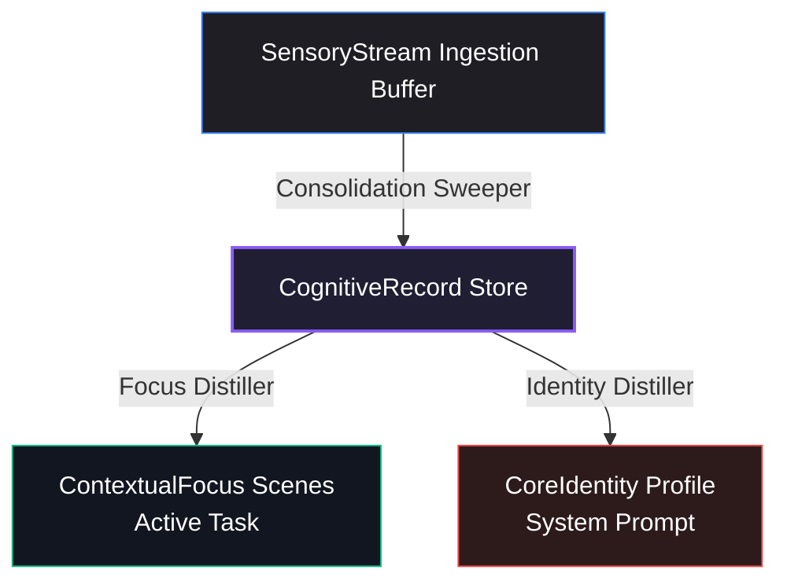
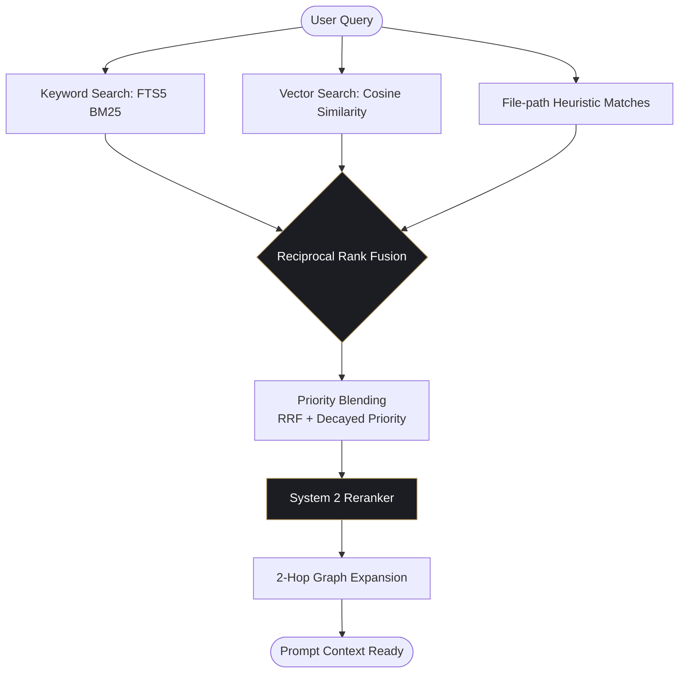
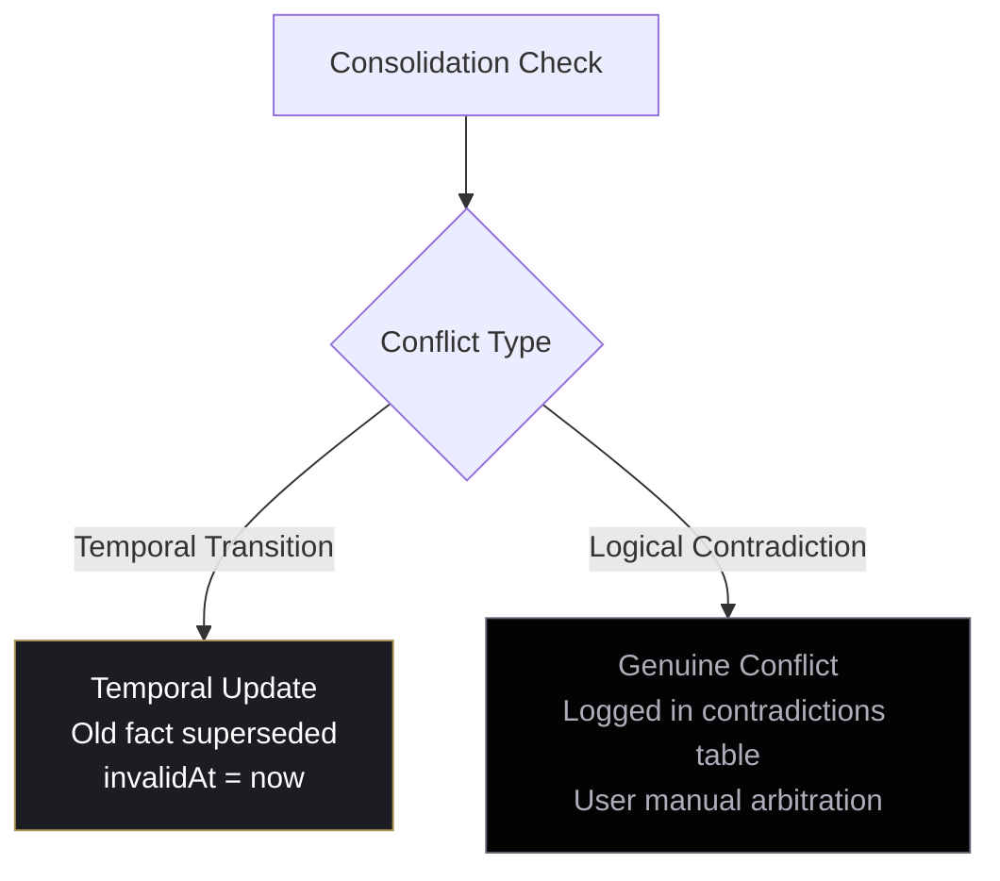
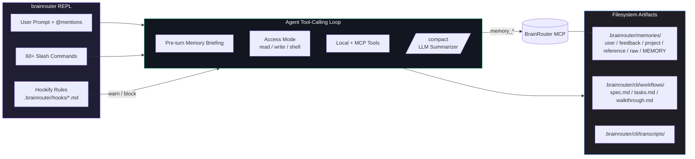

# 🧠 BrainRouter: Cognitive Memory for Agentic AI

### Biologically-Inspired Context Management & Multi-Agent Routing

---

## 🛑 The Core Challenge

### Context Windows are Leaky and Costly

*   **Catastrophic Forgetting**: Standard LLMs forget historical context as conversation history grows.
*   **Context Window Saturation**: Injecting entire files or long chats wastes API tokens and slows down Inference-Per-Second (IPS).
*   **Garbage In, Garbage Out**: Unfiltered retrieval floods prompts with noise, degrading agent performance.
*   **Static Prompts**: Agents lack a structured feedback loop to adapt to developer behavior over time.

---

## 💡 The BrainRouter Paradigm

### Emulating the Human Brain's Memory Architecture



*   **Filter & Consolidate**: Raw dialogue (`SensoryStream`) is distilled into key semantic facts (`CognitiveRecord`).
*   **Decay & Forget**: Inactive facts decay exponentially over time.
*   **Reinforce & Prune**: Retrieved facts used by the agent are boosted; unused noise is pruned.

---

## 🏛️ The Hierarchical Memory Stack

### Four Levels of Cognitive Persistence



1.  **SensoryStream**: Captures dialogue immediately.
2.  **CognitiveRecord**: Stores classified facts, code patterns, and preferences.
3.  **ContextualFocus**: Dynamically groups active task contexts (tracked via heat scores).
4.  **CoreIdentity**: Standardized Markdown prepended to all system prompts.

---

## 📉 Biological Memory Decay

### Implementing the Ebbinghaus Forgetting Curve

Memories fade exponentially unless retrieved and consolidated:

$$P_{\text{decayed}}(t) = P_{\text{original}} \times 2^{-\frac{\Delta t}{\tau_{\text{half-life}}}}$$

```
Memory Priority
  100% ┼───────────────────► Instruction (Infinite half-life)
       │  \
   50% ┼───\───────────────► Codebase Fact (60 days half-life)
       │    \
    0% ┼─────\─────────────► Task State (14 days half-life)
       └─────┴─────┴─────► Time
```

*   **Instructions**: Half-life is $\infty$ (never decays).
*   **Architecture Decisions**: Half-life is 180 days.
*   **Codebase Facts**: Half-life is 60 days.
*   **Task State**: Half-life is 14 days (highly volatile).

---

## 🔄 The ACE Loop: Plasticity & Pruning

### Agent Citation & Evaluation Loop

*   **Long-Term Potentiation (Citation Boost)**:
    When the agent recalls and cites a memory, its priority is boosted:
    
    $$P_{\text{effective}} = P_{\text{decayed}} \times (1 + \min(N_{\text{citations}} \times 0.05, 0.30))$$
    
    The memory is reinforced, resetting its decay clock.

*   **Synaptic Pruning (Auto-Archive)**:
    If a memory is retrieved but ignored by the agent:
    
    $$N_{\text{never-cited}} \leftarrow N_{\text{never-cited}} + 1$$
    
    Once $N_{\text{never-cited}} \geq 10$, the fact is pruned (archived) to prevent future prompt pollution.

---

## 🔍 Hybrid Retrieval Pipeline

### Combining System 1 (Intuitive) & System 2 (Logical) Retrieval



*   **Reciprocal Rank Fusion**: Merges keyword and vector results.
*   **Intent Boosting**: Multiplies score if query matches intent (e.g. `debug` boosts bug findings).
*   **Graph RAG**: Breadth-First Search (BFS) neighborhood extraction from query entities.

---

## ⚠️ Ingestion & Contradictions

### Self-Healing Memory Reconciliation

During SensoryStream-to-CognitiveRecord consolidation, new facts are scanned against existing memories:



*   **Temporal Updates**: "Node version is 18" is superseded by "Node version is 20" (old is set to `supersededBy = newId`).
*   **Genuine Conflicts**: "Authentication uses OAuth2" vs "Authentication uses SAML" are flagged for manual developer review.

---

## 🖥️ The BrainRouter Terminal CLI

### Memory-Native Coding Agent at Parity with Codex CLI & Claude Code



*   **60+ slash commands** spanning session, memory, workflow, orchestration, and ops surfaces.
*   **`/compact`** asks the LLM for a structured summary (Goals / Decisions / Files touched / Open work / Last user request) instead of nuking history.
*   **Hookify rules** load from markdown files — install warn/block guards without code:

    ```yaml
    ---
    name: block-rm-rf
    event: bash
    pattern: rm\s+-rf
    action: block
    ---
    ```
*   **Memory consolidation** runs Phase 2 over the MCP recall surface, writing per-type markdown so the cognitive store has a human-readable view at `.brainrouter/memories/`.
*   **Multi-agent orchestration** via `spawn_agent` / `wait_agent` with explorer, architect, reviewer, worker, and verifier roles — each one a forked session with its own transcript and token budget.

---

## 🛣️ Development Roadmap

### Phase 1: Local SQLite Storage & FTS5 (Completed)
*   In-memory and file-based SQLite database.
*   FTS5 BM25 search and local embeddings.

### Phase 2: Knowledge Graph & ACE Loop (Completed)
*   2-Hop Entity Graph RAG.
*   Synaptic citation boosts and auto-archiving.

### Phase 3: Metacognitive Refactoring (Completed)
*   System renaming to biological terms (`SensoryStream`, `CognitiveRecord`, `ContextualFocus`, `CoreIdentity`).
*   Next.js dashboard web application integration.

### Phase 4: Terminal CLI & Codex/Claude Code Parity (Completed)
*   `brainrouter` REPL with 60+ slash commands (`/theme`, `/personality`, `/new`, `/side`, `/raw`, `/feedback`, `/rollout`, `/ps`, `/stop`, `/logout`, `/apps`, `/plugins`, `/experimental`, `/memories`, `/debug-config`, `/mention`, `/keymap`, `/ide`, `/hookify`, …).
*   LLM-driven `/compact` summarization with structured headings.
*   Hookify markdown rules under `.brainrouter/hooks/` (regex + multi-condition matchers, warn/block actions).
*   Phase-2 filesystem consolidation: `MEMORY.md` + per-type files written by both the CLI and the new `memory_consolidate` MCP tool.
*   Multi-agent orchestration (`spawn_agent`, `wait_agent`) with role-based access modes and durable workflow folders (`spec.md` / `tasks.md` / `walkthrough.md`).
*   Personality overlays (`concise`, `standard`, `detailed`, `pair-programmer`) injected into the system prompt.
