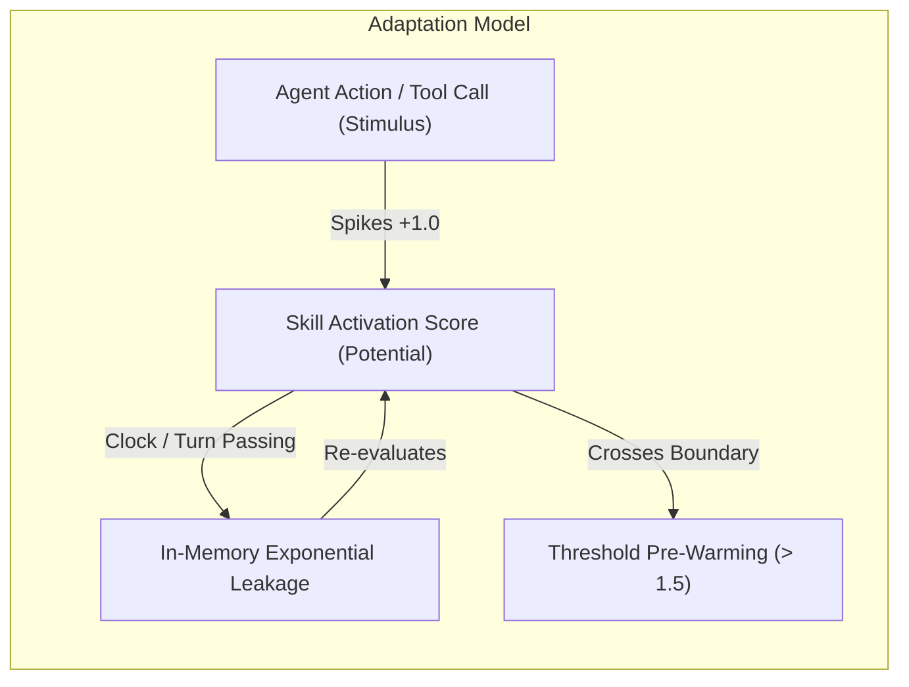
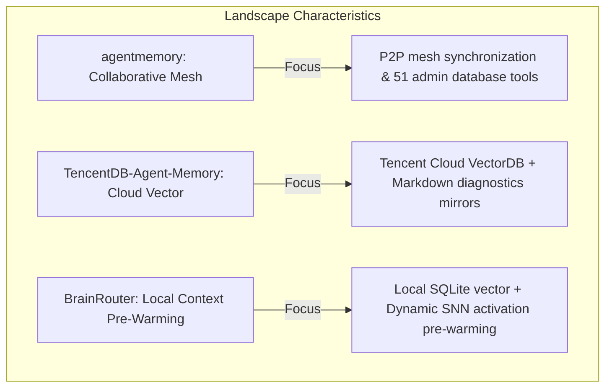
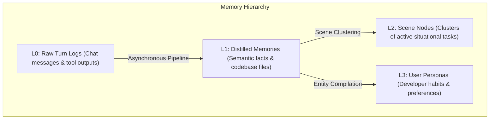
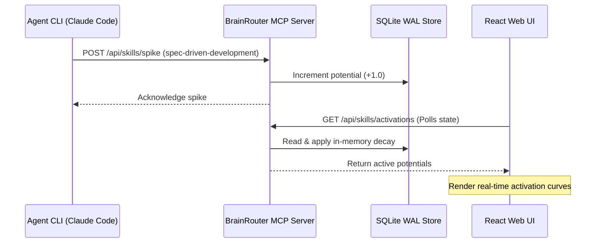

# 🧠 BrainRouter: Dynamic Context Gateway

### Orchestrating Multi-Agent Memory with Spiking Activation Routing

---

## 🛑 Slide 1: The Context Window Challenge

### Why Standard Prompts Struggle in Long-Running Development Cycles
*   **Prompt Bloat:** Combining multiple coding guidelines, directories, and checklists (e.g. `CLAUDE.md`, `CONVENTIONS.md`) consumes thousands of tokens before an agent executes its first turn.
*   **Attention Dilution:** Irrelevant prompt instructions pollute the context window, causing the LLM to ignore styling constraints or make syntax errors.
*   **API Latency & Cost:** Sending large prompts back and forth over HTTP spikes token usage and increases request latencies.
*   **Agent Silos:** CLI development environments (e.g. Claude Code) and editor instances (e.g. Cursor) lack a synchronized context cache.

---

## 🔬 Slide 2: SNN-Inspired Pre-Warming

### Borrowing Mechanics from the `ei8/prototypes` Models

*   **Active State Accumulation (`HelloWorm` Concept):** Tool executions act as stimuli, spiking specific skill potentials. Unused potentials decay back to zero over time.
*   **Sensor-Analyzer-Reactor Loop (`HeartRate` Concept):** Tracks developer actions (Sensor), computes decaying potentials (Analyzer), and pre-warms the prompt with relevant templates (Reactor).

---

## 📐 Slide 3: Decaying Potential Mathematics

### In-Memory Score Calculation on Read

$$P_{decayed} = \max(0, \min(P_{time}, P_{turn}))$$

*   **Temporal Clock Decay ($P_{time}$):** Decays potentials based on elapsed minutes ($\Delta t$) and a configured half-life:
    $$P_{time} = P_{old} \times e^{-\frac{\ln(2)}{T_{1/2}} \Delta t}$$
*   **Per-Turn Minimum Decay ($P_{turn}$):** Safeguards against zero-elapsed time during rapid turns:
    $$P_{turn} = P_{old} \times (1 - D_{turn})$$
*   **Pre-Warming Trigger:** Skills with potentials $\ge 1.5$ have their markdown files loaded and injected into the active prompt during `memory_recall`.

---

## 📊 Slide 4: Landscape Positioning

### Where BrainRouter Fits Among Alternative memory Implementations

*   **agentmemory:** Best for multi-agent P2P mesh synchronization with transactional locks (leases).
*   **TencentDB-Agent-Memory:** Best for enterprise cloud scaling using Tencent Cloud VectorDB.
*   **BrainRouter:** Hybrid choice. Lightweight local SQLite WAL + `sqlite-vec` vector storage, integrated with active context pre-warming to keep prompt costs low.

---

## 📦 Slide 5: Hierarchical Memory Layers

### Organizing Information to Prevent Attention Distraction

*   **L0:** Baseline raw logs, scrubbed of credentials before DB writes.
*   **L1:** Extracted episodic facts, API contracts, and guidelines. Includes the L1.5 contradiction check.
*   **L2 / L3:** Situational clusters and user preference profiles.

---

## 🔌 Slide 6: Workspace Integration

### How Client Tools and Servers Synchronize

*   **`@brainrouter/sdk`:** Type-safe wrapper client matching the `/api` routes.
*   **`@brainrouter/hooks`:** React Hooks (e.g. `useSkillActivations`) for synchronization.
*   **Next.js Dashboard:** Obsidian Surfaces UI displaying potentials, contradictions, and memory tables.
