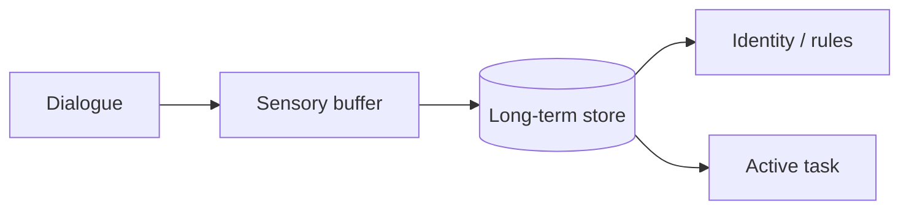
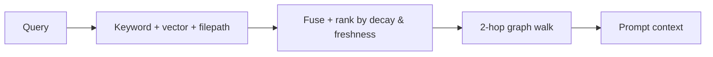

# BrainRouter

### Cognitive memory for LLM agents

---

## The problem

Agents forget. Every session starts from zero, and the workarounds are bad:

- Dumping chat history → blows the context window and burns tokens.
- Flat vector DB → returns whatever's cosine-close, not what's actually useful.
- Static system prompts → no feedback loop, no learning.

Result: your agent re-discovers the same project facts every conversation.

---

## The idea

Model agent memory like human memory: short-term feeds long-term, unused
facts fade, used ones get reinforced.

Three things make this work: decay, citation feedback, and a 2-hop graph
walk.

---

## Four memory layers

| Layer | Role |
| --- | --- |
| **SensoryStream** | Raw dialogue buffer |
| **CognitiveRecord** | Classified facts with priority and decay |
| **ContextualFocus** | Heat-scored scenes around active tasks |
| **CoreIdentity** | Stable user profile + hard rules |

Each layer has a distinct lifetime. The first two are short; the last two
persist or evict based on activity.

---

## Recall, simplified

- **Fuse** three retrievers with Reciprocal Rank Fusion.
- **Rerank** by decayed priority, citation boost, freshness, query intent.
- **Expand** via the knowledge graph to pull in related facts.

---

## Two feedback loops

**Reinforcement.** When the agent cites a memory in its answer, that
memory's priority gets boosted (up to +30%). Its decay clock resets.

**Pruning.** When a memory is surfaced repeatedly but never cited (10+
times), it's archived — the index stays high-fidelity over time.

That's the difference from a flat vector DB: the memory store actually
*learns* which records matter.

---

## The terminal CLI

Ships at [`brainrouter-cli/`](brainrouter-cli/). Memory-native coding
agent.

- Slash commands for session, memory, workflow, orchestration.
- Markdown-rule guardrails (hookify) — drop a `.md` file to install a
  warn/block guard on any tool call.
- Multi-agent fan-out — `spawn_agents` runs explorers / architects /
  reviewers / workers / verifiers in parallel.
- Durable workflow artifacts (`spec.md`, `tasks.md`, `walkthrough.md`).
- LLM-driven `/compact` replaces verbose history with a structured
  summary.

---

## Surfaces

| | Where | Use it for |
| --- | --- | --- |
| **MCP server** | `brainrouter/` | Plug into any MCP client (Claude Desktop, etc.) |
| **CLI** | `brainrouter-cli/` | Terminal coding agent |
| **Web chat** | `web/` | Browser UI for the same agent |
| **HTTP API** | `/api/chat-completions` | OpenAI-shaped endpoint |

All four share the same memory store.

---

## Status

Pre-release, v0.3.x. Memory engine, CLI, and web chat are running. Next:

- First tagged release + `npx brainrouter` install path.
- Dashboard memory explorer (audit *why* a record surfaced).
- Provider matrix verification (OpenAI, Anthropic, Gemini, local).
- Web-chat parity with CLI (goal lifecycle, hookify, orchestration).

See [ROADMAP.md](ROADMAP.md) for the live list.

---

## Learn more

- **[BRAINROUTER.md](BRAINROUTER.md)** — the concepts on one page.
- **[brainrouter-docs/](brainrouter-docs/)** — math, env vars, CLI internals.
- **[README.md](README.md)** — quick start.
