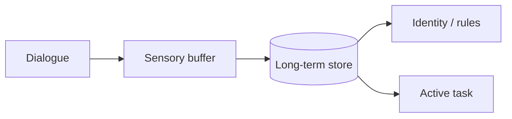
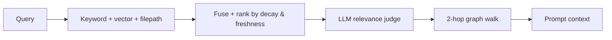

# BrainRouter

### Cognitive memory for LLM agents

---

## The problem

Agents forget. Every session starts from zero, and the workarounds are bad:

- Dumping chat history → blows the context window and burns tokens.
- Flat vector DB → returns whatever's cosine-close, not what's actually useful.
- Static system prompts → no feedback loop, no learning.

Result: your agent re-discovers the same project facts every conversation.

---

## The idea

Model agent memory like human memory: short-term feeds long-term, unused
facts fade, used ones get reinforced.

```mermaid
graph LR
    Dialogue[Dialogue] --> Sensory[Sensory buffer]
    Sensory --> Cognitive[(Long-term store)]
    Cognitive --> Identity[Identity / rules]
    Cognitive --> Focus[Active task]
```

Three things make this work: decay, citation feedback, and a 2-hop graph
walk.

---

## Four memory layers

| Layer | Role |
| --- | --- |
| **SensoryStream** | Raw dialogue buffer |
| **CognitiveRecord** | Classified facts with priority and decay |
| **ContextualFocus** | Heat-scored scenes around active tasks |
| **CoreIdentity** | Stable user profile + hard rules |

Each layer has a distinct lifetime. The first two are short; the last two
persist or evict based on activity.

---

## Recall, simplified

```mermaid
graph LR
    Q[Query] --> R[Keyword + vector + filepath]
    R --> F[Fuse + rank by decay & freshness]
    F --> J[LLM relevance judge]
    J --> G[2-hop graph walk]
    G --> P[Prompt context]
```

- **Fuse** three retrievers with Reciprocal Rank Fusion.
- **Rerank** by decayed priority, citation boost, freshness, query intent.
- **Judge** each finalist with a binary "is this actually relevant?" check —
  rejected candidates get dropped. The reranker reorders; the judge filters.
- **Expand** via the knowledge graph to pull in related facts.

---

## Two feedback loops

**Reinforcement.** When the agent cites a memory in its answer, that
memory's priority gets boosted (up to +30%). Its decay clock resets.

**Pruning.** When a memory is surfaced repeatedly but never cited (10+
times), it's archived — the index stays high-fidelity over time.

That's the difference from a flat vector DB: the memory store actually
*learns* which records matter — and the relevance judge stops the ones it
gets wrong from polluting the prompt.

---

## The terminal CLI

Ships at [`brainrouter-cli/`](brainrouter-cli/). Memory-native coding
agent.

- Slash commands for session, memory, workflow, orchestration.
- Markdown-rule guardrails (hookify) — drop a `.md` file to install a
  warn/block guard on any tool call.
- Multi-agent fan-out — `spawn_agents` runs explorers / architects /
  reviewers / workers / verifiers in parallel.
- **Deterministic multi-phase workflows** — one `run_workflow` call fans
  out per phase, barrier-waits, synthesizes, and feeds the result forward;
  durable + crash-resumable, with `compare` / `review-wide` / `research`
  templates and a next-action planner that triggers it automatically.
- Codex-grade execution safety — fail-closed sandboxing, command-segment
  approval, atomic `apply_patch`, per-child git worktree isolation.
- Durable workflow artifacts (`spec.md`, `tasks.md`, `walkthrough.md`) and
  an LLM-driven `/compact` that replaces verbose history with a summary.

---

## Surfaces

| | Where | Use it for |
| --- | --- | --- |
| **MCP server** | `brainrouter/` | Plug into any MCP client (Claude Desktop, etc.) |
| **CLI** | `brainrouter-cli/` | Terminal coding agent |
| **Web chat** | `brainrouter-dashboard` | Dashboard for memory management |

All four share the same memory store.

---

## Status

**v0.4.8 shipped.** All four `@kinqs/brainrouter-*` packages are live on npm;
the memory engine, CLI, MCP server, and dashboard are in active use. Recent
milestones: Codex-grade coding-agent parity (0.4.7), deterministic multi-phase
workflow orchestration + the next-action planner (0.4.8). **0.4.9 in progress:**
the dashboard's own design language ("The Memory Instrument") plus an
API-hardening pass (request validation, fail-closed JWT secret, security headers
+ strict CORS).

See [ROADMAP.md](ROADMAP.md) for the live list.

---

## Learn more

- **[BRAINROUTER.md](BRAINROUTER.md)** — the concepts on one page.
- **[brainrouter-docs/](brainrouter-docs/)** — math, env vars, CLI internals.
- **[README.md](README.md)** — quick start.
