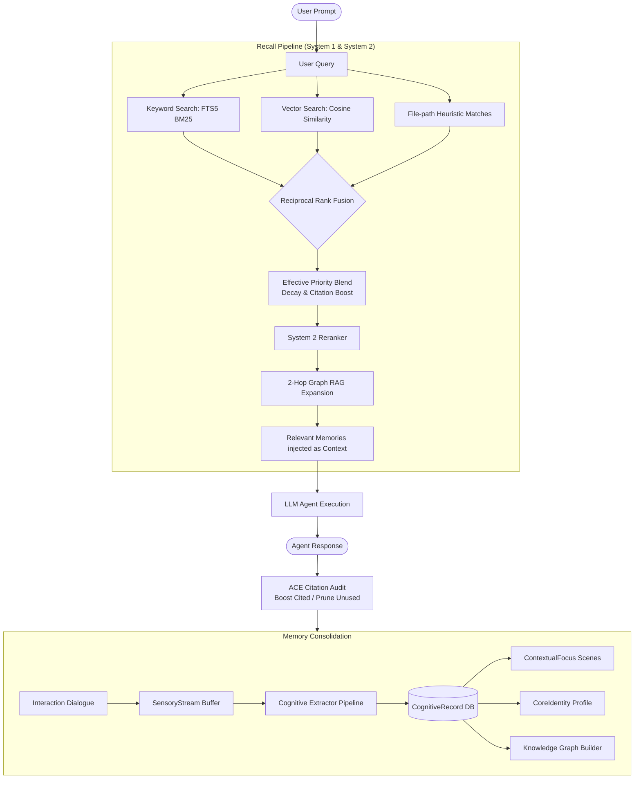

# 🧠 BrainRouter

[](https://opensource.org/licenses/MIT)
[](https://www.typescriptlang.org/)
[](https://modelcontextprotocol.io/)

> **Biologically-Inspired Dual-Process Memory Network and Multi-Agent Orchestration Router**

BrainRouter is a Model Context Protocol (MCP) server and routing layer that equips LLM agents with a multi-layered, biologically-modeled memory network. Designed to emulate human cognitive recall, it prevents context-window saturation, eliminates catastrophic forgetting, and handles real-time knowledge graph propagation, skill-priming, and automated conflict reconciliation.

---

## 🎨 System Overview

Human memory doesn't dump everything into a single context window. It filters, consolidates, decays, and reinforces information dynamically. BrainRouter brings these exact mechanisms to LLM agents:



---

## 🚀 Key Features

*   **⚡ Hierarchical Memory Stack**: Emulates sensory buffer (`SensoryStream`), semantic/episodic storage (`CognitiveRecord`), active session focus (`ContextualFocus` scenes), and long-term user profile instructions (`CoreIdentity`).
*   **🔄 ACE (Agent Citation & Evaluation) Loop**: Synaptic reinforcement and pruning. Recalled memories used by the agent get priority boosts (Long-Term Potentiation); neglected ones are archived automatically (Synaptic Pruning).
*   **📉 Forgetting Curve & Half-Life Decay**: Integrates an Ebbinghaus forgetting curve into the retrieval blend, ensuring stale memories decay unless regularly reinforced.
*   **🔗 Graph RAG (2-Hop BFS)**: Extracts entities and relations from memories, building an association graph to pull in adjacent details during query execution.
*   **🔥 Skill Pre-warming**: Automatically spikes active skill potential on trigger keyword detection and injects critical skill context.
*   **⚠️ Contradiction Resolution**: Detects conflicting information and determines if it represents a temporal update (superseding the old fact) or a genuine conflict (flagged for review).

---

## 📁 Repository Structure

```filepath
BrainRouter/
├── mcp/                      # Model Context Protocol Server
│   ├── src/
│   │   ├── memory/           # Core Memory Engine
│   │   │   ├── store/        # SQLite database & vector/rerank adapters
│   │   │   ├── pipeline/     # Extraction, scene, and graph pipelines
│   │   │   ├── working/      # Session-level context stores
│   │   │   ├── capture.ts    # Ingestion SensoryStream -> CognitiveRecord
│   │   │   └── recall.ts     # Multi-stage hybrid search & blending
│   │   └── index.ts          # MCP Server definition and registration
│   ├── package.json
│   └── tsconfig.json
├── packages/                 # Monorepo Packages
│   ├── types/                # Core Shared Types
│   ├── sdk/                  # BrainRouter Client SDK
│   └── hooks/                # React Hooks for Web Dashboard
├── dashboard/                # Web UI dashboard
├── BRAINROUTER.md            # Deep Concepts & Math specifications
├── PRESENTATION.md           # Slide Deck Overview
└── README.md                 # Project Landing Page
```

---

## 🛠️ Getting Started

### 1. Installation
Clone the repository and install dependencies in the root:

```bash
# Clone & install root
git clone https://github.com/kinqsradiollc/BrainRouter.git
# Or navigate to local workspace
cd BrainRouter
npm install
npm run build
```

### 2. Configuration
Create a `.env` file in the `mcp/` directory (see [`.env.example`](file:///Users/anhdang/Documents/Github/BrainRouter/mcp/.env.example) for reference):

```env
# LLM Endpoint & Models
BRAINROUTER_LLM_ENDPOINT="https://api.openai.com/v1/chat/completions"
BRAINROUTER_LLM_API_KEY="your-api-key"
BRAINROUTER_LLM_MODEL="gpt-4o-mini"

# Embedding & Reranking (Optional but recommended)
BRAINROUTER_EMBEDDING_MODEL="text-embedding-3-small"
BRAINROUTER_RERANKER_ENDPOINT="https://api.cohere.com/v1/rerank"
BRAINROUTER_RERANKER_API_KEY="your-cohere-key"

# Database Configuration
BRAINROUTER_MEMORY_DB="./memory.db"
```

### 3. Registering the MCP Server
Add the server configuration to your MCP host clients (e.g. Cursor, Claude Desktop):

```json
{
  "mcpServers": {
    "brainrouter": {
      "command": "node",
      "args": ["/Users/anhdang/Documents/Github/BrainRouter/mcp/dist/index.js"],
      "env": {
        "BRAINROUTER_LLM_ENDPOINT": "https://api.openai.com/v1/chat/completions",
        "BRAINROUTER_LLM_API_KEY": "your-openai-key",
        "BRAINROUTER_LLM_MODEL": "gpt-4o-mini",
        "BRAINROUTER_MEMORY_DB": "/Users/anhdang/Documents/Github/BrainRouter/mcp/memory.db"
      }
    }
  }
}
```

---

## 🧪 Documentation Suite

To dive deeper into the technical mechanics, mathematical routing functions, and visual presentations of BrainRouter:

1.  **[BRAINROUTER.md (Concept Specs)](file:///Users/anhdang/Documents/Github/BrainRouter/BRAINROUTER.md)**: Mathematical decay formulas, cognitive memory layer explanations, graph expansion mechanics, and conflict resolution loops.
2.  **[PRESENTATION.md (Slide Deck)](file:///Users/anhdang/Documents/Github/BrainRouter/PRESENTATION.md)**: An executive slide-deck overview explaining the business problem, biological inspiration, architecture, and developer roadmap.
3.  **[AGENT.md (Agent System Guidelines)](file:///Users/anhdang/Documents/Github/BrainRouter/AGENT.md)**: Guidelines for agent personalities and behaviors.
4.  **[ROADMAP.md (Future Milestones)](file:///Users/anhdang/Documents/Github/BrainRouter/ROADMAP.md)**: Development phases, vector database expansions, and visual dashboard milestones.

---

## 📄 License
This project is licensed under the MIT License - see the [LICENSE](file:///Users/anhdang/Documents/Github/BrainRouter/LICENSE) file for details.
