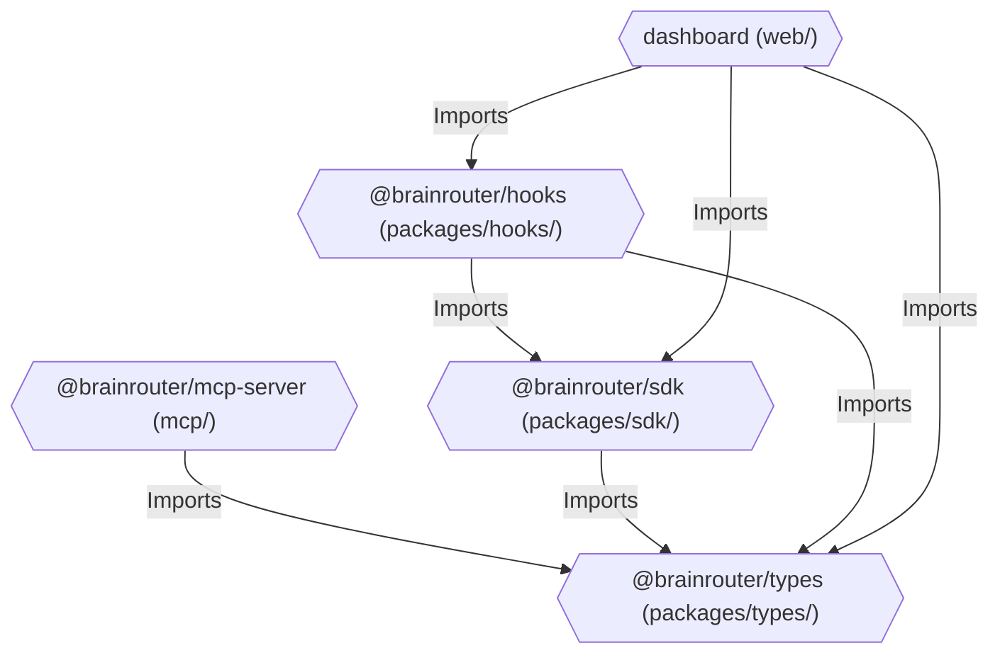
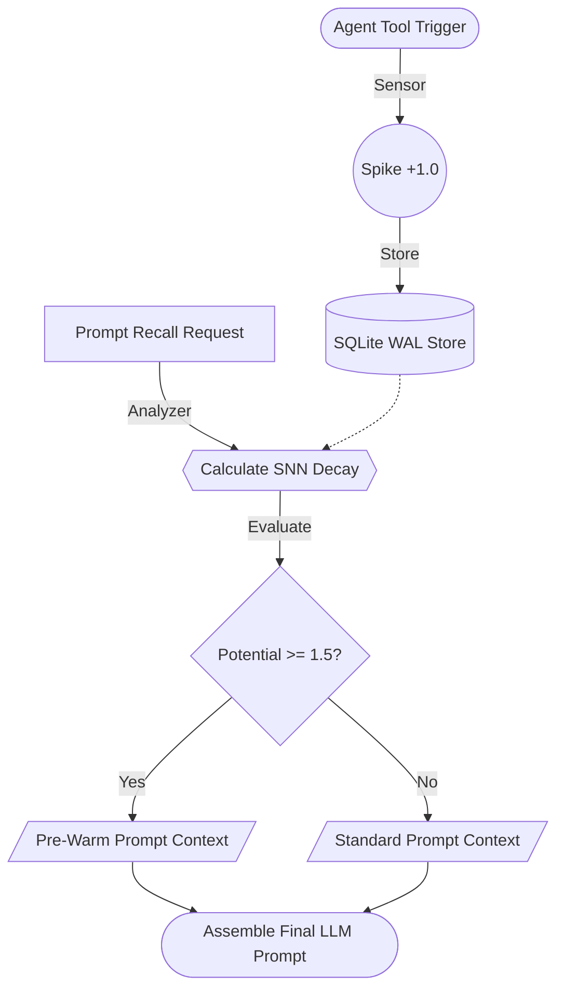

# 🧠 BrainRouter

### Dynamic Context Gateway & Multi-Agent Memory Core

**BrainRouter** is a multi-tenant, hierarchical memory engine and context router designed to coordinate autonomous AI agents. By organizing and serving context dynamically, BrainRouter prevents context-window bloat, controls LLM latency, and allows multiple agents (e.g., CLI helpers, IDE plugins, and web dashboards) to maintain a synchronized, persistent memory and behavioral identity.

Unlike traditional RAG systems that passively retrieve documents or static prompts that overload the context window, BrainRouter actively manages agent attention using **Spiking Skill Routing**—a dynamic activation score and decay mechanism inspired by Spiking Neural Networks (SNNs). It automatically pre-warms the agent's active context window with relevant rules and memories *only* when the agent's current task warrants them.

---

## ✨ Key Features

- **Dynamic SNN Context Pre-Warming**: Tracks agent tool calls as stimuli to spike skill potentials. When a skill crosses the activation threshold, its contextual rules are dynamically injected into the prompt. As time passes or turns advance, unused skills exponentially decay out of context, keeping prompts razor-sharp and token costs low.
- **Hierarchical Memory Pipeline**: Processes raw chat logs (L0) through an asynchronous pipeline to extract distilled semantic facts (L1), resolve logical contradictions (L1.5), cluster situational scenes (L2), and build persistent user personas (L3).
- **GraphRAG Entity Extraction**: Supports traversing 2-hop entity relationships to instantly map codebase architecture and implicit dependencies without dumping entire repositories into context.
- **Local-First, High-Speed SQLite Store**: Built on a high-performance local SQLite WAL database using `sqlite-vec` for seamless vector embeddings and FTS5 for full-text search. Designed for local execution with zero dependency on expensive cloud vector databases.
- **Multi-Tenant Workspace Synchronization**: Ensures that agents running in different environments (e.g., your IDE and your terminal) share the exact same contextual brain, preventing agent silos and fragmented workflows.
- **Visual Task Compaction**: Offloads massive terminal payloads into a robust working memory system, compressing thousands of lines of output into clean, visual Mermaid task canvases.

---

## 🏗️ System Architecture

BrainRouter is structured as a robust TypeScript monorepo using npm workspaces:



### Monorepo Workspaces:
*   **`mcp/` (`@brainrouter/mcp-server`):** Express HTTP / Streamable MCP Server hosting the core memory engine, L0/L1 pipelines, and SQLite store.
*   **`packages/types/` (`@brainrouter/types`):** Centralized TypeScript interfaces for REST APIs, memory layers, and configurations.
*   **`packages/sdk/` (`@brainrouter/sdk`):** Type-safe Client SDK (`BrainRouterClient`) for making REST API calls to the server.
*   **`packages/hooks/` (`@brainrouter/hooks`):** React Hooks to sync dashboard panels with active memory logs and activations.
*   **`web/` (`dashboard`):** Next.js dashboard client styled in Obsidian dark mode, visualising real-time activation potentials.

---

## ⚡ Runtime Execution Flow

Every agent turn operates through a rapid Sensor-Analyzer-Reactor loop:



---

## 🚀 Getting Started

### 1. Prerequisites
- **Node.js:** v22+ (required for native `node:sqlite` support)
- **npm:** v10+

### 2. Installation
Install dependencies in the monorepo root:
```bash
npm install
```

### 3. Environment Variables
Create an `.env` file in the root directory:
```env
# Server configuration (default: 3747)
PORT=3747
USE_HTTP=true

# Security
BRAINROUTER_JWT_SECRET=your_secure_random_jwt_secret_here

# Skill Routing parameters
BRAINROUTER_SKILL_HALF_LIFE_MINUTES=10
BRAINROUTER_SKILL_MIN_TURN_DECAY=0.05
BRAINROUTER_SKILL_PREWARM_THRESHOLD=1.5
BRAINROUTER_SKILL_SPIKE_AMOUNT=1.0
BRAINROUTER_SKILL_MAX_POTENTIAL=4.0
```

### 4. Running the Project

#### Build the Monorepo
Compile shared packages and build the Next.js app:
```bash
npm run build
```

#### Run the MCP Server (Backend)
Start the backend MCP server (runs Express and hosts the SQLite database):
```bash
npm run dev -w @brainrouter/mcp-server
```
Once started, the backend exposes:
- **MCP SSE Transport:** `http://localhost:3747/mcp`
- **REST API:** `http://localhost:3747/api`
- **Health Check:** `http://localhost:3747/health`

#### Run the Web Dashboard (Frontend)
Run the Next.js frontend in development mode:
```bash
npm run dev -w dashboard
```
Open [http://localhost:3000](http://localhost:3000) (the default port Next.js uses for the client dashboard web server) to view the visualizer dashboard in real-time.

---

## 🧪 Testing

To run the complete test suite across all packages:
```bash
npm test
```

---

## 📄 License
This project is licensed under the MIT License - see the [LICENSE](./LICENSE) file for details.
