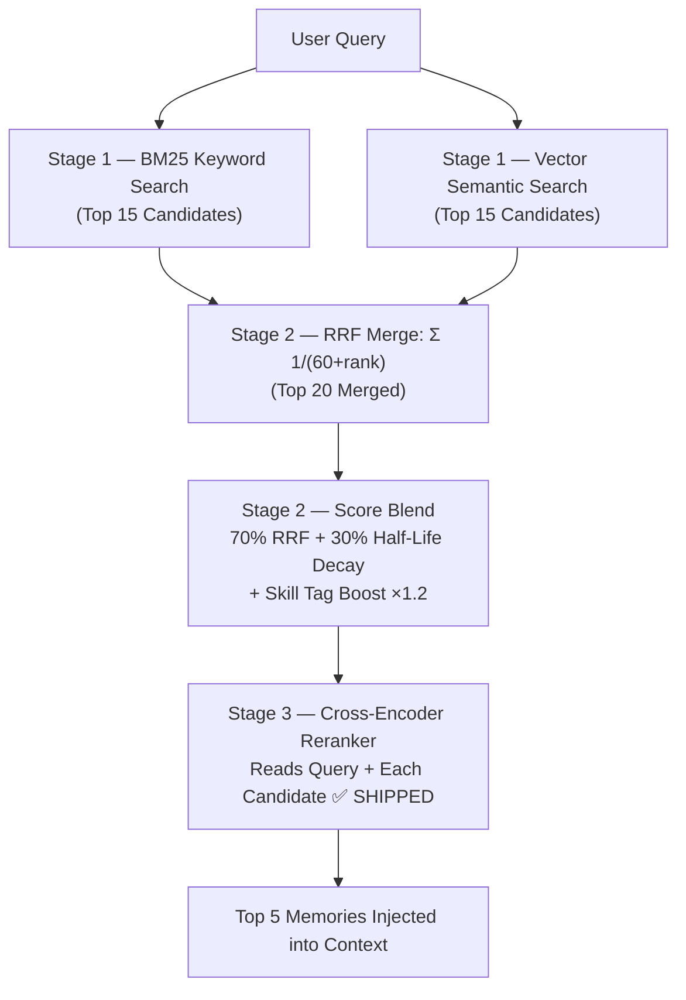
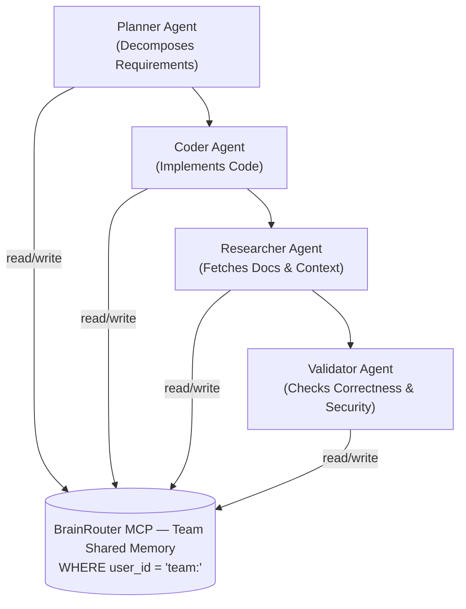
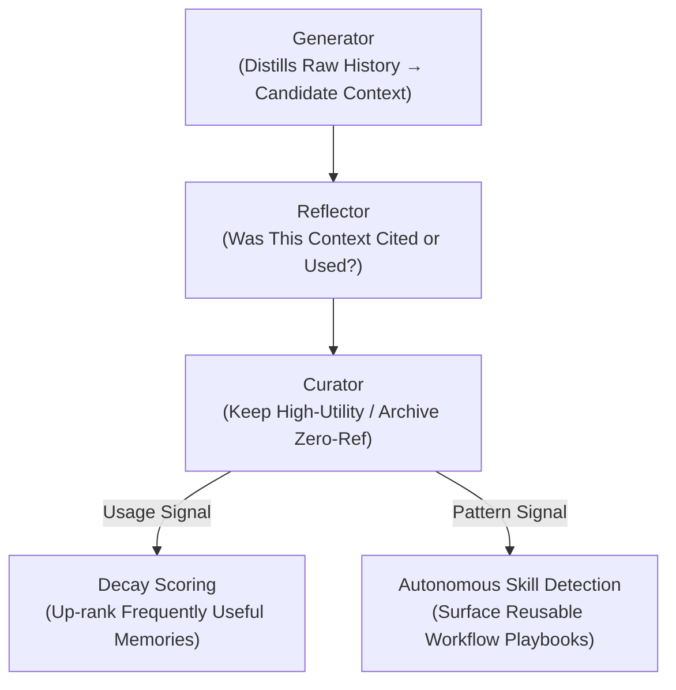

# 🗺️ BrainRouter — Roadmap

> **Last updated:** May 2026
> **Status:** Active development
>
> *Note: This roadmap reflects the state of AI research and tooling as of mid-2026.*

This document is a living record of where BrainRouter is going, why, and how each feature connects to real research. Every item listed here is buildable with today's technology — nothing is speculative vaporware.

---

## The Big Picture

```
┌──────────────────────────────────────────────────────────────────────────────┐
│                       BRAINROUTER DEVELOPMENT ROADMAP                        │
├──────────────────┬──────────────────┬────────────────────┬───────────────────┤
│ SHIPPED ✅        │ PHASE 1 (NEAR)   │ PHASE 2 (MED)      │ PHASE 3-4 (FUTURE)│
├──────────────────┼──────────────────┼────────────────────┼───────────────────┤
│ MCP Server       │ Memory Dashboard │ Skill-Conditioned  │ Team Memory       │
│ Skills & Personas│ Scene auto-merge │   Graph (GraphRAG) │ Memory Export     │
│ L0 / L1 / L1.5  │ L3 prompt cache  │ Temporal Validity  │ Swarm Agent Sync  │
│ L2 Scenes        │                  │   Windows          │ Cross-Session Link│
│ L3 Persona       │                  │ ACE Feedback Loop  │ BrainRouter Hub   │
│ Hybrid RRF Recall│                  │ Auto Skill Detect. │ Multimodal Memory │
│ Cross-Encoder    │                  │ Skill Pre-warming  │ LoCoMo Benchmarks │
│   Reranker       │                  │ Model Routing      │                   │
│ Vector Embedding │                  │ Autonomous Mgmt    │                   │
│ Decay Scoring    │                  │ memory_mark_cited  │                   │
│ create_skill     │                  │                    │                   │
│ update_skill     │                  │                    │                   │
└──────────────────┴──────────────────┴────────────────────┴───────────────────┘
```

---

## Where We Are Today

BrainRouter currently ships:

- [x] **MCP Server** — stdio + Streamable HTTP transports, works with Cursor, Claude, VS Code, Codex, Antigravity
- [x] **Dual Registry** — global skills + local project overrides with automatic shadowing
- [x] **40+ Skills** — agent workflows, code quality, design, devops, testing, communication
- [x] **Personas** — code-reviewer, security-auditor, test-engineer
- [x] **L0 Memory** — raw conversation capture, multi-tenant, FTS5 indexed, cursor-based dedup
- [x] **L1 Memory** — LLM-based extraction of 4 memory types (persona, episodic, instruction, **skill_context**)
- [x] **L1.5 Contradiction Detection** — first-class conflict layer; unresolved flags surfaced to agent/user during recall
- [x] **L2 Scene Narratives** — heat-scored narrative chapters, triggered every ~10 L1s
- [x] **L3 Persona Synthesis** — 4-layer cross-session profile, triggered every ~50 L1s
- [x] **Vector Embedding** — Background non-blocking embedding in `sqlite-vec`, configurable endpoint
- [x] **Hybrid Recall (RRF)** — BM25 FTS5 + Vector merged via Reciprocal Rank Fusion + decay blend + skill-tag ×1.2 boost
- [x] **Stage 3 Reranker** — Cross-encoder precision sorting (Cohere / Qwen3 / BGE) — graceful fallback to RRF-only
- [x] **Decay Scoring** — half-life per type: instruction never, persona 180d, episodic 30d, skill_context 7d
- [x] **Multi-tenant Isolation** — `user_id` on all tables, every query strictly scoped
- [x] **`create_skill` tool** — scaffolds canonical SKILL.md, local or global scope
- [x] **`update_skill` tool** — updates any section; global→local shadowing
- [x] **`memory_resolve_session`** — stable session UUID across conversation reloads

> **vs. TencentDB:** We added `skill_context` type, L1.5 as first-class layer, English prompt, MCP-native transport, multi-tenant enforcement, cross-encoder reranking.
> **vs. agentmemory:** We have explicit contradiction surfacing (not silent eviction), skill-conditioned extraction, cross-encoder reranking, and zero daemon dependency. Their lead areas: auto-hooks, knowledge graph, real-time viewer — all on our roadmap.

---

## Phase 1 — Complete the Memory Pipeline
### *Finish what's started (Near-term)*

The core memory architecture is designed and partially implemented. These items complete it.

---

### 1.1 — L2 Scene Narratives

**What it is:** After accumulating enough L1 memories, the system clusters them into narrative "chapters" — cohesive Markdown documents about different domains of your work (e.g., "Backend Architecture", "DevOps Pipeline", "Auth System").

**Why it matters:** Right now the agent retrieves individual memory atoms. With scenes, it can get the *summary of a whole topic area* in seconds, then drill in only when needed. Like reading a chapter heading before deciding whether to read the chapter.

**How it works:**
1. Every ~20 new L1 memories, an LLM reads the new batch
2. It decides: update an existing scene, merge two scenes, or create a new one
3. Scenes are stored with a **heat score** (how frequently updated) — active projects score higher
4. During recall, scene summaries are injected as stable context (cached at the prompt level)

**Research basis:** Directly from TencentDB's L2 design, which showed scene summaries dramatically reduce token usage for long-horizon tasks.

**Estimated complexity:** Medium (2–3 days). The prompt design is the hard part; storage is straightforward.

---

### 1.2 — L3 Persona Synthesis

**What it is:** Every ~50 new memories, the system performs a deep synthesis and writes a comprehensive profile of you — your working style, decision-making patterns, communication preferences, and technical identity.

**Why it matters:** The persona is the most valuable piece of long-term context. It's what lets the agent say "given how *you specifically* approach architecture decisions, I'd recommend X" instead of giving a generic answer.

**The 4 layers of the persona profile:**

| Layer | What it synthesizes |
|---|---|
| Base Anchors | Your role, tech stack, current projects |
| Interest Graph | What you actively work on vs. passively follow |
| Interaction Protocol | How you like to communicate and work |
| Cognitive Core | How you make decisions, what drives you |

**Auto-trigger:** If L2 scene extraction detects a major shift in your work direction, it sends a signal to regenerate L3 immediately.

**Estimated complexity:** Medium (2–3 days).

---

### 1.3 — Hybrid Vector + Keyword Recall with Reranking *(✅ Fully Shipped)*

**What it is:** BrainRouter implements a complete 3-stage retrieval pipeline combining keyword search (BM25), vector/semantic search (`sqlite-vec`), Reciprocal Rank Fusion (RRF), and Stage 3 cross-encoder reranking (`RerankerService`).

**The three-stage retrieval pipeline:**



**Why each stage matters:**
- **Keyword search** — catches exact terms (e.g., "pnpm", "auth service") via FTS5
- **Vector search** — catches *meaning* (e.g., "package manager" → surfaces pnpm memories) via `sqlite-vec`
- **RRF** — if a memory ranks high in *both* searches, it's almost certainly relevant
- **Reranker** — reads the query AND each candidate memory together to score true relevance, not just similarity

**What is a reranker?** A reranker is a small AI model (a "cross-encoder") that reads both the query and each candidate memory simultaneously and outputs a relevance score. Unlike embedding search (which compresses everything into single vectors and then compares), the reranker sees the full text of both — which gives it much higher precision. The tradeoff: it's slower, so you run it only on the top 20 candidates from Stage 2, not all memories.

**Production reranker options in 2026:**

| Option | Type | Best for |
|---|---|---|
| **Cohere Rerank 4** | Managed API | Maximum accuracy, long documents |
| **Voyage AI rerank-2.5** | Managed API | Enterprise-grade, technical docs |
| **Qwen3-Reranker (0.6B)** | Open-source, self-hosted | Lightweight, cost-free, Apache 2.0 |
| **BGE Reranker v2-m3** | Open-source, self-hosted | Strong multilingual, Apache 2.0 |
| **No reranker (RRF only)** | Built-in | Fastest option, no extra model |

**BrainRouter's approach (Fully Implemented in `recall.ts`):** Reranking is fully configurable. If configured with an API key/endpoint in `RerankerService`, it precision-sorts the top candidates. If no key is set, it gracefully defaults to RRF-only mode without blocking or erroring.

**Research basis:** 2026 production RAG pipelines consistently show reranking produces 15–40% improvement in precision (NDCG@10) on top of RRF. The hybrid retrieve → rerank pattern is now the industry standard baseline.

**Technical implementation:**
- `sqlite-vec` extension for vector storage
- Configurable embedding endpoint (OpenAI-compatible API or local Ollama)
- Background embedding — never blocking the agent
- Optional reranker endpoint (same configurable pattern as LLM)

**Estimated complexity:** Medium–High (3–4 days). Vector + RRF is the bulk of it; reranker is a clean add-on.

---

### 1.4 — Memory Observability Dashboard

**What it is:** A local web UI (accessible at `http://localhost:3747/dashboard`) that shows you what BrainRouter has learned about you.

**What you can see:**
- All L1 memories grouped by type, with their current decay score
- Scene chapters with heat scores
- Your persona profile
- Active contradiction flags — and resolve them with one click
- Capture/recall history timeline

**Why it matters:** Memory is currently a black box. You can call `memory_contradictions` from the agent, but there's no way to *see* what the system knows. Observability = trust. If you can inspect it, you can trust it.

**Research basis:** TencentDB listed this as an open roadmap item. It's also cited as a top gap by the broader AI agent memory research community (2026).

**Estimated complexity:** Medium–High (5–7 days). The UI layer is the main work; the data is already in SQLite.

---

## Phase 2 — Intelligence Upgrades
### *Make the memory smarter (Medium-term)*

These features add intelligence *on top of* the working memory pipeline. Each can be built independently.

---

### 2.1 — Skill-Conditioned Knowledge Graph (GraphRAG)

**What it is:** A knowledge graph that captures *relationships* between memories — and annotates every edge with *which BrainRouter skill was active* when the relationship was established.

**Why it's better than agentmemory's graph:** agentmemory does entity extraction and BFS traversal. Our graph goes further by tagging every edge with the active skill, enabling queries neither competitor supports:
> *"What architectural decisions were made during debugging sessions that we should revisit?"*
> *"Which technologies did we evaluate during spec-driven-development vs. actually adopt?"*

**Relationship types:**
- `User --[prefers | skill: conventions-skill]--> TypeScript`
- `Project --[uses | skill: docker-lifecycle]--> Docker`
- `Decision --[resulted-in | skill: debugging]--> Fix`
- `Bug --[was-fixed-by | skill: debugging]--> Solution`
- `Skill --[was-used-during]--> Session`

**v1 implementation:** SQLite adjacency tables (no external dependency).  
**v2:** FalkorDB (in-memory, sub-100ms) or Neo4j (enterprise, audit trails).

**Research basis:** Microsoft GraphRAG (2024), Mem0 hybrid vector+graph, agentmemory's entity BFS.

**Estimated complexity:** High (1–2 weeks). Graph query design is the hardest part.

**The problem with flat memory:** Current memories are independent atoms. "User uses TypeScript" and "User's API project uses Zod for validation" and "Zod is used in the auth service" are three separate records. A graph connects them: `User → uses → TypeScript → used in → API project → validated by → Zod → used in → auth service`.

**Why relationships matter:** When you ask "how does our validation work?", the agent can *traverse the graph* from the question to the relevant answer — instead of hoping the right keyword matches. This is called **GraphRAG** in the research literature and is one of the most significant developments in AI memory in 2026.

**Technology options:**
- **FalkorDB** — Redis-based graph, high performance, good for local embedding
- **Neo4j** — industry standard, excellent for larger teams/production
- **SQLite with adjacency tables** — simplest option, good enough for v1

**What the graph captures:**
- `User → prefers → Technology`
- `Project → uses → Technology`
- `Decision → resulted in → Outcome`
- `Bug → was fixed by → Solution`
- `Skill → was used during → Session`

**Research basis:** Mem0's hybrid vector+graph architecture, GraphRAG (Microsoft Research, 2024), Cognee's graph memory framework.

**Estimated complexity:** High (1–2 weeks). Graph query design is the hardest part.

---

### 2.2 — Temporal Validity Windows (inspired by Zep/Graphiti)

**What it is:** Every `instruction`-type memory gets `valid_from` / `valid_to` / `invalid_at` timestamps. When a new instruction supersedes an old one, the old is *invalidated but preserved* — not deleted.

**The problem it solves:** Our L1.5 currently flags "always use npm" vs. "always use pnpm" as an unresolved contradiction requiring user action. But most of the time it's just an *update over time* — the user changed their mind. Temporal validity makes the system self-healing: the newer instruction automatically supersedes the older one, the audit trail is preserved, and the contradiction flag never fires.

**What it enables:**
- Agent can query: *"what was the rule in March?"* vs. *"what is the rule now?"*
- L1.5 becomes smarter: only flag genuine simultaneous contradictions, not temporal updates
- Full audit trail: nothing is deleted, recency determines validity

**Schema additions:**
```sql
ALTER TABLE l1_records ADD COLUMN valid_from TEXT;     -- ISO 8601, set on creation
ALTER TABLE l1_records ADD COLUMN valid_to TEXT;       -- null = currently valid
ALTER TABLE l1_records ADD COLUMN invalid_at TEXT;     -- set when superseded
ALTER TABLE l1_records ADD COLUMN superseded_by TEXT;  -- FK to newer record
```

**Research basis:** Zep/Graphiti temporal graph engine — scored ~63.8% on LongMemEval temporal reasoning tasks.

**Estimated complexity:** Medium (2–3 days). Schema migration + updated L1.5 judgment logic.

---

### 2.3 — ACE Feedback Loop (Citation Tracking)

**What it is:** Track which recalled memories the agent actually cited in its responses. Use that signal to up-rank useful memories and auto-archive noise.

**The gap neither competitor has:** agentmemory and TencentDB both store memories but never measure whether retrieved memories were actually *used*. This means:
- Stale memories keep resurfacing (waste tokens, mislead agent)
- Useful memories aren't reinforced
- There's no signal for when to prune

**The mechanism:**
1. `memory_recall` returns each memory with its `record_id`
2. If agent uses a memory in its response → call `memory_mark_cited` with that record ID
3. `citation_count` and `last_cited_at` updated on the record
4. `never_cited_count` incremented on each recall where NOT cited
5. After `never_cited_count > N` → auto-archive flag set, excluded from active pool

**Downstream effects:**
- Frequently cited memories → boosted effective priority in recall scoring
- Never-cited memories → auto-archived (still queryable, not deleted)
- `skill_context` citation patterns → feed autonomous skill detection (Phase 2.4)

**New tool:** `memory_mark_cited` — lightweight, called passively by agent after responding.

**Research basis:** Agentic Context Engineering (ACE) — Generator → Reflector → Curator closed loop.

**Estimated complexity:** Low–Medium (2–3 days). Schema additions + new MCP tool + adjusted scoring.

---

### 2.4 — Autonomous Skill Detection from Patterns

**What's already shipped:** `create_skill` and `update_skill` MCP tools — any agent can already scaffold a full SKILL.md instantly.

**What's NOT built yet:** The *autonomous detection* layer — BrainRouter scanning `skill_context` memories in the background, recognizing you've solved the same problem 3+ times, and *proactively proposing* a new skill.

**The detection pipeline:**
1. Background scheduler queries `skill_context` memories grouped by `scene_name`
2. Semantic clustering: same N-step structure seen 3+ times → candidate pattern
3. Surface proposal via `memory_skill_proposals` tool
4. On approval → auto-call `create_skill` with the detected workflow
5. On dismiss → suppress same proposal for configurable cooldown period

**Example output:**
```
🔍 Pattern detected across 4 sessions:
   You've solved React hydration bugs with a consistent 4-step process.
   → Proposed skill: "react-hydration-debugging"
   → Call create_skill to save, or dismiss for 30 days.
```

**Research basis:** Memento-Skills (2025–2026), TencentDB "Automatic Skill generation" roadmap, PRAXIS procedural memory.

**Estimated complexity:** High (1–2 weeks). Detection pipeline is the hard part; scaffolding already exists.

---

### 2.5 — Skill Pre-warming

**What it is:** When `skill_context` patterns predict you're about to use a particular skill, BrainRouter pre-loads that skill's context before you ask.

**Example:** You always open `spec-driven-development` at the start of a new feature. BrainRouter detects the pattern; on the next session starting with a new feature description, the spec skill's extraction hints and workflow summary are already in `appendSystemContext` — before you say anything.

**Why it matters:** Eliminates the "read AGENT.md → find the skill → load it" dance. Zero latency, zero agent effort.

**Estimated complexity:** Low–Medium (2–3 days). Pattern matching on `skill_context` + proactive injection.

---

### 2.6 — Model Routing (Cost Optimisation)

**What it is:** Use a cheap/fast model for L1 extraction and a smarter model for L3 persona synthesis.

| Task | Model tier | Rationale |
|---|---|---|
| L1 extraction | Haiku, GPT-4o-mini, DeepSeek-V3 | Structured JSON — smaller model sufficient |
| L1.5 contradiction judgment | Haiku, GPT-4o-mini | Binary classification task |
| L2 scene distillation | Sonnet, GPT-4o | Narrative quality matters |
| L3 persona synthesis | Sonnet, GPT-4o | Deep reasoning over long context |

**Target:** 60–80% reduction in LLM API cost for memory operations.

**Research basis:** Context Engineering discipline — use the right tool for the right job.

**Estimated complexity:** Low (1–2 days). Two env vars, two LLMRunner instances.

---

### 2.7 — Autonomous Memory Management

**What it is:** Instead of fixed rules for when to trigger L1/L2/L3, the system adapts based on conversation density.

**The problem:** L1 runs every 5 turns regardless. A long debugging session generates far more extractable signal than 5 quick clarification questions. A rigid schedule misses this nuance.

**How it works:**
1. Track capture/recall telemetry: which sessions, which memory types, which skills active
2. Adaptive L1 trigger: dense technical sessions → trigger earlier; casual chat → trigger later
3. Adaptive pruning: archive memories with consistently low recall scores
4. Privacy-first: all telemetry stays local

**Research basis:** AgeMem / MemRL — memory management as a learned policy (GRPO, 2026).

**Estimated complexity:** High (1–2 weeks). Requires telemetry collection first (ACE feedback loop is a prerequisite).

---

### 2.3 — Autonomous Skill Generation from Patterns

**What's already shipped:** The `create_skill` and `update_skill` MCP tools are fully implemented. Any agent can already call `create_skill` with a name, category, description, and optional workflow steps — and BrainRouter scaffolds a complete, canonical SKILL.md instantly. Agents can also call `update_skill` to modify any section, with automatic global/local shadowing.

**What's NOT built yet (this roadmap item):** The *autonomous detection* layer — BrainRouter monitoring `skill_context` memories in the background, recognizing that you've solved the same type of problem 4+ times, and *proactively proposing* a new skill without the agent explicitly asking.

**The gap in plain English:**
- Today: the agent (or you) manually calls `create_skill("react-hydration-debugging", ...)` when you decide to capture a pattern
- Goal: BrainRouter *notices* the pattern from memory data and surfaces the proposal itself

**Example of what the autonomous layer would do:**

```
🔍 Pattern detected across 4 sessions (from skill_context memories):
   You've solved React hydration bugs with a consistent 4-step process.

   Proposed new skill: "react-hydration-debugging"
   Step 1: Disable SSR for the component temporarily
   Step 2: Check browser console for hydration mismatch errors
   Step 3: Trace to server/client rendering boundary
   Step 4: Fix the boundary mismatch

   → Call create_skill to save this, or dismiss.
```

**Why this is transformative:** Your `skill_context` memories already capture procedural patterns. Autonomous skill generation *lifts* those patterns into executable playbooks without requiring you to notice them yourself.

**Research basis:** Memento-Skills framework (2025–2026), TencentDB's "Automatic Skill generation" roadmap item, PRAXIS procedural memory architecture.

**Estimated complexity:** High (1–2 weeks). The `create_skill` scaffolding already exists — the detection pipeline is what's left.

---

### 2.4 — Skill Pre-warming

**What it is:** When patterns in your `skill_context` memories predict you're about to use a particular skill, BrainRouter pre-loads that skill's context before you ask.

**Example:** You always run `spec-driven-development` at the start of Monday sessions. BrainRouter detects this pattern, and on Monday morning when you open your AI tool, the spec skill's extraction hints and workflow are already injected — without you saying anything.

**Why it matters:** Eliminates the "Read AGENT.md, now find the skill, now load it" dance. The system meets you where you are.

**Estimated complexity:** Low–Medium (2–3 days). Mostly pattern matching on `skill_context` memories + proactive injection.

---

## Phase 3 — Team & Scale
### *From individual developers to teams (Longer-term)*

---

### 3.1 — Team / Shared Memory

**What it is:** A "team tenant" that multiple developers contribute to and read from — a shared organizational knowledge graph.

**What team memory captures:**
- Architectural decisions that apply to the whole team ("we use Postgres, not MySQL")
- Shared coding conventions ("all API responses use camelCase")
- Institutional knowledge ("the auth service is owned by Sarah, touch with care")
- Cross-project patterns ("we always use Zod for validation across all services")

**How isolation works:**
- Each developer still has their personal memory (private tenant)
- The team memory is a second, shared tenant that every team member can read
- Only designated "contributors" can write to team memory (via approval flow)

**Use case:** A new engineer joins. Instead of 2 weeks of onboarding conversations, BrainRouter's team memory has the architectural decisions, conventions, and gotchas — available instantly.

**Estimated complexity:** High (2 weeks+). Requires multi-tenant architecture extensions, approval/contribution flows.

---

### 3.2 — Memory Export / Import / Portability

**What it is:** Move your memory between machines, between tools, or share it with a new team member.

**Export format:** A structured JSON/Markdown package containing your L1 memories, scene files, and persona profile — readable by humans AND re-importable into any BrainRouter instance.

**Use cases:**
- Onboard a new machine without starting from zero
- Share your project's memory snapshot with a new team member
- Back up your context before a long break
- Migrate to a different AI tool while keeping everything you've taught it

**Research basis:** TencentDB's "Portable memory" roadmap item. Also cited in 2026 MCP ecosystem research as a major unmet need.

**Estimated complexity:** Medium (3–5 days). SQLite export is straightforward; the schema versioning and import validation are the hard parts.

---

### 3.3 — Cross-Session Memory Graph

**What it is:** Link related memories across different projects, sessions, and contexts — creating a web of connected knowledge rather than isolated islands.

**Example:** You fixed a PostgreSQL connection pool bug in Project A. Three months later, you hit the same pattern in Project B. Without cross-session linking, the agent has to rediscover the solution. With it, it surfaces: *"You solved a similar connection pool issue in Project A on March 10 — here's what worked."*

**The linking mechanism:**
- When a new memory is extracted, it's compared against memories from *all projects* (not just the current one)
- Similar memories get a `linked_to` relationship
- During recall, linked memories from other projects can be surfaced as "related context from previous work"

**Estimated complexity:** High (1–2 weeks). Requires cross-project graph traversal and careful UX for surfacing cross-project results without noise.

---

## Phase 4 — Ecosystem
### *Beyond individual projects*

---

### 4.1 — BrainRouter Hub (Skill Sharing)

**What it is:** A public registry where developers can publish and discover skills — like npm for AI agent playbooks.

**How it works:**
- Developers create skills for their stack (e.g., `next-app-router-patterns`, `drizzle-orm-migrations`, `aws-lambda-typescript`)
- They publish to the BrainRouter Hub with `brainrouter publish`
- Other developers install skills: `brainrouter install next-app-router-patterns`
- Skills are version-controlled and can be overridden locally

**What makes a skill publishable:**
- Follows the standard `SKILL.md` format
- Has a clear `when_to_use` section
- Includes at least one workflow section
- Optionally: includes extraction hints for memory

**Estimated complexity:** Very High (1–2 months). Requires registry infrastructure, npm-style tooling, auth, versioning.

---

### 4.2 — Multimodal Memory

**What it is:** Memory that can store and recall more than just text — screenshots, diagrams, error logs with stack traces, design mockups.

**Research basis:** 2026 research shows multimodal memory is increasingly critical as agents work in more complex environments. Tools like Pixeltable have demonstrated SQL-queryable multimodal memory for agents.

**Use cases for coding agents:**
- "Remember this error screenshot" → recalled the next time a similar error appears
- "Store this architecture diagram" → surfaced when working on related components
- "Remember this design mockup" → recalled when implementing that UI section

**Estimated complexity:** Very High (2–3 months). Requires multimodal embedding models, new storage schema, image/file handling.

---

## Feature Prioritization Matrix

| Feature | Impact | Buildability | Phase |
|---|---|---|---|
| L2 Scene Narratives | 🔴 High | 🟢 Easy | **✅ Shipped** |
| L3 Persona Synthesis | 🔴 High | 🟢 Easy | **✅ Shipped** |
| Hybrid RRF Recall | 🔴 High | 🟡 Medium | **✅ Shipped** |
| Reranker (Qwen3/BGE/Cohere) | 🔴 High | 🟡 Medium | **✅ Shipped** |
| Memory Dashboard (Observability) | 🟡 Medium | 🟡 Medium | **1 — Next** |
| Scene auto-merge at threshold | 🟡 Medium | 🟢 Easy | **1 — Next** |
| L3 persona prompt caching | 🟡 Medium | 🟢 Easy | **1 — Next** |
| **ACE Feedback Loop** (citation tracking) | 🔴 High | 🟢 Easy | **2 — Next** |
| **Temporal Validity Windows** | 🔴 High | 🟡 Medium | **2 — Next** |
| **Model Routing** (cost opt.) | 🟡 Medium | 🟢 Easy | **2 — Next** |
| Skill Pre-warming | 🟡 Medium | 🟢 Easy | **2 — Next** |
| **Skill-Conditioned Graph** (GraphRAG) | 🔴 High | 🔴 Hard | **2 — Later** |
| **Autonomous Skill Detection** | 🔴 High | 🔴 Hard | **2 — Later** |
| Autonomous Memory Mgmt (AgeMem) | 🟡 Medium | 🔴 Hard | **2 — Later** |
| Team / Shared Memory | 🔴 High | 🔴 Hard | **3 — Later** |
| Memory Export/Import | 🟡 Medium | 🟡 Medium | **3 — Later** |
| Swarm Agent Support | 🔴 High | 🟡 Medium | **3 — Later** |
| Cross-session Memory Graph | 🟡 Medium | 🔴 Hard | **3 — Future** |
| BrainRouter Hub (Skill Marketplace) | 🔴 High | 🔴 Very Hard | **4 — Future** |
| Multimodal Memory | 🟡 Medium | 🔴 Very Hard | **4 — Future** |
| LoCoMo / LongMemEval Benchmarks | 🔴 High | 🟡 Medium | **4 — Future** |

> **ACE, Temporal Validity, and Model Routing** are the highest-leverage near-term items — each is low-complexity but addresses a core gap vs. both competitors.
> **Skill-Conditioned Graph** is what ultimately puts us beyond agentmemory's knowledge graph capability.

---

## Research Landscape — What We're Watching

*Everything below is based on active research and production systems as of mid-2026. Each area is directly relevant to BrainRouter's roadmap.*

---

### 1. GraphRAG — Knowledge Graphs Replace Flat Vector Search
**Status: Actively evaluating for Phase 2.1 (Graph Memory Layer)**

The field has largely moved past "dump everything into a vector store and search it." In 2026, **GraphRAG** — combining knowledge graphs with retrieval-augmented generation — is standard in production agentic systems.

**Why it matters for BrainRouter:** Vector search (what we use today) finds *similar* memories but misses *relationships*. A graph can answer: "What did I decide about authentication, and what other decisions were connected to it?" — a multi-hop query that vector search can't do reliably.

**Production landscape in 2026:**

| Database | Best for | Architecture |
|---|---|---|
| **FalkorDB** | Real-time inference, sub-100ms retrieval | In-memory, C-optimized, GraphBLAS sparse matrix ops |
| **Neo4j** | Enterprise, audit trails, multi-team | Native graph engine, ACID, mature ecosystem |
| **Memgraph** | Low-latency in-memory | Compatible with Cypher, streams-first |

**What we plan to steal:** The pattern of combining vector entry points (fast semantic search) with graph traversal (relationship reasoning). A query like "how does our validation work?" starts with a vector search, then traverses a graph from `User → uses → TypeScript → validated by → Zod → used in → auth service`.

**Key insight from 2026 research:** Graphs are also the right primitive for *temporal* reasoning — understanding how things *changed over time*, not just what they are now. This is critical for a coding agent that needs to understand "we used to use X, now we use Y."

---

### 2. Zep / Graphiti — Temporal Knowledge Graphs
**Status: Design inspiration for L1.5 and Cross-Session Graph (Phase 3.3)**

[Zep](https://getzep.com) (built on [Graphiti](https://github.com/getzep/graphiti), their open-source temporal graph engine) has emerged as a leading memory architecture for agents that need to track *how facts change over time*, not just what they are right now.

**Their key invention — temporal validity windows:** Every fact in the graph is stored with `valid_from`, `valid_to`, and `invalid_at` timestamps. When new information contradicts old information, the old fact is *invalidated but preserved* (not deleted). The agent can then query: "what was true in March?" vs. "what is true now?"

**Why this is directly relevant to BrainRouter:**

Our L1.5 Contradiction Detection is solving the same problem — what to do when an old instruction conflicts with a new one. Graphiti's approach is more sophisticated than our current flag-and-warn approach: it maintains a full temporal history and automatically invalidates outdated facts while preserving the audit trail.

**Benchmark result (LongMemEval, 2026):** Zep/Graphiti scored ~63.8% — one of the highest for temporal reasoning tasks where memory must track changes over time.

**BrainRouter opportunity:** Adopt temporal validity windows for `instruction`-type memories, so "always use npm" can be automatically superseded by "always use pnpm" without creating a contradiction flag — it's just an update in time.

---

### 3. Letta (formerly MemGPT) — OS-Inspired Tiered Memory
**Status: Architecture reference for our L0–L3 hierarchy design**

[Letta](https://letta.com) treats an LLM's context window like a computer's **virtual memory** — an OS metaphor that's surprisingly useful for understanding agent memory.

**Their three tiers:**

| Letta Tier | OS Analogy | BrainRouter Equivalent |
|---|---|---|
| **Core Memory** | RAM — immediately accessible | Active context window (L3 persona + L2 scenes) |
| **Recall Memory** | Disk cache — recent history | L1 memories retrieved via recall |
| **Archival Memory** | Cold storage — vast, queryable | L0 raw conversation store |

**Key difference from BrainRouter:** Letta agents *actively manage* what goes into Core Memory via function calls — the agent itself decides what to promote or demote between tiers. BrainRouter does this automatically via the extraction pipeline (L0 → L1 → L2 → L3). Both approaches are valid; Letta gives the agent more control, BrainRouter is more automatic.

**What we're watching:** Letta's "autonomous context window management" where the agent compresses Core Memory when it gets full — similar to how our L2 scene merging works, but happening at the agent level in real-time.

---

### 4. Mem0 — Hybrid Vector + Graph for Personalization
**Status: Reference architecture; our L1.5 is our answer to their update/merge logic**

[Mem0](https://mem0.ai) is the most widely deployed agent memory framework in 2026, focused on personalization. Their hybrid architecture combines:
- Vector database for semantic search
- Knowledge graph for entity/relationship storage
- A "self-evolving" memory update mechanism

**Their self-evolving mechanism (and why we improved on it):** When Mem0 detects a contradiction (e.g., "User prefers REST" vs. "User now uses gRPC"), it runs an LLM call to decide whether to `store`, `update`, `merge`, or `skip`. This is exactly what our L1.5 Contradiction Detection does — but BrainRouter goes further by *surfacing* unresolved contradictions to the agent during recall, rather than silently picking one.

**BrainRouter's advantage:** Mem0 resolves contradictions silently. BrainRouter makes them *visible* — the agent sees the warning and can ask the user to clarify. Explicit resolution > silent best-guess.

**Benchmark standing:** Mem0 scores well on PersonaMem accuracy tests (personalization recall), making it the benchmark we want to beat as we build out our L3 persona synthesis.

---

### 5. Context Engineering — The Discipline That Replaced Prompt Engineering
**Status: Directly influences our skill-hints architecture and recall injection design**

In 2026, "context engineering" has replaced "prompt engineering" as the core discipline for building reliable AI systems. The insight: it's not about finding the perfect phrasing — it's about systematically managing *what information enters the context window, when, and in what format*.

**The key techniques we're already using (or planning):**

| Technique | BrainRouter Implementation |
|---|---|
| **Retrieval-based memory injection** | `memory_recall` injects only top-K relevant memories, not full history |
| **Stable vs. dynamic context split** | L2/L3 → `appendSystemContext` (cached); L1 → `prependContext` (per-turn) |
| **Prefix/prompt caching** | Stable system context benefits from Anthropic/OpenAI cache discounts |
| **Skill-context modular prompting** | Skills inject focused, structured hints rather than dumping all docs |
| **5-second recall timeout** | Never block the agent — bad context is better than no response |

**What we haven't done yet:** Model routing — using a cheap/fast model (Claude Haiku, GPT-4o-mini) for L1 extraction and a smarter model for L3 persona synthesis. This could cut our LLM API costs by 60–80% for memory operations.

**Research insight from 2026:** "Stale context is worse than no context." Injecting outdated memories can actively mislead the agent. This is why our half-life decay model is not just a nice-to-have — it's a correctness requirement.

---

### 6. Multi-Agent Systems — Swarm Coding Workflows
**Status: Future direction — BrainRouter as shared memory for agent swarms**

In 2026, complex software development tasks are increasingly handled by *swarms* of specialized agents rather than one general-purpose agent. A typical setup:



**Why this matters for BrainRouter:** Right now, BrainRouter serves a single agent talking to a single human. But as multi-agent coding workflows become standard, each specialized agent needs access to the same shared memory — project decisions, user preferences, conventions. BrainRouter's multi-tenant architecture is already designed for this: a "team tenant" where all agents in a swarm read from a shared memory space.

**Production frameworks in use:** LangGraph (stateful graph workflows), CrewAI (role-based), OpenAI Agents SDK, Google ADK. All of them could use BrainRouter as their shared memory layer via MCP.

**Key challenge:** In a swarm, multiple agents capture turns simultaneously. Our cursor-based L0 capture (which prevents duplicate messages) needs to be extended to handle concurrent multi-agent writes safely.

---

### 7. Agentic Context Engineering (ACE) — Self-Improving Agents
**Status: Influences L2/L3 distillation and auto-skill-generation plans**

ACE is a framework where agents use a closed feedback loop to improve their own context over time:



**The insight:** Agents can learn *what context is useful* without retraining the underlying model. The "curriculum" is built from real usage data — which memories actually got referenced in responses?

**BrainRouter connection:** This is the feedback loop we're missing. Right now, we extract memories but we don't track whether they were useful. Adding a "did the agent cite this memory?" signal would let us:
- Up-rank frequently useful memories in recall scoring
- Automatically archive memories that are never referenced
- Feed usage data into the auto-skill-generation pipeline (Phase 2.3)

---

### 8. MCP Ecosystem — What's New in 2026
**Status: We track this to stay compatible with the evolving standard**

MCP has gone from experimental to foundational infrastructure. As of mid-2026:

- **97 million** monthly SDK downloads (Python + TypeScript)
- **9,400+** public MCP servers
- Native support from Anthropic, OpenAI, Microsoft, Google
- Donated to the **Agentic AI Foundation** (Linux Foundation) — now community-governed

**New features in 2026 MCP spec relevant to BrainRouter:**

| Feature | What it means for us |
|---|---|
| **MCP Server Cards** — standardized discovery via `.well-known` URL | BrainRouter should publish a Server Card so it appears in MCP registries |
| **Agent-to-agent communication** — formalized delegation patterns | BrainRouter could route tool calls between specialized sub-agents |
| **Scalable session handling** — session resume across restarts | Aligns with our cursor-based L0 capture; we should implement session resume |
| **Interactive UI components** — servers can return forms/dashboards | Foundation for our planned memory observability dashboard |
| **Enterprise auth** — SSO/Cross-App Access replacing static secrets | Important for team deployment of BrainRouter |

**Opportunity:** As the MCP ecosystem grows to 9,400+ servers, a skill discovery mechanism that connects to the broader MCP registry (not just BrainRouter's own skill library) becomes viable. A developer could search the MCP registry for "drizzle ORM" and get a skill written by the community.

---

### 9. Memento-Skills & Procedural Memory — Skills as Living Artifacts
**Status: Direct research basis for Phase 2.3 (Auto Skill Generation)**

**Memento-Skills (2025–2026):** Agents rewrite and expand their own skills as external memory artifacts (structured markdown/code) without modifying the underlying LLM. Uses offline RL to update the skill router based on long-term utility data.

**PRAXIS (Procedural Recall for Agents with eXperiences Indexed by State):** Stores consequences of past actions, indexed by environmental and internal state. When a similar state recurs, the system retrieves the action sequence that worked previously — a formalization of "muscle memory" for AI.

**The core insight both share:** Procedural memory (knowing *how* to do something) is more valuable and more durable than episodic memory (remembering *that* something happened). A skill that captures "how to debug hydration errors" is worth more than a memory that says "the user debugged a hydration error on May 10th."

**BrainRouter's path:** Our `skill_context` memory type already captures procedural patterns ("when debugging, user always checks console first"). Auto-skill-generation (Phase 2.3) is the mechanism that *lifts* those patterns into executable, shareable SKILL.md files.

---

### 10. AgeMem / MemRL — Memory Management as a Learned Policy
**Status: Theoretical basis for Phase 2.2 (Autonomous Memory Management)**

Rather than fixed rules for when to store, compress, or prune memory, **AgeMem** and **MemRL** treat memory management as a *trainable policy*. The agent learns through experience:
- When is it actually useful to capture a memory?
- When should an old memory be archived vs. kept active?
- Which memories consistently help vs. which are consistently ignored?

**Using Group Relative Policy Optimization (GRPO):** Agents can refine their memory management policy using feedback from whether retrieved memories led to successful task completions — without human supervision.

**The practical implication for BrainRouter:** Today, L1 extraction runs every 5 turns regardless. With autonomous management, it would learn: "This user's debugging sessions are information-dense — run L1 every 3 turns. Their morning stand-up summaries are not — run L1 every 10 turns." Same quality, lower LLM API cost.

---

### 11. Standardized Memory Benchmarks — How We'll Know We're Good
**Status: Evaluation targets for BrainRouter memory quality**

In 2026, the field finally has standardized ways to measure memory quality:

| Benchmark | What it tests | Relevance to BrainRouter |
|---|---|---|
| **LoCoMo** | Multi-session recall, temporal reasoning, adversarial probing | Tests our L0→L1 pipeline + decay scoring |
| **LongMemEval** | Knowledge updates, preference recall, temporal reasoning | Tests our L1.5 contradiction handling + L3 persona accuracy |
| **PersonaMem** | Persona accuracy — does the agent act like it knows you? | Tests our L3 persona synthesis quality |

**Current state:** TencentDB improved PersonaMem from 48% → 76%. Zep/Graphiti scores ~63.8% on LongMemEval temporal tasks. These are our benchmarks to beat.

**Plan:** Once L2/L3 are implemented, run BrainRouter against LoCoMo and LongMemEval and publish the results.

---

## What We Are NOT Building

To stay focused and not lose quality:

| What | Why not |
|---|---|
| **Our own LLM** | BrainRouter is model-agnostic. We use whatever OpenAI-compatible endpoint the user provides. We are the memory layer, not the model. |
| **A new agent framework** | MCP is the standard. We implement MCP, not compete with it. |
| **Cloud-hosted memory by default** | Privacy first. All memory lives on your machine by default. Cloud is opt-in. |
| **Proprietary skill formats** | Our `SKILL.md` format is plain Markdown. You own your skills. No vendor lock-in. |
| **Voice/chat UI** | BrainRouter is infrastructure, not an end-user product. We serve the agent, not the human directly. |

---

## How to Contribute

BrainRouter is open source. The most valuable contributions right now:

1. **Write skills** — if you have a repeatable workflow for your stack, turn it into a SKILL.md and submit a PR
2. **Test the memory engine** — run it, break it, report what memory retrieval gets wrong
3. **Build L2/L3** — the architecture is fully designed (see `APPLIED_CONCEPT.md`); it needs implementation
4. **Improve prompts** — the L1 extraction prompt quality directly determines memory quality
5. **Run the benchmarks** — help us evaluate against LoCoMo and LongMemEval

---

*This roadmap is updated as priorities shift. Check the GitHub issues for the most current status on any specific item.*

*Research references: TencentDB Agent Memory · Microsoft GraphRAG · Mem0 · Zep/Graphiti · Letta/MemGPT · Memento-Skills · AgeMem/MemRL · PRAXIS · Agentic Context Engineering (ACE) · LoCoMo · LongMemEval · PersonaMem benchmarks · MCP 2026 Roadmap (Agentic AI Foundation)*

