# BrainRouter — System Workflows & Architecture

> Architecture reference — a top-to-bottom map of how every part of BrainRouter flows: the two
> frontends, the agent turn engine, the cognitive-memory server, multi-agent delegation, extensions,
> and federation. Every box is anchored to real `file:line` so you can jump into the code.

---

## Table of contents

1. [The 10,000-ft picture](#1-the-10000-ft-picture)
2. [Package map](#2-package-map)
3. [Frontend A — Desktop (Electron)](#3-frontend-a--desktop-electron)
4. [Frontend B — CLI (Ink TUI)](#4-frontend-b--cli-ink-tui)
5. [The Agent turn lifecycle (the heart)](#5-the-agent-turn-lifecycle-the-heart)
6. [Tool dispatch, exec policy & hooks](#6-tool-dispatch-exec-policy--hooks)
7. [Multi-agent: how a complex task fans out](#7-multi-agent-how-a-complex-task-fans-out)
8. [Memory engine — RECALL pipeline](#8-memory-engine--recall-pipeline)
9. [Memory engine — CAPTURE / extraction pipeline](#9-memory-engine--capture--extraction-pipeline)
10. [Memory storage & concurrency](#10-memory-storage--concurrency)
11. [Extensibility — extensions, providers, packs, trust](#11-extensibility--extensions-providers-packs-trust)
12. [Federation — multi-CLI / cross-agent messaging](#12-federation--multi-cli--cross-agent-messaging)
13. [End-to-end: one user message, all the way down](#13-end-to-end-one-user-message-all-the-way-down)
14. [Key file index](#14-key-file-index)

---

## 1. The 10,000-ft picture

BrainRouter is **one core agent engine** (`packages/core`) driven by **two interchangeable frontends**
(Desktop Electron app, CLI TUI), talking to **one cognitive-memory MCP server** (`brainrouter/`) plus any
third-party MCP servers, over an **OpenAI-compatible** provider wire. Extensions, packs, and a
workspace-trust gate layer on top.

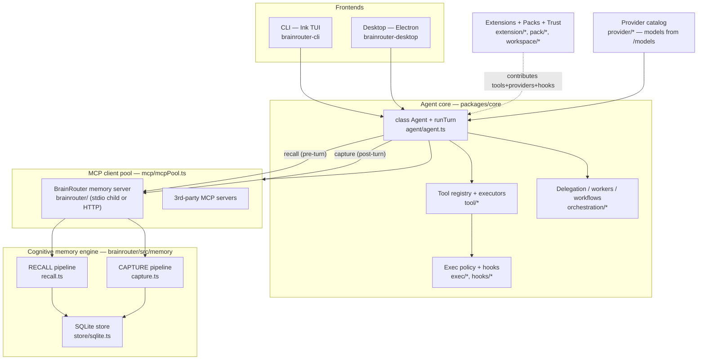

**The one idea to hold onto:** the Desktop and the CLI add *no* memory logic of their own. Both construct
the **same** `Agent` and both reach memory through the **same** `memory_*` MCP tools served by the
bundled `brainrouter` server. Everything below is just "who calls `Agent.runTurn`, and what `runTurn` does."

---

## 2. Package map

| Package | Role | Ships from |
|---|---|---|
| `packages/core` | The Agent engine: `runTurn`, tool registry, exec policy, hooks, delegation, providers, extensions, trust, sessions, config. | `dist/` (gitignored; CI rebuilds) |
| `packages/agent-protocol` | The typed message contract between a frontend and the agent host. | `dist/` |
| `brainrouter/` | The **cognitive memory MCP server** (recall + capture + SQLite + embeddings/reranker/judge). Runs as a stdio child or HTTP. | `dist/` |
| `brainrouter-cli/` | Ink/TUI shell + slash-command router. Thin — imports the core `Agent`. | `dist/` |
| `brainrouter-desktop/` | Electron app: main process + per-workspace agent host (`utilityProcess`) + React renderer. | `dist-electron/` **tracked**, `dist/` renderer build |

---

## 3. Frontend A — Desktop (Electron)

**Three OS processes.** The agent does **not** run in the main process — each workspace gets its own
`utilityProcess` host.

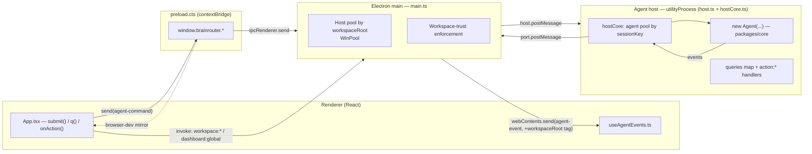

Anchors: host fork `main.ts:142`; agent build `host.ts:506-510`; command router `hostCore.ts:334`;
the **single** agent channel is `agent-command`/`agent-event` (`main.ts:279/161`) — every "query" and every
`action:*` is *not* its own IPC channel, it rides inside `{kind:'query', name}` over that one channel.

**User-message sequence (Desktop):**

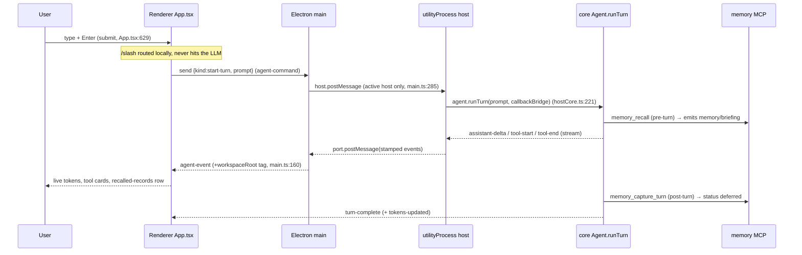

**Modes** (`App.tsx:134`, default `code`): **Chat** = read-only stance (re-asserts `action:set-access {mode:'read'}`),
**Code** = full IDE surface (`shell` access), **Track** = Jira-class PM view firing `track-*` queries.
**Settings** read config via the `config-snapshot` query (secrets scrubbed, `host.ts:1914`); writes via `action:*`
handlers into the **same** `~/.config/brainrouter/config.json` the CLI uses. Secrets never cross to the renderer
(`scrubCliSecrets`, `host.ts:109`; provider keys sent as `hasKey:boolean`).

---

## 4. Frontend B — CLI (Ink TUI)

The CLI is a **thin TUI shell + slash router**; the `Agent`, sessions, federation, MCP, and memory all live
in `packages/core`.

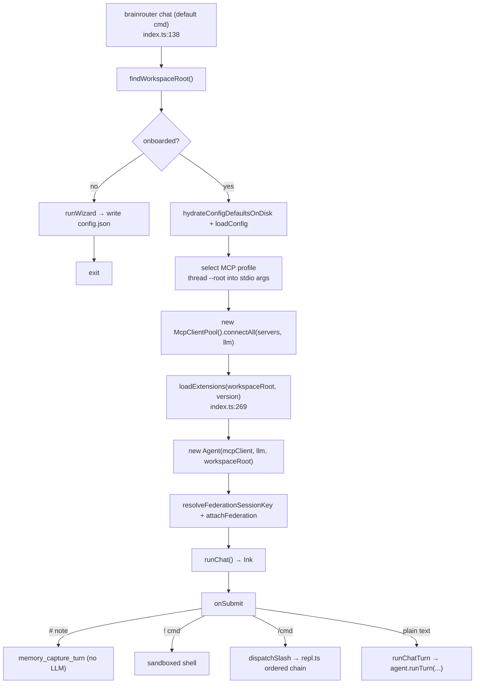

Anchors: boot `index.ts:148-336`; `runChatTurn`→`agent.runTurn` `runChat.tsx:662`; slash chain
`repl.ts:132-151` (first match wins, ends at `tryHandleExtensionCommand` for `/ext` `/trust` `/update`,
then custom markdown commands from `.brainrouter/commands/<name>.md`).

**Memory is out-of-process:** the default profile spawns `brainrouter-mcp` as a **stdio child**
(`wizard/runner.ts:410`), reached through `McpClientWrapper` (`StdioClientTransport`) — never in-process.
`--root <workspaceRoot>` is threaded into its args at boot.

---

## 5. The Agent turn lifecycle (the heart)

This is what both frontends ultimately call. `Agent.runTurn` (`agent/agent.ts:1051`) is a **streaming agentic
loop** with a durable transcript, pre-turn memory recall, a strategy planner, enforce/advisory hook fire-points,
and post-turn memory capture.

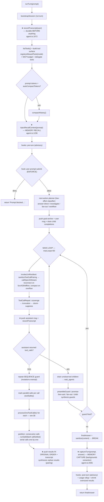

**Why the ★ ordering matters:**
- The **user message is written to the transcript first** (`agent.ts:1072`) — before recall, planner, or LLM —
  so a mid-turn crash never loses it, and tool-call pairing stays intact on resume.
- **Recall is pre-turn** (injects a `<relevant-memories>` block), **capture is post-turn** (and backgrounds the
  heavy cognitive extraction so the reply never blocks).
- Tool **results are appended in original call order** even when executed in parallel, so the next LLM turn sees a
  deterministic transcript. Every `tool_call` is guaranteed a paired result (dedupe + storm-synthetics +
  `synthesizeOrphanResults`), or the provider 400s.

**Resilience baked into the loop:** transient 5xx/429/timeout/offline → bounded reconnect (honors `Retry-After`,
offline waits don't spend budget); context-overflow → reactive `compactHistory()` + retry; model-not-found →
fallback model; `<<<NEEDS_HIGH>>>` → self-escalate up the provider tier ladder (≤2/turn).

---

## 6. Tool dispatch, exec policy & hooks

### 6.1 One registry, three derived views

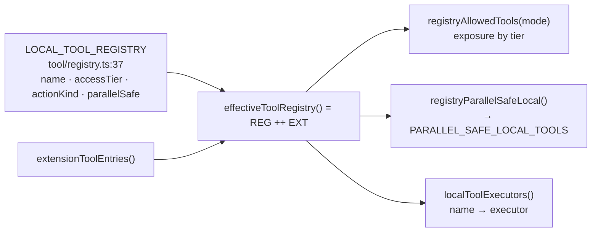

All three views are **generated** from the single registry (drift-guarded by `tool-registry.test.ts` +
`assertLocalToolExecutorInvariants`). Extensions register a tool **at** a tier and flow through the identical
exposure/parallel/policy path — they cannot bypass the tier.

### 6.2 The per-tool-call gauntlet — `processOneToolCall` (`agent.ts:2383`)

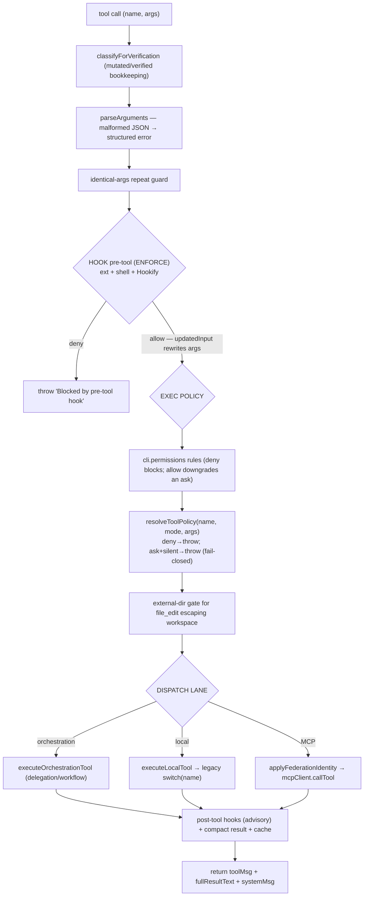

### 6.3 Exec-policy matrix — `decideExecutionPolicy(actionKind, mode)` (`exec/execPolicy.ts:27`)

| ActionKind | `read` mode | `write` mode | `shell` mode |
|---|---|---|---|
| `read_only` / `network` / `bg` | ✅ allow | ✅ allow | ✅ allow |
| `file_edit` / `child_write` | ⛔ deny | ✅ allow | ✅ allow |
| `shell` | ⛔ deny | ⛔ deny | ✅ allow |

Unknown tool → `read_only` (safe default; MCP `memory_*` land here, usable in every mode). A child spawn's
action-kind is resolved from the **child's requested access**, and `clampAccess(parent, requested)` guarantees
child ≤ parent.

### 6.4 Hook fire-points

| Event | Where (`agent.ts`) | Enforce / Advisory | Effect |
|---|---|---|---|
| `pre-turn` | 1240 (shell) + 1241 (ext) | advisory | informational |
| `user-prompt-submit` | 1247 (ext) + 1249 (shell) | **enforce** | deny → turn returns before any LLM call; runs even for silent agents |
| `pre-tool` | 2475 (ext) + 2477 (shell) + 2496 (Hookify) | **enforce** | deny / non-zero / block → tool throws; `updatedInput` rewrites args |
| `post-tool` | 2742 (shell) + 2746 (ext) | advisory | informational |
| `post-turn` | 2937 (shell) | advisory | gets answer preview + token usage |
| `pre-compact` | 3872 (shell) | advisory | before `compactHistory()` |

Two gates decide whether hooks run: `hookEnforceActive()` (blocking events run even unattended/headless if
`enforceWhenSilent`) and `hookAdvisoryActive()` (advisory = interactive only). Extension hooks are typed,
in-process handlers (`runExtensionHooks`); a thrown handler is swallowed (never blocks), a returned `'deny'` blocks.

---

## 7. Multi-agent: how a complex task fans out

When the planner picks `fan-out` / `workflow`, or the model calls a delegation tool, the agent spawns child
`Agent`s. The model sees `task_agent` (foreground/blocking), `delegate_agent` (background), synthesized
`delegate_<id>` tools, plus `spawn_agents` / `run_workflow` / worker tools.

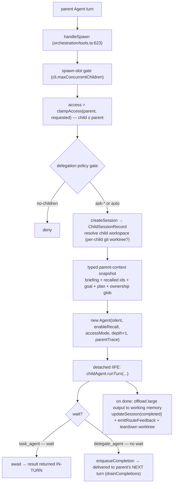

- **`spawn_agents` (grid/batch):** ownership pre-check (write/shell fan-out must declare a non-overlapping
  ownership glob — atomic fail), spawn sequentially but **children run in parallel**; `wait_agents` awaits all
  with `allSettled` (one failure ≠ whole-batch fail).
- **Model-spawned workers** (`spawnWorkerThread`): durable detached `Agent` (`tier:'worker'`) that **outlives the
  turn**, persists status to `workerStore.ts`, depth-capped at `MAX_WORKER_DEPTH=1`. Orphans flip `running→failed`
  on restart (no fake resume).
- **Workflows** (`run_workflow`): a declarative `PhasePlan` whose children go through the same spawn/wait path;
  **blocked for silent/child agents** (no recursive runaway) and gated by a cost confirmation.
- **Task planning:** `update_plan` persists a `PlanState` to `tasks.json` and renders the live ✓/⏳/☐ checklist;
  `planSyncGuard` + `taskTrackingNudge` force multi-step work to keep the plan in sync.

---

## 8. Memory engine — RECALL pipeline

`MemoryRecallPipeline.recall` (`brainrouter/src/memory/recall.ts:414`). Four headline stages
(**retrieve → rerank/select → judge → graph**) with fusion/scoring/spreading-activation between them. **RRF is
the safety net** — if vector, reranker, and judge are all down, FTS+filepath fused by RRF still returns results.

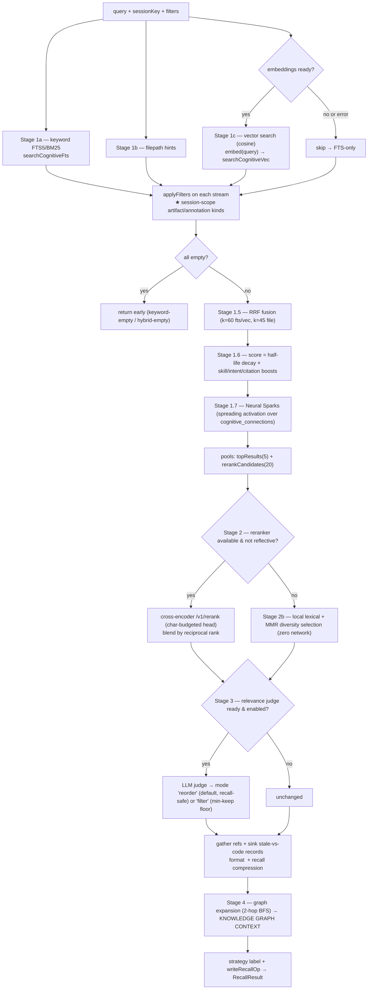

**Key correctness points:**
- `applyFilters` (`recall.ts:348`) drops `kind ∈ {artifact, annotation}` unless `record.session_key === sessionKey`
  — **artifacts/annotations are session-scoped** even when no filter is supplied.
- The judge defaults to **`reorder`** (approved first, rest demoted not dropped) with a min-keep floor, so the
  ranking stages can never zero-out a query that had candidates.
- Reflective/"how do I feel"-style queries **skip the reranker** (MEM-ROUTE) and ride the local MMR path.

---

## 9. Memory engine — CAPTURE / extraction pipeline

`MemoryCapturePipeline` (`brainrouter/src/memory/capture.ts`). Split into a **fast synchronous part** (write raw
sensory rows, reply immediately) and a **backgrounded heavy part** (LLM cognitive extraction → commit). This is
the non-blocking design that stops the MCP reply from hanging on the LLM.

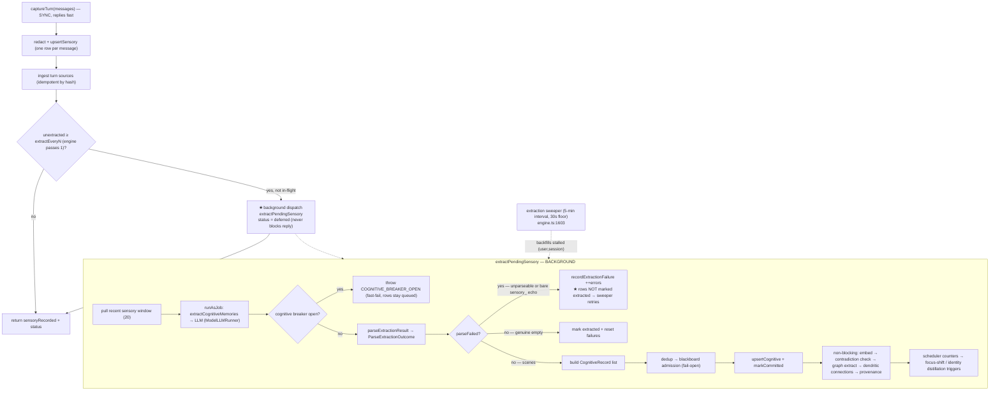

**The bug class this guards against** (the `#512`/`#516` fix): the LLM sometimes echoes a bare
`[sensory_<id>, …]` list instead of scene JSON. The old code returned `[]`, looked like "nothing notable", marked
the rows extracted, and **dropped them forever**. Now `parseExtractionResult` returns a discriminated
`{ scenes, parseFailed, reason }` — `parseFailed:true` → `success:false` → rows **stay queued** for the sweeper.
A genuine `[]` is still accepted. A **cognitive circuit breaker** (threshold 3 / 30s cooldown) fast-fails the whole
cognitive chain against a dead endpoint instead of burning each stage's full retry budget; a per-user
`extraction_errors` counter pauses the sweep for a session at 5 failures until a success resets it.

---

## 10. Memory storage & concurrency

**SQLite store** — `brainrouter/src/memory/store/sqlite.ts` (`SqliteMemoryStore`). The tiers:

| Tier | Table(s) | Purpose |
|---|---|---|
| **Sensory** | `sensory_stream` | raw per-message turn log; `extracted_at IS NULL` drives the sweeper |
| **Cognitive** | `cognitive_records` (+ `cognitive_fts` BM25, `cognitive_vec` cosine embeddings) | distilled long-term memories; FTS + vector recall |
| **Graph** | `graph_nodes`, `graph_edges`, `cognitive_connections` | GraphRAG entities/relations + dendritic-spine assoc graph (neural sparks) |
| **Sources** | `source_documents`, `source_chunks` (+ `source_chunks_fts`), `code_symbol_edges`, `cognitive_source_links` | ingested docs/code, chunked + provenance-linked to records |
| **Curation** | `contradictions`, `memory_blackboard_items`, `memory_tree_nodes`, `contextual_focus`, `core_identity` | conflict detection, staged-admission, summary tree, focus scenes, persona |
| **Ops/sched** | `memory_operations`, `memory_jobs`, `scheduler_state` (`extraction_errors`), `memory_evidence`, `memory_file_index` | audit log, observable job queue, per-user counters |
| **Federation** | `users`, `active_sessions`, `session_inbox`, `pending_delegations` | cross-CLI session registry / inbox / delegation |

**Concurrency model** (`brainrouter/src/memory/llm/llm-semaphore.ts` + the new `token-bucket.ts` from #515):

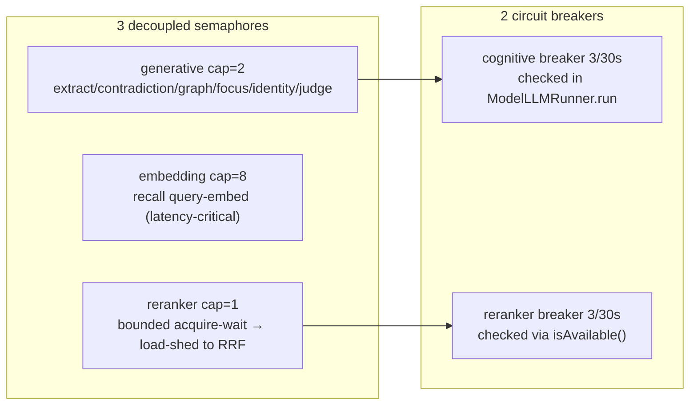

The point of **three separate pools**: a latency-critical recall query-embed must never queue behind a slow
background generation (the pre-0.4.15 single-cap-1 stall that produced "client disconnected before reply").
**Bounded timeouts** (embedding 30s, reranker 25s, judge ~15s) are deliberately exempt from the 10-minute local
generative floor so the recall path degrades fast instead of hanging the MCP reply. Background work (extraction,
embed, contradiction, graph, distillation) is dispatched `void`/`.catch` so it never blocks a reply, and three
`setInterval` sweepers (extraction 5m, active-session 1m, inbox 5m) backfill with reentrancy guards + `.unref()`.

---

## 11. Extensibility — extensions, providers, packs, trust

### 11.1 Extension load flow (trust-gated, fault-isolated)

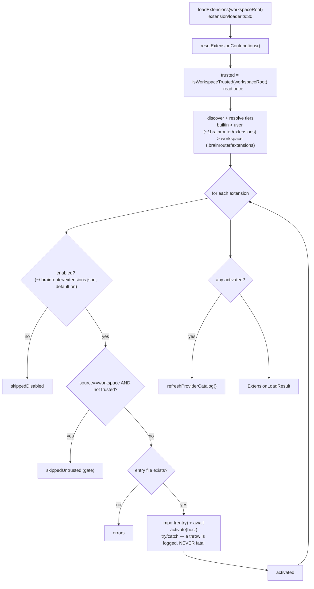

### 11.2 How a contribution reaches the agent (three chains)

| Contribution | `activate(host)` call | Reaches the agent via |
|---|---|---|
| **Tool** | `host.registerTool(def)` → `toolContribs` | `effectiveToolRegistry()` (exposure by tier) + `localToolExecutor(name)` **falls through to** `extensionExecutor(name)` |
| **Provider** | `host.registerProvider(def)` → `providerContribs` | `refreshProviderCatalog()` rebuilds `PROVIDER_CATALOG` (a **built-in id always wins** over an extension of the same id) |
| **Hook** | `host.registerHook(handler)` → `hookContribs` | `runExtensionHooks(event, ctx)` at pre-turn / user-prompt-submit / pre-tool / post-tool; `'deny'` blocks |

### 11.3 Providers & packs & trust (the facts)

- **Providers** (`provider/catalog.ts`): every provider is the same OpenAI-compatible wire; `endpoint` is a base
  URL and `callOpenAI` appends `/chat/completions`. **Model lists are always empty in the catalog** — live
  `/models` from the endpoint wins; provider modules are forbidden from owning model catalogs/defaults.
- **Packs** (`pack/packs.ts`): same builtin>user>workspace tiering, but user packs live under
  `~/.config/brainrouter/packs` (note: **different home** from extensions/trust, which are under `~/.brainrouter`).
  Today **only `agents/` is wired** into the agent registry (`commands/skills/hooks/mcp` are declared-but-unconsumed).
  Packs are **opt-in per workspace** (`.brainrouter/packs.json`), not trust-gated.
- **Trust** (`workspace/workspaceTrust.ts`): one global store at `~/.brainrouter/trusted-workspaces.json`, shared
  by CLI + desktop, path-normalized via `realpathSync`. **What it actually gates today: workspace-tier extension
  activation only** (the loader). The docstring mentions shell/hooks aspirationally, but no separate shell/pack-hook
  trust gate is wired in core yet. Desktop auto-trusts the launch workspace (`main.ts:275`); every other workspace
  needs an explicit "Do you trust this folder?" confirmation, enforced defense-in-depth in `workspace:open`.

> **0.4.15 cleanup that landed in this branch:** the extension API originally added a second `getConfigHome()`
> reading `process.env.BRAINROUTER_HOME` and a *duplicate* trust store (`trust/trust.ts`). Both were removed —
> extension dirs now route through the single `getBrainrouterHome()` helper and the one canonical
> `workspace/workspaceTrust.ts`, fixing a split-brain where the desktop launch-trust and the extension gate read
> different files.

---

## 12. Federation — multi-CLI / cross-agent messaging

Each CLI process registers with the brain so multiple terminals/agents can see and message each other. The subtle
part: there are **two session keys**.

| Key | Field | Scope | The LLM sees it? |
|---|---|---|---|
| **Chat key** | `agent.sessionKey` | transcript, memory recall/capture, goals, plans; rotates on `/new`; resolved by the brain via `memory_resolve_session` | ✅ yes (in its system prompt) |
| **Federation key** | `agent.federationSessionKey` | the federation registry/inbox/delegation; fresh `randomUUID()` per process, not persisted | ❌ no |

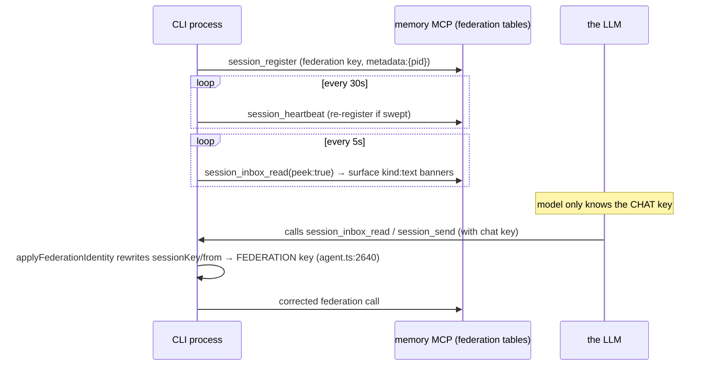

The **identity rewrite at the tool-call boundary** (`util/federationIdentity.ts`) is what reconciles the two keys:
the model uses the chat key it knows, and the agent silently substitutes the federation key for
`session_inbox_*` / `session_send` / `session_delegate_task` so messages land in the right registry row.
(Parent↔child agent results use a *separate* in-memory completion inbox keyed by the parent chat key — not federation.)

---

## 13. End-to-end: one user message, all the way down

Putting every layer together — a Desktop user message that triggers a tool, with memory recall and capture:

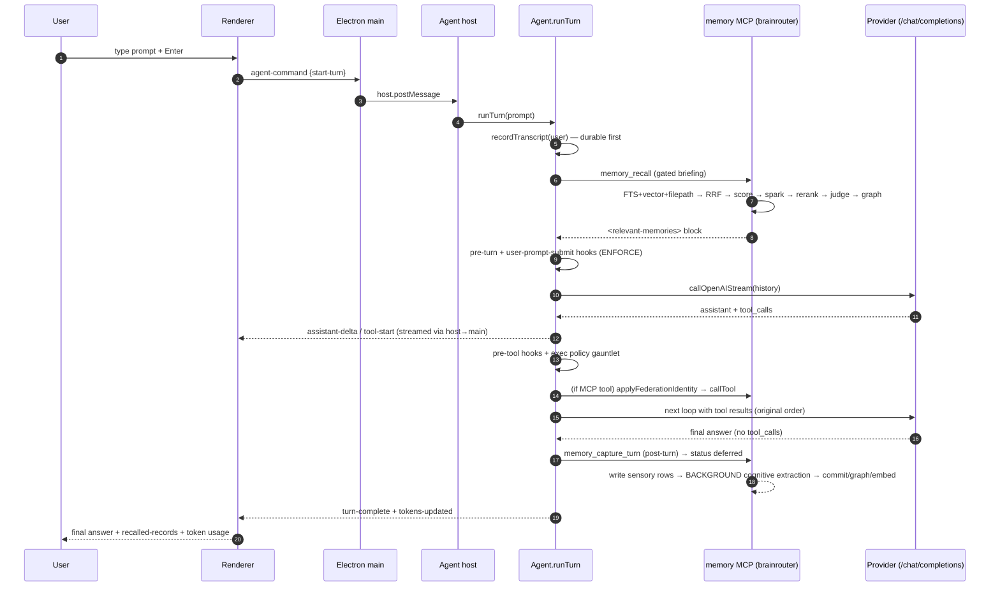

**Read this as the spine of the whole system:** frontend → host → `runTurn` → (recall) → hooks/policy →
LLM↔tools loop → (capture) → background memory consolidation. Every other section is a zoom-in on one of these
boxes.

---

## 14. Key file index

| Subsystem | Anchor files |
|---|---|
| **Agent core** | `packages/core/src/agent/agent.ts` (`runTurn` 1051, `processOneToolCall` 2383, `injectRecallContext` 4785, `captureTurn` 5022) |
| **Tools / policy / hooks** | `tool/registry.ts`, `tool/executors.ts`, `tool/toolSafety.ts`, `exec/execPolicy.ts`, `hooks/hooksStore.ts` |
| **Delegation / workers** | `orchestration/tools.ts` (`handleSpawn` 623), `orchestration/workerTools.ts`, `task/taskStore.ts` |
| **Memory recall** | `brainrouter/src/memory/recall.ts` (`recall` 414), `reranker/index.ts`, `pipeline/neural-spark.ts`, `pipeline/graph-recall.ts` |
| **Memory capture** | `brainrouter/src/memory/capture.ts`, `pipeline/cognitive-extractor.ts`, `llm/cognitive-breaker.ts`, `llm/modelRunner.ts`, `engine.ts` (sweeper 1603) |
| **Memory storage** | `brainrouter/src/memory/store/sqlite.ts`, `store/embedding.ts`, `store/reranker.ts`, `store/relevance-judge.ts`, `llm/llm-semaphore.ts`, `llm/token-bucket.ts` |
| **MCP transport** | `brainrouter/src/transport/mcpServer.ts`, `packages/core/src/mcp/mcpClient.ts`, `mcp/mcpPool.ts` |
| **Desktop** | `brainrouter-desktop/electron/main.ts`, `electron/host.ts`, `electron/hostCore.ts`, `electron/preload.cts`, `src/App.tsx`, `src/lib/agent/useAgentEvents.ts`, `src/settings.tsx` |
| **CLI** | `brainrouter-cli/src/index.ts`, `cli/ink/runChat.tsx`, `cli/repl.ts`, `runtime/federationRegistration.ts`, `cli/commands/*` |
| **Extensibility** | `packages/core/src/extension/{loader,manifest,host,registry,extensionStore}.ts`, `provider/catalog.ts`, `pack/packs.ts`, `workspace/workspaceTrust.ts` |
| **Federation** | `runtime/federationRegistration.ts`, `packages/core/src/util/federationIdentity.ts`, `session/completionInbox.ts` |

---

*Generated from a live read of the codebase on the `release/0.4.15` branch. Diagrams are GitHub-flavored Mermaid —
view in any Mermaid-aware renderer.*
