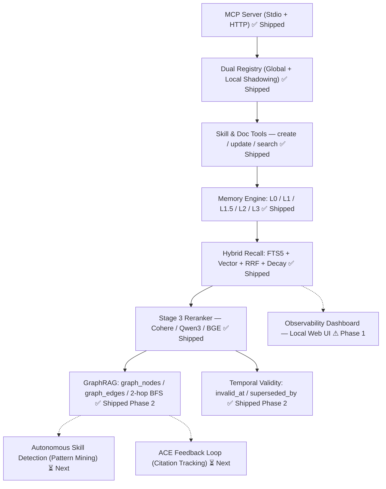

# ✅ BrainRouter — TODO

> Derived from `ROADMAP.md`. Updated: May 2026.
> Mark items `[x]` when shipped. Use `[/]` for in-progress.

---

## Shipped ✓

- [x] MCP Server — stdio transport
- [x] MCP Server — Streamable HTTP transport (`--http --port`)
- [x] Dual registry — global skills + local project overrides with automatic shadowing
- [x] 40+ global skills (agent, code, design, devops, testing, communication, memory)
- [x] Personas (code-reviewer, security-auditor, test-engineer)
- [x] References support
- [x] `list_skills` tool
- [x] `get_skill` tool (section-level: overview, workflow, checklist, etc.)
- [x] `search_skills` tool (fuzzy search)
- [x] `get_persona` tool
- [x] `get_reference` tool
- [x] `list_docs` tool
- [x] `get_doc` tool (section-level)
- [x] `create_skill` tool — scaffolds a canonical SKILL.md, local or global scope
- [x] `update_skill` tool — updates any section; handles global→local shadowing
- [x] `memory_capture_turn` tool
- [x] `memory_recall` tool (3-stage retrieval + GraphRAG context expansion + L2/L3 injection)
- [x] `memory_search` tool
- [x] `memory_contradictions` tool (list + resolve genuine conflicts)
- [x] `memory_register_skill_hints` tool
- [x] `memory_resolve_session` tool
- [x] **`memory_graph_query` tool** — query knowledge graph by entity name, hop depth, skill filter *(Phase 2)*
- [x] L0 Memory — raw conversation capture, FTS5 indexed, cursor-based (no duplicates)
- [x] L1 Memory — LLM extraction pipeline (persona, episodic, instruction, skill_context types)
- [x] **L1.5 Contradiction Detection** — two-pass evaluation: temporal updates auto-invalidate old records; genuine conflicts surfaced as agent-visible `⚠️` warnings
- [x] **Temporal Validity Windows** — `invalid_at` + `superseded_by` columns; self-healing; all recall queries filter `WHERE invalid_at IS NULL` *(Phase 2)*
- [x] L1 Deduplication — FTS-based dedup before writing, drops identical memories
- [x] **L2 Scene Narratives** — auto-triggered every 10 L1s; heat-scored; injected as `<scene-navigation>` in recall
- [x] **L2 Scene Cold-Start Consolidation** — L1 extractor snaps to existing scene names; LLM clustering pass prevents fragmentation *(Phase 2)*
- [x] **L2 Scene Direction-Shift Trigger** — LLM judge fires L2 early on major topic transitions (≥0.75 confidence) *(Phase 2)*
- [x] **L2 Scene Auto-Merge** — cold scenes merged when count exceeds `BRAINROUTER_L2_MAX_SCENES` *(Phase 2)*
- [x] **L3 Persona Synthesis** — cross-session distillation, auto-triggered every 50 L1s; 4-layer profile; injected as `<user-persona>` in recall
- [x] **L3 Persona Prompt-Level Cache** — TTL-based in-memory cache, invalidated on L3 distillation *(Phase 2)*
- [x] Memory decay scoring — per-type half-life model (instruction never fades, episodic 30d, persona 180d, skill_context 7d)
- [x] **Vector Embedding** — `EmbeddingService` with configurable endpoint/model/dimensions; background non-blocking; graceful FTS fallback
- [x] **Hybrid Recall (RRF)** — BM25 FTS5 + vector merged via Reciprocal Rank Fusion; 70% RRF / 30% decay blend; skill-tag boost ×1.2
- [x] **Stage 3 Reranker** — `RerankerService` with configurable endpoint, model, and topN (Cohere/vLLM/BGE compatible)
- [x] **GraphRAG** — skill-conditioned `graph_nodes` / `graph_edges`; non-blocking extraction; 2-hop BFS hybrid recall expansion *(Phase 2)*
- [x] Keyword recall — BM25 FTS5 + decay blending (FTS-only fallback mode)
- [x] Multi-tenant isolation — `user_id` on all tables, all queries scoped
- [x] 5-second recall timeout (agent never blocked)
- [x] Local LLM support — configurable timeouts (`BRAINROUTER_GRAPH_TIMEOUT_MS`, `BRAINROUTER_CONTRADICTION_TIMEOUT_MS`); `BRAINROUTER_GRAPH_ENABLED` opt-out *(Phase 2)*
- [x] `setup:mcp` script — generates tool config files for all major AI tools

---

## Phase 1 — Complete the Memory Pipeline
### Target: Near-term

- [x] **L2 Scene Narratives** *(fully implemented — `pipeline/l2-scene.ts`)*
  - [x] LLM reads new L1 memory batch — triggers every `BRAINROUTER_L2_TRIGGER_N` L1 extractions (default: 10)
  - [x] Decides: update existing scene / create new scene (upserts by scene name)
  - [x] Stores scenes with heat score (boosts by +30 on each distillation; decays each cycle)
  - [x] Scene summaries injected in `recall.ts` as `<scene-navigation>` block
  - [x] Scene auto-merge when scene count exceeds threshold *(implemented — `pipeline/l2-scene.ts` `mergeScenes()`, configurable via `BRAINROUTER_L2_MAX_SCENES`)*
  - [x] Auto-trigger regeneration on major direction shift *(implemented — `pipeline/l2-direction-shift.ts` LLM judge, fires before count-based trigger)*
  - [x] Scene consolidation on fresh sessions *(implemented — L1 extractor receives existing scene names; LLM clustering pass in `canonicalizeSceneNames()` remaps fragmented names to a single canonical)*

- [x] **L3 Persona Synthesis** *(fully implemented — `pipeline/l3-distiller.ts`)*
  - [x] Triggers every `BRAINROUTER_L3_TRIGGER_N` L1 extractions (default: 50)
  - [x] Reads all `persona` + `instruction` L1 memories cross-session
  - [x] Synthesizes via LLM with 90s timeout
  - [x] Persona injected in recall as `<user-persona>` block
  - [x] 4-layer profile structure (Base Anchors, Interest Graph, Skill Map, Behavioural Patterns) *(implemented — `prompts/l3-persona.ts` prompt rewrite)*
  - [x] Cache persona at prompt level as stable system context *(implemented — in-memory cache in `MemoryEngine`, TTL via `BRAINROUTER_PERSONA_CACHE_TTL_MS`, invalidated on L3 distillation)*

- [x] **Hybrid Vector + Keyword Recall** *(fully implemented — `recall.ts`)*
  - [x] Stage 1: BM25 FTS5 keyword search → top 15 candidates
  - [x] Stage 1: Vector similarity search → top 15 candidates (when embedding enabled)
  - [x] Stage 2: RRF merge (formula: `Σ 1/(60 + rank)`) → combined scored list
  - [x] Decay scoring blended in: 70% RRF relevance + 30% half-life priority
  - [x] Skill-tag boost (×1.2 for memories matching active skill)
  - [x] Top 5 results injected as `<relevant-memories>` block
  - [x] Graceful fallback to FTS-only if embedding not configured
  - [x] Stage 3 (Reranker) precision sorting → top 5 results

- [x] **Vector Embedding** *(fully implemented — `store/embedding.ts` & `store/sqlite.ts`)*
  - [x] `EmbeddingService` class with configurable endpoint, model, dimensions
  - [x] Defaults to `text-embedding-3-small` / OpenAI-compatible
  - [x] Graceful fallback — if no API key, falls back to FTS-only silently
  - [x] Background embedding after L1 capture (non-blocking `.then()/.catch()`)
  - [x] `sqlite-vec` vector storage (`store.initVec()` and `upsertL1Vec()` fully functional)

- [x] **Reranker support** *(fully implemented — `store/reranker.ts`)*
  - [x] Configurable reranker endpoint (`endpoint`, `apiKey`, `model`, `topN`)
  - [x] Default: disabled (RRF-only)
  - [x] Opt-in: Cohere Rerank 4 / Voyage AI via API key
  - [x] Opt-in: local Qwen3-Reranker (0.6B) or BGE v2-m3 via Ollama

- [ ] **Memory Observability Dashboard**
  - [ ] Local web UI at `http://localhost:3747/dashboard`
  - [ ] View all L1 memories grouped by type with current decay score
  - [ ] View scene chapters with heat scores
  - [ ] View L3 persona profile
  - [ ] One-click contradiction resolution
  - [ ] Capture/recall history timeline

---

## Phase 2 — Intelligence Upgrades
### Target: Medium-term

- [x] **Skill-Conditioned Knowledge Graph (GraphRAG)** *(v1 shipped — skill-tagged entities/relations, 2-hop BFS, `memory_graph_query` tool)*
  - [x] Define entity/relationship schema with `skill_tag` on every edge
  - [x] v1: SQLite adjacency tables (`graph_nodes`, `graph_edges` with `skill_tag`, `confidence`)
  - [x] Build graph construction pipeline from L1 memories post-extraction (`pipeline/graph-builder.ts`)
  - [x] Implement skill-conditioned graph traversal queries (`store/sqlite.ts` `getGraphNeighbors()`)
  - [x] Hybrid recall: BFS entry point → graph traversal → `<graph-context>` injected in system prompt
  - [x] New tool: `memory_graph_query` (entity + hop depth + skill filter)
  - [x] Local LLM support: `BRAINROUTER_GRAPH_ENABLED` opt-out, `BRAINROUTER_GRAPH_TIMEOUT_MS` (default 120s)
  - [ ] v2 upgrade path: FalkorDB or Neo4j for larger teams

- [x] **Temporal Validity Windows** *(shipped — self-healing L1.5, audit trail preserved)*
  - [x] Schema migration: add `invalid_at`, `superseded_by` to `l1_records` (auto-migrated on startup)
  - [x] When new `instruction` memory is a temporal update: mark old as `invalid_at = NOW()`, set `superseded_by`
  - [x] L1.5 two-pass evaluation: classify as `temporal_update` (auto-resolve all candidates) vs. `genuine_conflict` (flag)
  - [x] Recall: filter `WHERE invalid_at IS NULL` in FTS, vector, and scene queries
  - [x] Configurable contradiction timeout: `BRAINROUTER_CONTRADICTION_TIMEOUT_MS` (default 60s for local LLMs)
  - [x] **Point-in-time recall:** `memory_search` with `asOf` param — SQL filters `created_time <= asOf AND (invalid_at IS NULL OR invalid_at > asOf)` *(Phase 3)*

- [x] **ACE Feedback Loop** *(Phase 3 — shipped)*
  - [x] Schema: `citation_count`, `last_cited_at`, `never_cited_count`, `archived` columns (idempotent migrations, run before prepared statements)
  - [x] New tool: `memory_mark_cited` — agent calls after each response with cited + all-recalled IDs
  - [x] Decay scoring boost: each citation +5% effective priority, capped at +30%
  - [x] Auto-archive: `never_cited_count >= BRAINROUTER_ACE_ARCHIVE_THRESHOLD` (default 10) → `archived = 1`
  - [x] Archived memories excluded from `searchL1Fts` and `searchL1Vec` (`WHERE archived = 0`); upsert-safe (citation fields not in ON CONFLICT UPDATE)
  - [ ] Feed `skill_context` citation signals into autonomous skill detection (future)

- [x] **Model Routing** *(Phase 3 — shipped)*
  - [x] `BRAINROUTER_EXTRACTION_MODEL` — used for L1, L1.5, GraphRAG (fast/cheap)
  - [x] `BRAINROUTER_SYNTHESIS_MODEL` — used for L2, L3 (smarter)
  - [x] `ModelLLMRunner(modelOverride?)` — fallback chain: env override → `BRAINROUTER_LLM_MODEL` → `"gpt-4o-mini"`
  - [x] Two instances in `MemoryEngine` (`extractionRunner`, `synthesisRunner`); default: same model (backward-compatible)

- [x] **Skill Pre-warming** *(Phase 3 — shipped)*
  - [x] Scans last N `skill_context` L1s (configurable via `BRAINROUTER_PREWARM_WINDOW`, default 10)
  - [x] Skills with ≥ `BRAINROUTER_PREWARM_MIN_HITS` (default 3) occurrences load their registered hints
  - [x] `<skill-prewarm>` block injected into `appendSystemContext`; opt-in via `BRAINROUTER_PREWARM_ENABLED=true`
  - [x] Active skill excluded from pre-warm (already injected by capture pipeline)

- [ ] **Autonomous Skill Detection from Patterns** *(detection layer — `create_skill` itself is shipped)*
  - [ ] Background scheduler: scan `skill_context` memories grouped by `scene_name`
  - [ ] Semantic clustering: same N-step structure seen 3+ times → candidate pattern
  - [ ] Surface proposal via `memory_skill_proposals` tool
  - [ ] On approval: auto-call `create_skill` with the detected workflow steps
  - [ ] On dismiss: suppress same proposal for configurable cooldown period

- [ ] **ACE-Driven Autonomous Memory Management** *(requires ACE feedback loop first)*
  - [ ] Track capture/recall telemetry: session density, memory type distribution, skill activity
  - [ ] Adaptive L1 trigger: dense sessions → trigger earlier; sparse sessions → trigger later
  - [ ] Adaptive pruning: auto-archive memories with consistently low recall + zero citations
  - [ ] Privacy-first: all telemetry stays local, never sent externally

---

## Phase 3 — Team & Scale
### Target: Longer-term

- [ ] **Team / Shared Memory**
  - [ ] Add "team tenant" concept alongside personal tenant
  - [ ] Shared architectural decisions, conventions, institutional knowledge
  - [ ] Contribution approval flow (only designated contributors can write)
  - [ ] Every team member can read team memory during recall
  - [ ] Team memory injection priority below personal memory

- [ ] **Memory Export / Import / Portability**
  - [ ] Export: structured JSON/Markdown package (L1 memories + scenes + persona)
  - [ ] Human-readable and re-importable format
  - [ ] Import validation + schema versioning
  - [ ] CLI: `brainrouter export` / `brainrouter import`
  - [ ] Use case: new machine onboarding, team member onboarding, tool migration

- [ ] **Swarm Agent Support**
  - [ ] Safe concurrent L0 writes (multiple agents writing simultaneously)
  - [ ] Shared memory space for agent swarms via team tenant
  - [ ] Compatible with LangGraph, CrewAI, OpenAI Agents SDK, Google ADK via MCP

- [ ] **Cross-Session Memory Graph**
  - [ ] Compare new memories against memories from all other projects (not just current)
  - [ ] Create `linked_to` relationships between similar cross-project memories
  - [ ] Surface cross-project links as optional "related context from previous work"
  - [ ] UX: deduplicated, relevance-scored, non-noisy

- [ ] **MCP Server Card** (ecosystem discoverability)
  - [ ] Publish `.well-known/mcp.json` Server Card
  - [ ] Register in MCP public registry
  - [ ] Standardised capability advertisement

---

## Phase 4 — Ecosystem
### Target: Future

- [ ] **BrainRouter Hub (Skill Marketplace)**
  - [ ] Public skill registry (like npm for SKILL.md files)
  - [ ] `brainrouter publish` CLI command
  - [ ] `brainrouter install <skill-name>` CLI command
  - [ ] Version control + local override support
  - [ ] Auth, moderation, skill quality standards

- [ ] **Multimodal Memory**
  - [ ] Store and recall screenshots, diagrams, error logs with stack traces
  - [ ] Multimodal embedding models for image/doc indexing
  - [ ] New storage schema for binary assets
  - [ ] Recall: "remember this error screenshot" → surfaces on similar errors

- [ ] **Benchmark Evaluation Suite**
  - [ ] Run BrainRouter against **LoCoMo** (multi-session recall, temporal, adversarial)
  - [ ] Run against **LongMemEval** (preference recall, knowledge updates, temporal)
  - [ ] Run against **PersonaMem** (persona accuracy — does agent act like it knows you?)
  - [ ] Publish results publicly
  - [ ] Targets: beat TencentDB's 76% PersonaMem, beat Zep's 63.8% LongMemEval

- [ ] **Self-evolving Skill Generation** (full autonomous loop)
  - [ ] Detect pattern → propose skill → capture approval/rejection signal
  - [ ] RL policy update: adjust detection thresholds based on approval rate
  - [ ] Skill router policy: learn which skill to suggest given current memory state

---

## Documentation & Accuracy

- [x] `ROADMAP.md` — 4-phase plan, research landscape, new Phase 2 innovations
- [x] `BRAINROUTER.md` — rewritten: shipped state + all planned innovations with competitive framing
- [x] `TODO.md` — this file, synced with ROADMAP
- [x] `README.md` — updated with memory architecture, decay model, tools table
- [ ] `APPLIED_CONCEPT.md` — add Temporal Validity, ACE Feedback Loop, Model Routing schema sections
- [ ] `CHANGELOG.md` — track what shipped in each milestone

---

## Nice-to-Have / Under Consideration

- [ ] `memory_mark_cited` MCP tool — signal which recalled memories were cited in the response
- [ ] `memory_skill_proposals` MCP tool — list/approve/dismiss auto-detected skill patterns
- [ ] `memory_graph_query` MCP tool — traverse knowledge graph by entity or relation+skill_tag
- [ ] `memory_export` MCP tool — single-tool export without CLI
- [ ] `memory_import` MCP tool
- [ ] `memory_prune` MCP tool — manually archive low-relevance memories
- [ ] `memory_stats` MCP tool — returns counts by type, total size, oldest memory, citation rate
- [ ] Session resume in L0 capture (MCP 2026 spec feature)
- [ ] L3 persona injected as stable system prompt prefix (prompt-cache-friendly, not per-turn)
- [ ] Scene auto-merge when scene count exceeds configurable threshold
- [ ] Enterprise auth (SSO/Cross-App Access) for team deployments
- [ ] MCP Server Card at `.well-known/mcp.json` for ecosystem discoverability

---

*Synced from `ROADMAP.md`. For implementation details on any item, see the corresponding phase section in the roadmap.*
