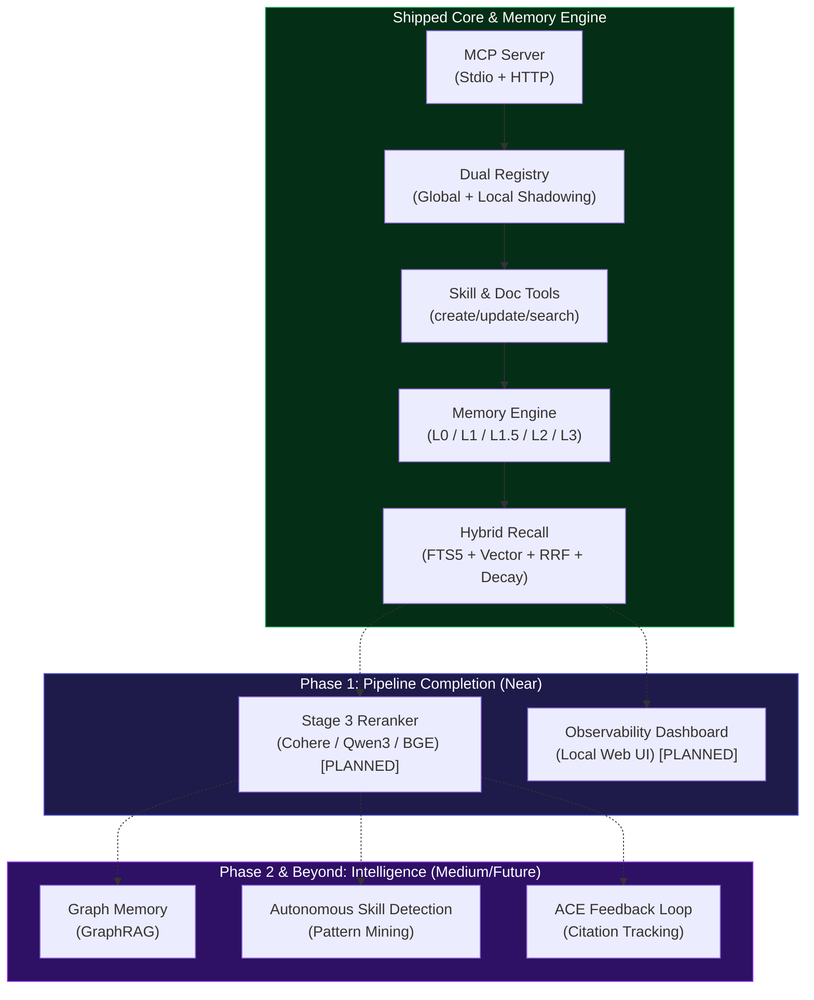

# ✅ BrainRouter — TODO

> Derived from `ROADMAP.md`. Updated: May 2026.
> Mark items `[x]` when shipped. Use `[/]` for in-progress.

---

## Shipped ✓

- [x] MCP Server — stdio transport
- [x] MCP Server — Streamable HTTP transport (`--http --port`)
- [x] Dual registry — global skills + local project overrides with automatic shadowing
- [x] 40+ global skills (agent, code, design, devops, testing, communication, memory)
- [x] Personas (code-reviewer, security-auditor, test-engineer)
- [x] References support
- [x] `list_skills` tool
- [x] `get_skill` tool (section-level: overview, workflow, checklist, etc.)
- [x] `search_skills` tool (fuzzy search)
- [x] `get_persona` tool
- [x] `get_reference` tool
- [x] `list_docs` tool
- [x] `get_doc` tool (section-level)
- [x] `create_skill` tool — scaffolds a canonical SKILL.md, local or global scope
- [x] `update_skill` tool — updates any section; handles global→local shadowing
- [x] `memory_capture_turn` tool
- [x] `memory_recall` tool
- [x] `memory_search` tool
- [x] `memory_contradictions` tool (list + resolve)
- [x] `memory_register_skill_hints` tool
- [x] `memory_resolve_session` tool
- [x] L0 Memory — raw conversation capture, FTS5 indexed, cursor-based (no duplicates)
- [x] L1 Memory — LLM extraction pipeline (persona, episodic, instruction, skill_context types)
- [x] L1.5 Contradiction Detection — conflict flagging, agent-visible warnings
- [x] L1 Deduplication — FTS-based dedup before writing, drops identical memories
- [x] **L2 Scene Narratives** — auto-triggered every 10 L1s; heat-scored; injected as `<scene-navigation>` in recall
- [x] **L3 Persona Synthesis** — cross-session distillation, auto-triggered every 50 L1s; injected as `<user-persona>` in recall
- [x] Memory decay scoring — per-type half-life model (instruction never fades, episodic 30d, persona 180d, skill_context 7d)
- [x] **Vector Embedding** — `EmbeddingService` with configurable endpoint/model/dimensions; background non-blocking; graceful FTS fallback
- [x] **Hybrid Recall (RRF)** — BM25 FTS5 + vector merged via Reciprocal Rank Fusion; 70% RRF / 30% decay blend; skill-tag boost ×1.2
- [x] Keyword recall — BM25 FTS5 + decay blending (FTS-only fallback mode)
- [x] Multi-tenant isolation — `user_id` on all tables, all queries scoped
- [x] 5-second recall timeout (agent never blocked)
- [x] `setup:mcp` script — generates tool config files for all major AI tools

---

## Phase 1 — Complete the Memory Pipeline
### Target: Near-term

- [x] **L2 Scene Narratives** *(fully implemented — `pipeline/l2-scene.ts`)*
  - [x] LLM reads new L1 memory batch — triggers every `BRAINROUTER_L2_TRIGGER_N` L1 extractions (default: 10)
  - [x] Decides: update existing scene / create new scene (upserts by scene name)
  - [x] Stores scenes with heat score (boosts by +30 on each distillation; decays each cycle)
  - [x] Scene summaries injected in `recall.ts` as `<scene-navigation>` block
  - [ ] Scene auto-merge when scene count exceeds threshold *(not yet built)*
  - [ ] Auto-trigger regeneration on major direction shift *(not yet built — currently only count-based)*

- [x] **L3 Persona Synthesis** *(fully implemented — `pipeline/l3-distiller.ts`)*
  - [x] Triggers every `BRAINROUTER_L3_TRIGGER_N` L1 extractions (default: 50)
  - [x] Reads all `persona` + `instruction` L1 memories cross-session
  - [x] Synthesizes via LLM with 90s timeout
  - [x] Persona injected in recall as `<user-persona>` block
  - [ ] 4-layer profile structure (Base Anchors, Interest Graph, etc.) *(depends on L3 prompt quality — check `prompts/l3-persona.ts`)*
  - [ ] Cache persona at prompt level as stable system context *(currently injected per-turn, not cached)*

- [x] **Hybrid Vector + Keyword Recall** *(fully implemented — `recall.ts`)*
  - [x] Stage 1: BM25 FTS5 keyword search → top 15 candidates
  - [x] Stage 1: Vector similarity search → top 15 candidates (when embedding enabled)
  - [x] Stage 2: RRF merge (formula: `Σ 1/(60 + rank)`) → combined scored list
  - [x] Decay scoring blended in: 70% RRF relevance + 30% half-life priority
  - [x] Skill-tag boost (×1.2 for memories matching active skill)
  - [x] Top 5 results injected as `<relevant-memories>` block
  - [x] Graceful fallback to FTS-only if embedding not configured
  - [ ] Stage 3 (Reranker) → not yet implemented

- [x] **Vector Embedding** *(implemented — `store/embedding.ts`)*
  - [x] `EmbeddingService` class with configurable endpoint, model, dimensions
  - [x] Defaults to `text-embedding-3-small` / OpenAI-compatible
  - [x] Graceful fallback — if no API key, falls back to FTS-only silently
  - [x] Background embedding after L1 capture (non-blocking `.then()/.catch()`)
  - [ ] `sqlite-vec` vector storage *(check whether `store.initVec()` and `upsertL1Vec()` are working in SQLite schema — `store/sqlite.ts`)*

- [ ] **Reranker support** *(not yet implemented)*
  - [ ] Configurable reranker endpoint
  - [ ] Default: disabled (RRF-only)
  - [ ] Opt-in: Cohere Rerank 4 / Voyage AI via API key
  - [ ] Opt-in: local Qwen3-Reranker (0.6B) or BGE v2-m3 via Ollama

- [ ] **Memory Observability Dashboard**
  - [ ] Local web UI at `http://localhost:3747/dashboard`
  - [ ] View all L1 memories grouped by type with current decay score
  - [ ] View scene chapters with heat scores
  - [ ] View L3 persona profile
  - [ ] One-click contradiction resolution
  - [ ] Capture/recall history timeline

---

## Phase 2 — Intelligence Upgrades
### Target: Medium-term

- [ ] **Graph Memory Layer (GraphRAG)**
  - [ ] Choose graph backend (SQLite adjacency tables for v1; FalkorDB or Neo4j for scale)
  - [ ] Define entity/relationship schema (`User → prefers → Technology`, `Decision → resulted in → Outcome`, etc.)
  - [ ] Build graph construction pipeline from L1 memories
  - [ ] Implement graph traversal for multi-hop queries
  - [ ] Hybrid recall: vector entry point → graph traversal

- [ ] **Temporal Validity Windows** (inspired by Zep/Graphiti)
  - [ ] Add `valid_from`, `valid_to`, `invalid_at` timestamps to L1 memories
  - [ ] When a new `instruction` memory supersedes an old one, mark old as `invalid_at` (not deleted)
  - [ ] Agent can query "what was the rule in March?" vs "what is the rule now?"
  - [ ] Integrate with L1.5 — contradiction becomes a temporal update, not a conflict flag

- [ ] **Skill Pre-warming**
  - [ ] Analyse `skill_context` memories for temporal patterns (e.g., always runs spec on Mondays)
  - [ ] Proactively inject matching skill's extraction hints before the agent asks
  - [ ] Configurable: opt-in per project

- [ ] **Model Routing (cost optimisation)**
  - [ ] Use cheap/fast model (Haiku, GPT-4o-mini) for L1 extraction
  - [ ] Use smarter model for L3 persona synthesis
  - [ ] Configurable: separate `extractionModel` and `synthesisModel` in config
  - [ ] Target: 60–80% reduction in LLM API cost for memory operations

- [ ] **Autonomous Skill Detection from Patterns** *(not `create_skill` — that's shipped)*
  - [ ] Background scheduler: scan `skill_context` memories for recurring N-step patterns
  - [ ] Threshold: same pattern detected 3+ times → surface proposal
  - [ ] Output proposal via MCP tool response (agent surfaces to user for approval)
  - [ ] On approval: call `create_skill` with the detected workflow automatically
  - [ ] On dismiss: suppress same proposal for configurable cooldown period

- [ ] **ACE Feedback Loop** (Agentic Context Engineering)
  - [ ] Track which recalled memories were actually referenced in agent responses
  - [ ] Up-rank frequently useful memories in decay scoring
  - [ ] Auto-archive memories never referenced after N recalls
  - [ ] Feed reference signals into autonomous skill detection

- [ ] **Autonomous Memory Management** (AgeMem/MemRL-inspired)
  - [ ] Track capture/recall telemetry (which sessions, which memory types, which skills active)
  - [ ] Adaptive L1 trigger: dense sessions → trigger earlier; sparse sessions → trigger later
  - [ ] Adaptive pruning: archive memories with consistently low recall scores
  - [ ] Privacy-first: all telemetry stays local

---

## Phase 3 — Team & Scale
### Target: Longer-term

- [ ] **Team / Shared Memory**
  - [ ] Add "team tenant" concept alongside personal tenant
  - [ ] Shared architectural decisions, conventions, institutional knowledge
  - [ ] Contribution approval flow (only designated contributors can write)
  - [ ] Every team member can read team memory during recall
  - [ ] Team memory injection priority below personal memory

- [ ] **Memory Export / Import / Portability**
  - [ ] Export: structured JSON/Markdown package (L1 memories + scenes + persona)
  - [ ] Human-readable and re-importable format
  - [ ] Import validation + schema versioning
  - [ ] CLI: `brainrouter export` / `brainrouter import`
  - [ ] Use case: new machine onboarding, team member onboarding, tool migration

- [ ] **Swarm Agent Support**
  - [ ] Safe concurrent L0 writes (multiple agents writing simultaneously)
  - [ ] Shared memory space for agent swarms via team tenant
  - [ ] Compatible with LangGraph, CrewAI, OpenAI Agents SDK, Google ADK via MCP

- [ ] **Cross-Session Memory Graph**
  - [ ] Compare new memories against memories from all other projects (not just current)
  - [ ] Create `linked_to` relationships between similar cross-project memories
  - [ ] Surface cross-project links as optional "related context from previous work"
  - [ ] UX: deduplicated, relevance-scored, non-noisy

- [ ] **MCP Server Card** (ecosystem discoverability)
  - [ ] Publish `.well-known/mcp.json` Server Card
  - [ ] Register in MCP public registry
  - [ ] Standardised capability advertisement

---

## Phase 4 — Ecosystem
### Target: Future

- [ ] **BrainRouter Hub (Skill Marketplace)**
  - [ ] Public skill registry (like npm for SKILL.md files)
  - [ ] `brainrouter publish` CLI command
  - [ ] `brainrouter install <skill-name>` CLI command
  - [ ] Version control + local override support
  - [ ] Auth, moderation, skill quality standards

- [ ] **Multimodal Memory**
  - [ ] Store and recall screenshots, diagrams, error logs with stack traces
  - [ ] Multimodal embedding models for image/doc indexing
  - [ ] New storage schema for binary assets
  - [ ] Recall: "remember this error screenshot" → surfaces on similar errors

- [ ] **Benchmark Evaluation Suite**
  - [ ] Run BrainRouter against **LoCoMo** (multi-session recall, temporal, adversarial)
  - [ ] Run against **LongMemEval** (preference recall, knowledge updates, temporal)
  - [ ] Run against **PersonaMem** (persona accuracy — does agent act like it knows you?)
  - [ ] Publish results publicly
  - [ ] Targets: beat TencentDB's 76% PersonaMem, beat Zep's 63.8% LongMemEval

- [ ] **Self-evolving Skill Generation** (full autonomous loop)
  - [ ] Detect pattern → propose skill → capture approval/rejection signal
  - [ ] RL policy update: adjust detection thresholds based on approval rate
  - [ ] Skill router policy: learn which skill to suggest given current memory state

---

## Documentation & Accuracy

- [x] `ROADMAP.md` — created with 4-phase plan and research landscape
- [x] `PRESENTATION.md` — 20-slide stakeholder deck with plain-English explanations
- [x] `README.md` — updated with memory architecture, decay model, tools table
- [x] `TODO.md` — this file
- [ ] `APPLIED_CONCEPT.md` — verify L2/L3 schema matches current implementation plan
- [ ] `BRAINROUTER.md` — sync with latest shipped features (add create_skill, update_skill, decay scoring)
- [ ] Add `CHANGELOG.md` — track what shipped in each milestone

---

## Nice-to-Have / Under Consideration

- [ ] `memory_export` MCP tool (single-tool export without CLI)
- [ ] `memory_import` MCP tool
- [ ] `memory_prune` MCP tool — manually archive low-relevance memories
- [ ] `memory_stats` MCP tool — returns counts by type, total size, oldest memory, etc.
- [ ] Session resume in L0 capture (MCP 2026 spec feature)
- [ ] Enterprise auth (SSO/Cross-App Access) for team deployments
- [ ] Interactive UI components via MCP (for dashboard integration)

---

*Synced from `ROADMAP.md`. For implementation details on any item, see the corresponding phase section in the roadmap.*
