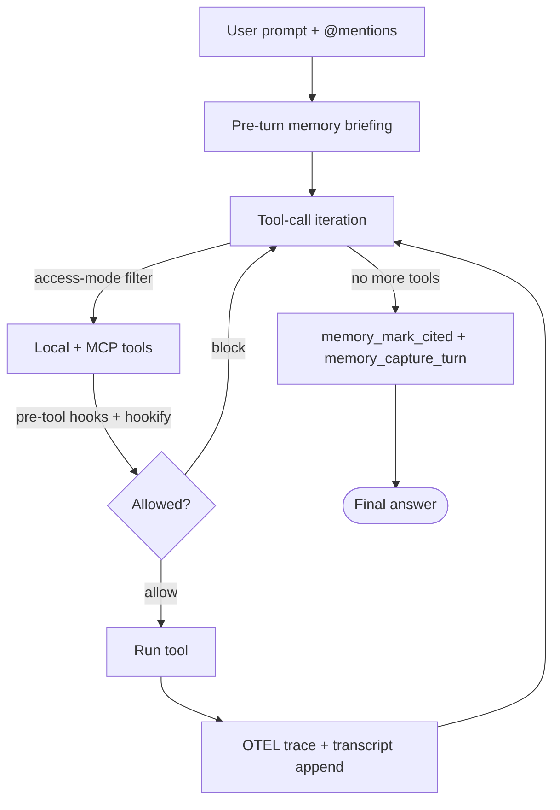

# Brainrouter CLI — Full Reference

A memory-native terminal agent at [`brainrouter-cli/`](../brainrouter-cli/).
Treats the BrainRouter MCP as a first-class tool — cognitive memory shapes
every turn instead of being a sidecar.

## Run

```bash
brainrouter                                    # interactive REPL (global install)
npm run cli                                    # interactive REPL (monorepo dev)
brainrouter run "summarize src/"               # one-shot, headless
brainrouter agents [--json]                    # list child sessions
```

Flags:

| Flag | Behavior |
| --- | --- |
| `--strict-mcp` | Exit immediately if the MCP server is unreachable. Default is to continue in **offline mode** (local tools only — no memory recall, skills, or capture). Banner surfaces `⚠️  OFFLINE MODE` when active. |
| `--quiet` | Suppress recall tables, briefing dumps, and tool-completion previews (model prose only). One-shot override; persist by calling `/quiet on` in-session. |
| `-w <path>` | Override the workspace root. |

The CLI auto-spawns the MCP server in stdio mode unless your config points
at an HTTP server. See [configuration.md → MCP client config](configuration.md#mcp-client-config).

---

## First-run wizard (0.3.7+)

If you launch `brainrouter` without a config (or after deleting
`~/.config/brainrouter/.onboarded`), the CLI drops you straight into
an in-terminal setup wizard — no separate `brainrouter login` /
`brainrouter config` subcommand needed.

The wizard walks 6 decision steps inside the Ink terminal UI:

```
welcome → theme → provider → API key → model → MCP → AGENT.md → done
```

- **theme** — `dark` / `light` / `mono`; the picker live-previews the
  prompt accent on cursor moves so you see the change before you
  commit.
- **provider** — `OpenAI / DeepSeek / OpenRouter / Anthropic (via
  gateway) / Gemini / LM Studio / Ollama`, plus an "Other" row that
  drops to free-text for any OpenAI-compatible endpoint. The picker
  pre-detects which row is most likely to "just work" from your
  shell's env vars (`OPENAI_API_KEY`, `DEEPSEEK_API_KEY`,
  `OPENROUTER_API_KEY`, `GEMINI_API_KEY`).
- **API key** — pre-filled from the relevant env var when present;
  press ENTER to accept, or edit in place. Validation is
  **warn-not-block**: unfamiliar prefixes save with a non-blocking
  advisory rather than being rejected, because every vendor invents
  new key shapes.
- **model** — curated per-provider short-list plus "Other" for a
  free-text override.
- **MCP** — `Local stdio` (spawn `brainrouter-mcp`) / `Local HTTP`
  (`http://localhost:3747/mcp`) / `Remote HTTP` (custom URL) /
  `Skip` (no MCP — local tools only). The wizard runs a single
  5-second reachability probe; failure offers "save anyway / try a
  different transport / skip" instead of bricking the run.
- **AGENT.md** — opt-in toggle to scaffold `AGENT.md` in your
  workspace root. Pre-checks for an existing `AGENT.md` /
  `CLAUDE.md` and defaults the toggle to "skip" when one is present.

`q` at any picker aborts cleanly — **nothing is written to disk
until the Done step commits**, so a half-finished wizard leaves no
partial state. Re-run any time with `/init`.

Writes land in two files:

- **`~/.config/brainrouter/config.json`** — LLM provider, model,
  endpoint, API key, MCP profiles, active profile.
- **`<workspace>/.brainrouter/cli/preferences.json`** — theme.

A marker file at **`~/.config/brainrouter/.onboarded`** tells the
CLI not to auto-trigger the wizard again. Delete it to force the
wizard on the next launch.

### `/init` from inside the REPL

Same wizard, same steps, but reuses the REPL's existing readline so
you don't have to exit first. Useful when you want to swap provider
mid-session or re-pick the MCP transport.

### `/config` settings home panel (0.3.7+)

Bare `/config` opens an arrow-key panel over every CLI knob with the
current value shown on the right:

```
⚙️  /config
  ▶ LLM provider       openai · gpt-4o-mini · ········cd34
    MCP profile        local-http · http · http://localhost:3747/mcp
    Theme              dark
    Statusline         mode,branch,workflow,goal
    Reasoning effort   medium (default)
    Execution mode     planning
    Review policy      request
    Quiet mode         off
    Personality        standard
    Editor mode        emacs
    View raw config
    Quit (Esc)
```

Selecting a row opens its sub-picker (provider picker, theme
picker, etc.). Esc backs out one level. The "View raw config" row
prints the scrubbed JSON dump (the pre-0.3.7 `/config` behaviour).

`/config` is also **verb-overloaded** so you can skip the panel for
one-shot tweaks:

- `/config theme` — print the current value.
- `/config theme dark` — set and persist.
- `/config statusline mode,branch,workflow,goal` — set the
  statusline layout.
- `/config raw` — dump the scrubbed JSON.

Valid keys: `theme`, `statusline`, `effort`, `mode`,
`review-policy`, `quiet`, `personality`, `editor`, `model`,
`provider`. Unknown keys point you back at the bare picker.

### `/login` — in-REPL MCP profile editor (0.3.7+)

The slash-command twin of `brainrouter login`. Picks a transport
(stdio / local-http / remote-http), prompts for the URL + optional
API key, runs the 5s reachability probe, and saves the profile.
Failure offers the same "save anyway / try another transport /
cancel" fallback as the wizard. The `brainrouter login`
sub-command still works for users who scripted it.

---

## Startup banner & shell chrome

The CLI opens with a boxed banner that summarizes the runtime in one block:

```
┌─────────────────────────────────────────────────┐
│ workspace   brainrouter (main)                  │
│ mcp         default · stdio · ✓ connected       │
│ brain       🟢 online                           │
│ workflow    spec-driven-skill (in-progress)     │
│ goal        active · 3 / unlimited              │
│ session     7f3a1e0c                            │
│ model       gpt-4o · access:read                │
└─────────────────────────────────────────────────┘
```

The **brain** row is distinct from `mcp` and appears only when the active
MCP profile is identified as BrainRouter (`mcpClient.getIdentity() ===
'brainrouter'`). It surfaces "the cloud brain is up" separately from a
generic MCP transport state so users with multiple MCPs configured can
tell `the BrainRouter cloud went down` from `a third-party MCP went
down`. States: `🟢 online`, `🔴 offline · cloud unreachable`. Third-
party MCPs skip the row to keep the box compact. Identity detection runs
in priority order: explicit `ServerConfig.identity` > name prefix
(`brainrouter*`, case-insensitive) > URL host (`*.brainrouter.cloud /
.dev / .io / .com / .app`) > stdio command basename (`brainrouter` /
`brainrouter-mcp`) > tool-signature fallback (`memory_recall` AND
`list_skills` both present in the first successful `listTools()`).

- **Session prefix** — the leading 8 chars of the per-process UUID
  `sessionKey`. Two concurrent CLIs in the same workspace get different
  prefixes, so you can tell them apart at a glance. (See
  [Goal state machine → Resume across sessions](#resume-across-sessions)
  for why the UUID matters.)
- **Theme** — colors come from `brainrouter-cli/src/cli/theme.ts`. Pick
  with `BRAINROUTER_THEME=dark|light|mono` or `/theme`. `auto` falls
  through to `dark`.
- **Quiet mode** — `--quiet` or `/quiet on` hides recall tables,
  briefing dumps, and tool-completion previews. Useful for screenshots
  and headless capture.
- **Idle-help hint** — if you sit idle at the REPL for 30s on a
  TTY, the CLI prints a one-time tip pointing at `?` / `/help` / `/where`.
- **`?` keystroke** — a bare `?` on its own line opens `/help`.

### Chat chrome (0.3.7+)

The chat REPL renders through one Ink tree — banner, composer,
scrollback, slash palette, and footer all diff together so terminal
resize redraws the whole frame cleanly. Glyph cheatsheet:

```
⏺  assistant turn (green) / tool call header (green=ok, red=failed)
⎿  tool result preview connector (first line; continuation lines
   plain-indent to align under the connector body)
❯  user prompt + composer caret
◉  access mode pill (green=read, accent=write, red=shell)
●/◐/○  effort glyph (high/medium/low)
↳  dim italic explanation under a plan checklist
```

Composer is framed by two horizontal rules; the footer status line
underneath shows `◉ access  ● effort  model · session · branch`
on the left and `? for shortcuts  ·  / for commands` on the right.
Both rows collapse progressively on narrow terminals (80 → 60 → 50 →
40 cols, then floor of just the access pill).

Typing `/` opens an inline slash command palette below the composer:
arrow-keys navigate, Tab autocompletes the highlighted row into the
buffer, Enter submits, Esc or backspace past `/` cancels. The palette
filters as you type (`startsWith` → `contains` → description match).

`/config`, `/login`, and `/init` render as overlays INSIDE the chat
tree — there's no second Ink mount fighting for stdin. The overlay
hides the composer while it owns keystrokes; closing it restores the
composer in place.

Spinner color warms from green to amber after 10s on a single turn
(claude-code's "still working" cue). Markdown in assistant prose is
rendered through marked + marked-terminal with code-fence unwrap and
per-line ANSI re-scope so multi-line blockquotes / lists keep their
styling across newlines. Set `/raw on` to bypass markdown rendering
and see the model's literal source.

### Statusline

`/statusline <segments>` configures a comma-separated subset of:

| Segment | Shows |
| --- | --- |
| `mode` | Current access mode (`read` / `write` / `shell`). |
| `exec` | Execution stance set by `/mode` (`fast` only — `planning` is hidden as the default). |
| `effort` | Reasoning depth set by `/effort` (`low` / `high` only — `medium` is hidden as the default). |
| `branch` | Git branch. |
| `dirty` | `*` when the working tree has uncommitted changes. |
| `pr` | GitHub PR number for the current branch (cached 30s). |
| `tokens` | Running session token meter. |
| `session` | Truncated sessionKey prefix. |
| `goal` | Goal status + iteration ratio (e.g. `goal:active 3/unlimited`). |
| `plan` | Plan completion ratio (e.g. `plan:2/5`). |
| `workflow` | Active workflow slug if any. |
| `brain` | BrainRouter MCP state — `brain:🔴` (offline) / `brain:🟡` (degraded, local-only fallback). Hidden when online; hidden entirely for third-party MCPs. Mirrors the `exec` + `effort` hide-when-default convention. |

Defaults are `mode,branch,pr,tokens,time,goal`. Implementation:
[`brainrouter-cli/src/cli/statusline.ts`](../brainrouter-cli/src/cli/statusline.ts).

---

## Agent loop



Each turn:

1. **Memory briefing** — recall + scenes + persona injected as a system message.
2. **Tool-call iteration** — bounded by `BRAINROUTER_MAX_TOOL_LOOPS` (default 60).
3. **Auto-compact** — when history grows past `BRAINROUTER_AUTO_COMPACT_TOKENS`.
4. **Capture** — cited record IDs are written back; the full turn is recorded for later extraction.

Tool calls open OTEL-style child spans under the turn's root span. Set
`BRAINROUTER_TRACE_LOG=path/to/trace.jsonl` to persist them.

---

## Access modes

| Mode | What it adds |
| --- | --- |
| **read** | `read_file`, `list_dir`, `grep_search`, `glob_files`, `fetch_url`, `web_search`, `update_plan`, `goal_complete`, `goal_blocked`, orchestration tools |
| **write** | All of `read` + `write_file`, `edit_file`, `apply_patch` |
| **shell** | All of `write` + `run_command` |

Cycle with **Shift+Tab**. Set explicitly with `/permissions read|write|shell`.

`run_command` is gated by a y/N confirmation prompt by default. The
session-wide `/mode` and `/review-policy` commands consolidate the
gating knobs into one mental model:

| Command | Default | What it changes |
| --- | --- | --- |
| `/mode planning` | ✅ | Every `run_command` routes through the y/N prompt. |
| `/mode fast` | | Safe commands auto-run; dangerous ones (`rm -rf`, `sudo`, `git push --force`, `dd`, `mkfs`, `kubectl delete`, `curl … \| sh`, …) **still** prompt. |
| `/review-policy request` | ✅ | At multi-file / workflow gates the agent surfaces the plan and waits for `/approve`. |
| `/review-policy proceed` | | The agent applies the plan and reports after; `/approve` still works as an explicit lever. |
| `/yolo on` | | One-line alias: flips both axes to `fast` + `proceed`. `/yolo off` restores the defaults. |

`/approve` is unchanged — it's the explicit "approve this specific
workflow now" gesture, independent of session policy.

Silent child agents refuse shell unless the session is in `fast` mode
(or the legacy `autoApproveShell` flag is set) — closes a
privilege-escalation path where a read-mode parent spawned a shell-mode
child. Dangerous commands in silent children are always denied because
there's nobody to answer the y/N.

### Reasoning depth — `/effort`

`/effort low|medium|high` is a session-wide knob for "how hard should
the model think." It's **orthogonal to `/mode`** — fast-execute +
deep-thinking is a legitimate combo.

| Level | System-prompt overlay | Provider `reasoning_effort` |
| --- | --- | --- |
| `low` | "Be terse. Skip ceremony. One-paragraph answers when the question fits in one paragraph." | `low` |
| `medium` (default) | _no overlay — current behaviour_ | _omitted_ |
| `high` | "Reason step-by-step before acting. Audit your evidence against the goal before each tool call." | `high` |

`medium` is the default and emits no overlay — upgrades are silent for
users who never touch the command. Bare `/effort` prints the current
level + source (`(env)` / `(preference)` / `(default)`) + a description
of each level + the list of provider/model combos the level forwards
to.

**Env override.** `BRAINROUTER_EFFORT=low|medium|high` beats the
persisted preference for the lifetime of the process. Matches the
precedence pattern from `BRAINROUTER_THEME` and `BRAINROUTER_QUIET`:
**env > preference > default**. Garbled values fall through to the
preference rather than crash. When env is shadowing a saved
preference, the in-session `/effort` write surfaces a yellow warning:
"preference saved but BRAINROUTER_EFFORT is still active this process —
env wins."

**Provider forwarding.** When the model name matches a known
reasoning-model family, the level is forwarded as `reasoning_effort` in
the `/v1/chat/completions` body (field name borrowed verbatim from
OpenAI's [`ReasoningEffort`](https://platform.openai.com/docs/api-reference/chat/create#chat_create-reasoning_effort)
enum, so cross-vendor familiarity beats inventing our own names).
Detection keys on the **model name**, not the endpoint hostname, so it
works uniformly across:

- **OpenAI** — `gpt-5*`, `o1`, `o3`, `o4`, dated variants
- **OpenAI open-weights** — `gpt-oss-20b`, `gpt-oss-120b` (via
  LM Studio 0.3.29+, llama.cpp, Ollama, …)
- **DeepSeek** — `deepseek-r1`, `deepseek-r2`, `deepseek-v3.1+`,
  `deepseek-v4`
- **Alibaba** — `qwen3*` reasoning variants
- **Mistral** — `magistral-small`, `magistral-medium`
- **Microsoft & others** — any model whose name contains `reasoning` or
  `thinking` (e.g. `phi-4-reasoning-plus`, `qwen3-30b-a3b-thinking`)

Vendor prefixes (`openai/gpt-oss-20b`) and tag suffixes
(`deepseek-r1:14b`) are normalised before matching. Non-reasoning
models (`gpt-4o-mini`, `qwen2.5-coder`, …) skip the field on every
server — sending it would be a no-op at best.

Anthropic native (`claude-*` on `/v1/messages`) is **not** covered —
it uses `thinking: { type: 'enabled', budget_tokens }`, a different
field shape on a different endpoint. Reaching it needs a separate
provider adapter (tracked for 0.4.x).

**Surfacing.**

- **Statusline** — opt-in `effort` segment shows `low` / `high`; hidden
  on `medium` (mirroring the `exec` segment from `/mode`). Add it with
  `/statusline mode,effort,…`.
- **`/where`** — Workspace block folds the level into the policy line:
  `exec X · review Y · effort Z`. Shown regardless of default. An
  `(env)` tag appears next to the level when the env var shadowed the
  preference.

Re-resolved at every loop iteration so an in-session `/effort` flip
applies to the next request without restart.

Implementation: preference + resolver in
[`brainrouter-cli/src/state/preferencesStore.ts`](../brainrouter-cli/src/state/preferencesStore.ts);
overlay in
[`brainrouter-cli/src/prompt/systemPrompt.ts`](../brainrouter-cli/src/prompt/systemPrompt.ts);
provider forwarding heuristic
(`supportsReasoningEffortField`) in
[`brainrouter-cli/src/agent/agent.ts`](../brainrouter-cli/src/agent/agent.ts).

---

## Local tools

| Tool | Purpose |
| --- | --- |
| `read_file` | Read a workspace file, optionally a line range. |
| `write_file` | Create or overwrite a file. |
| `edit_file` | Replace exactly one substring. |
| `apply_patch` | Multi-file `*** Begin Patch / *** Update File / @@ / - / + / *** End Patch` envelope. |
| `list_dir` | List a workspace directory. |
| `grep_search` | String/regex search across files. |
| `glob_files` | Find files by glob pattern. |
| `run_command` | Shell command (gated by confirmation + optional sandbox). Aliased as `bash` / `Bash` / `shell` / `sh` for Claude Code parity — all four route to the same gated implementation, so read-only mode can't sneak shell access. |
| `fetch_url` | HTTP GET; strips HTML tags; clamps at 15kB. |
| `web_search` | DuckDuckGo or `BRAINROUTER_WEB_SEARCH_ENDPOINT`. |
| `update_plan` | Create/update the durable task plan. |
| `goal_complete` | Mark the active `/goal` complete with proof. Hard-refuses while plan items are open. |
| `goal_blocked` | Mark the active `/goal` blocked with a reason + needed unblocker. |
| `ask_user_choice` | Pause mid-turn for a 2–4 option arrow-key picker with an always-on "Other" free-text fallback. Available in every access mode (interaction primitive — touches no files). Returns `{ answer }` (string or `string[]` in multi-select). Errors in non-TTY runs with `NoTTYError` and on cancellation with `CancelledChoiceError` so the agent can fall back to deciding itself. See [Mid-turn user prompts](#mid-turn-user-prompts) below. |

### Orchestration tools (also local)

| Tool | Purpose |
| --- | --- |
| `spawn_agent` | Spawn one child. |
| `spawn_agents` | Spawn a batch in one tool call. |
| `list_agents` | List active children. |
| `wait_agent` / `wait_agents` | Block until child(ren) finish. |
| `read_agent_transcript` | Read child transcript. |
| `close_agent` | Close a finished child. |
| `route_agent` | Dry-run role inference without spawning. |

### MCP tools (selected)

`memory_recall`, `memory_search`, `memory_graph_query`, `memory_file_history`,
`memory_explain_recall`, `memory_failed_attempts`, `memory_verify`,
`memory_working_context`, `memory_working_offload`, `memory_working_reset`,
`memory_task_state`, `memory_task_update`, `memory_contradictions`,
`memory_governance_*`, `memory_engineering_*`, `memory_consolidate`,
`memory_diagnostics`, `list_skills`, `search_skills`, `get_skill`,
`get_persona`, `get_reference`, `list_template_docs`, `get_template_doc`.

The CLI hides a few MCP tools from the LLM because the auto-pipeline owns
them (`memory_capture_turn`, `memory_mark_cited`, `memory_resolve_session`,
`memory_register_skill_hints`, `memory_hook_register`, `memory_hook_status`).

---

## Mid-turn user prompts

Two primitives let an agent pause mid-turn and ask the human a question
without leaving the terminal. They share the same readline bridge in
[`brainrouter-cli/src/cli/cliPrompt.ts`](../brainrouter-cli/src/cli/cliPrompt.ts)
— a single `activeReadline` handle published by the REPL and consumed
by every helper, so a turn-in-flight can stop the agent loop and
collect input without spawning a competing readline interface.

### `askYesNo` — binary confirmation (used internally)

Already wired into the existing approval gates: `run_command` before
shell execution, `/goal <text>` when an in-progress goal would be
overwritten, the dangerous-file warning in `write_file`. **The agent
does NOT call `askYesNo` directly** — it's owned by the CLI gates.
Listed here because it's the structural model the picker below mirrors.

Non-TTY returns the supplied default (no prompt fires). The model
sees the result through whatever tool was gated.

### `ask_user_choice` — multi-choice picker (call this directly)

Available to the agent as a local tool. Renders an arrow-key picker
with an always-on `Other` row that drops to a free-text input — the
user is never trapped between bad options.

```
[Storage]
Which database should backend tier use?

  ▶ Postgres         —  Mature, ACID, our team knows it
    SQLite           —  Zero ops, single-file, fine up to ~50 GB
    DynamoDB         —  AWS-native, auto-scales, learning curve
    Other            —  Type a free-form answer not listed above

↑/↓ navigate  ·  ENTER confirm  ·  q to cancel
```

| Behaviour | Detail |
| --- | --- |
| **Single-select (default)** | Cursor on row, `ENTER` finalises with that label as the answer string. |
| **Multi-select** (`multiSelect: true`) | `SPACE` toggles ☐ ↔ ☑ on rows; `ENTER` returns an array of selected labels in option order. Empty selection on `ENTER` is a no-op so the user doesn't silently commit `[]`. |
| **"Other" picked** | Drops to a free-text input phase. `Backspace` edits, `Esc` bails back to the picker, `ENTER` finalises with the typed string replacing the literal "Other" label. Empty `ENTER` is a no-op. |
| **Cancellation** | `q`, `Esc`, or `Ctrl+C` raises `CancelledChoiceError`. The tool wrapper surfaces this as a tool-call error so the agent can re-plan rather than guess. |
| **Non-TTY** (CI, piped, `brainrouter run`) | Raises `NoTTYError` instead of defaulting to option 1. The agent gets the error in its tool result and is expected to fall back to deciding itself, stating which option it picked and why. |
| **Validation** | Eager checks before any screen writes: 2–4 options required; duplicate labels rejected (case-insensitive); `"Other"` reserved (the synthetic free-text row owns it); each option needs both `label` and `description`. |
| **Access modes** | Always available — it's an interaction primitive, not a workspace mutation. Gated structurally by `activeReadline` + `process.stdin.isTTY`. |

The picker yields stdin while it's on screen by setting an
`isPickerActive()` flag the REPL's `shift+tab` access-mode handler
checks before firing, so the access-mode cycle can't interrupt
mid-prompt.

**Tool schema:**

```ts
ask_user_choice({
  question: string,              // ends with `?`
  header: string,                // ≤12 chars chip shown above the question
  options: Array<{               // 2–4 items, mutually exclusive
    label: string,               // 1–5 words
    description: string,         // one-line explanation
  }>,
  multiSelect?: boolean,         // default false
}) → { answer: string | string[] }
```

**When to call it.** The system prompt scopes this tightly: only when
there's genuine ambiguity that needs the user's judgment AND there are
2–4 mutually exclusive reasonable approaches. It's explicitly not a
substitute for `askYesNo`-style confirmations (already wired), not for
things the agent can decide itself with the available context, and not
a way to shift load-bearing decisions back to the user when the
spec / files already imply the right answer.

Implementation lives at
[`brainrouter-cli/src/cli/cliPrompt.ts`](../brainrouter-cli/src/cli/cliPrompt.ts)
(pure reducer + renderer + orchestrator). Tool registration + access
classification at [`brainrouter-cli/src/agent/agent.ts`](../brainrouter-cli/src/agent/agent.ts).

### Clarify before implementing — `/grill-me`

`ask_user_choice` is the picker; `/grill-me [--force] <task>` is the
user-initiated trigger that tells the agent to *use* it before
touching files. Typing `/grill-me add a /uptime slash command` latches
a `grill-me` activeSkill on the agent and refreshes the system prompt
with a six-line CLARIFY overlay:

> Do NOT make file edits, run shell commands, or spawn worker agents
> this turn. Ask 2–5 questions to disambiguate scope, format, and
> unstated assumptions. Prefer `ask_user_choice` for mutually-exclusive
> options; plain prose for free-form input. End with a one-paragraph
> "what I'll do once you answer" so the user can sanity-check the read.

The overlay is scoped to that single turn — the post-turn hook clears
`activeSkill` and refreshes the prompt again, so the next plain user
message runs without the edit ban.

**Skip-if-plan-exists guardrail.** If the current workflow already has
a `spec.md`, `/grill-me` refuses with:

```
Plan already exists at .brainrouter/workflows/<slug>/spec.md.
  Drop into it with `/workflow switch <slug>`, or use `/grill-me --force`
  to clarify additional details.
```

This stops `/grill-me` from re-litigating answers the user already gave
during the spec phase. `--force` is the explicit escape hatch when scope
has drifted enough to warrant a second clarifying pass.

**When to use which.**

| Tool / command | Who initiates | When |
| --- | --- | --- |
| `askYesNo` | CLI gates | Binary confirmation inside an existing flow (shell approval, `/goal` overwrite, dangerous-file warning). Agent never calls directly. |
| `ask_user_choice` | Agent | Mid-task, when the agent hit a genuine fork with 2–4 mutually-exclusive reasonable approaches. |
| `/grill-me` | User | Up-front, when the request is ambiguous on multiple axes (scope, format, dependencies) and you want a clarify pass before any edits. |

Implementation: command handler + skip guard at
[`brainrouter-cli/src/cli/commands/workflow.ts`](../brainrouter-cli/src/cli/commands/workflow.ts);
CLARIFY overlay in
[`brainrouter-cli/src/prompt/systemPrompt.ts`](../brainrouter-cli/src/prompt/systemPrompt.ts).

---

## Slash commands

`/help` paginates by category on small terminals or shows everything on
tall ones. `/help <category>` drills in.

### Session

| Command | Purpose |
| --- | --- |
| `/sessions` | List recent chat sessions. |
| `/resume [id]` | Re-attach to a session and replay its transcript. |
| `/new [title]` | Start a fresh session (fresh sessionKey + bucket). |
| `/side [title]` | Branch a side-conversation; main session restored on `/back`. |
| `/btw "<note>"` | Quick side-conversation that ends after one turn. |
| `/fork [title]` | Fork the current chat into a new sessionKey. |
| `/rename <title>` | Rename the current session. |
| `/clear` | Wipe in-memory history (transcript on disk untouched). |
| `/compact` | LLM-driven summary replaces verbose history. |
| `/quit`, `/exit` | Exit. |

### Memory

| Command | Purpose |
| --- | --- |
| `/memory` | Open memory inspector (recall, scenes, persona, contradictions). |
| `/recall <query>` | Run `memory_recall` manually, show results inline. |
| `/briefing` | Show the last memory briefing (records, sources). |
| `/scenes` | List active focus scenes + heat scores. |
| `/forget <recordId>` | Archive a record (manual prune). |
| `/handover` | Generate a handover summary for paste into another agent. |
| `/explain <recordId>` | Run `memory_explain_recall` — why did this rank where it did. |
| `/trace [on\|off\|status]` | Toggle OTEL trace logging at runtime. |
| `/failed` | Show recent failed-attempt records (`memory_failed_attempts`). |
| `/verify <recordId>` | Flag a record for re-verification. |
| `/audit` | Run a governance audit. |
| `/export <path>` | Export the memory store. |
| `/import <path>` | Import a memory snapshot. |
| `/persona` | Show the current CoreIdentity. |
| `/skill-hints` | List registered skill keyword triggers. |
| `/diagnostics` | Show MCP-side memory diagnostics. |
| `/working` | Inspect the working-memory canvas. |
| `/memories <command>` | Filesystem consolidation (`/memories consolidate`, `/memories list`, etc.). |

### Workflow

| Command | Purpose |
| --- | --- |
| `/goal <text>` | Set a sticky goal; CLI auto-continues until complete/blocked. See [Goal state machine](#goal-state-machine). |
| `/goal pause\|resume\|clear\|status` | Lifecycle subcommands. |
| `/goal budget <N>` | Iteration cap. |
| `/goal tokens <N>` | Token cap (0 to clear). |
| `/goal edit <field> <value>` | Unified update (text / status / budget / tokens). |
| `/continue` | Resume after a loop-limit abort or paused continuation. |
| `/plan` | Show the durable task plan. |
| `/skills` | List BrainRouter skills (workflow docs). |
| `/skill <name>` | Load a skill and execute its instructions. |
| `/tools` | List local + MCP tool inventory. |
| `/spec <title>` | Scaffold a spec workflow folder. |
| `/feature-dev <title>` | Full spec → tasks → implement workflow. |
| `/grill-me [--force] <task>` | Pause the agent for 2–5 clarifying questions before any file edit. See [Clarify before implementing](#clarify-before-implementing--grill-me). |
| `/review [target]` | Reviewer pass. |
| `/implement-plan` | Execute the current `tasks.md`. |
| `/approve` | Mark workflow complete; write `walkthrough.md`. |
| `/workflows` | List workflows in `.brainrouter/workflows/` with artifact markers. |
| `/workflow switch <slug>` | Pure navigation — bind this session to a workflow folder so future artifact writes land there. Doesn't touch goal state (goals are session-scoped, workflows are storage). |
| `/workflow pause` | Alias for `/goal pause` — pauses the session goal. |
| `/workflow resume <slug>` | `/workflow switch <slug>` + `/goal resume` if the session has a paused goal. |
| `/diff [--staged\|--all]` | Streaming `git diff --color=always`. |
| `/commit` | Compose a commit (uses the agent to draft a message). |
| `/loop <N> <command>` | Repeat a slash command N times (debug aid). |

### Orchestration

| Command | Purpose |
| --- | --- |
| `/roles` | List available agent roles. |
| `/agents [--json]` | List active children. |
| `/agent <id>` | Inspect one child. |
| `/spawn <role> <prompt>` | Spawn a child. |
| `/wait [id\|all] [--timeout=ms]` | Drain children. |
| `/kill <id>` | Force-close a child. |
| `/ps` | Running children snapshot. |
| `/stop` | Send stop signal to all running children. |
| `/auto-review` | Spawn a reviewer over current branch / changes. |

### Guard

| Command | Purpose |
| --- | --- |
| `/permissions [read\|write\|shell]` | Show / set access mode. |
| `/mode [planning\|fast]` | Session execution stance. `planning` (default) routes `run_command` through y/N; `fast` skips it for safe commands and still gates dangerous ones. |
| `/review-policy [request\|proceed]` | How the agent treats multi-file / workflow approval gates. `request` (default) surfaces the plan and waits for `/approve`; `proceed` applies and reports after. |
| `/yolo [on\|off]` | Alias for `/mode fast` + `/review-policy proceed`; flips both axes in one go. |
| `/hooks` | List shell lifecycle hooks. |
| `/hookify [list\|add\|remove\|enable\|disable]` | Manage markdown guardrail rules. |
| `/sandbox [on\|off\|status]` | Toggle `BRAINROUTER_SANDBOX` at runtime. |
| `/logout` | Clear cached API credentials. |

### Observability

| Command | Purpose |
| --- | --- |
| `/transcript [--full\|--tail=N]` | Show the JSONL transcript. |
| `/watch` | Live-tail the transcript as turns happen. |
| `/tokens` | Session / turn token usage + memory-savings counter. |
| `/feedback "<text>"` | Drop a feedback entry into `feedback.jsonl`. |
| `/rollout` | Show session bucket on disk (paths + sizes + mtimes). |
| `/debug-config` | Print resolved config (env, model, endpoint) for troubleshooting. |
| `/doctor` | Health snapshot: MCP latency, extraction status, errors, children, plan items, hookify rules. |

### UI / config

| Command | Purpose |
| --- | --- |
| `/help [category]` | Paginated help. A bare `?` keystroke is equivalent. |
| `/where` | One-screen orientation: workspace, workflow, goal, plan, recent recall, child agents — collapses what used to be four commands. |
| `/quiet [on\|off]` | Toggle quiet output (recall tables, briefing dumps, tool-completion previews suppressed). Persists in workspace preferences. |
| `/status` | One-line status: model / mode / branch / token meter / goal. |
| `/workspace` | Show / change workspace root. |
| `/config` | Show resolved config. |
| `/init` | Generate an `AGENT.md` for this workspace. |
| `/model [name]` | Show / switch chat model at runtime. |
| `/mcp [list\|reconnect\|tools]` | Manage MCP connections. `list` (default) shows every configured profile with identity tag (`brainrouter` / `third-party` / `unknown`), transport, online/offline/idle, and the URL or stdio command; `★` marks the active profile. `reconnect` closes the active wrapper and reconnects against the same profile (re-probes tools so identity refreshes). `tools` renders the namespace-grouped tool surface for the active MCP. See [MCP profiles, identity, and offline mode](#mcp-profiles-identity-and-offline-mode). |
| `/copy` | Copy the last assistant message to clipboard. |
| `/theme [auto\|light\|dark\|mono]` | Set color theme. |
| `/title <text>` | Set a custom terminal title. |
| `/personality [concise\|standard\|detailed\|pair-programmer]` | Communication overlay. |
| `/effort [low\|medium\|high]` | Reasoning depth: `low` = terse / `medium` = default / `high` = step-by-step. Forwards as `reasoning_effort` to providers that accept it. See [Reasoning depth — `/effort`](#reasoning-depth--effort). Env override: `BRAINROUTER_EFFORT`. |
| `/raw [on\|off]` | Toggle raw scrollback (skip markdown rendering). |
| `/vim` | Toggle vim keybindings for the REPL prompt. |
| `/keymap` | Show current keybinding overlay. |
| `/statusline mode,exec,effort,branch,pr,tokens,session,goal,plan,workflow,brain` | Comma-separated statusline segments. See [Statusline](#statusline). |
| `/mention` | Print the @file mention syntax help. |
| `/ide` | Detect / set IDE integration (VS Code, JetBrains). |
| `/apps`, `/plugins`, `/experimental` | Toggle gated feature surfaces. |

---

## `/compact` — context summarization

When history grows past `BRAINROUTER_AUTO_COMPACT_TOKENS` (default 80k),
the CLI asks the LLM for a structured summary:

```
# Goals
…
# Decisions made
…
# Files touched
…
# Open work
…
# Last user request
(verbatim)
```

Verbose history is then replaced with `[system, compactedSummary, lastUserMessage]`,
tagged so the next turn treats the summary as authoritative state.

Implementation: [`brainrouter-cli/src/prompt/compactor.ts`](../brainrouter-cli/src/prompt/compactor.ts).
Provider-agnostic — works against any OpenAI-compatible endpoint.

---

## Memory briefing

Each turn the CLI **may** open with an injected briefing built from:

- `memory_recall` against the user prompt.
- `memory_working_context` (active scenes + working canvas).
- `memory_task_state` (open task / handover state) — **skipped** when an
  active goal-anchor is present, since the anchor already carries the
  "what we're doing right now" context (0.3.6 item 9d).

The briefing block is tagged with an HTML comment marker
(`<!--brainrouter:memory-briefing-->`) so each turn replaces the prior
copy instead of stacking duplicates. Marker stripped before the payload
reaches the LLM. The CLI surfaces every memory tool call as a one-liner
(`🧠 Briefing`, `💾 Captured`, `📌 Reinforced`) so users see what was
consulted.

### Recall gating (`BRAINROUTER_RECALL_MODE`)

Pre-0.3.6 the briefing fired unconditionally — every turn paid 3–10K
tokens for a fresh recall pull even when the user message was `thanks` or
`/help`. The 0.3.6 item 9b gating logic skips the briefing unless one of
three triggers fires:

1. **First turn** of the session (no prior briefing exists yet).
2. **Post-compaction** — the next turn after `compactHistory()` runs, so
   the model isn't blind to what was load-bearing.
3. **Entity cue** — the user message contains ≥2 entity-shaped tokens.
   The cheap local heuristic (`countEntityTokens`) counts file paths
   (`src/foo.ts`, `lib/bar.js`), `camelCase` / `snake_case` /
   `PascalCase` identifiers (≥5 chars), and mid-sentence proper nouns
   (≥3 chars). Sentence-leading capitals are intentionally skipped.

When skipped, the prompt carries a one-line `## Memory available (gated
mode)` system-reminder so the model knows it can pull recall itself via
`memory_recall` / `memory_search` / `memory_file_history` whenever the
work needs prior context.

The mode is controlled by the `BRAINROUTER_RECALL_MODE` env var:

| Value | Behaviour |
| --- | --- |
| `gated` (**default**) | Tiered triggers above; emit lightweight hint when skipped. |
| `always` | Pre-0.3.6 behaviour — fire the full briefing every turn. Useful when you've measured better outcomes with always-on recall, or as a benchmarking baseline. |
| `off` | Skip the briefing entirely AND don't emit the hint. Cost-per-token measurement mode. |

Garbled values (`BRAINROUTER_RECALL_MODE=ludicrous`) fall through to
`gated` defensively rather than crashing. Resolved on every turn so an
in-session `export BRAINROUTER_RECALL_MODE=always` via `/run` applies on
the next prompt without restart.

Implementation:
[`brainrouter-cli/src/agent/agent.ts`](../brainrouter-cli/src/agent/agent.ts)
(`injectRecallContext`, `resolveRecallMode`, `countEntityTokens`).

---

## MCP profiles, identity, and offline mode

The CLI connects to one **active** MCP profile from `config.json` at
launch and treats it as the cognitive memory layer (recall, capture,
skills, working canvas). The 0.3.6 item 10 work added explicit
**identity tagging** so the CLI can distinguish the BrainRouter cloud
brain ("our MCP") from third-party MCPs the user might attach (GitHub,
filesystem, Slack, …) and surface that distinction across banner,
statusline, `/where`, and the system prompt itself.

### Identity detection

Every `ServerConfig` accepts an optional `identity?: 'brainrouter' |
'third-party'`. When absent, the wrapper auto-detects in priority order:

1. Server profile name starts with `brainrouter` (case-insensitive).
2. URL host matches `*.brainrouter.cloud` / `.dev` / `.io` / `.com` /
   `.app`.
3. Stdio command basename is `brainrouter` or `brainrouter-mcp`.
4. **Tool-signature fallback** — first successful `listTools()` contains
   both `memory_recall` AND `list_skills` (the BrainRouter signature
   pair).

Detection is cached on `McpClientWrapper` after the first list — exposed
via `getIdentity()`. Identity drives the banner / statusline / `/where`
brain row and the system prompt's brain-online vs brain-offline shape
(below).

### Offline mode

If the active MCP is unreachable at launch the CLI runs in **offline
mode**: `listTools()` returns `{ tools: [] }`, `callTool()` synthesizes
an `{ isError: true }` envelope, and the agent's existing try/catch
handlers route around the failure. The banner prints an OFFLINE MODE
warning beneath the box, and the system prompt swaps its memory section
for a brain-offline notice:

```
## ⚠️ BrainRouter MCP is OFFLINE this turn
- Long-term memory, skill lookup, and the recall briefing are unavailable.
- Do NOT call any BrainRouter memory or skill tools — they will fail
  with "MCP server is not connected". The turn-start tool list reflects
  this; only tools that appear there are callable.
- If the user asks about past sessions, prior decisions, or skill-based
  workflows, tell them the brain is offline and recommend `/mcp reconnect`.
- Operate against the workspace files directly using local tools
  (`read_file`, `glob_files`, `grep_search`, `run_command`).
```

The Agent refreshes `chatHistory[0]` whenever the connected tool
inventory shape changes (online ↔ offline) so the model sees the right
prompt on the very next turn without restart. `/mcp reconnect` is the
manual recovery path; the CLI does not auto-reconnect with backoff (yet
— tracked for 0.3.7).

### `/mcp` commands

| Subcommand | Purpose |
| --- | --- |
| `/mcp list` (bare `/mcp` aliases to this) | List every configured profile with identity tag, transport, online/offline/idle, and target URL or stdio command. ★ marks the active profile. |
| `/mcp reconnect` | Close the active wrapper and reconnect against the same profile. Re-probes tools so identity refreshes (relevant if the user just installed a new MCP exposing `memory_recall`). |
| `/mcp tools` | Render the namespace-grouped tool surface for the active MCP (preserves pre-0.3.6 bare-`/mcp` behaviour under a subcommand). |

### Local-only fallback (`BRAINROUTER_OFFLINE_LOCAL_RECALL`)

When the brain is offline the briefing has nothing to inject by default
— recall and skills are unavailable, so the next turn operates blind on
history. A planned opt-in path (0.3.7 / item 10d) will let users set
`BRAINROUTER_OFFLINE_LOCAL_RECALL=1` to fall back to a compressed view
of the last few transcript entries on disk. Tracked, not yet shipped.
When the flag eventually lands, the brain statusline segment will flip
to `brain:🟡` so the degraded mode is visible.

Implementation:
[`brainrouter-cli/src/runtime/mcpClient.ts`](../brainrouter-cli/src/runtime/mcpClient.ts) (identity detection),
[`brainrouter-cli/src/prompt/systemPrompt.ts`](../brainrouter-cli/src/prompt/systemPrompt.ts) (`connectedMcpTools` → brain-online vs brain-offline prompt),
[`brainrouter-cli/src/cli/commands/mcp.ts`](../brainrouter-cli/src/cli/commands/mcp.ts) (slash-command dispatcher).

---

## @file mentions

Type `@<path>` (or `@<glob>`) in your prompt to inline file contents:

```
brainrouter[shell]> please review @src/server.ts and @packages/**/*.md
```

The CLI:

1. Expands the mentions to absolute paths.
2. Reads and embeds each file inline at the top of the turn.
3. Prints `📎  Attached N files: @src/server.ts, @packages/**/*.md`.
4. Files over a budget threshold are auto-offloaded to working memory.

`/mention` shows the full syntax.

---

## Hookify — markdown guardrails

Drop `.md` files into `~/.brainrouter/workspaces/<encoded>/hooks/`:

```markdown
---
name: warn-debug-code
enabled: true
event: file
pattern: console\.log\(|debugger;
action: warn
---

🐛 Debug code detected — remember to remove before committing.
```

### Event taxonomy

| Tool | Hookify event | Fields exposed |
| --- | --- | --- |
| `run_command` | `bash` | `command` |
| `write_file` | `file` | `file_path`, `content`, `new_text` |
| `edit_file` | `file` | `file_path`, `old_text`, `new_text` |
| `apply_patch` | `file` | `new_text` |
| user prompt submit | `prompt` | `user_prompt` |
| agent stop | `stop` | `transcript` |

### Matching

- **`pattern: <regex>`** — single-field shortcut. Matches against the
  event's primary field (`command` for bash, `file_path`/`new_text` for
  file, etc.).
- **`conditions:`** — multi-field matchers. All must match (AND):

```markdown
---
name: block-sensitive-write
enabled: true
event: file
action: block
conditions:
  - field: file_path
    pattern: ^(secrets|credentials)/.*\.json$
  - field: new_text
    pattern: \"api_key\"|\"password\"
---

❌ Blocked — sensitive file write detected.
```

### Actions

- **`warn`** — appends the rule message to the tool summary in the REPL.
  Tool still runs.
- **`block`** — denies the call; the message is fed back to the model so
  it self-corrects.

Manage with `/hookify list|add|remove|enable|disable <name>`.

---

## Shell lifecycle hooks

Distinct from hookify — these are *shell scripts* the CLI runs at
lifecycle events (`pre-turn`, `post-turn`, `pre-tool`, `post-tool`).
Configured in `~/.brainrouter/workspaces/<encoded>/cli/hooks.json`:

```json
{
  "hooks": [
    {
      "id": "telemetry-post-tool",
      "event": "post-tool",
      "command": "/usr/local/bin/log-tool-call.sh",
      "enabled": true
    }
  ]
}
```

Env vars available to the child: `BRAINROUTER_HOOK_EVENT`,
`BRAINROUTER_HOOK_TOOL`, `BRAINROUTER_HOOK_PAYLOAD` (JSON). A non-zero
exit from a `pre-tool` hook blocks the tool call.

---

## Multi-agent orchestration

`spawn_agent` (one child) or `spawn_agents` (batch in one tool call)
dispatch to bounded roles.

### Roles

| Role | Access | Purpose |
| --- | --- | --- |
| **explorer** | read | Investigate code, surface key files and symbols |
| **architect** | read | Design alternatives + tradeoffs grounded in prior decisions |
| **reviewer** | read | Severity-ordered findings; cites prior reviews |
| **worker** | write | Implementation; must read before editing |
| **verifier** | shell | Run tests, typecheck, lint; reports blocker states |

Each role opens with a mandatory memory-first phase
(`memory_search` → `memory_graph_query` → file history) before doing
any work.

### Auto-router

When `role` is omitted from a `spawn_agents` entry, `inferRoleFromTask`
picks one from the leading verb / intent:

| Verb | Role |
| --- | --- |
| investigate / explore / map / find / inspect / audit / "where is" | `explorer` |
| design / propose / architect / plan / "tradeoff" / "spec" | `architect` |
| review / critique / evaluate / "code review" / "smell" | `reviewer` |
| test / verify / typecheck / "build passes" | `verifier` |
| _(default)_ | `worker` |

`route_agent({ task })` returns the inferred role + rationale without
spawning. Useful for sanity-checking a costly fan-out.

### Batch spawn

```ts
spawn_agents({
  agents: [
    { prompt: 'Investigate the auth middleware.', label: 'auth' },
    { prompt: 'Map the packages/types surface.', label: 'types' },
    { prompt: 'Design two search-filter options.', role: 'architect' }
  ]
})
// → { spawned: 3, agents: [{ id, role, access, status }, …] }

wait_agents({ ids: ['agent-...', 'agent-...', 'agent-...'], timeoutMs: 240000 })
```

### Child output handling

- Child outputs above ~6k chars auto-offload to the working-memory canvas
  (`memory_working_offload`). Parent inspects via
  `memory_working_context` instead of paying the context cost.
- Children are required to open with a `## Headline` block; the parent
  uses that section as the preview. Falls back to head+tail when missing.

### Headless multi-agent CLI

```bash
brainrouter agents --json
```

Lists active children from outside the REPL. Handy for tmux status bars.

---

## Workflow artifacts

Every multi-step request lands as files under
`.brainrouter/cli/workflows/<slug>/`:

```
spec.md              # what + why + boundaries
tasks.md             # ordered breakdown with status
walkthrough.md       # post-implementation summary
meta.json            # slug, started_at, status
```

Slash commands `/spec`, `/feature-dev`, `/review`, `/implement-plan`,
`/approve` scaffold these automatically.

`/workflows` lists existing folders; `/feature-dev <title>` runs the full
arc (spec → tasks → implement → review → approve).

---

## Personality overlays

`/personality <style>` injects a communication block into the system
prompt:

| Style | Behavior |
| --- | --- |
| `concise` | ≤ 2 sentences, no closing summaries when tool output is self-explanatory |
| `standard` | Default — no overlay |
| `detailed` | Walks through reasoning + post-task summary with file/line citations |
| `pair-programmer` | Narrates decisions, surfaces tradeoffs, invites redirection at forks |

Persists across restarts via `~/.brainrouter/workspaces/<encoded>/cli/preferences.json`.

---

## Goal state machine

`/goal <text>` sets a sticky outcome. The CLI auto-continues turns until
one of: `goal_complete(proof)`, `goal_blocked(reason)`, budget exhaustion,
anti-spin/repeat-loop tripwire, or manual `/goal pause`.

Each auto-continued turn injects a `goal-anchor` system message that
re-states the goal verbatim, so it stays in immediate context across long
loops even when the conversation drifts. The continuation prompt also
ships a "tool-call mechanics" reminder and a drift check.

Setting `/goal <new text>` while a goal is already in flight prompts for
y/N before overwriting — prevents accidental clobbering after a long
auto-loop.

### Lifecycle

| Status | Means |
| --- | --- |
| `active` | Continuation loop will fire after each turn |
| `paused` | User-initiated suspend (`/goal pause`) |
| `complete` | Outcome satisfied — loop halts permanently |
| `blocked` | Agent gave up — needs user input |
| `usage_limited` | Iteration or token budget exhausted; resumable after raise |

### Contracts

`goal_complete` is hard-refused if:

- The active plan (`update_plan`) still has `pending` or `in_progress` items.
- The same assistant message lacks user-visible prose. (Soft enforced — if
  the model skips prose, the CLI fallback surfaces the proof from
  `goal.json` so the user has something to read.)

`goal_blocked` is similar — the assistant must include user-visible
prose explaining what was tried and what the user needs to provide.

### Budgets

- **Iteration budget** (`/goal budget <N>`) — caps auto-continue turns.
  Default is **effectively unlimited** (`1_000_000`, rendered as
  `unlimited` in the banner / statusline). Anti-spin detection, the
  repeat-loop tripwire, and explicit `/goal pause` are the real safety
  nets; the numeric cap is there for users who want a hard ceiling.
- **Inline budget syntax** — write `budget: N iterations` (or
  `budget: N`) directly in the goal text. The CLI parses it out and
  applies the cap without a separate `/goal budget` call.
- **Token budget** (`/goal tokens <N>`) — caps cumulative
  prompt+completion tokens. Optional; `0` clears.

When the next turn would be the last within either cap, the CLI injects
a "wrap up gracefully" steering message so the model lands soft instead
of being cut off mid-thought. The steering is dropped if the user raises
the cap before the next tick.

### Plan recovery

`/plan clear` wipes stale plan items when an old plan is blocking
`goal_complete`. New goals also auto-reconcile stale plan items left
over from an earlier goal so the contract check doesn't trip on
leftovers.

### Resume across sessions

`/resume <session>` will surface a y/N prompt to resume the goal if the
loaded session has a paused / blocked / usage_limited goal. Prevents the
"loop silently stays paused" footgun.

### Session isolation

Each CLI process is its own session — the sessionKey is a fresh `randomUUID()`
at agent startup, not a workspace-derived string. Two concurrent CLIs in
the same workspace get distinct goal / plan / working-memory buckets;
recall is unaffected because the memory DB is userId-scoped, not
session-scoped. The startup banner prints the session prefix so you can
tell concurrent CLIs apart at a glance. Leftover legacy
`cli/goal.json` files (from pre-PR-#26 builds) are archived to
`cli/.brainrouter.migrated/legacy-goal-<ts>.json` on first session-scoped
goal write.

---

## Working-memory canvas

`memory_working_*` tools manage an active context canvas where large
child-agent outputs and analyses land. Each session has one canvas at
`~/.brainrouter/work/<user>/<workspace-hash>/<session>/`:

- `state.json` — current cursor + metadata.
- `steps.jsonl` — append-only log of canvas events.
- `canvas.mmd` — Mermaid diagram of the active context graph.
- `refs/` — referenced documents (e.g. offloaded child outputs).

Use cases:

- Parent agent fans out 5 explorers; each offloads 8kB of findings into
  `refs/`. Parent reads `memory_working_context()` once instead of pasting
  40kB back into its own context.
- Long-running goal accumulates a multi-file analysis the agent can
  re-read across iterations without paying the token cost each turn.

`/working` inspects the canvas. `memory_working_reset()` clears it.

### Reasoning capture (why-trail)

The canvas captures two distinct kinds of step:

| `kind` | Captures | When the agent emits it |
|---|---|---|
| `tool_output` (default) | What came back — payload, analysis, child summary | Any output over ~1,000 tokens (token-budget rule). |
| `reasoning` | **Why** the agent did what it did — the decision and its rationale | After every non-trivial tool batch (≥3 tool calls OR any single tool that returned >2KB). The system prompt steers the agent to call `memory_working_offload` with `kind: "reasoning"`, `title: "Why: <short>"`, and a 1-paragraph summary of the **decision**, not the tool results. |

The two rules are independent and can both fire on the same batch — payload offload is about token budget, reasoning offload is about the audit trail.

Reasoning nodes get a **distinct dashed border** in the Mermaid canvas (`stroke-dasharray:4 4`) so they're visually separable from `tool_output` and `compressed_summary` nodes when you inspect `canvas.mmd` directly or in the dashboard.

The next turn's briefing surfaces working memory in two blocks:

```
### Working memory canvas
Recent steps:
- [tool_output] Read recall.ts — 4 stages run in order.
- [tool_output] Read judge.ts — LLM-as-judge sits behind a flag.
- [reasoning] Why: keep kind free-form — avoids a breaking type change.

Recent reasoning (why-trail):
- [reasoning] Why: chose hybrid recall — indices were both warm.
```

- **`Recent steps:`** is the MCP's already-injected `recentSteps` tail (last 5–10 steps regardless of kind, in chronological order).
- **`Recent reasoning (why-trail):`** is up to the **3 most-recent reasoning steps** that have already fallen off the recent tail (dedup'd so a reasoning step still in the tail doesn't double-print).

The cap-at-3 on the why-trail is deliberate — without it, an agent that offloaded reasoning every batch would stuff the next turn's briefing with its own past commentary. The cap keeps the audit trail visible across many turns without runaway growth.

**Note on LLM compliance.** The system-prompt rule is **steering, not enforcement** — smaller / less-aligned models routinely skip explicit "after every batch, call tool X" instructions, and BrainRouter does not currently intercept assistant prose to auto-emit reasoning steps (that's deferred to v0.4.x). If you notice your agent isn't producing reasoning steps unprompted, you can always emit one manually via `memory_working_offload` or simply ask the agent to "call memory_working_offload with kind:'reasoning', title:'Why: …'" — the moment any reasoning step lands, the canvas style + briefing surface pay off.

---

## Filesystem memory consolidation

The MCP store is source of truth, but `/memories consolidate` writes a
human-readable view to `~/.brainrouter/workspaces/<encoded>/memories/`:

```
MEMORY.md              # one-line index
user.md                # role, expertise, goals
feedback.md            # do/avoid guidance the user validated
project.md             # in-flight deadlines, stakeholders, motivation
reference.md           # pointers to Linear / Grafana / GitHub
raw_memories.md        # unclassified records
rollout_summaries/     # one .md per session summary
```

Classification taxonomy: user / feedback / project / reference. Records
that don't classify land in `raw_memories.md` so nothing is lost.

Runs from the MCP tool `memory_consolidate` as well — any MCP-speaking
client can trigger it.

---

## Headless mode

```bash
node brainrouter-cli/dist/index.js run "summarize src/"
```

One-shot, non-interactive. Slash commands are rejected with exit code 2
(use the REPL).

```bash
brainrouter agents [--json]
```

Lists child sessions from outside the REPL — convenient for tmux-resurrect,
status bars, and external agent pickers.

---

## Storage

All CLI state lives under `~/.brainrouter/workspaces/<basename>-<sha8>/cli/`,
keyed inside that bucket by the per-process `sessionKey`. The memory
store is at `~/.brainrouter/memory.db`. Workflow artifacts are the only
committable files (they live inside the workspace at
`.brainrouter/workflows/`).

Notable subdirectories under `cli/`:

- `sessions/<encodedKey>/` — per-session `transcript.jsonl`, `goal.json`,
  `tasks.json`.
- `.brainrouter.migrated/` — archive of legacy workspace-level files
  (e.g. `legacy-goal-<ts>.json`) moved here on first session-scoped
  write. See [Session isolation](#session-isolation).
- `preferences.json` — theme, statusline, vim, personality, quiet mode.

`/tokens` and child-agent counters are scoped by
`parentSessionKey === agent.sessionKey`, so a fresh CLI no longer mixes
in counts from prior CLI processes in the same workspace. `/resume` and
`/fork` zero the in-process parent counters (`sessionUsage`,
`memoryMetrics`) since the persisted transcript doesn't record per-call
usage and the pre-switch counts belong to a different session.
`/rename` leaves counters alone — it's the same conversation, just
relabelled.

See [configuration.md → Storage layout](configuration.md#storage-layout)
for the complete tree.
