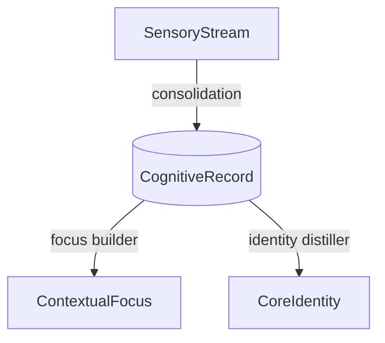
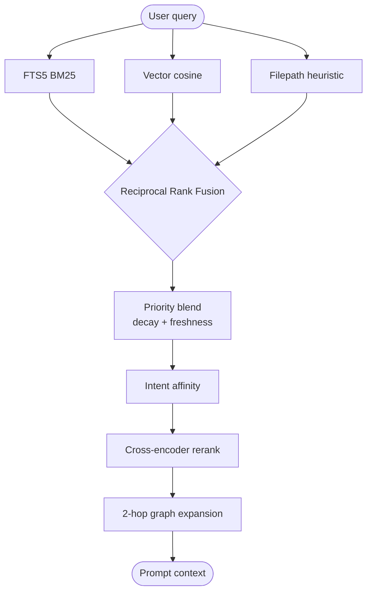

# Memory Engine

Concepts, formulas, and the retrieval pipeline.

## The 4-layer stack

| Layer | Biological analog | What it stores | Lifetime |
| --- | --- | --- | --- |
| **SensoryStream** | Sensory / echoic memory | Raw user + assistant messages | Transient — pruned after extraction |
| **CognitiveRecord** | Declarative (episodic + semantic) | Classified facts: decisions, preferences, code facts | Long-term, subject to decay + citation boost |
| **ContextualFocus** | Working memory | Heat-scored "scenes" grouping related records by task | Medium — evicted when heat cools |
| **CoreIdentity** | Core beliefs / identity schema | User profile + absolute instructions | Permanent — prepended to system prompts |



### SensoryStream

High-bandwidth dialogue buffer. Stores raw user/assistant messages
immediately and flags rows as processed once the cognitive extractor has
distilled them, so the same content doesn't get re-injected into prompts.

### CognitiveRecord

Each record carries a classification (`instruction`, `architecture_decision`,
`tool_preference`, `codebase_fact`, `task_state`, `skill_context`, etc.),
a priority (0–100), timestamps, and links into the knowledge graph.

### ContextualFocus

Records cluster into scenes when they share entities/topics. Each scene has
a heat score that decays when the scene is inactive. A drift detector
watches incoming records and triggers focus shifts when the task direction
changes — cooling the old scene, pre-warming the new one.

### CoreIdentity

A synthesized Markdown profile of the user (role, preferences, hard rules).
Bypasses vector search — it's directly prepended to system prompts so
identity stays stable across sessions.

## Forgetting curve

Records decay exponentially on a half-life that's specific to their type:

$$P_{\text{decayed}}(t) = P_{\text{original}} \cdot 2^{-t / \tau}$$

| Type | Half-life $\tau$ |
| --- | --- |
| `instruction` | ∞ (never decays) |
| `architecture_decision` / `security_policy` | 180 days |
| `codebase_fact` | 60 days |
| `task_state` | 14 days |
| `skill_context` | 7 days |

## ACE loop (citation feedback)

When the agent finishes a turn, the CLI auto-runs `memory_mark_cited` with
the records it actually used (detected by content match against the final
answer). Two effects:

**Boost cited:**

$$P_{\text{effective}} = P_{\text{decayed}} \cdot (1 + \min(0.05 \cdot N_{\text{cit}},\ 0.30))$$

**Prune uncited:** if a record is surfaced in recall but ignored 10+ times,
it gets archived. Keeps the index high-fidelity over time.

## Recall pipeline



Three System-1 retrievers run in parallel; RRF merges them. System 2 then
blends in the decayed priority, intent affinity, an optional cross-encoder
reranker, and a 2-hop graph walk for spreading activation.

### Reciprocal Rank Fusion

$$\text{Score}_{\text{RRF}}(m) = \sum_{s \in \text{streams}} \frac{1}{60 + \text{Rank}_s(m)}$$

### Final ranking blend

```
effectivePriority(r) = decayedPriority(r) * (1 + citationBoost) * freshnessBoost
finalScore(r)        = rrfScore(r) * 30 * 0.7
                     + (effectivePriority(r) / 100) * 0.3
                     * intentAffinity[type][intent]
                     * (1.2 if r.skill_tag == activeSkill)
```

| Knob | Behavior |
| --- | --- |
| **Time decay** | Type-specific half-life (see above). |
| **Citation boost** | +5% per cite, capped at +30%. |
| **Freshness boost** | 1.15× at age 0 → 1.0× at age 1 day. New captures surface immediately. |
| **Intent affinity** | `detectTaskIntent(query)` maps verbs (debug, fix, design) to per-type multipliers. |
| **Skill boost** | Score ×1.2 when `record.skill_tag` matches active skill. |
| **Neural sparks** | 2-hop spreading activation — records firing above threshold join the candidate pool. |
| **Reranker** | Cross-encoder (Cohere / vLLM `/v1/rerank`) replaces top-K ordering when configured. |

## Filters

`memory_recall` and `memory_search` accept an optional `filters` object:

```ts
filters: {
  types?: string[];          // ['instruction', 'feedback']
  scenes?: string[];          // ['Mobile App Build']
  capturedAfter?: string;     // ISO 8601
  capturedBefore?: string;    // ISO 8601
  minPriority?: number;       // 0–100
  skillTag?: string;
}
```

Filters constrain the candidate pool *before* ranking, so RRF computes
ranks within the relevant scope instead of skewing toward globally top
records.

## Contradictions

During consolidation, new facts are scanned against existing records.

- **Temporal update**: "Node version is 18" → "Node version is 20" → the old
  record is marked `supersededBy = newId` and its `invalidAt` is set.
- **Genuine conflict**: "Auth uses OAuth2" vs "Auth uses SAML" → logged in
  the contradictions table for manual arbitration.

## Skill pre-warming

Skills (e.g. `monorepo-migration`, `chrome-extensions`) have keyword
triggers. When a trigger fires, the skill's memetic potential spikes:

$$H_{\text{new}} = \min(H_{\text{max}},\ H_{\text{decayed}} + \Delta_{\text{spike}})$$

with $H_{\text{max}} = 4.0$, $\Delta_{\text{spike}} = 1.0$. Decay follows a
10-minute half-life. When $H \ge 0.3$ the system pre-warms the skill
context and injects its directives into the prompt.
