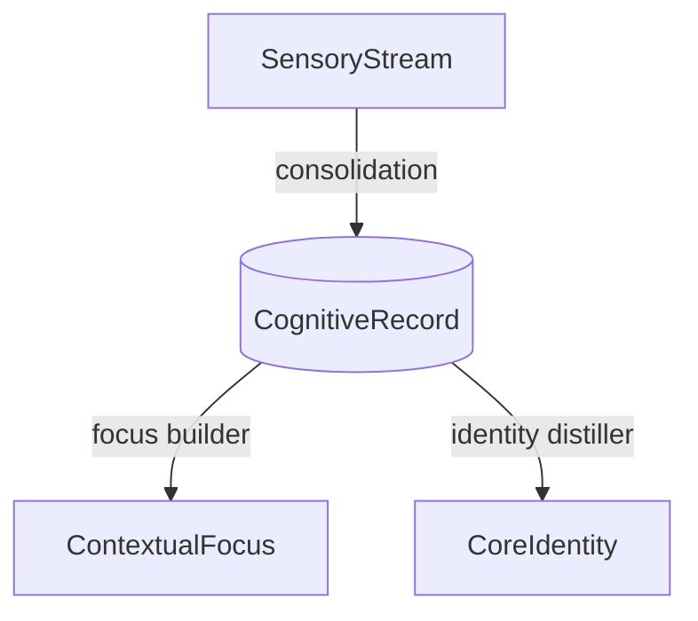
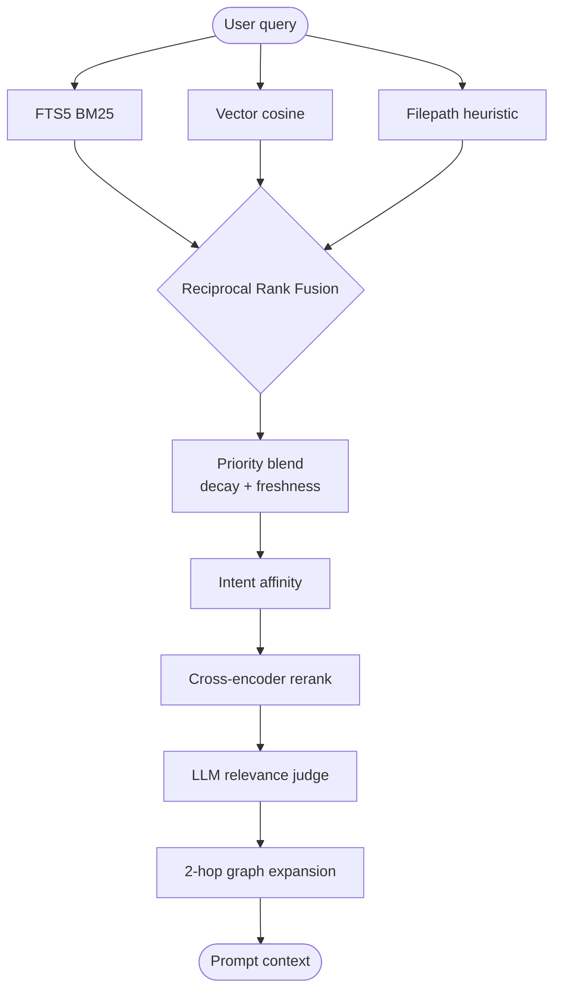

# Memory Engine

Concepts, formulas, and the retrieval pipeline.

## The 4-layer stack

| Layer | Biological analog | What it stores | Lifetime |
| --- | --- | --- | --- |
| **SensoryStream** | Sensory / echoic memory | Raw user + assistant messages | Transient — pruned after extraction |
| **CognitiveRecord** | Declarative (episodic + semantic) | Classified facts: decisions, preferences, code facts | Long-term, subject to decay + citation boost |
| **ContextualFocus** | Working memory | Heat-scored "scenes" grouping related records by task | Medium — evicted when heat cools |
| **CoreIdentity** | Core beliefs / identity schema | User profile + absolute instructions | Permanent — prepended to system prompts |



### SensoryStream

High-bandwidth dialogue buffer. Stores raw user/assistant messages
immediately and flags rows as processed once the cognitive extractor has
distilled them, so the same content doesn't get re-injected into prompts.

### CognitiveRecord

Each record carries a classification (`instruction`, `architecture_decision`,
`tool_preference`, `codebase_fact`, `task_state`, `skill_context`, etc.),
a priority (0–100), timestamps, and links into the knowledge graph.

### ContextualFocus

Records cluster into scenes when they share entities/topics. Each scene has
a heat score that decays when the scene is inactive. A drift detector
watches incoming records and triggers focus shifts when the task direction
changes — cooling the old scene, pre-warming the new one.

### CoreIdentity

A synthesized Markdown profile of the user (role, preferences, hard rules).
Bypasses vector search — it's directly prepended to system prompts so
identity stays stable across sessions.

## Forgetting curve

Records decay exponentially on a half-life that's specific to their type:

$$P_{\text{decayed}}(t) = P_{\text{original}} \cdot 2^{-t / \tau}$$

| Type | Half-life $\tau$ |
| --- | --- |
| `instruction` | ∞ (never decays) |
| `architecture_decision` / `security_policy` | 180 days |
| `codebase_fact` | 60 days |
| `task_state` | 14 days |
| `skill_context` | 7 days |

## ACE loop (citation feedback)

When the agent finishes a turn, the CLI auto-runs `memory_mark_cited` with
the records it actually used (detected by content match against the final
answer). Two effects:

**Boost cited:**

$$P_{\text{effective}} = P_{\text{decayed}} \cdot (1 + \min(0.05 \cdot N_{\text{cit}},\ 0.30))$$

**Prune uncited:** if a record is surfaced in recall but ignored 10+ times,
it gets archived. Keeps the index high-fidelity over time.

## Recall pipeline



Three System-1 retrievers run in parallel; RRF merges them. System 2 then
blends in the decayed priority, intent affinity, an optional cross-encoder
reranker, an optional LLM judge that drops candidates that aren't actually
relevant (the reranker only reorders), and a 2-hop graph walk for
spreading activation.

### Reciprocal Rank Fusion

$$\text{Score}_{\text{RRF}}(m) = \sum_{s \in \text{streams}} \frac{1}{60 + \text{Rank}_s(m)}$$

### Final ranking blend

```
effectivePriority(r) = decayedPriority(r) * (1 + citationBoost) * freshnessBoost
finalScore(r)        = rrfScore(r) * 30 * 0.7
                     + (effectivePriority(r) / 100) * 0.3
                     * intentAffinity[type][intent]
                     * (1.2 if r.skill_tag == activeSkill)
```

| Knob | Behavior |
| --- | --- |
| **Time decay** | Type-specific half-life (see above). |
| **Citation boost** | +5% per cite, capped at +30%. |
| **Freshness boost** | 1.15× at age 0 → 1.0× at age 1 day. New captures surface immediately. |
| **Intent affinity** | `detectTaskIntent(query)` maps verbs (debug, fix, design) to per-type multipliers. |
| **Skill boost** | Score ×1.2 when `record.skill_tag` matches active skill. |
| **Neural sparks** | 2-hop spreading activation — records firing above threshold join the candidate pool. |
| **Reranker** | Cross-encoder (Cohere / vLLM `/v1/rerank`) replaces top-K ordering when configured. |
| **Relevance judge** | LLM-as-judge stage that filters the reranked finalists. Each candidate gets a binary verdict + reason; rejects are dropped. Off by default — opt in with `BRAINROUTER_RELEVANCE_JUDGE_ENABLED=true`. Adds one LLM round-trip; on failure the reranker output passes through unchanged. Survives LM Studio's idle-model auto-unload by detecting the "model is unloaded" 400, waiting 1.5s, and retrying once (mirrors `ModelLLMRunner`). |

## Filters

`memory_recall` and `memory_search` accept an optional `filters` object:

```ts
filters: {
  types?: string[];          // ['instruction', 'feedback']
  scenes?: string[];          // ['Mobile App Build']
  capturedAfter?: string;     // ISO 8601
  capturedBefore?: string;    // ISO 8601
  minPriority?: number;       // 0–100
  skillTag?: string;
}
```

Filters constrain the candidate pool *before* ranking, so RRF computes
ranks within the relevant scope instead of skewing toward globally top
records.

## Extraction robustness

The cognitive extractor parses JSON emitted by the LLM. Two real-world
failures showed up frequently enough to warrant guard rails:

- **Bad JSON escapes survive.** `parseJsonWithEscapeRepair`
  ([`brainrouter/src/memory/pipeline/cognitive-extractor.ts`](../brainrouter/src/memory/pipeline/cognitive-extractor.ts))
  doubles any `\X` that isn't a legal JSON escape and retries the parse,
  so Windows paths (`C:\Users\…`), Unix path segments like `\bin` /
  `\target` / `\release`, LaTeX literals, and regex content survive
  intact. The repair branch only preserves `\"`, `\\`, `\/` as-is;
  everything else doubles. (Tradeoff: legitimate `\n` in repair-branch
  content becomes a literal two-char `\n`. Happy-path `\n` still becomes
  a newline.)
- **LM Studio model auto-unload.** Idle local models get unloaded;
  the first request after that comes back as
  `400 {"error":"Model is unloaded."}`. The extractor LLM runner and
  the relevance judge both detect this and retry once after 1.5s.

These two together mean a noisy upstream (idle local model, malformed
JSON escapes) no longer drops a whole extraction batch.

## Contradictions

During consolidation, new facts are scanned against existing records.

- **Temporal update**: "Node version is 18" → "Node version is 20" → the old
  record is marked `supersededBy = newId` and its `invalidAt` is set.
- **Genuine conflict**: "Auth uses OAuth2" vs "Auth uses SAML" → logged in
  the contradictions table for manual arbitration.

## Skill pre-warming

Skills (e.g. `monorepo-migration`, `chrome-extensions`) have keyword
triggers. When a trigger fires, the skill's memetic potential spikes:

$$H_{\text{new}} = \min(H_{\text{max}},\ H_{\text{decayed}} + \Delta_{\text{spike}})$$

with $H_{\text{max}} = 4.0$, $\Delta_{\text{spike}} = 1.0$. Decay follows a
10-minute half-life. When $H \ge 0.3$ the system pre-warms the skill
context and injects its directives into the prompt.

## Federation policy decisions (0.4.0)

These are the six open questions
the federation work surfaced. Documented here so they don't get
re-litigated each cycle; cross-link from
[`federation.md`](federation.md) when relevant.

### OQ-1 — Default memory scope: per-userId share, no per-memory opt-in

**Decision.** Memory is **shared by default across every host attached
under the same BrainRouter API key.** No per-record opt-in flag.

**Rationale.** The killer scenario (BrainRouter CLI captures a fact,
Claude Code recalls it 30 s later in another terminal) only works if
the share is implicit. Asking the user to mark each record "shareable"
turns the feature into a privacy choreography exercise. Users who want
isolation use a second API key — that's the policy boundary, not a
per-record flag.

**Constraint.** Cross-*userId* visibility stays off forever. The
`active_sessions` registry, the `session_inbox`, and the recall
pipeline all scope by `user_id`; nothing in 0.4.0 leaks across the
multi-tenant boundary.

### OQ-2 — Working memory across federated peers: per-session, not cross-readable

**Decision.** Working memory (the `.brainrouter/work/<userId>/...`
canvas, `memory_working_*` tools) is **per-session and private** to
the session that wrote it. A federated peer does NOT see another
session's working memory by default.

**Rationale.** Working memory is essentially scratch state — partial
plans, in-progress reasoning offloads, mermaid canvases mid-edit.
Cross-reading it would be louder than helpful (two CLIs hammering on
each other's half-written thoughts) and the existing
`memory_working_offload` / `memory_working_context` MCP tools already
scope by `sessionKey`.

**Escape hatch.** A peer that *wants* to read another session's
working memory can call `memory_working_context` with the explicit
target `sessionKey` — same MCP tool, scoped read. The default is just
"my session's view"; cross-reads are an explicit opt-in.

### OQ-3 — Auth model: per-user federation across many CLIs (not multi-tenant MCP)

**Decision.** The default auth model is **one user, many CLIs**. The
HTTP MCP server is single-tenant from the perspective of any given
API key; multi-tenancy is achieved by running multiple users with
distinct keys.

**Rationale.** Federation Stage 2's `active_sessions` table scopes
every row by `user_id`; the broadcast / inbox / heartbeat surfaces all
inherit that scope. This shape composes cleanly with the cloud
deployment model: each tenant gets their own brain instance, and
within that brain the federation surface is fully shared. Trying to
serve multiple tenants from one process would force per-row
authentication on every query — a larger surface than 0.4.0 should
carry.

**Future.** A multi-tenant MCP variant (one process, many tenants,
fine-grained ACLs) is intentionally deferred. When it ships it'll
ride the existing `user_id` foreign keys, not a new schema.

### OQ-4 — Conflict resolution on simultaneous writes: last-write-wins via `updatedTime`

**Decision.** When two federated CLIs write to the same record
nearly simultaneously, **the later `updatedTime` wins**. No
locking, no merge attempt, no CRDT machinery.

**Rationale.** Memory records are append-mostly. Updates are rare,
and the dominant update pattern is "mark superseded" (one record
replacing another) rather than "edit in place". For the few in-place
update paths (`memory_update`, `memory_evidence_add`), the
last-write-wins semantics match SQLite's natural ordering and don't
require any client-side coordination.

**Cost.** The losing write's content is lost. We accept this for
0.4.0 — the cost of building a real merge layer (CRDTs, vector
clocks, manual conflict resolution UI) is much higher than the
expected frequency of conflicts. The `operation_log` keeps an audit
trail so a clobbered update is recoverable manually.

**Future.** A Phase-5 memory-blackboard pipeline naturally tames
this — concurrent writes both land as `kind=candidate_record`
items on the blackboard and the dedup / contradiction agents
arbitrate before either commits. See
[`brain-agents.md`](brain-agents.md).

### OQ-5 — Heartbeat cost confirmed: zero `operation_log` writes

**Decision.** `session_heartbeat` and `session_inbox` heartbeat-like
operations **do not write to `operation_log`.** The audit table only
captures cognitive writes + governance actions.

**Rationale.** 30 s × N peers × 24 h = 2,880 N rows/day just for
"I'm still here" pings. With N=5 federated CLIs that's 14k rows/day
of pure noise; over a month the audit table grows by 400k rows that
carry zero forensic value. The active-session sweeper handles
absence detection; explicit audit rows would be redundant.

**Asserted by test.** The brain integration suite includes
`active-sessions.node-test.ts → "heartbeat does NOT write to
memory_operations (audit volume guard)"` — 10 heartbeats fired
against a fresh database leave the operation_log row count unchanged.

### OQ-6 — Stdio transport: best-experienced over HTTP MCP, but supported

**Decision.** Federation **works over both stdio and HTTP MCP
transports.** HTTP is the recommended path; stdio works with two
caveats.

**Caveats for stdio:**

1. **No live-watch latency benefit.** `/agents --remote --watch`
   polls every 2 s on stdio (no SSE — that's HTTP-only). Same UX,
   slightly higher floor on heartbeat-to-render latency.
2. **One peer per stdio process.** Each stdio MCP child is a single
   user, single brain instance — you can't multiplex stdio sessions
   the way you can with the HTTP server. Two terminals using stdio
   each spawn their own brain child.

**Rationale.** HTTP is the natural transport for federation (one
brain process, N clients), but stdio is the right default for
embedded / sandboxed use cases (Claude Code, single-shot
`brainrouter run`). The federation surface is identical on both;
only the connection-fan-out story differs.
