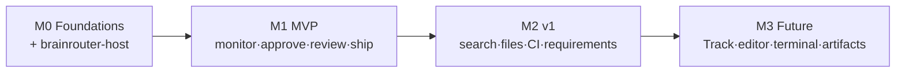

# Mobile App Roadmap — BrainRouter

> Phased delivery plan grouping features into milestones with rationale. Grounded in [investigation-summary.md](investigation-summary.md); scope follows the **MVP-first, parity-over-time** decision. Feature **parity** with desktop is the destination; flow/UI parity is not (mobile conventions win).

---

## Guiding principles

1. **Remote-first.** The agent runtime is remote (technical-doc §1). Nothing ships until the **`brainrouter-host`** server exists — it's the critical path for every feature.
2. **Lead with the loop that only mobile can do well.** The phone's unique value is **monitor + approve from anywhere** (push notifications). MVP centers there.
3. **Defer the desktop-bound heavy surfaces** (Monaco editor, terminal, worktrees, Track DnD) — they're the worst phone fit and the least urgent on the go.
4. **Reuse, don't rewrite.** Every milestone maximizes use of the verbatim-portable `domain/**` logic; new work is UI + transport.

---

## Milestone 0 — Foundations (engineering pre-req, no user-facing release)

The skeleton everything else builds on.

| Item | Why first |
|---|---|
| **`brainrouter-host` server** (WS/SSE wrapping `createHostCore`) | critical path — the app is inert without it |
| `BrainRouterTransport` + `RemoteTransport` (WS, reconnect, `seq` resync) + `MockTransport` | the seam all screens depend on |
| `Storage` adapter (MMKV + SecureStore) | prefs/credentials |
| Theme system (`tokens.ts` + ThemeProvider) | every screen needs it |
| Ported `domain/**` + their unit tests (verbatim) | de-risks reuse early; tests prove portability |
| Navigation shell (tabs + stacks) | scaffolding |

**Exit:** a `MockTransport`-backed app boots, themed, with the navigation shell and green domain tests.

---

## Milestone 1 — MVP · "Remote control for your coding agent"

**Goal:** a Dev can pair with a host and run the full **monitor → steer → approve → review** loop from a phone. **Stories:** US-01…US-29. **Workflows:** WF-1…WF-7.

### Epics
1. **Connect & sessions** — pairing (S-01), connection state (S-15), projects/sessions list (S-02), session management (S-24), workspace switch + trust (S-18/S-19). *US-01–07, US-29.*
2. **The core chat loop** — Session screen (S-03): streaming transcript, tool cards, composer + pickers (S-04), slash commands, attachments, goals, interrupt. *US-08–10, US-14–17.*
3. **Approvals & plan** — Approval/Question sheet (S-05) + **push notifications** + biometric gate, Plan review (S-06). *US-11–13, US-25.* ← **the headline mobile capability**
4. **Review & ship** — Changes/diff (S-07), commit/push + gate (S-13), Review inbox + finding triage (S-11/S-12). *US-18–21.*
5. **Monitoring** — Activity dashboard (S-10), task/workflow transcript (S-09), stop tasks. *US-22–24.*
6. **Context & settings** — context usage (S-23), models/providers (S-16), appearance (S-17), settings home (S-14). *US-26–28.*

### Rationale
This is the **minimum that's genuinely useful and uniquely mobile**: you can leave your desk and still keep agents moving (approvals via push), catch regressions (review), and ship (commit/push). It deliberately excludes editing/terminal because those are the *worst* phone experiences and the *least* needed away from a desk — yet it preserves **feature parity for the supervisory loop**, which is the desktop's actual day-to-day use for a running agent.

### Exit criteria
- UF-03 (core loop incl. approval) and UF-06 (commit with gate) pass e2e against a real host.
- Push approval works backgrounded (UF-12).
- Reconnect replays missed events without gaps (WF-7).
- All MVP screens have empty/loading/error/populated states.

---

## Milestone 2 — v1 · "Inspect & search"

**Goal:** add read-depth and the next-most-wanted surfaces. **Stories:** US-30…US-33.

| Feature | Screen | Rationale |
|---|---|---|
| Session search | S-22 | finding earlier context is common; logic already mobile-friendly |
| Read-only file browser + viewer | S-20, S-21 | inspect code on the go without Monaco; high value, low risk |
| CI / PR status | S-25 | "is the build green?" is a classic phone check |
| Requirements management | S-26 | lightweight planning; pure record CRUD |
| Branch checkout (composer) | S-04 | completes the git-context picker (read → write) |
| Detox e2e | — | lock in the core loop before surface area grows |

**Rationale:** these are **read-or-light-write** surfaces that fit a phone well and reuse existing pure view-models — high parity gain per unit of effort, no new desktop-only tech.

**Exit:** files/CI/search/requirements usable; e2e covers UF-03/UF-06/UF-07.

---

## Milestone 3 — Future · "Full parity surfaces"

The heavy or lower-frequency surfaces, each needing genuine mobile redesign or new tech.

| Feature | Screen | Why later |
|---|---|---|
| Annotations | S-27 | authoring UX; lower mobile frequency |
| Artifacts (sandboxed preview) | S-28 | needs WebView preview of HTML/SVG |
| Schedules | S-29 | infrequent on mobile |
| Worktrees | S-30 | desktop git concept; rare on phone |
| Track board / sprints / members | S-31 | needs tap-to-move redesign (no DnD); large surface |
| In-app code editor | S-32 | Monaco replacement (RN/WebView CodeMirror) is significant |
| Terminal | S-33 | remote-shell view; or omit permanently |

**Rationale:** each is either a large redesign (Track, editor), needs new rendering tech (artifacts WebView, terminal), or is low-frequency on mobile (worktrees, schedules). Sequencing them last maximizes early value and keeps risk contained. Several may be re-scoped or dropped based on MVP/v1 usage.

---

## Critical-path & sequencing summary

- **Hard dependency:** M0's `brainrouter-host` blocks everything. Build and harden it first (auth, reconnect/replay, per-workspace pool).
- **Parallelizable within M1:** epics 1–6 share the transport + domain layers but are otherwise independent screens — good for parallel implementation once M0 lands.
- **Parity tracking:** the desktop's 18 panels map to S-07/08/09/10/11/12/20/21/22/23/25/26/27/28/29/30/31/32/33 across M1–M3; the CHANGELOG records each as it lands.

---

## Out-of-scope (explicit)
- Running the agent runtime on-device (architecturally impossible — investigation §0).
- Editing files with a full desktop-class editor on a phone (deferred; read-only first).
- Replacing the desktop app — mobile is a **companion**, not a replacement.
