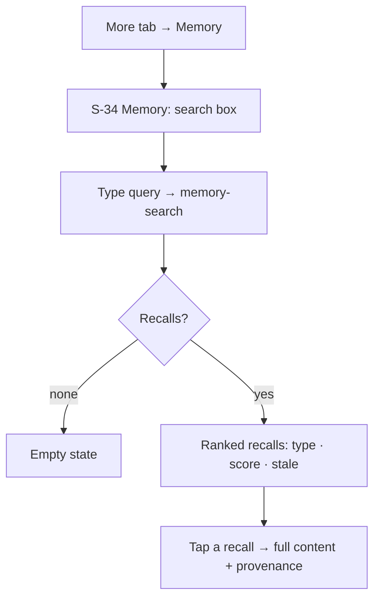

# Mobile Memory Search (S-34) Implementation Plan

> **For agentic workers:** REQUIRED SUB-SKILL: Use superpowers:subagent-driven-development (recommended) or superpowers:executing-plans to implement this plan task-by-task. Steps use checkbox (`- [ ]`) syntax for tracking.

**Goal:** Add a **Memory** tool to the BrainRouter mobile app that searches the brain memory engine and lists recalled memories — porting the desktop `MemoryPanel.tsx` (#668) as a new phone-native screen S-34.

**Architecture:** Prototype-first, then a thin RN screen over a pure, unit-tested domain view-model. The screen calls `transport.query('memory-search', { q })` and renders `RecalledMemory[]` shaped by `src/domain/view/memoryView.ts`. All display logic (sort, score%, type label, stale flag, snippet, counts) lives in the pure view-model so it is testable on mock data with `node:test` (run by `npm run test:domain`). The screen is registered in the existing **More** tab stack, exactly like the other tool screens.

**Tech Stack:** Expo 54 / React Native 0.81 / React 19, React Navigation v7, TypeScript (NodeNext), `@kinqs/brainrouter-types` (`RecalledMemory`), `node:test` + `tsx` for domain tests, Lucide icons (`../components/Icon`), the DESK-4k SVG sprite for the standalone HTML prototype.

## Global Constraints

- Prototype HTML: colors ONLY via `global.css` CSS variables; icons ONLY from the embedded DESK-4k sprite via `<svg class="ic sN"><use href="#i-…"/></svg>`; body background `#050506`; `<style>` base rules + sprite + `<script>` byte-identical to `flow-UF-15.html`. (See `mobile-prototype-authoring` memory.)
- RN code: colors ONLY via `useTheme().colors.*`; icons ONLY via `<Icon name="…"/>` with a name present in `src/components/Icon.tsx`; fonts via `../theme/fonts` (`MONO`).
- Domain layer (`src/domain/**`) is pure and RN-free: no React, no imports from `react-native`, no host calls. Import types from `@kinqs/brainrouter-types`. Cross-module imports use the `.js` extension (NodeNext), e.g. `from './memoryView.js'`.
- Every new pure function has a `node:test` test using a typed mock factory. `npm run test:domain` must stay green (currently 225 tests) and `npm run typecheck` must exit 0.
- Frequent commits: one commit per task.

---

### Task 1: Memory-search prototype (UF-22) + docs + gallery

**Files:**
- Create: `brainrouter-mobile/prototypes/flow-UF-22.html`
- Modify: `brainrouter-mobile/prototypes/index.html` (add UF-22 flow card)
- Modify: `brainrouter-mobile/docs/user-stories.md` (add US-41)
- Modify: `brainrouter-mobile/docs/user-flows.md` (add UF-22 + matrix row)

**Interfaces:**
- Produces: the visual contract the RN screen (Task 3) must match — search bar, ranked result cards (type badge · score% · stale flag · snippet), result detail.

- [ ] **Step 1: Copy the canonical template**

```bash
cd brainrouter-mobile/prototypes
cp flow-UF-15.html flow-UF-22.html
```

- [ ] **Step 2: Change the `<title>`, the `Surface:` comment, and the `.hd` header**

Replace `<title>…</title>` with:
```html
<title>UF-22 · Search your memory · BrainRouter Mobile</title>
```
Replace the `  Surface:` comment line with:
```html
  Surface: S-34 Memory (MemoryPanel.tsx → memory-search). Covers US-41. Milestone: parity (desktop #668).
```
Replace the `<div class="hd">…</div>` block with:
```html
  <div class="hd">
    <span class="tag">UF-22 · parity</span>
    <h1>Search your memory</h1>
    <p>Open Memory from the More tab, search the brain engine, scan ranked recalls (type · score · stale), and open one for the full record. Tap the highlighted control to advance. Covers US-41 · <a href="index.html">← all prototypes</a></p>
  </div>
```

- [ ] **Step 3: Append memory-specific CSS before `</style>`**

Insert immediately before the closing `</style>`:
```css
  /* memory: score chip + type badge + stale flag */
  .mtype{font-family:var(--mono);font-size:10px;font-weight:500;letter-spacing:.3px;color:var(--text-2);border:1px solid var(--border-strong);border-radius:4px;padding:1px 6px}
  .mscore{margin-left:auto;font-family:var(--mono);font-size:11px;font-weight:600;color:var(--accent);font-variant-numeric:tabular-nums}
  .mstale{font-family:var(--mono);font-size:9px;font-weight:500;color:var(--warn);border:1px solid var(--warn);border-radius:4px;padding:1px 5px}
  .mrow{flex-direction:column;align-items:stretch;gap:6px}
  .mrow .mh{display:flex;align-items:center;gap:7px}
  .mrow .mc{font-size:12.5px;color:var(--text);line-height:1.5;white-space:normal}
  .mrow .mm{font-family:var(--mono);font-size:10.5px;color:var(--muted)}
```

- [ ] **Step 4: Replace the frames (everything between `<div class="screen">` and `</div><!--/screen-->`)**

```html
      <!-- FRAME 1: More tab → Memory -->
      <div class="frame active" data-cap="<b class='step'>1.</b> The More tab hubs the tools. Tap <b>Memory</b> to search the brain engine.">
        <div class="topbar">
          <span class="back"><svg class="ic s20"><use href="#i-arrow-left"/></svg></span>
          <div class="t"><b>More</b><span>tools &amp; records</span></div>
          <span class="ibtn"><svg class="ic s18"><use href="#i-dots"/></svg></span>
        </div>
        <div class="body">
          <div class="tool" data-next style="border-color:var(--accent)"><svg class="ic s20" style="color:var(--accent)"><use href="#i-brain"/></svg>
            <div class="m"><div class="nm">Memory</div><div class="su">search the brain engine</div></div>
            <svg class="ic s18" style="color:var(--accent)"><use href="#i-chev-right"/></svg></div>
          <div class="tool"><svg class="ic s20"><use href="#i-plan"/></svg><div class="m"><div class="nm">Requirements</div><div class="su">structured intent</div></div><svg class="ic s18" style="color:var(--muted)"><use href="#i-chev-right"/></svg></div>
          <div class="tool"><svg class="ic s20"><use href="#i-bubble"/></svg><div class="m"><div class="nm">Annotations</div><div class="su">review notes</div></div><svg class="ic s18" style="color:var(--muted)"><use href="#i-chev-right"/></svg></div>
          <div class="tool"><svg class="ic s20"><use href="#i-search"/></svg><div class="m"><div class="nm">Search</div><div class="su">find sessions &amp; messages</div></div><svg class="ic s18" style="color:var(--muted)"><use href="#i-chev-right"/></svg></div>
        </div>
      </div>

      <!-- FRAME 2: S-34 Memory — query typed, searching -->
      <div class="frame" data-cap="<b class='step'>2.</b> S-34 Memory. Type a query — here <b>recall pipeline reranker</b> — and the brain engine is searched via memory-search.">
        <div class="topbar">
          <span class="back" data-restart><svg class="ic s20"><use href="#i-arrow-left"/></svg></span>
          <div class="t"><b>Memory</b><span>brain engine</span></div>
          <span class="ibtn"><svg class="ic s18"><use href="#i-brain"/></svg></span>
        </div>
        <div class="body">
          <div class="cbox" style="margin-bottom:8px">
            <span class="addbtn"><svg class="ic s18"><use href="#i-search"/></svg></span>
            <div class="tx">recall pipeline reranker</div>
            <button class="send" data-next title="Search"><svg class="ic s18"><use href="#i-arrow-up"/></svg></button>
          </div>
          <div class="work"><span class="spin"></span> Recalling from <span class="el">1,204</span> memories…</div>
        </div>
      </div>

      <!-- FRAME 3: ranked recalls -->
      <div class="frame" data-cap="<b class='step'>3.</b> Ranked recalls — each row shows the memory type, a relevance score, and a snippet. One is flagged <b>stale</b> (its source code changed). Tap the top hit.">
        <div class="topbar">
          <span class="back" data-restart><svg class="ic s20"><use href="#i-arrow-left"/></svg></span>
          <div class="t"><b>Memory</b><span>“recall pipeline reranker” · 3 recalls</span></div>
          <span class="ibtn"><svg class="ic s18"><use href="#i-brain"/></svg></span>
        </div>
        <div class="body">
          <div class="tool mrow" data-next style="border-color:var(--accent)">
            <div class="mh"><svg class="ic s16" style="color:var(--accent)"><use href="#i-brain"/></svg><span class="mtype">Architecture decision</span><span class="mscore">92%</span></div>
            <div class="mc">The recall pipeline runs four stages: keyword/vector/filepath retrieval → reranker → optional LLM judge → graph expansion.</div>
            <div class="mm">mem_4471 · recall.ts</div>
          </div>
          <div class="tool mrow">
            <div class="mh"><svg class="ic s16"><use href="#i-brain"/></svg><span class="mtype">Codebase fact</span><span class="mstale">stale</span><span class="mscore">78%</span></div>
            <div class="mc">The reranker weights vector similarity 0.6 and keyword overlap 0.4 before the judge stage.</div>
            <div class="mm">mem_3120 · recall/rerank.ts</div>
          </div>
          <div class="tool mrow">
            <div class="mh"><svg class="ic s16"><use href="#i-brain"/></svg><span class="mtype">Lesson</span><span class="mscore">64%</span></div>
            <div class="mc">Skipping the LLM judge on short queries cut recall latency ~40% with no quality loss.</div>
            <div class="mm">mem_2884</div>
          </div>
        </div>
      </div>

      <!-- FRAME 4: recall detail -->
      <div class="frame" data-cap="<b class='step'>4.</b> The full record — content, type, score, and provenance (source chunks / memory-tree node) you can drill into. Memory is read-only on mobile.">
        <div class="topbar">
          <span class="back"><svg class="ic s20"><use href="#i-arrow-left"/></svg></span>
          <div class="t"><b>mem_4471</b><span>architecture_decision · 92%</span></div>
          <span class="ibtn"><svg class="ic s18"><use href="#i-close"/></svg></span>
        </div>
        <div class="body">
          <div class="eyebrow" style="margin:4px 2px 0">Content</div>
          <div class="bubble assistant" style="max-width:100%;margin:8px 0">The recall pipeline runs four stages: keyword/vector/filepath retrieval → reranker → optional LLM relevance judge → graph expansion. The reranker is always on; the judge is skipped for short queries.</div>
          <div class="eyebrow" style="margin:12px 2px 0">Provenance</div>
          <div class="tool"><svg class="ic s18"><use href="#i-file"/></svg><div class="m"><div class="nm">2 source chunks</div><div class="su">memory_fetch_source_chunk</div></div><svg class="ic s18" style="color:var(--muted)"><use href="#i-chev-right"/></svg></div>
          <div class="tool"><svg class="ic s18"><use href="#i-brain"/></svg><div class="m"><div class="nm">Memory-tree node</div><div class="su">node_88 · memory_tree_walk</div></div><svg class="ic s18" style="color:var(--muted)"><use href="#i-chev-right"/></svg></div>
          <div class="csum" style="margin-top:14px"><svg class="ic s18"><use href="#i-eye"/></svg><span>Read-only · recalled from the host memory engine</span></div>
        </div>
        <div class="composer">
          <div class="cbox"><span class="addbtn" data-restart><svg class="ic s18"><use href="#i-refresh"/></svg></span><div class="tx ph">Restart the flow…</div>
            <button class="send" data-restart title="Restart"><svg class="ic s18"><use href="#i-arrow-up"/></svg></button></div>
        </div>
      </div>
```

- [ ] **Step 5: Register in the gallery, stories, and flows**

In `prototypes/index.html`, add after the `flow-UF-21.html` card in the User Flows grid:
```html
    <a class="card" href="flow-UF-22.html"><div class="mtag">parity</div><span class="id">UF-22</span><div class="ti">Search your memory</div><div class="ds">Search the brain engine; ranked recalls with score + stale flags.</div></a>
```
In `docs/user-stories.md`, add after the US-40 story (before the `---` and Coverage map):
```markdown
### US-41 · Search my memory — *parity*
As a Dev, I want to search the brain memory engine from my phone so that I can recall codebase facts, decisions, and lessons on the go.
**Acceptance:** a search box queries `memory-search`; results list ranked recalls (type label, relevance score, content snippet) sorted highest-first; records whose source changed are flagged **stale**; tapping a recall shows the full content + provenance; read-only.
**Screens:** S-34 · **Flow:** UF-22 · *Ports `MemoryPanel.tsx`; `memory-search` (brain engine, #668).*
```
In `docs/user-flows.md`, add a `## UF-22` section before the `## Flow ↔ screen ↔ story matrix` header, and a matrix row `| UF-22 | S-34 | US-41 | parity |` after the UF-21 row:
```markdown
## UF-22 · Search your memory — *parity*
**Covers:** US-41 · **Screens:** More → S-34



---
```

- [ ] **Step 6: Verify the prototype renders and commit**

```bash
cd brainrouter-mobile/prototypes
python -m http.server 5599 &
# open http://localhost:5599/flow-UF-22.html — confirm 4 frames advance; then Ctrl-C the server
```
Expected: header "UF-22 · PARITY / Search your memory", the More→Memory→results→detail click-through works, no console errors.
```bash
git add brainrouter-mobile/prototypes/flow-UF-22.html brainrouter-mobile/prototypes/index.html brainrouter-mobile/docs/user-stories.md brainrouter-mobile/docs/user-flows.md
git commit -m "design(mobile): UF-22 Memory-search prototype + US-41 story/flow"
```

---

### Task 2: Memory view-model + mock-data tests

**Files:**
- Create: `brainrouter-mobile/src/domain/view/memoryView.ts`
- Test: `brainrouter-mobile/src/domain/view/memoryView.test.ts`

**Interfaces:**
- Consumes: `RecalledMemory` from `@kinqs/brainrouter-types` (`{ content: string; score: number; type: string; recordId: string; skillTag?: string; sourceChunkIds?: string[]; treeNodeId?: string | null; staleVsCode?: boolean }`).
- Produces (used by Task 3): `sortByScore(RecalledMemory[]): RecalledMemory[]`, `scorePercent(number): string`, `memoryTypeLabel(string): string`, `isStale(RecalledMemory): boolean`, `memoryCounts(RecalledMemory[]): { total: number; stale: number }`, `contentSnippet(string, max?: number): string`.

- [ ] **Step 1: Write the failing test**

Create `src/domain/view/memoryView.test.ts`:
```ts
import test from 'node:test';
import assert from 'node:assert/strict';
import type { RecalledMemory } from '@kinqs/brainrouter-types';
import {
  sortByScore, scorePercent, memoryTypeLabel, isStale, memoryCounts, contentSnippet,
} from './memoryView.js';

const mem = (over: Partial<RecalledMemory>): RecalledMemory => ({
  content: 'A recalled memory',
  score: 0.5,
  type: 'codebase_fact',
  recordId: 'mem_0001',
  ...over,
});

test('sortByScore orders highest-score first, stable, non-mutating', () => {
  const list = [mem({ recordId: 'a', score: 0.2 }), mem({ recordId: 'b', score: 0.9 }), mem({ recordId: 'c', score: 0.5 })];
  assert.deepEqual(sortByScore(list).map((m) => m.recordId), ['b', 'c', 'a']);
  assert.deepEqual(list.map((m) => m.recordId), ['a', 'b', 'c'], 'input untouched');
});

test('scorePercent renders a clamped integer percent', () => {
  assert.equal(scorePercent(0.874), '87%');
  assert.equal(scorePercent(0), '0%');
  assert.equal(scorePercent(1), '100%');
  assert.equal(scorePercent(1.4), '100%');
  assert.equal(scorePercent(-0.2), '0%');
});

test('memoryTypeLabel humanizes the snake_case type', () => {
  assert.equal(memoryTypeLabel('codebase_fact'), 'Codebase fact');
  assert.equal(memoryTypeLabel('architecture_decision'), 'Architecture decision');
  assert.equal(memoryTypeLabel(''), '');
});

test('isStale + memoryCounts flag stale-vs-code records', () => {
  const list = [mem({ staleVsCode: true }), mem({}), mem({ staleVsCode: false })];
  assert.equal(isStale(list[0]), true);
  assert.equal(isStale(list[1]), false);
  assert.deepEqual(memoryCounts(list), { total: 3, stale: 1 });
});

test('contentSnippet collapses whitespace and truncates with an ellipsis', () => {
  assert.equal(contentSnippet('  a\n b  c '), 'a b c');
  const snip = contentSnippet('x'.repeat(200), 140);
  assert.equal(snip.length, 140);
  assert.ok(snip.endsWith('…'));
});
```

- [ ] **Step 2: Run the test to verify it fails**

Run: `cd brainrouter-mobile && npx tsx --test src/domain/view/memoryView.test.ts`
Expected: FAIL — `Cannot find module './memoryView.js'`.

- [ ] **Step 3: Write the minimal implementation**

Create `src/domain/view/memoryView.ts`:
```ts
/**
 * MEMORY-SEARCH (parity, desktop #668) — pure presentation helpers for the
 * Memory panel. The host owns the brain engine + `memory-search`; this just
 * shapes a RecalledMemory[] for display (sort / score / type label / stale /
 * snippet / counts) so the logic is unit-testable without the host.
 */
import type { RecalledMemory } from '@kinqs/brainrouter-types';

/** Highest relevance first, stable. Pure — never mutates the input array. */
export function sortByScore(records: RecalledMemory[]): RecalledMemory[] {
  return [...records].sort((a, b) => b.score - a.score);
}

/** A 0..1 relevance score as a clamped integer percent, e.g. 0.874 → "87%". */
export function scorePercent(score: number): string {
  const clamped = Math.max(0, Math.min(1, score));
  return `${Math.round(clamped * 100)}%`;
}

/** Humanize a snake_case MemoryType into sentence case: "codebase_fact" → "Codebase fact". */
export function memoryTypeLabel(type: string): string {
  if (!type) return '';
  const spaced = type.replace(/_/g, ' ');
  return spaced.charAt(0).toUpperCase() + spaced.slice(1);
}

/** True when the source this record was derived from has changed since capture. */
export function isStale(record: RecalledMemory): boolean {
  return record.staleVsCode === true;
}

/** Total recalls and how many are stale-vs-code (for the count row). */
export function memoryCounts(records: RecalledMemory[]): { total: number; stale: number } {
  return { total: records.length, stale: records.filter(isStale).length };
}

/** One-line snippet: collapse whitespace, then truncate to `max` chars with an ellipsis. */
export function contentSnippet(content: string, max = 140): string {
  const oneLine = content.replace(/\s+/g, ' ').trim();
  if (oneLine.length <= max) return oneLine;
  return `${oneLine.slice(0, max - 1).trimEnd()}…`;
}
```

- [ ] **Step 4: Run the test to verify it passes**

Run: `cd brainrouter-mobile && npx tsx --test src/domain/view/memoryView.test.ts`
Expected: PASS — 5 tests, 0 fail.

- [ ] **Step 5: Run the full domain suite + typecheck, then commit**

Run: `cd brainrouter-mobile && npm run test:domain && npm run typecheck`
Expected: test:domain `pass 230` (225 existing + 5 new), typecheck exit 0.
```bash
git add brainrouter-mobile/src/domain/view/memoryView.ts brainrouter-mobile/src/domain/view/memoryView.test.ts
git commit -m "feat(mobile): memoryView — pure recall-list view-model + mock tests"
```

---

### Task 3: MemoryScreen (RN, from the prototype)

**Files:**
- Create: `brainrouter-mobile/src/screens/MemoryScreen.tsx`

**Interfaces:**
- Consumes: `memoryView` (Task 2); `useTransport()` (`transport.query<T>(name, params): Promise<T>`); `useTheme()`; `Icon`.
- Produces (used by Task 4): `export function MemoryScreen(): React.JSX.Element`.

- [ ] **Step 1: Write the screen**

Create `src/screens/MemoryScreen.tsx`:
```tsx
/**
 * MemoryScreen (S-34) — search the brain memory engine. A query box over the
 * host `memory-search`, results as ranked recall cards (type · score · stale ·
 * snippet). Read-only. Ports the desktop MemoryPanel (#668). Display logic is
 * the pure `domain/view/memoryView` (unit-tested on mock RecalledMemory[]).
 */
import React, { useState } from 'react';
import { View, Text, TextInput, ScrollView, Pressable, StyleSheet, ActivityIndicator } from 'react-native';
import { SafeAreaView } from 'react-native-safe-area-context';
import type { RecalledMemory } from '@kinqs/brainrouter-types';
import { useTheme } from '../theme/ThemeProvider';
import { useTransport } from '../state/TransportProvider';
import { Icon } from '../components/Icon';
import { MONO } from '../theme/fonts';
import {
  sortByScore, scorePercent, memoryTypeLabel, isStale, memoryCounts, contentSnippet,
} from '../domain/view/memoryView';

export function MemoryScreen(): React.JSX.Element {
  const theme = useTheme();
  const transport = useTransport();
  const [q, setQ] = useState('');
  const [results, setResults] = useState<RecalledMemory[] | null>(null);
  const [loading, setLoading] = useState(false);

  const run = async (): Promise<void> => {
    const query = q.trim();
    if (!query) return;
    setLoading(true);
    try {
      const r = await transport.query<{ results: RecalledMemory[] }>('memory-search', { q: query });
      setResults(sortByScore(r?.results ?? []));
    } catch {
      setResults([]);
    } finally {
      setLoading(false);
    }
  };

  const counts = results ? memoryCounts(results) : null;

  return (
    <SafeAreaView style={[styles.safe, { backgroundColor: theme.colors.base }]} edges={['left', 'right', 'bottom']}>
      <View style={[styles.bar, { borderBottomColor: theme.colors.border, backgroundColor: theme.colors.raised }]}>
        <Icon name="search" size={18} color={theme.colors.muted} />
        <TextInput
          style={[styles.input, { color: theme.colors.text }]}
          value={q}
          onChangeText={setQ}
          placeholder="Search your memory…"
          placeholderTextColor={theme.colors.muted}
          autoCapitalize="none"
          autoCorrect={false}
          returnKeyType="search"
          onSubmitEditing={run}
        />
        <Pressable onPress={run} hitSlop={6} style={[styles.go, { backgroundColor: theme.colors.accent }]}>
          <Icon name="arrow-up" size={16} color={theme.colors.accentText} />
        </Pressable>
      </View>
      <ScrollView style={styles.flex} contentContainerStyle={styles.body} keyboardShouldPersistTaps="handled">
        {loading ? (
          <ActivityIndicator color={theme.colors.accent} style={styles.spin} />
        ) : results === null ? (
          <Text style={[styles.hint, { color: theme.colors.muted }]}>
            Search the brain memory engine — persona, codebase facts, decisions, lessons.
          </Text>
        ) : results.length === 0 ? (
          <Text style={[styles.hint, { color: theme.colors.muted }]}>No memories matched.</Text>
        ) : (
          <>
            <Text style={[styles.count, { color: theme.colors.muted }]}>
              {counts!.total} recalls{counts!.stale ? ` · ${counts!.stale} stale` : ''}
            </Text>
            {results.map((m) => (
              <View key={m.recordId} style={[styles.card, { backgroundColor: theme.colors.raised, borderColor: theme.colors.border }]}>
                <View style={styles.head}>
                  <Icon name="brain" size={15} color={theme.colors.text2} />
                  <Text style={[styles.type, { color: theme.colors.text2, borderColor: theme.colors.borderStrong }]}>{memoryTypeLabel(m.type)}</Text>
                  {isStale(m) ? <Text style={[styles.stale, { color: theme.colors.warn, borderColor: theme.colors.warn }]}>stale</Text> : null}
                  <Text style={[styles.score, { color: theme.colors.accent }]}>{scorePercent(m.score)}</Text>
                </View>
                <Text style={[styles.content, { color: theme.colors.text }]}>{contentSnippet(m.content)}</Text>
                <Text style={[styles.meta, { color: theme.colors.muted }]}>{m.recordId}{m.skillTag ? ` · ${m.skillTag}` : ''}</Text>
              </View>
            ))}
          </>
        )}
      </ScrollView>
    </SafeAreaView>
  );
}

const styles = StyleSheet.create({
  safe: { flex: 1 },
  flex: { flex: 1 },
  bar: { flexDirection: 'row', alignItems: 'center', gap: 8, paddingHorizontal: 12, paddingVertical: 8, borderBottomWidth: StyleSheet.hairlineWidth },
  input: { flex: 1, fontSize: 14, padding: 0 },
  go: { width: 32, height: 32, borderRadius: 16, alignItems: 'center', justifyContent: 'center' },
  body: { padding: 12, gap: 8 },
  spin: { marginTop: 30 },
  hint: { fontSize: 13, textAlign: 'center', marginTop: 30, lineHeight: 19, paddingHorizontal: 20 },
  count: { fontSize: 11, fontFamily: MONO, marginBottom: 2 },
  card: { borderWidth: StyleSheet.hairlineWidth, borderRadius: 10, padding: 11, gap: 6 },
  head: { flexDirection: 'row', alignItems: 'center', gap: 7 },
  type: { fontFamily: MONO, fontSize: 10, borderWidth: StyleSheet.hairlineWidth, borderRadius: 4, paddingHorizontal: 6, paddingVertical: 1 },
  stale: { fontFamily: MONO, fontSize: 9, borderWidth: StyleSheet.hairlineWidth, borderRadius: 4, paddingHorizontal: 5, paddingVertical: 1 },
  score: { marginLeft: 'auto', fontFamily: MONO, fontSize: 12, fontWeight: '600' },
  content: { fontSize: 13, lineHeight: 19 },
  meta: { fontFamily: MONO, fontSize: 10.5 },
});
```

- [ ] **Step 2: Typecheck, then commit**

Run: `cd brainrouter-mobile && npm run typecheck`
Expected: exit 0. (If `theme.colors.borderStrong` errors, use `theme.colors.border` — confirm the token name against `src/theme/tokens.ts` before committing.)
```bash
git add brainrouter-mobile/src/screens/MemoryScreen.tsx
git commit -m "feat(mobile): MemoryScreen (S-34) — recall search over memory-search"
```

---

### Task 4: Wire the Memory tool into navigation + the More menu

**Files:**
- Modify: `brainrouter-mobile/src/navigation/types.ts`
- Modify: `brainrouter-mobile/src/navigation/AppTabs.tsx`
- Modify: `brainrouter-mobile/src/screens/MoreScreen.tsx`

**Interfaces:**
- Consumes: `MemoryScreen` (Task 3).
- Produces: a reachable **More → Memory** route.

- [ ] **Step 1: Add the route to `MoreStackParamList`**

In `src/navigation/types.ts`, inside `MoreStackParamList`, add after the `More: undefined; // hub` line:
```ts
  Memory: undefined; // S-34
```

- [ ] **Step 2: Register the screen in the More stack**

In `src/navigation/AppTabs.tsx`, add the import after the `MoreScreen` import:
```ts
import { MemoryScreen } from '../screens/MemoryScreen';
```
And add the screen inside `MoreNavigator`'s `<MoreStack.Navigator>` after the `name="More"` screen:
```tsx
      <MoreStack.Screen name="Memory" component={MemoryScreen} options={{ ...header, title: 'Memory' }} />
```

- [ ] **Step 3: Add the Memory row to the More menu**

In `src/screens/MoreScreen.tsx`, add `'Memory'` to the `ToolKey` union:
```ts
type ToolKey = 'Memory' | 'Requirements' | 'Annotations' | 'Artifacts' | 'Schedules' | 'CI' | 'Worktrees' | 'Search' | 'Files' | 'Track' | 'Terminal' | 'Editor';
```
And add this as the FIRST entry of the `TOOLS` array (so Memory leads the hub):
```ts
  { key: 'Memory', label: 'Memory', icon: 'brain', desc: 'Search the brain memory engine' },
```

- [ ] **Step 4: Typecheck and commit**

Run: `cd brainrouter-mobile && npm run typecheck`
Expected: exit 0 (the `navigation.navigate(t.key)` call in MoreScreen now accepts `'Memory'` because `MoreStackParamList` includes it).
```bash
git add brainrouter-mobile/src/navigation/types.ts brainrouter-mobile/src/navigation/AppTabs.tsx brainrouter-mobile/src/screens/MoreScreen.tsx
git commit -m "feat(mobile): wire Memory tool into the More tab (S-34)"
```

---

### Task 5: Full verification

**Files:** none (verification only).

- [ ] **Step 1: Run the full domain suite**

Run: `cd brainrouter-mobile && npm run test:domain`
Expected: `pass 230` (225 prior + 5 memory), `fail 0`.

- [ ] **Step 2: Run the typecheck**

Run: `cd brainrouter-mobile && npm run typecheck`
Expected: exit 0, no errors.

- [ ] **Step 3: Confirm reachability by reading the wiring**

Confirm `MoreScreen.tsx` TOOLS contains `Memory`, `AppTabs.tsx` registers `name="Memory"`, and `types.ts` `MoreStackParamList` has `Memory`. All three must agree on the exact route string `Memory`.

- [ ] **Step 4: Final commit if anything is uncommitted**

```bash
cd brainrouter-mobile && git status --short
# if clean, done; otherwise commit the stragglers
```

---

## Self-Review

**Spec coverage:**
- "prototype first" → Task 1 (flow-UF-22 + US-41 + UF-22). ✓
- "update tools for UI" → Task 4 (More menu entry + nav registration). ✓
- "create the screens from that prototype" → Task 3 (MemoryScreen mirrors the 4 prototype frames: search bar → ranked cards → detail). ✓
- "test on mock data that all tests must match" → Task 2 (memoryView.test.ts on mock `RecalledMemory[]`, run by test:domain) + Task 5 (full green). ✓
- "from new main" → built on the current `main`-based branch; types imported from `@kinqs/brainrouter-types` `RecalledMemory`. ✓

**Placeholder scan:** every code step shows complete code; no TBD/TODO. The one conditional note (Task 3 Step 2, `borderStrong` token) tells the executor exactly how to resolve it against `tokens.ts`. ✓

**Type consistency:** `sortByScore`, `scorePercent`, `memoryTypeLabel`, `isStale`, `memoryCounts`, `contentSnippet` are named identically in `memoryView.ts` (Task 2), its test (Task 2), and `MemoryScreen.tsx` (Task 3). Route string `Memory` is identical across `types.ts`, `AppTabs.tsx`, `MoreScreen.tsx` (Task 4). ✓

**Known follow-ups (out of scope for this plan):** the host `memory-search` wire is not added here — the screen degrades to an empty state until the host provides it (same posture as the mock-backed `term-run`). Next plans: **Connectors (S-35)** and **Home stats (S-36)** in the same shape.
