# User Flows — BrainRouter Mobile

> Screen-to-screen journeys with Mermaid diagrams. Each flow has a unique ID, the screens ([ui-spec.md](ui-spec.md)) and stories ([user-stories.md](user-stories.md)) it covers, and a milestone. Screen IDs in `()` reference the UI spec. Prototypes: `flow-UF-01.html` … `flow-UF-21.html` (UF-15…21 are the M3 "full-parity" surfaces).

---

## UF-01 · First-run pairing → projects — *MVP*
**Covers:** US-01, US-02 · **Screens:** S-01 → AppTabs → S-02

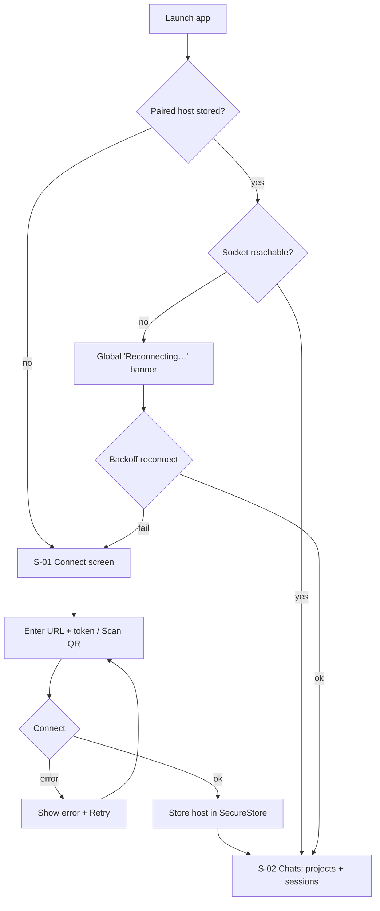
```mermaid
flowchart TD
    A[Launch app] --> B{Paired host stored?}
    B -- no --> C[S-01 Connect screen]
    C --> D[Enter URL + token / Scan QR]
    D --> E{Connect}
    E -- error --> C2[Show error + Retry]
    C2 --> D
    E -- ok --> F[Store host in SecureStore]
    F --> G[S-02 Chats: projects + sessions]
    B -- yes --> H{Socket reachable?}
    H -- yes --> G
    H -- no --> I[Global 'Reconnecting…' banner]
    I --> J{Backoff reconnect}
    J -- ok --> G
    J -- fail --> C
```
**Steps:** launch → if no stored host, S-01 → enter/scan credentials → connect (errors retry) → persist → land on projects. On relaunch with a stored host, auto-reconnect with a banner; persistent failure routes back to S-01.

---

## UF-02 · Resume a session & manage it — *MVP*
**Covers:** US-03, US-05, US-06 · **Screens:** S-02 → S-03 / S-24

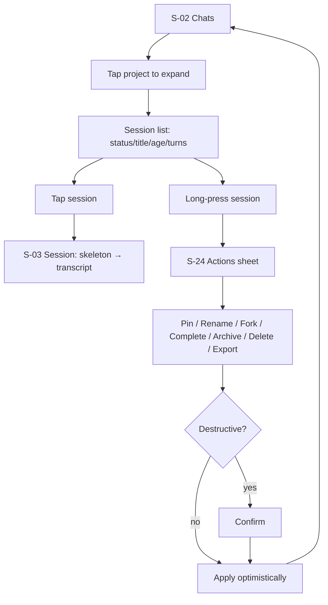
```mermaid
flowchart TD
    A[S-02 Chats] --> B[Tap project to expand]
    B --> C[Session list: status/title/age/turns]
    C --> D[Tap session]
    D --> E[S-03 Session: skeleton → transcript]
    C --> F[Long-press session]
    F --> G[S-24 Actions sheet]
    G --> H[Pin / Rename / Fork / Complete / Archive / Delete / Export]
    H --> I{Destructive?}
    I -- yes --> J[Confirm]
    I -- no --> K[Apply optimistically]
    J --> K
    K --> A
```

---

## UF-03 · Core loop: send turn → live work → tool approval — *MVP* (the heart of the app)
**Covers:** US-08, US-09, US-10, US-12, US-14, US-15, US-16, US-26 · **Screens:** S-03, S-04, S-05, S-08, S-23

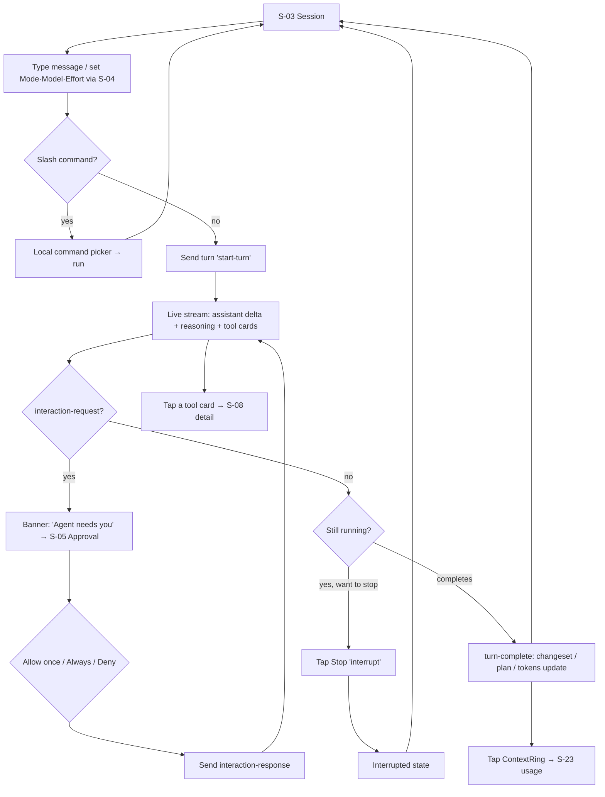
```mermaid
flowchart TD
    A[S-03 Session] --> B[Type message / set Mode·Model·Effort via S-04]
    B --> C{Slash command?}
    C -- yes --> C1[Local command picker → run] --> A
    C -- no --> D[Send turn 'start-turn']
    D --> E[Live stream: assistant delta + reasoning + tool cards]
    E --> F{interaction-request?}
    F -- yes --> G[Banner: 'Agent needs you' → S-05 Approval]
    G --> H{Allow once / Always / Deny}
    H --> I[Send interaction-response]
    I --> E
    F -- no --> J{Still running?}
    J -- yes, want to stop --> K[Tap Stop 'interrupt'] --> L[Interrupted state] --> A
    J -- completes --> M[turn-complete: changeset / plan / tokens update]
    M --> N[Tap ContextRing → S-23 usage] 
    M --> A
    E --> O[Tap a tool card → S-08 detail]
```
**Notes:** approvals fail closed on the 5-min broker timeout (US-12). Token/context updates land on `turn-complete`/`tokens-updated`.

---

## UF-04 · Plan review & approval — *MVP*
**Covers:** US-11 · **Screens:** S-03 → S-06

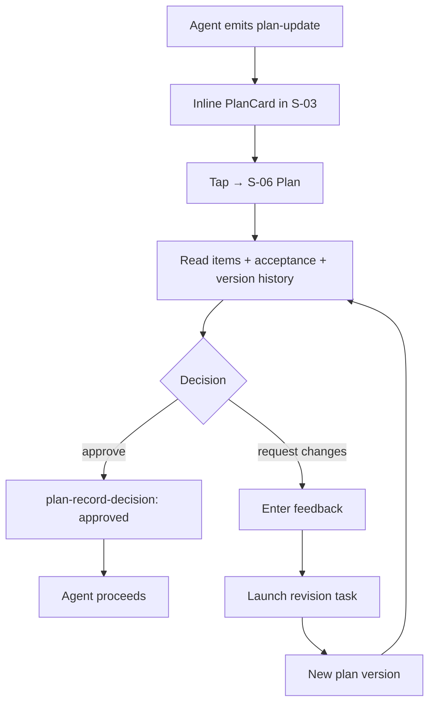
```mermaid
flowchart TD
    A[Agent emits plan-update] --> B[Inline PlanCard in S-03]
    B --> C[Tap → S-06 Plan]
    C --> D[Read items + acceptance + version history]
    D --> E{Decision}
    E -- approve --> F[plan-record-decision: approved] --> G[Agent proceeds]
    E -- request changes --> H[Enter feedback] --> I[Launch revision task] --> J[New plan version] --> D
```

---

## UF-05 · Answer the agent's question — *MVP*
**Covers:** US-13 · **Screens:** S-03 → S-05

```mermaid
flowchart TD
    A[interaction-request: choice] --> B[Banner in S-03]
    B --> C[S-05 Question sheet]
    C --> D{Single or multi-select}
    D --> E[Pick option(s)]
    E --> F[Submit → interaction-response]
    F --> G[Agent continues] 
    C --> H[Dismiss] --> I[Broker treats per rules / re-ask]
```

---

## UF-06 · Review changes → commit/push (with gate) — *MVP*
**Covers:** US-18, US-19, US-21 · **Screens:** S-03 → S-07 → S-13

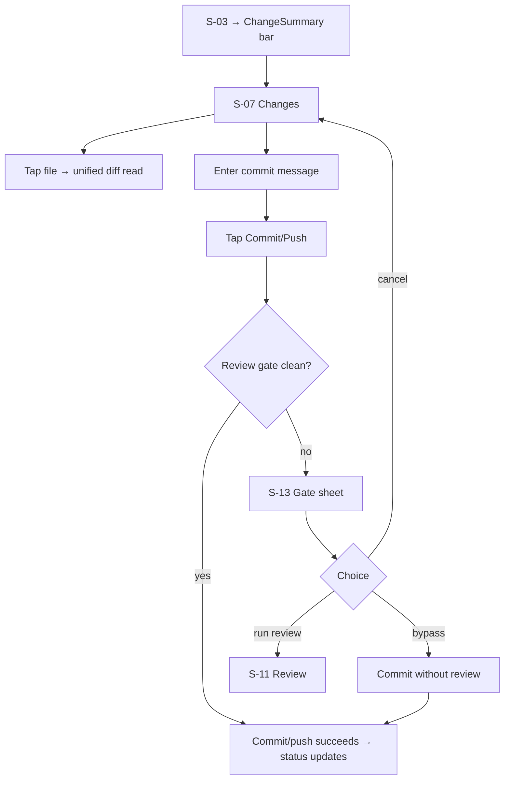
```mermaid
flowchart TD
    A[S-03 → ChangeSummary bar] --> B[S-07 Changes]
    B --> C[Tap file → unified diff read]
    B --> D[Enter commit message]
    D --> E[Tap Commit/Push]
    E --> F{Review gate clean?}
    F -- yes --> G[Commit/push succeeds → status updates]
    F -- no --> H[S-13 Gate sheet]
    H --> I{Choice}
    I -- run review --> J[S-11 Review]
    I -- bypass --> K[Commit without review] --> G
    I -- cancel --> B
```

---

## UF-07 · Run code review → triage a finding — *MVP*
**Covers:** US-20 · **Screens:** S-11 → S-12

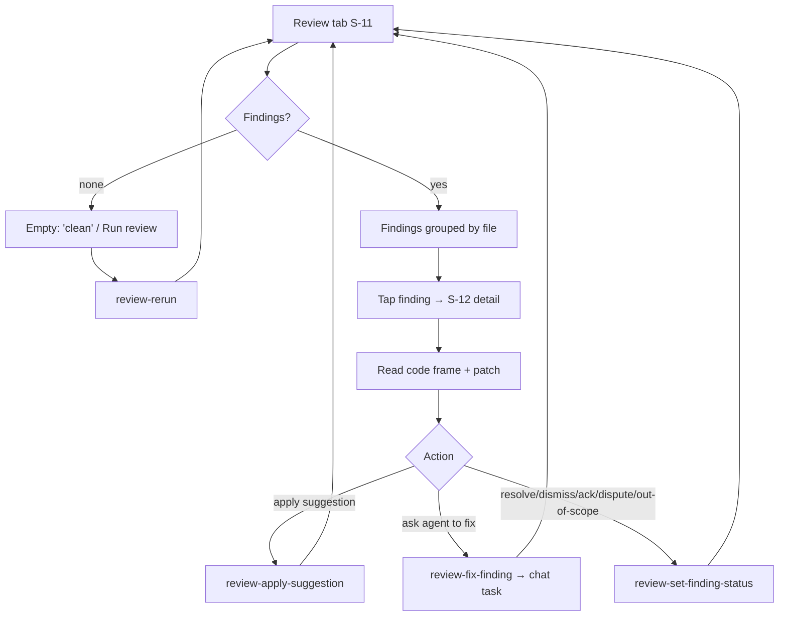
```mermaid
flowchart TD
    A[Review tab S-11] --> B{Findings?}
    B -- none --> C[Empty: 'clean' / Run review]
    C --> D[review-rerun] --> A
    B -- yes --> E[Findings grouped by file]
    E --> F[Tap finding → S-12 detail]
    F --> G[Read code frame + patch]
    G --> H{Action}
    H -- apply suggestion --> I[review-apply-suggestion]
    H -- ask agent to fix --> J[review-fix-finding → chat task]
    H -- resolve/dismiss/ack/dispute/out-of-scope --> K[review-set-finding-status]
    I --> A
    J --> A
    K --> A
```

---

## UF-08 · Monitor dashboard → stop a task — *MVP*
**Covers:** US-22, US-24 · **Screens:** Activity S-10 → S-09

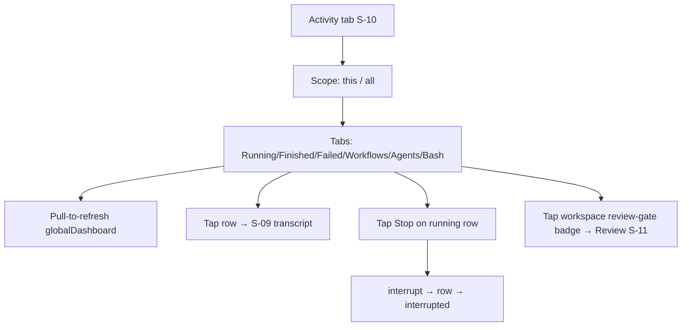
```mermaid
flowchart TD
    A[Activity tab S-10] --> B[Scope: this / all]
    B --> C[Tabs: Running/Finished/Failed/Workflows/Agents/Bash]
    C --> D[Pull-to-refresh globalDashboard]
    C --> E[Tap row → S-09 transcript]
    C --> F[Tap Stop on running row]
    F --> G[interrupt → row → interrupted]
    C --> H[Tap workspace review-gate badge → Review S-11]
```

---

## UF-09 · Inspect a task / workflow transcript — *MVP*
**Covers:** US-23 · **Screens:** S-10 → S-09

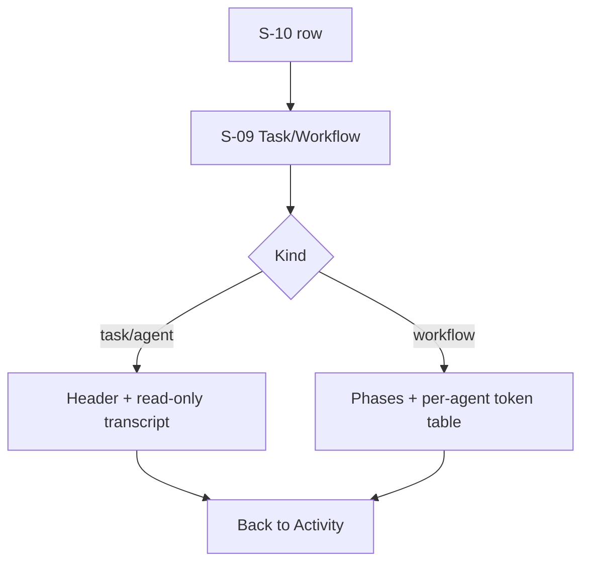
```mermaid
flowchart TD
    A[S-10 row] --> B[S-09 Task/Workflow]
    B --> C{Kind}
    C -- task/agent --> D[Header + read-only transcript]
    C -- workflow --> E[Phases + per-agent token table]
    D --> F[Back to Activity]
    E --> F
```

---

## UF-10 · Switch workspace (with trust) — *MVP*
**Covers:** US-07, US-29 · **Screens:** S-18 → S-19 → S-02

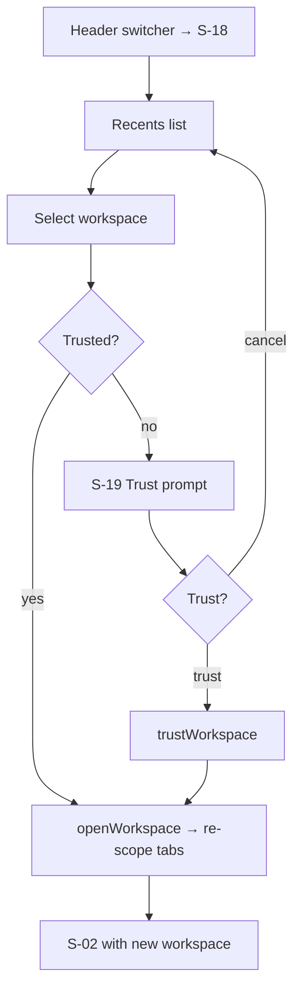
```mermaid
flowchart TD
    A[Header switcher → S-18] --> B[Recents list]
    B --> C[Select workspace]
    C --> D{Trusted?}
    D -- yes --> E[openWorkspace → re-scope tabs]
    D -- no --> F[S-19 Trust prompt]
    F --> G{Trust?}
    G -- trust --> H[trustWorkspace] --> E
    G -- cancel --> B
    E --> I[S-02 with new workspace]
```

---

## UF-11 · Configure model & provider — *MVP*
**Covers:** US-27 · **Screens:** Settings S-14 → S-16

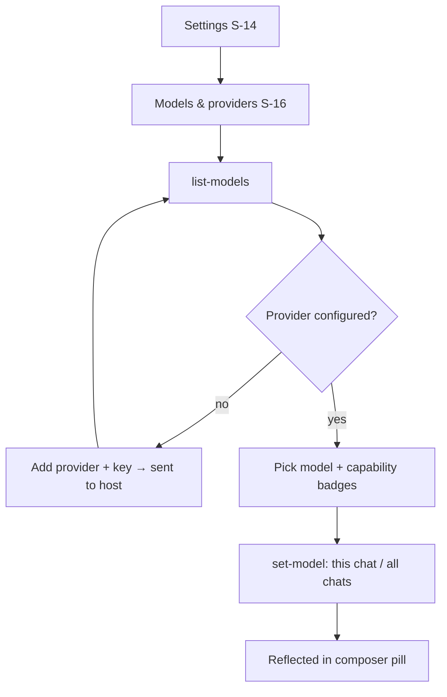
```mermaid
flowchart TD
    A[Settings S-14] --> B[Models & providers S-16]
    B --> C[list-models]
    C --> D{Provider configured?}
    D -- no --> E[Add provider + key → sent to host]
    E --> C
    D -- yes --> F[Pick model + capability badges]
    F --> G[set-model: this chat / all chats]
    G --> H[Reflected in composer pill]
```

---

## UF-12 · Push notification → approve from background — *MVP*
**Covers:** US-25, US-12 · **Screens:** notification → S-05

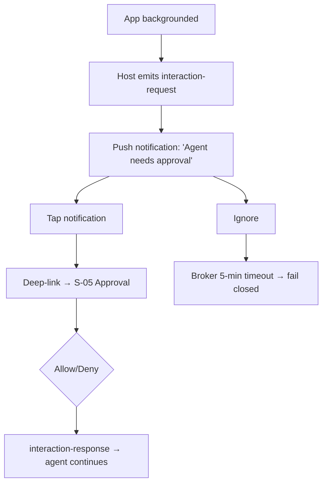
```mermaid
flowchart TD
    A[App backgrounded] --> B[Host emits interaction-request]
    B --> C[Push notification: 'Agent needs approval']
    C --> D[Tap notification]
    D --> E[Deep-link → S-05 Approval]
    E --> F{Allow/Deny}
    F --> G[interaction-response → agent continues]
    C --> H[Ignore] --> I[Broker 5-min timeout → fail closed]
```
*Net-new mobile affordance (Expo Notifications); rationale in [ux-enhancements.md](ux-enhancements.md).*

---

## UF-13 · New chat with a goal — *MVP*
**Covers:** US-04, US-17 · **Screens:** S-02 → S-03

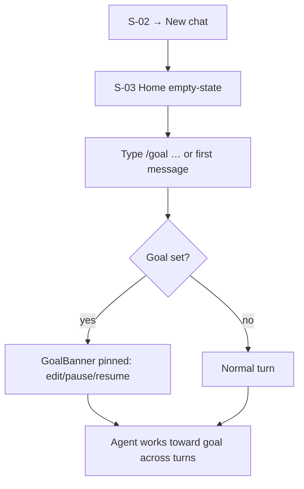
```mermaid
flowchart TD
    A[S-02 → New chat] --> B[S-03 Home empty-state]
    B --> C[Type /goal … or first message]
    C --> D{Goal set?}
    D -- yes --> E[GoalBanner pinned: edit/pause/resume]
    D -- no --> F[Normal turn]
    E --> G[Agent works toward goal across turns]
    F --> G
```

---

## UF-14 · Search a session — *v1*
**Covers:** US-30 · **Screens:** S-03 → S-22

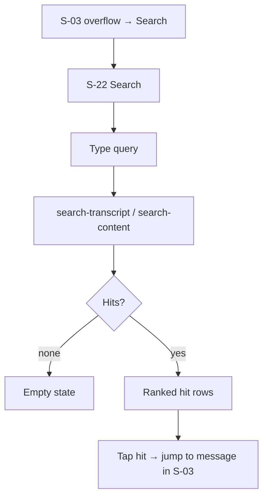
```mermaid
flowchart TD
    A[S-03 overflow → Search] --> B[S-22 Search]
    B --> C[Type query]
    C --> D[search-transcript / search-content]
    D --> E{Hits?}
    E -- none --> F[Empty state]
    E -- yes --> G[Ranked hit rows]
    G --> H[Tap hit → jump to message in S-03]
```

---

## UF-15 · Read & add an annotation — *future*
**Covers:** US-34 · **Screens:** S-03 → S-27

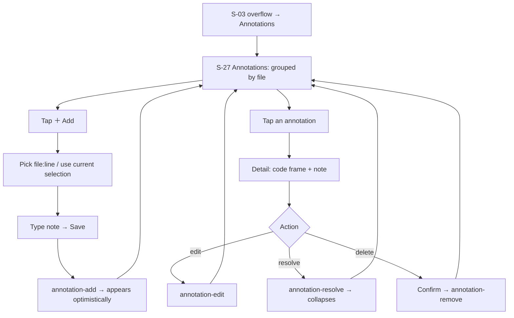
```mermaid
flowchart TD
    A[S-03 overflow → Annotations] --> B[S-27 Annotations: grouped by file]
    B --> C[Tap ＋ Add]
    C --> D[Pick file:line / use current selection]
    D --> E[Type note → Save]
    E --> F[annotation-add → appears optimistically]
    F --> B
    B --> G[Tap an annotation]
    G --> H[Detail: code frame + note]
    H --> I{Action}
    I -- edit --> J[annotation-edit] --> B
    I -- resolve --> K[annotation-resolve → collapses] --> B
    I -- delete --> L[Confirm → annotation-remove] --> B
```

---

## UF-16 · Preview an artifact — *future*
**Covers:** US-35 · **Screens:** S-03 → S-28

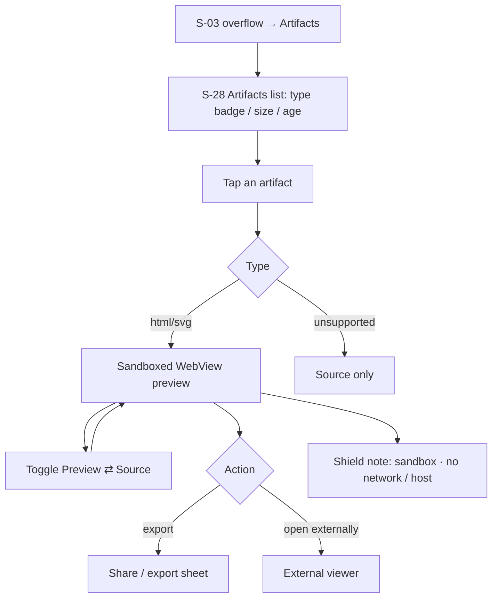
```mermaid
flowchart TD
    A[S-03 overflow → Artifacts] --> B[S-28 Artifacts list: type badge / size / age]
    B --> C[Tap an artifact]
    C --> D{Type}
    D -- html/svg --> E[Sandboxed WebView preview]
    D -- unsupported --> F[Source only]
    E --> G[Toggle Preview ⇄ Source]
    G --> E
    E --> H{Action}
    H -- export --> I[Share / export sheet]
    H -- open externally --> J[External viewer]
    E --> K[Shield note: sandbox · no network / host]
```

---

## UF-17 · Create & manage a schedule — *future*
**Covers:** US-36 · **Screens:** S-03 → S-29

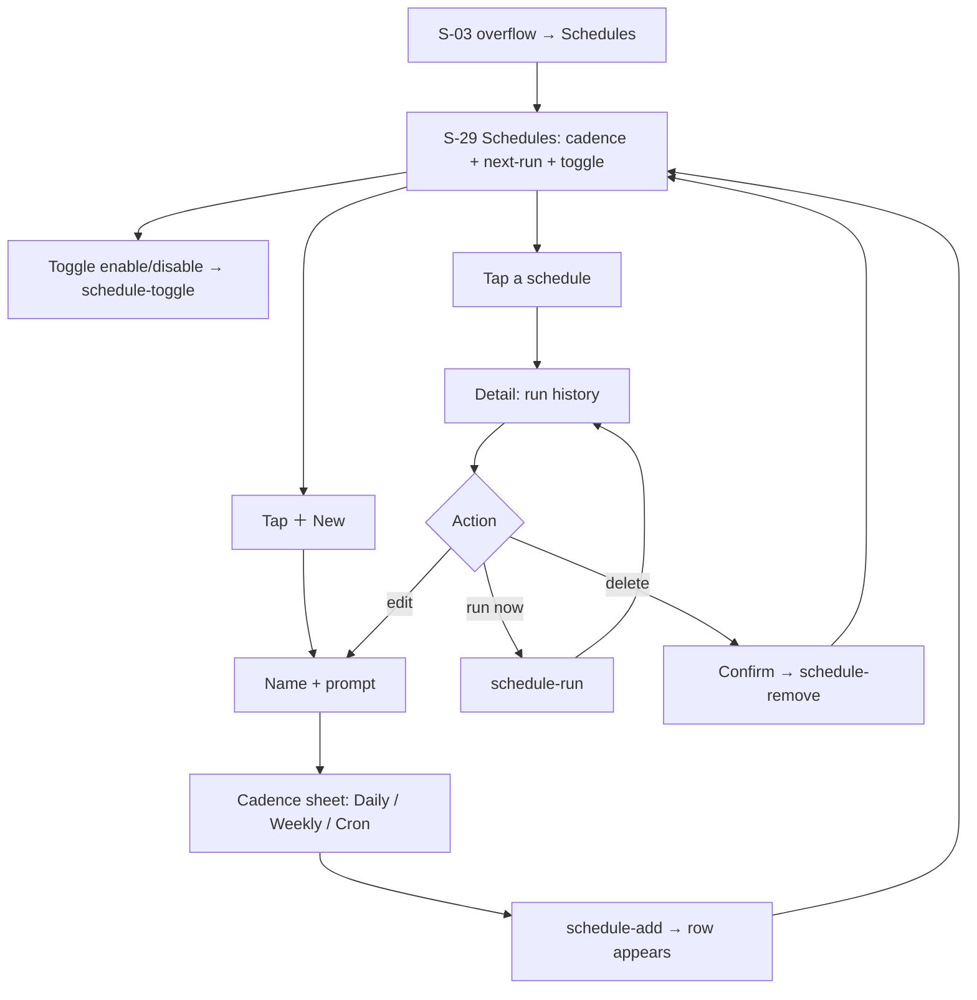
```mermaid
flowchart TD
    A[S-03 overflow → Schedules] --> B[S-29 Schedules: cadence + next-run + toggle]
    B --> C[Toggle enable/disable → schedule-toggle]
    B --> D[Tap ＋ New]
    D --> E[Name + prompt]
    E --> F[Cadence sheet: Daily / Weekly / Cron]
    F --> G[schedule-add → row appears]
    G --> B
    B --> H[Tap a schedule]
    H --> I[Detail: run history]
    I --> J{Action}
    J -- run now --> K[schedule-run] --> I
    J -- edit --> E
    J -- delete --> L[Confirm → schedule-remove] --> B
```

---

## UF-18 · Create & switch a worktree — *future*
**Covers:** US-37 · **Screens:** S-03 → S-30 → S-02

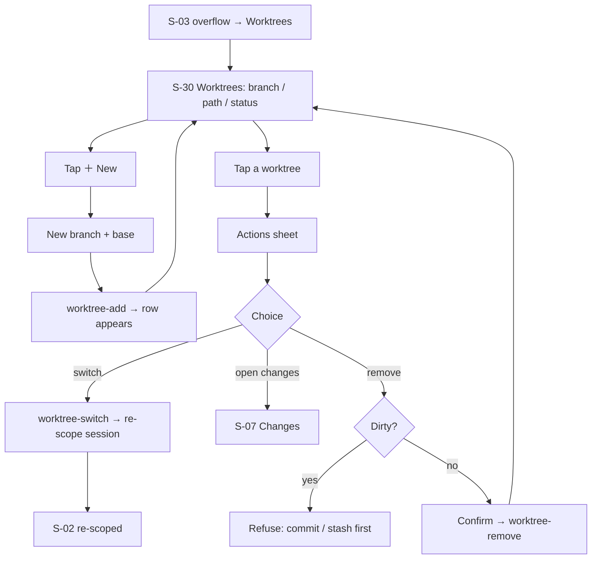
```mermaid
flowchart TD
    A[S-03 overflow → Worktrees] --> B[S-30 Worktrees: branch / path / status]
    B --> C[Tap ＋ New]
    C --> D[New branch + base]
    D --> E[worktree-add → row appears]
    E --> B
    B --> F[Tap a worktree]
    F --> G[Actions sheet]
    G --> H{Choice}
    H -- switch --> I[worktree-switch → re-scope session] --> J[S-02 re-scoped]
    H -- open changes --> K[S-07 Changes]
    H -- remove --> L{Dirty?}
    L -- yes --> M[Refuse: commit / stash first]
    L -- no --> N[Confirm → worktree-remove] --> B
```

---

## UF-19 · Triage on the Track board — *future*
**Covers:** US-38 · **Screens:** S-31

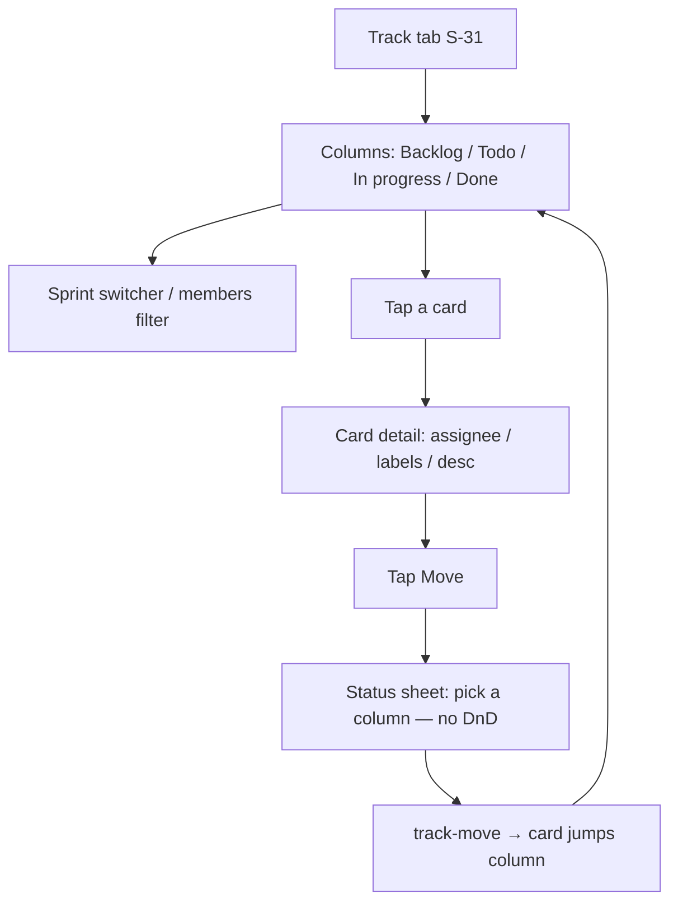
```mermaid
flowchart TD
    A[Track tab S-31] --> B[Columns: Backlog / Todo / In progress / Done]
    B --> C[Sprint switcher / members filter]
    B --> D[Tap a card]
    D --> E[Card detail: assignee / labels / desc]
    E --> F[Tap Move]
    F --> G[Status sheet: pick a column — no DnD]
    G --> H[track-move → card jumps column]
    H --> B
```

---

## UF-20 · Quick edit → save — *future*
**Covers:** US-39 · **Screens:** S-21 → S-32 → S-07

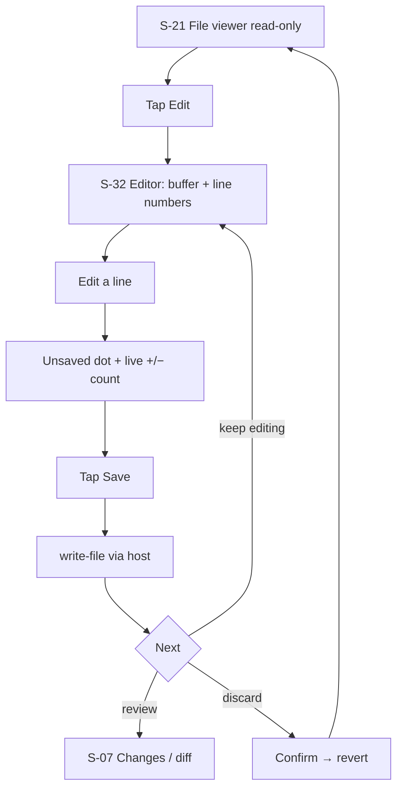
```mermaid
flowchart TD
    A[S-21 File viewer read-only] --> B[Tap Edit]
    B --> C[S-32 Editor: buffer + line numbers]
    C --> D[Edit a line]
    D --> E[Unsaved dot + live +/− count]
    E --> F[Tap Save]
    F --> G[write-file via host]
    G --> H{Next}
    H -- review --> I[S-07 Changes / diff]
    H -- keep editing --> C
    H -- discard --> J[Confirm → revert] --> A
```

---

## UF-21 · Run a command on the host — *future*
**Covers:** US-40 · **Screens:** S-03 → S-33

```mermaid
flowchart TD
    A[S-03 overflow → Terminal] --> B[S-33 Terminal: host scrollback + prompt]
    B --> C[Type a command]
    C --> D[Run → term-run]
    D --> E[stdout/stderr streams host-side]
    E --> F{Still running?}
    F -- yes, want to stop --> G[Tap Stop → term-stop]
    F -- completes --> H[Exit code shown]
    G --> B
    H --> B
    B --> I[Note: runs on the host · workspace cwd]
```

---

## UF-22 · Search your memory — *parity*
**Covers:** US-41 · **Screens:** More → S-34

```mermaid
flowchart TD
    A[More tab → Memory] --> B[S-34 Memory: search box]
    B --> C[Type query → memory-search]
    C --> D{Recalls?}
    D -- none --> E[Empty state]
    D -- yes --> F[Ranked recalls: type · score · stale]
    F --> G[Tap a recall → full content + provenance]
```

---

## UF-23 · Connect a source — *parity*
**Covers:** US-42 · **Screens:** More → S-35

```mermaid
flowchart TD
    A[More tab → Connectors] --> B[S-35 Connectors: sources + status]
    B --> C{Action}
    C -- refresh --> D[connectors-list → re-sort by health]
    D --> B
    C -- add --> E[Catalog: 18+ sources]
    E --> F[Pick a source → flows + credential]
    F --> G[Connect → host runs ingestion]
    G --> B
```

---

## Flow ↔ screen ↔ story matrix

| Flow | Screens | Stories | Milestone |
|---|---|---|---|
| UF-01 | S-01, S-15, S-02 | US-01, US-02 | MVP |
| UF-02 | S-02, S-03, S-24 | US-03, US-05, US-06 | MVP |
| UF-03 | S-03, S-04, S-05, S-08, S-23 | US-08–10, US-12, US-14–16, US-26 | MVP |
| UF-04 | S-03, S-06 | US-11 | MVP |
| UF-05 | S-03, S-05 | US-13 | MVP |
| UF-06 | S-03, S-07, S-13 | US-18, US-19, US-21 | MVP |
| UF-07 | S-11, S-12 | US-20 | MVP |
| UF-08 | S-10, S-09 | US-22, US-24 | MVP |
| UF-09 | S-10, S-09 | US-23 | MVP |
| UF-10 | S-18, S-19, S-02 | US-07, US-29 | MVP |
| UF-11 | S-14, S-16 | US-27 | MVP |
| UF-12 | S-05 (deep link) | US-25, US-12 | MVP |
| UF-13 | S-02, S-03 | US-04, US-17 | MVP |
| UF-14 | S-03, S-22 | US-30 | v1 |
| UF-15 | S-03, S-27 | US-34 | future |
| UF-16 | S-03, S-28 | US-35 | future |
| UF-17 | S-03, S-29 | US-36 | future |
| UF-18 | S-03, S-30, S-02 | US-37 | future |
| UF-19 | S-31 | US-38 | future |
| UF-20 | S-21, S-32, S-07 | US-39 | future |
| UF-21 | S-03, S-33 | US-40 | future |
| UF-22 | S-34 | US-41 | parity |
| UF-23 | S-35 | US-42 | parity |
