# User Flows — BrainRouter Mobile

> Screen-to-screen journeys with Mermaid diagrams. Each flow has a unique ID, the screens ([ui-spec.md](ui-spec.md)) and stories ([user-stories.md](user-stories.md)) it covers, and a milestone. Screen IDs in `()` reference the UI spec. Prototypes: `flow-UF-01.html` … `flow-UF-14.html`.

---

## UF-01 · First-run pairing → projects — *MVP*
**Covers:** US-01, US-02 · **Screens:** S-01 → AppTabs → S-02

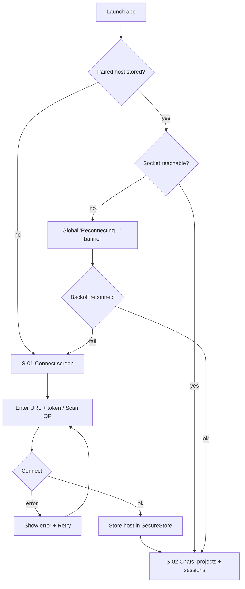
**Steps:** launch → if no stored host, S-01 → enter/scan credentials → connect (errors retry) → persist → land on projects. On relaunch with a stored host, auto-reconnect with a banner; persistent failure routes back to S-01.

---

## UF-02 · Resume a session & manage it — *MVP*
**Covers:** US-03, US-05, US-06 · **Screens:** S-02 → S-03 / S-24

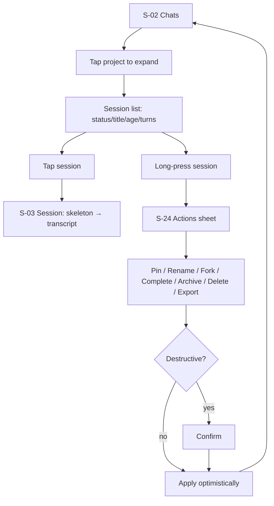

---

## UF-03 · Core loop: send turn → live work → tool approval — *MVP* (the heart of the app)
**Covers:** US-08, US-09, US-10, US-12, US-14, US-15, US-16, US-26 · **Screens:** S-03, S-04, S-05, S-08, S-23

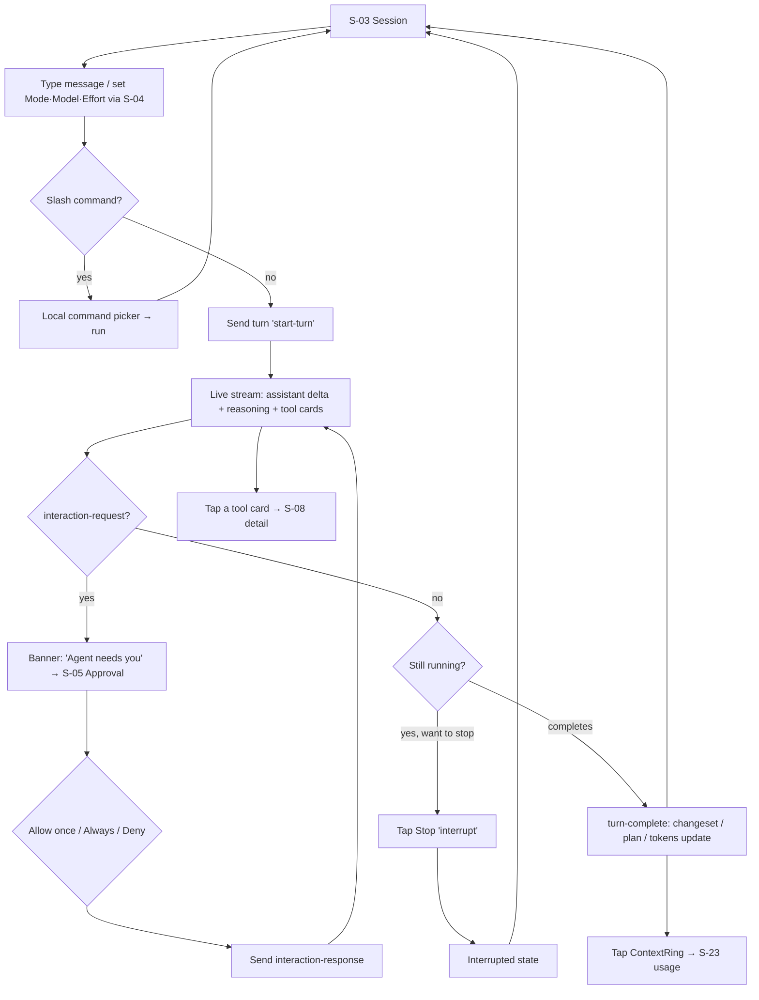
**Notes:** approvals fail closed on the 5-min broker timeout (US-12). Token/context updates land on `turn-complete`/`tokens-updated`.

---

## UF-04 · Plan review & approval — *MVP*
**Covers:** US-11 · **Screens:** S-03 → S-06

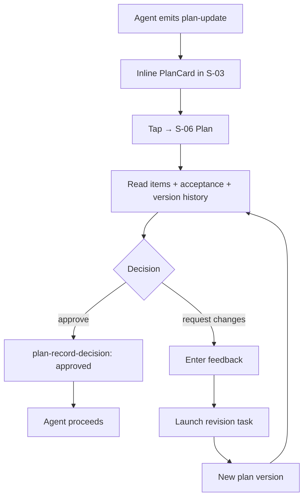

---

## UF-05 · Answer the agent's question — *MVP*
**Covers:** US-13 · **Screens:** S-03 → S-05

```mermaid
flowchart TD
    A[interaction-request: choice] --> B[Banner in S-03]
    B --> C[S-05 Question sheet]
    C --> D{Single or multi-select}
    D --> E[Pick option(s)]
    E --> F[Submit → interaction-response]
    F --> G[Agent continues] 
    C --> H[Dismiss] --> I[Broker treats per rules / re-ask]
```

---

## UF-06 · Review changes → commit/push (with gate) — *MVP*
**Covers:** US-18, US-19, US-21 · **Screens:** S-03 → S-07 → S-13

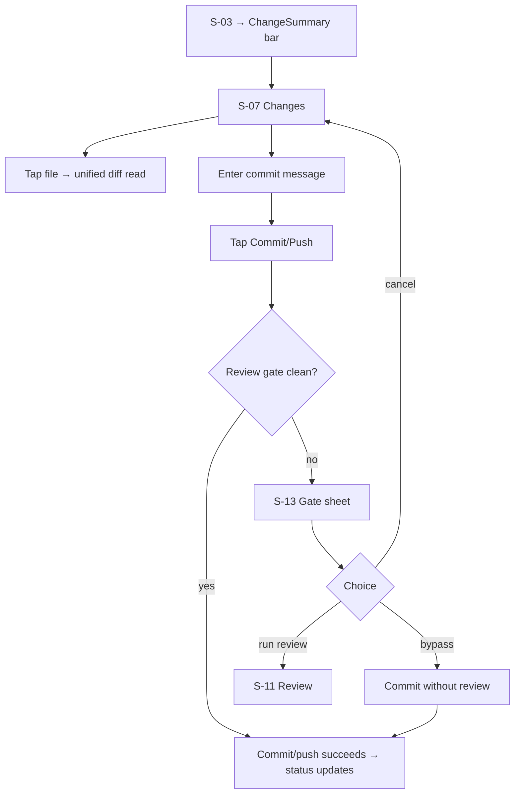

---

## UF-07 · Run code review → triage a finding — *MVP*
**Covers:** US-20 · **Screens:** S-11 → S-12

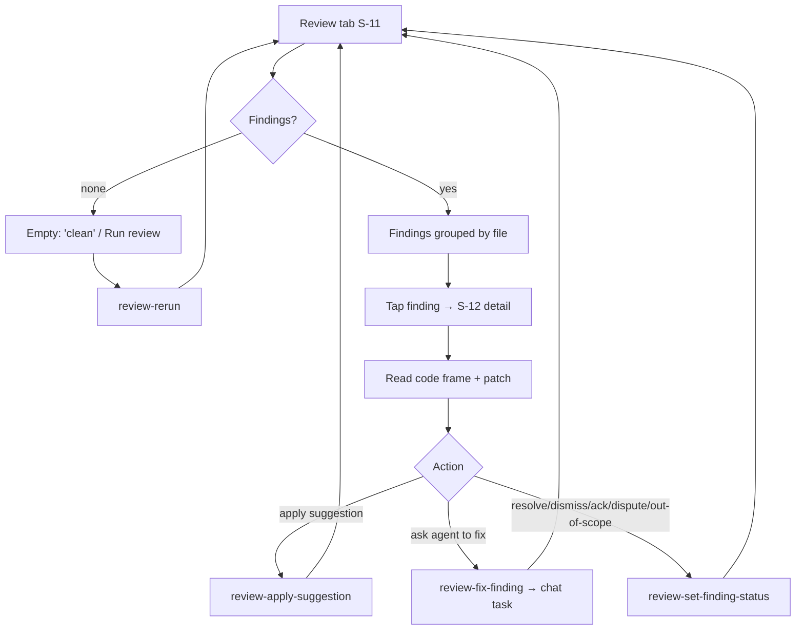

---

## UF-08 · Monitor dashboard → stop a task — *MVP*
**Covers:** US-22, US-24 · **Screens:** Activity S-10 → S-09

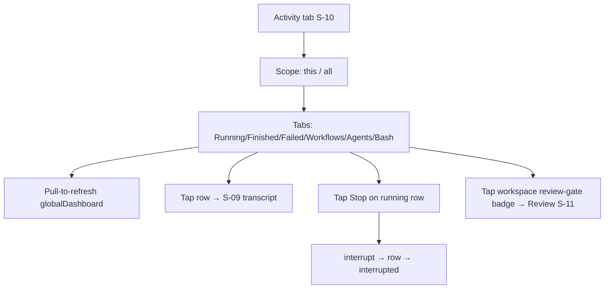

---

## UF-09 · Inspect a task / workflow transcript — *MVP*
**Covers:** US-23 · **Screens:** S-10 → S-09

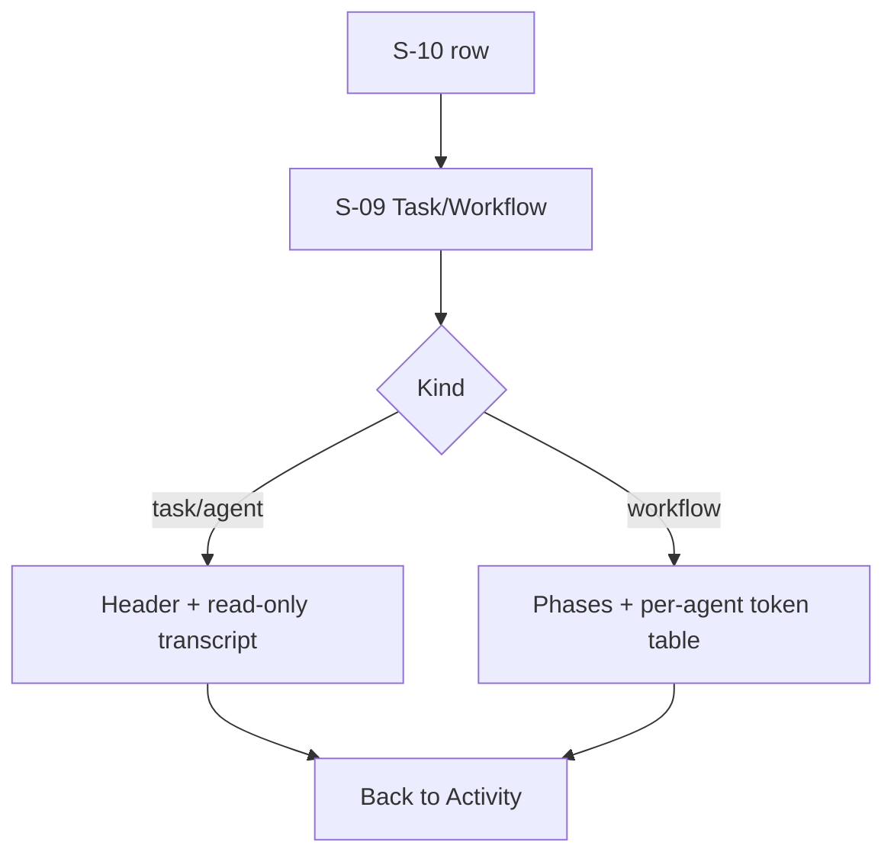

---

## UF-10 · Switch workspace (with trust) — *MVP*
**Covers:** US-07, US-29 · **Screens:** S-18 → S-19 → S-02

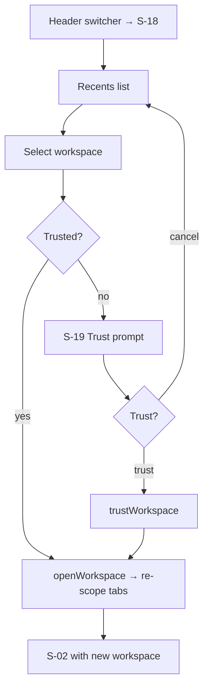

---

## UF-11 · Configure model & provider — *MVP*
**Covers:** US-27 · **Screens:** Settings S-14 → S-16

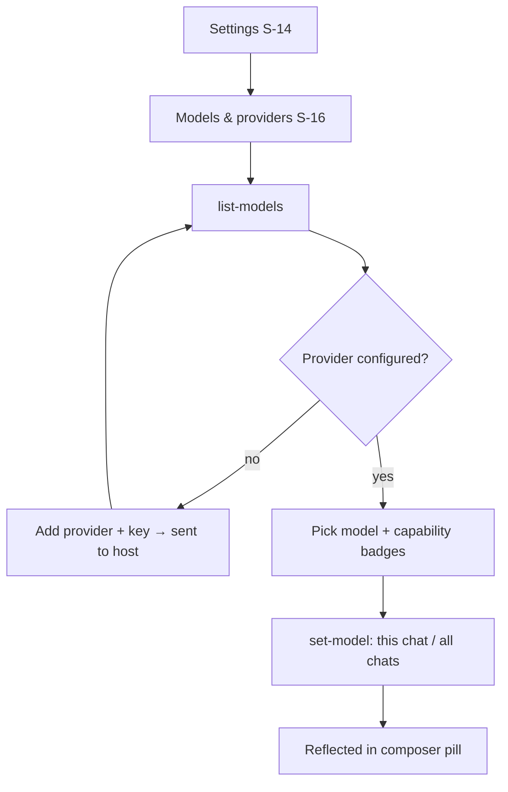

---

## UF-12 · Push notification → approve from background — *MVP*
**Covers:** US-25, US-12 · **Screens:** notification → S-05

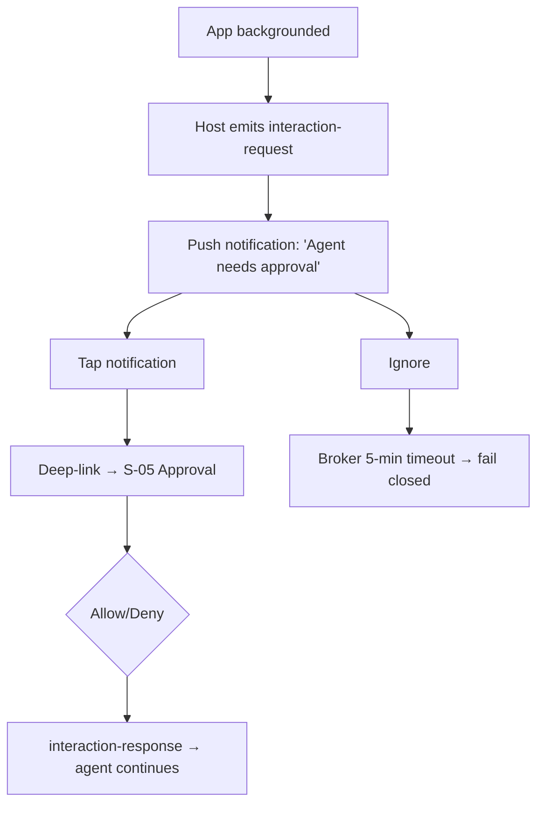
*Net-new mobile affordance (Expo Notifications); rationale in [ux-enhancements.md](ux-enhancements.md).*

---

## UF-13 · New chat with a goal — *MVP*
**Covers:** US-04, US-17 · **Screens:** S-02 → S-03

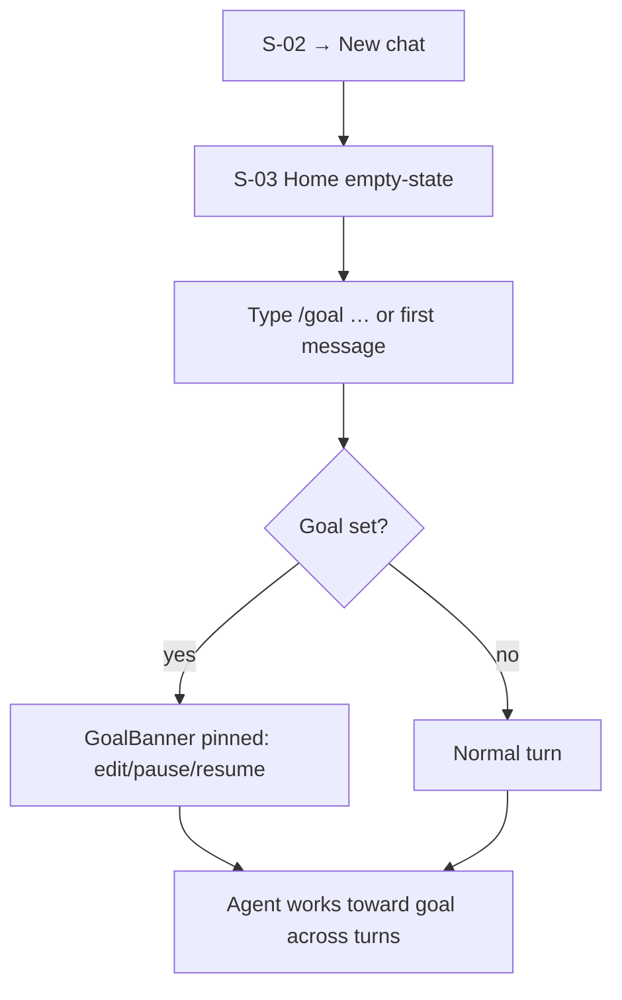

---

## UF-14 · Search a session — *v1*
**Covers:** US-30 · **Screens:** S-03 → S-22

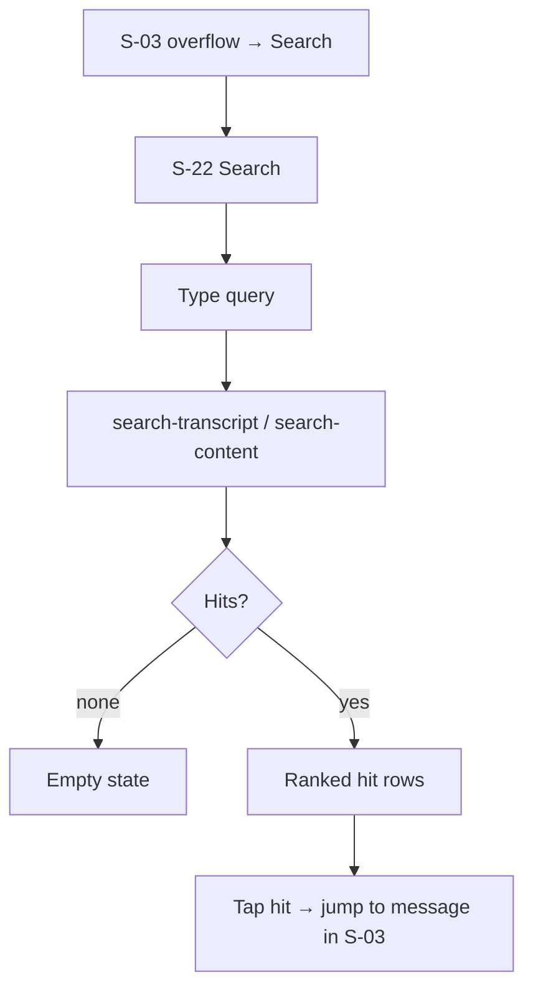

---

## Flow ↔ screen ↔ story matrix

| Flow | Screens | Stories | Milestone |
|---|---|---|---|
| UF-01 | S-01, S-15, S-02 | US-01, US-02 | MVP |
| UF-02 | S-02, S-03, S-24 | US-03, US-05, US-06 | MVP |
| UF-03 | S-03, S-04, S-05, S-08, S-23 | US-08–10, US-12, US-14–16, US-26 | MVP |
| UF-04 | S-03, S-06 | US-11 | MVP |
| UF-05 | S-03, S-05 | US-13 | MVP |
| UF-06 | S-03, S-07, S-13 | US-18, US-19, US-21 | MVP |
| UF-07 | S-11, S-12 | US-20 | MVP |
| UF-08 | S-10, S-09 | US-22, US-24 | MVP |
| UF-09 | S-10, S-09 | US-23 | MVP |
| UF-10 | S-18, S-19, S-02 | US-07, US-29 | MVP |
| UF-11 | S-14, S-16 | US-27 | MVP |
| UF-12 | S-05 (deep link) | US-25, US-12 | MVP |
| UF-13 | S-02, S-03 | US-04, US-17 | MVP |
| UF-14 | S-03, S-22 | US-30 | v1 |
